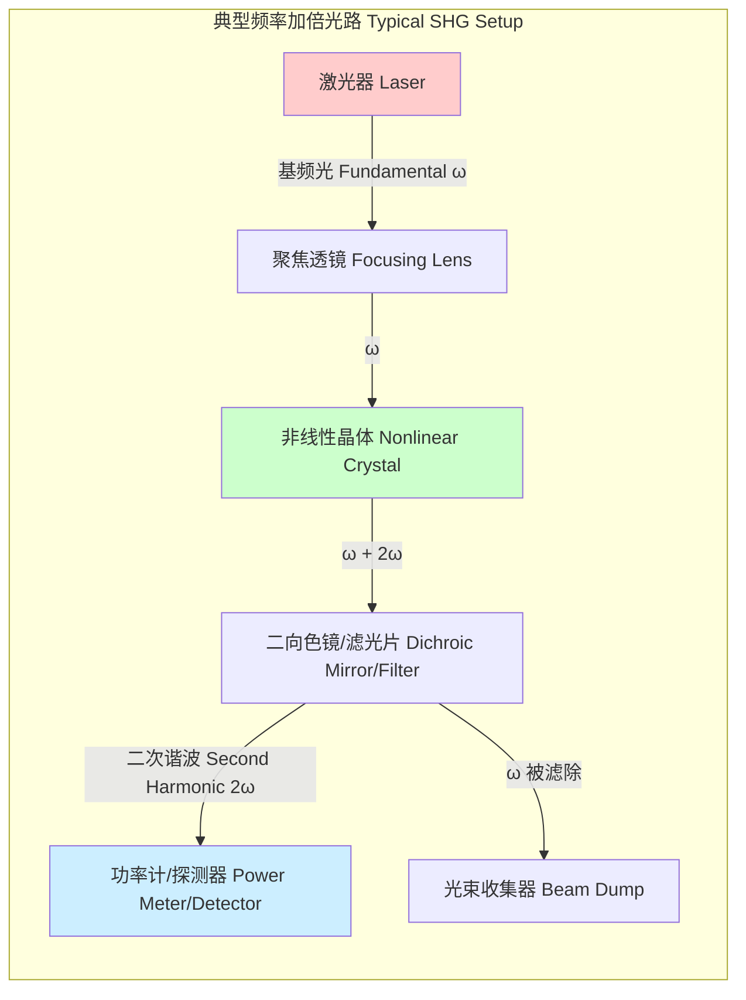
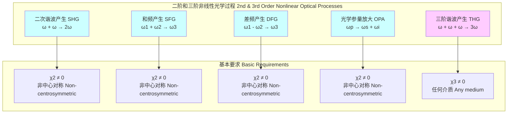

## 频率加倍

频率加倍，在科学上更常被称为**二次谐波产生 (Second-Harmonic Generation, SHG)**，是一种非线性光学过程。在此过程中，两个具有相同频率 $\omega$ 的光子与非线性材料相互作用，被湮灭并产生一个频率为 $2\omega$ 的新光子。这个过程有效地将输入光的频率加倍，同时将其波长减半。频率加倍是各种非线性光学现象的基础，需要在具有非中心对称性的介质中才能发生。

### 1. 核心概念与数学基础

当电磁波（光）在介质中传播时，它会诱导介质中的电偶极子振荡，从而产生宏观的电极化强度 $\vec{P}$。在传统的线性光学中，电极化强度与电场强度 $\vec{E}$ 成正比。然而，当光强非常高时（例如，使用激光器），介质的响应变得非线性。

电极化强度 $\vec{P}$ 可以用电场强度 $\vec{E}$ 的泰勒级数来表示：

$$
\vec{P} = \epsilon_0 \left( \chi^{(1)} \vec{E} + \chi^{(2)} \vec{E}^2 + \chi^{(3)} \vec{E}^3 + \dots \right)
$$

其中：
*   $\epsilon_0$ 是真空介电常数。
*   $\chi^{(1)}$ 是线性磁化率，它主导了折射和吸收等线性光学现象。
*   $\chi^{(2)}$ 是二阶非线性磁化率，是频率加倍、和频产生和差频产生等现象的根源。
*   $\chi^{(3)}$ 是三阶非线性磁化率，与三阶谐波产生、四波混频和克尔效应等有关。

对于频率加倍，我们主要关注二阶项。考虑一个频率为 $\omega$ 的单色入射光波，其电场可以表示为：

$$
E(t) = E_0 \cos(\omega t) = \frac{E_0}{2} (e^{i\omega t} + e^{-i\omega t})
$$

由二阶非线性效应产生的电极化强度 $P^{(2)}$ 为：

$$
P^{(2)}(t) = \epsilon_0 \chi^{(2)} E(t)^2 = \epsilon_0 \chi^{(2)} [E_0 \cos(\omega t)]^2
$$

使用三角恒等式 $\cos^2(\theta) = \frac{1}{2}(1 + \cos(2\theta))$，我们得到：

$$
P^{(2)}(t) = \frac{1}{2} \epsilon_0 \chi^{(2)} E_0^2 (1 + \cos(2\omega t))
$$

这个结果是频率加倍现象的数学核心。它表明，非线性介质中的电极化包含两个部分：
1.  一个静态（直流）电场分量：$\frac{1}{2} \epsilon_0 \chi^{(2)} E_0^2$。
2.  一个以两倍于入射光频率 $2\omega$ 振荡的分量：$\frac{1}{2} \epsilon_0 \chi^{(2)} E_0^2 \cos(2\omega t)$。

这个以 $2\omega$ 振荡的电极化强度会作为辐射源，产生频率为 $2\omega$ 的新电磁波，即二次谐波。值得注意的是，$\chi^{(2)}$ 是一个三阶张量，它将两个电场矢量映射到一个极化矢量上，这解释了该过程对输入光偏振的依赖性。此外，对于中心对称的介质（如玻璃、气体和大多数液体），$\chi^{(2)}$ 的所有分量均为零，因此无法发生频率加倍。这就是为什么频率加倍需要使用非中心对称的晶体（如 BBO, LBO, KDP）。

下图展示了频率加倍过程的能量量子化视图。

```mermaid
graph TD
    subgraph "二次谐波产生 Second-Harmonic Generation"
        A[基态 Ground State]
        B虚能级 Virtual Level
        C虚能级 Virtual Level
        D[基态 Ground State]

        A -- "吸收光子 Absorbed Photon ħω" --> B
        B -- "吸收光子 Absorbed Photon ħω" --> C
        C -- "发射光子 Emitted Photon 2ħω" --> D
    end

    style A fill:#cceeff,stroke:#333
    style B fill:#fff0b3,stroke:#333,stroke-dasharray: 5 5
    style C fill:#fff0b3,stroke:#333,stroke-dasharray: 5 5
    style D fill:#cceeff,stroke:#333
```

### 2. 关键技术规格

频率加倍的性能在很大程度上取决于所选非线性晶体的特性。下表列出了一些常用非线性晶体的关键技术规格。

| 参数 | 符号 | 磷酸二氢钾 (KDP) | 偏硼酸钡 (BBO) | 三硼酸锂 (LBO) | 单位 |
| :--- | :--- | :--- | :--- | :--- | :--- |
| **有效非线性系数** | $d_{eff}$ | 0.39 (@ 1064 nm) | 2.2 (@ 1064 nm) | 0.85 (@ 1064 nm) | pm/V |
| **相位匹配类型** | - | Type I & II | Type I & II | Type I & II | - |
| **透明范围** | - | 200 - 1500 | 190 - 3500 | 160 - 2600 | nm |
| **光学损伤阈值** | - | > 0.5 (@ 10 ns, 1064 nm) | > 10 (@ 10 ns, 1064 nm) | > 18 (@ 10 ns, 1064 nm) | GW/cm² |
| **角度接收带宽** | $\Delta\theta \cdot L$ | 1.8 | 0.8 | 6.0 | mrad·cm |
| **温度接收带宽** | $\Delta T \cdot L$ | 12 | 55 | 4.5 | °C·cm |
| **走离角** | $\rho$ | 27 (@ 532 nm) | 83 (@ 532 nm) | 13 (@ 532 nm) | mrad |

### 3. 常见用例

频率加倍技术在工业、科研和消费电子领域都有广泛应用。

*   **绿色激光指示器**: 这是最常见的消费级应用。一个低成本的 808 nm 激光二极管泵浦一个 Nd:YVO₄ 晶体，产生 1064 nm 的红外激光。然后，该 1064 nm 激光通过一个 KTP (磷酸氧钛钾) 或 BBO 晶体进行频率加倍，产生 532 nm 的绿色可见光。
    *   **性能指标**: 典型转换效率为 5% 到 20%。输出功率通常在 5 mW 到 500 mW 之间。
*   **紫外 (UV) 激光源**: 在半导体制造、材料加工和医学领域，需要高功率的紫外激光。这通常通过多级频率加倍实现。例如，将一个 1064 nm 的高功率激光倍频至 532 nm，然后再将 532 nm 的光再次倍频（或与 1064 nm 的光进行和频），产生 266 nm (四次谐波) 或 355 nm (三次谐波) 的紫外光。
    *   **性能指标**: 对于商业高功率系统，从红外到紫外（例如 1064 nm -> 266 nm）的总转换效率可以达到 10% - 30%。
*   **二次谐波成像显微镜 (SHG Microscopy)**: 这是一种先进的生物成像技术。由于 SHG 只在非中心对称结构中发生，因此它可以用于对生物组织中的特定分子（如胶原蛋白、微管蛋白和肌球蛋白）进行无标记、高对比度的三维成像，而不会对周围组织造成光损伤。
    *   **性能指标**: 空间分辨率可达 ~300 nm。成像深度可达数百微米。信号强度与入射激光强度的平方成正比。

### 4. 实现考量

为了实现高效的频率加倍，必须满足**相位匹配 (Phase Matching)** 条件。

#### 相位匹配
在频率加倍过程中，基频光 ($\omega$) 沿晶体传播并不断产生二次谐波光 ($2\omega$)。如果这两束光的相速度不同，它们之间会产生相位差。当相位差累积到 $\pi$ 时，能量将从二次谐波流回基频光，导致转换效率极低。相位匹配的目标是使基频光和二次谐波光的相位在整个晶体长度上保持一致。

数学上，相位匹配条件为波矢失配 $\Delta k$ 为零：
$$
\Delta k = k_{2\omega} - 2k_{\omega} = 0
$$
其中 $k = n\omega/c$ 是波矢的大小，$n$ 是材料的折射率。因此，该条件等价于：
$$
n(2\omega) = n(\omega)
$$
然而，由于材料的色散效应，通常 $n(2\omega) > n(\omega)$。为了克服这个问题，主要有两种技术：

1.  **双折射相位匹配 (Birefringent Phase Matching, BPM)**:
    利用双折射晶体的特性，即折射率与光的偏振方向有关。通过精确选择光的偏振和传播方向（相对于晶体光轴的角度），可以使寻常光 (o-ray) 和非常光 (e-ray) 的折射率满足匹配条件。
    *   **Type I**: 两个基频光子具有相同的偏振（均为 o-ray 或 e-ray），产生的二次谐波光子具有正交的偏振。条件：$n_e(2\omega, \theta_m) = n_o(\omega)$。
    *   **Type II**: 两个基频光子具有相互正交的偏振（一个 o-ray，一个 e-ray）。条件：$n_e(2\omega, \theta_m) = \frac{1}{2} [n_o(\omega) + n_e(\omega, \theta_m)]$。
    $\theta_m$ 是相位匹配角。

2.  **准相位匹配 (Quasi-Phase Matching, QPM)**:
    通过周期性地反转非线性晶体的光轴方向（称为周期性极化），可以引入一个额外的“补偿”波矢 $K_g = 2\pi/\Lambda$，其中 $\Lambda$ 是极化周期。相位匹配条件变为：
    $$
    \Delta k_{QPM} = k_{2\omega} - 2k_{\omega} - K_g = 0
    $$
    QPM 允许使用材料中最大的非线性系数分量，并且可以在任意波长实现非临界相位匹配，从而消除了限制转换效率的走离效应。常用的 QPM 材料是周期性极化铌酸锂 (PPLN)。

#### 算法复杂性分析
在理论建模和数值模拟中，频率加倍过程通常通过求解耦合波方程来描述。在慢变包络近似 (SVEA) 下，对于平面波，这些方程为：

$$
\frac{dA_{2\omega}}{dz} = -i \frac{\omega d_{eff}}{n_{2\omega} c} A_{\omega}^2 e^{-i\Delta k z}
$$
$$
\frac{dA_{\omega}}{dz} = -i \frac{\omega d_{eff}}{n_{\omega} c} A_{2\omega} A_{\omega}^* e^{i\Delta k z}
$$

其中：
*   $A_j$ 是频率为 $j$ 的光波的复振幅。
*   $z$ 是传播距离。
*   $d_{eff}$ 是有效非线性系数。
*   $n_j$ 是在相应频率下的折射率。
*   $c$ 是真空中的光速。
*   $A_{\omega}^*$ 是基频光复振幅的共轭。

对于包含衍射和时间效应（如超短脉冲）的更复杂情况，通常使用**分步傅里叶方法 (Split-Step Fourier Method)** 进行数值求解。该算法的复杂度主要由傅里叶变换决定。对于一个 $N \times M$ 的空间网格，每一步的计算复杂度为 $O(NM \log(NM))$。

### 5. 性能特征

频率加倍的核心性能指标是**转换效率 ($\eta$)**，定义为二次谐波输出功率 $P_{2\omega}$ 与基频输入功率 $P_{\omega}$ 之比。

$$
\eta = \frac{P_{2\omega}}{P_{\omega}}
$$

在低功率、无泵浦损耗的近似下，且满足完美相位匹配 ($\Delta k = 0$) 时，转换效率为：

$$
\eta \approx \frac{8 \pi^2 d_{eff}^2 L^2}{n_{2\omega} n_{\omega}^2 c \epsilon_0 \lambda_{\omega}^2} \frac{P_{\omega}}{A} = \Gamma L^2 I_{\omega}
$$

当存在相位失配时，效率会受到一个 $\text{sinc}^2$ 函数的调制：

$$
\eta \propto I_{\omega} L^2 \text{sinc}^2\left(\frac{\Delta k L}{2}\right)
$$

其中：
*   $I_{\omega} = P_{\omega}/A$ 是基频光的强度。
*   $L$ 是晶体长度。
*   $\lambda_{\omega}$ 是基频光的波长。
*   $\text{sinc}(x) = \sin(x)/x$。

从这些方程可以看出：
*   效率与输入光强 $I_{\omega}$ 成正比。因此，脉冲激光（特别是飞秒或皮秒激光）比连续波激光具有高得多的转换效率。
*   效率与晶体长度的平方 $L^2$ 成正比。
*   效率对相位失配 $\Delta k$ 非常敏感。任何导致折射率变化的因素（如温度波动、角度偏差）都会显著降低效率。

**统计度量**:
在实际应用中，输出功率的稳定性至关重要。
*   **功率稳定性**: 通常用均方根 (RMS) 噪声来衡量，例如，一个高质量的商用倍频激光系统在数小时内的功率稳定性可以达到 < 0.5% RMS。
*   **置信区间**: 在测量转换效率时，应提供置信区间（例如，$\eta = (45 \pm 2)\%$，置信水平 95%），以说明由于激光功率波动、探测器噪声和环境变化引起的不确定性。

下图展示了一个典型的频率加倍实验装置。



### 6. 相关技术

频率加倍是二阶非线性光学效应 ($\chi^{(2)}$) 的一个特例。其他相关的过程包括：

*   **和频产生 (Sum-Frequency Generation, SFG)**: 两个不同频率 ($\omega_1, \omega_2$) 的光子结合，产生一个频率为 $\omega_3 = \omega_1 + \omega_2$ 的新光子。SHG 是 SFG 在 $\omega_1 = \omega_2$ 时的简并形式。
    *   **数学模型**: $P^{(2)}(\omega_3) \propto \chi^{(2)} E(\omega_1) E(\omega_2)$。
    *   **相位匹配**: $k_3 = k_1 + k_2$。

*   **差频产生 (Difference-Frequency Generation, DFG)**: 一个高频光子 ($\omega_1$) 被湮灭，同时产生一个低频光子 ($\omega_2$) 和一个差频光子 ($\omega_3 = \omega_1 - \omega_2$)。
    *   **数学模型**: $P^{(2)}(\omega_3) \propto \chi^{(2)} E(\omega_1) E^*(\omega_2)$。
    *   **相位匹配**: $k_3 = k_1 - k_2$。

*   **光学参量放大/振荡 (OPA/OPO)**: 这是 DFG 的一个重要应用。一个高频“泵浦”光子 ($\omega_p$) 在非线性晶体中分裂成一个“信号”光子 ($\omega_s$) 和一个“闲频”光子 ($\omega_i$) 。能量守恒要求 $\omega_p = \omega_s + \omega_i$。OPA 用于放大信号光，而 OPO 则将晶体置于谐振腔中以产生可调谐的相干输出。
    *   **数学模型**: 过程与 DFG 相同，但角色不同。
    *   **相位匹配**: $k_p = k_s + k_i$。

*   **三阶谐波产生 (Third-Harmonic Generation, THG)**: 这是一个三阶非线性过程 ($\chi^{(3)}$)，三个频率为 $\omega$ 的光子结合产生一个频率为 $3\omega$ 的光子。与 SHG 不同，THG 可以在任何介质中发生，包括中心对称介质，但通常效率低得多。
    *   **数学模型**: $P^{(3)}(3\omega) \propto \chi^{(3)} E^3(\omega)$。

下图比较了这些相关的非线性过程。



### 7. 参考文献

1.  Franken, P. A., Hill, A. E., Peters, C. W., & Weinreich, G. (1961). Generation of Optical Harmonics. *Physical Review Letters*, 7(4), 118–119. **DOI**: [10.1103/PhysRevLett.7.118](https://doi.org/10.1103/PhysRevLett.7.118)
2.  Boyd, R. W. (2020). *Nonlinear Optics* (4th ed.). Academic Press. (ISBN: 978-0128119429)
3.  Armstrong, J. A., Bloembergen, N., Ducuing, J., & Pershan, P. S. (1962). Interactions between Light Waves in a Nonlinear Dielectric. *Physical Review*, 127(6), 1918–1939. **DOI**: [10.1103/PhysRev.127.1918](https://doi.org/10.1103/PhysRev.127.1918)
4.  Fejer, M. M., Magel, G. A., Jundt, D. H., & Byer, R. L. (1992). Quasi-Phase-Matched Second Harmonic Generation: Tuning and Tolerances. *IEEE Journal of Quantum Electronics*, 28(11), 2631–2654. **DOI**: [10.1109/3.161322](https://doi.org/10.1109/3.161322)