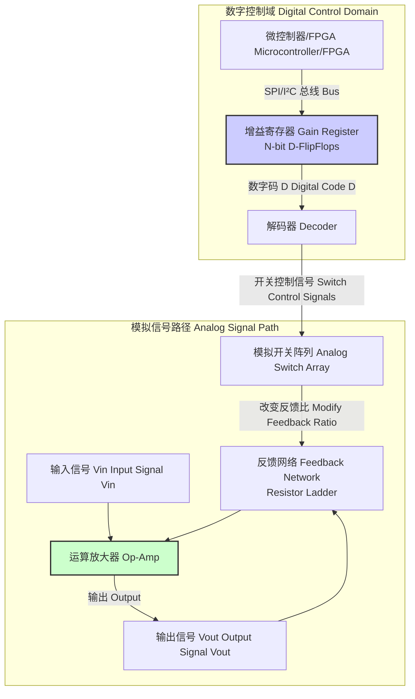
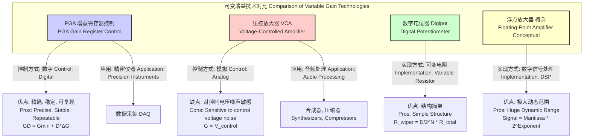

好的，我将根据您的要求，以科学和数学的严谨性为重点，创建关于“增益寄存器”的综合技术文档。文档将仅基于“增益寄存器”这一标题进行构建，所有推理过程在内部以英文进行，但最终输出将完全使用简体中文。

## 增益寄存器 (gain register)

增益寄存器是一种数字存储单元，其核心功能是存储一个离散的数字值，该值用于精确控制一个模拟信号处理电路（通常是可编程增益放大器，PGA）的放大倍数（增益）。作为数字域和模拟域之间的关键接口，增益寄存器在现代混合信号系统中扮演着至关重要的角色，例如数据采集系统、无线通信和医疗成像设备。

### 核心概念与数学基础

增益寄存器的根本作用是将一个数字控制字 $D$ 映射到一个特定的模拟增益值 $G$。这个映射关系是该组件的核心传递函数。放大器的输出电压 $V_{out}$ 与输入电压 $V_{in}$ 的关系由该增益决定：

$$ V_{out} = G(D) \cdot V_{in} $$

其中：
*   $V_{out}$ 是放大器的模拟输出电压。
*   $V_{in}$ 是放大器的模拟输入电压。
*   $G(D)$ 是由增益寄存器中的数字值 $D$ 决定的增益函数。

增益寄存器的数字值 $D$ 是一个 $N$ 位的二进制数，其中 $N$ 是寄存器的分辨率。$D$ 的取值范围为 $0$ 到 $2^N - 1$。增益 $G(D)$ 的映射可以是线性的，也可以是对数的（以分贝 dB 为单位）。

#### 1. 线性增益步长模型

在线性模型中，增益随数字代码 $D$ 呈线性增加。

$$ G_{lin}(D) = G_{min} + D \cdot \Delta G_{step} $$

其中：
*   $G_{lin}(D)$ 是与数字代码 $D$ 对应的线性增益。
*   $G_{min}$ 是当 $D=0$ 时的最小增益（基准增益）。
*   $\Delta G_{step}$ 是每个最低有效位（LSB）变化所对应的增益步长，定义为：
    $$ \Delta G_{step} = \frac{G_{max} - G_{min}}{2^N - 1} $$
*   $G_{max}$ 是当 $D=2^N - 1$ 时的最大增益。
*   $N$ 是增益寄存器的位数（分辨率）。

#### 2. 对数（分贝）增益步长模型

在许多应用（如音频和射频）中，使用对数标度的增益更为普遍，因为它能更好地匹配人类的感知和信号的动态范围。

$$ G_{dB}(D) = G_{min, dB} + D \cdot \Delta G_{step, dB} $$

其中：
*   $G_{dB}(D)$ 是与数字代码 $D$ 对应的分贝增益。
*   $G_{min, dB}$ 是当 $D=0$ 时的最小分贝增益。
*   $\Delta G_{step, dB}$ 是每个 LSB 变化所对应的分贝增益步长。

线性增益 $G_{lin}$ 和分贝增益 $G_{dB}$ 之间的关系是：

$$ G_{dB} = 20 \log_{10}(G_{lin}) $$

### 关键技术规格

下表列出了增益寄存器及其关联PGA的关键技术规格。

| 规格参数 (Specification) | 典型值 (Typical Value) | 单位 (Unit) | 描述 (Description) |
| :--- | :--- | :--- | :--- |
| **分辨率 (Resolution)** | 8, 10, 12 | 位 (bits) | 寄存器可以存储的二进制位数，决定了增益的可调级数 ($2^N$)。 |
| **增益范围 (Gain Range)** | 0 ~ 40 | 分贝 (dB) | 放大器可以实现的最大增益与最小增益之间的范围。 |
| **增益步长 (Gain Step)** | 0.5 | 分贝/最低有效位 (dB/LSB) | 寄存器值每改变一个LSB，增益的变化量。 |
| **增益误差 (Gain Error)** | ±0.1 | 分贝 (dB) | 实际增益值与理论计算值的最大偏差。 |
| **建立时间 (Settling Time)** | 500 | 纳秒 (ns) | 更新寄存器值后，输出信号稳定到最终值1%误差带内所需的时间。 |
| **更新速率 (Update Rate)** | 20 | 兆赫兹 (MHz) | 增益寄存器可以被有效更新的最大频率，通常受限于接口协议。 |
| **接口类型 (Interface Type)** | SPI, I²C, Parallel | - | 用于向寄存器写入数据的数字通信协议。 |
| **功耗 (Power Consumption)** | 5 | 毫瓦 (mW) | 器件在典型工作条件下消耗的功率。 |
| **增益带宽积 (GBWP)** | 1 | 吉赫兹 (GHz) | 放大器增益与其-3dB带宽的乘积，通常为常数。 |

### 常见用例

*   **数据采集系统 (Data Acquisition Systems, DAQ)**
    *   **应用**: 在模数转换器 (ADC) 前端，用于将来自不同量程传感器的信号放大或衰减，以匹配ADC的全量程输入范围，从而最大化系统的动态范围。
    *   **量化性能指标**: 动态范围提升 > 30 dB；信噪比 (SNR) 优化。

*   **软件定义无线电 (Software-Defined Radio, SDR)**
    *   **应用**: 在接收机射频前端，作为自动增益控制 (AGC) 环路的核心执行元件。AGC算法根据接收信号强度动态调整增益，防止强信号使ADC饱和，同时放大弱信号。
    *   **量化性能指标**: AGC环路响应时间 < 1 ms；三阶交调截取点 (IIP3) > +25 dBm。

*   **超声成像 (Ultrasound Imaging)**
    *   **应用**: 用于实现时间增益补偿 (TGC)。随着超声波在人体组织中传播，信号会因深度增加而衰减。TGC放大器链使用动态更新的增益寄存器来补偿这种衰减，确保不同深度的组织回波具有相似的亮度。
    *   **量化性能指标**: TGC曲线匹配精度 ±0.5 dB。

*   **光通信 (Optical Communications)**
    *   **应用**: 在跨阻放大器 (TIA) 的输出级，用于适应大范围的光功率输入。这确保了无论接收到的光信号是强还是弱，后续电路都能正确处理。
    *   **量化性能指标**: 光功率动态范围 > 40 dB。

### 实现考量

#### 硬件实现

增益寄存器在物理上由一组D型触发器构成。其输出通过一个解码器连接到模拟开关阵列，该阵列用于改变运算放大器 (Op-Amp) 的反馈网络，从而改变闭环增益。常见的反馈网络包括电阻梯或R-2R网络。

#### 算法实现：自动增益控制 (AGC)

在许多应用中，增益寄存器的值由一个闭环控制算法（如AGC）动态决定。

**AGC 算法伪代码:**

1.  **测量 (Measure):** 对ADC采样后的数字信号块计算功率或峰值幅度 $P_{meas}$。
2.  **比较 (Compare):** 计算测量值与目标设定点 $P_{target}$ 之间的误差 $e = P_{target} - P_{meas}$。
3.  **计算 (Compute):** 使用比例-积分 (PI) 控制器计算所需的增益调整量 $\Delta G_{dB}$。
    $$ \Delta G_{dB}[k] = K_p \cdot e[k] + K_i \cdot \sum_{j=0}^{k} e[j] \cdot T_s $$
4.  **更新 (Update):** 将当前增益 $G_{dB}[k-1]$ 与调整量相加，得到新的目标增益 $G_{dB, new}$。
5.  **转换与写入 (Convert & Write):** 将 $G_{dB, new}$ 转换为最接近的寄存器数字代码 $D_{new}$，并将其写入增益寄存器。

**算法复杂度分析:**
对于每个处理的信号块，AGC算法的计算复杂度主要由功率计算和PI控制器更新组成。若信号块大小为 $M$，功率计算（如RMS）复杂度为 $O(M)$。PI控制器的计算复杂度为 $O(1)$。因此，整个算法的复杂度为 $O(M)$。然而，寄存器本身的写入操作是一个 $O(1)$ 的硬件操作。

### 性能特征

#### 1. 线性度

*   **积分非线性度 (Integral Nonlinearity, INL):** 实际增益传递函数与理想直线之间的最大偏差。
    $$ INL(D) = \left( G_{actual}(D) - G_{min} \right) - D \cdot \Delta G_{ideal\_step} $$
    一个理想的器件 INL 为 0 LSB。高性能PGA的INL通常小于 ±0.5 LSB。

*   **微分非线性度 (Differential Nonlinearity, DNL):** 相邻两个数字代码对应的实际增益步长与理想步长 $\Delta G_{ideal\_step}$ 之间的差异。
    $$ DNL(D) = \left( G_{actual}(D) - G_{actual}(D-1) \right) - \Delta G_{ideal\_step} $$
    DNL > -1 LSB 保证了增益的单调性。

#### 2. 噪声

放大器的噪声性能通常用输入参考噪声电压谱密度 ($V_{n,in}$) 来衡量，单位为 $nV/\sqrt{Hz}$。此噪声会影响系统的信噪比 (SNR)。输出噪声 $V_{n,out}$ 是输入参考噪声被增益放大后的结果。

$$ V_{n,out}(D) = G(D) \cdot V_{n,in} $$

在某些设计中，$V_{n,in}$ 本身也可能随增益设置 $D$ 而略有变化，这需要在系统噪声预算中予以考虑。

#### 3. 统计度量

由于制造过程的变化（Process）、工作电压（Voltage）和温度（Temperature）的波动（PVT），增益寄存器的性能参数（如增益误差、INL/DNL）会呈现统计分布。制造商通常会提供在特定置信区间（如99.7%，对应于±3σ）内的规格保证。
例如，增益步长可以表示为：$\Delta G_{step, dB} = 0.5 \pm 0.02$ dB (3σ)。

### 相关技术对比

增益寄存器控制的PGA是实现可变增益的主流技术之一，但也存在其他替代方案。

**数学模型对比:**

*   **增益寄存器 (PGA):** $G(D) = f(D)$，其中 $D$ 是离散的数字值。具有高精度和可重复性。
*   **压控放大器 (VCA):** $G \approx k \cdot V_{control}$，其中 $V_{control}$ 是一个连续的模拟电压。其传递函数可能存在非线性，且易受控制路径上的噪声影响。
*   **数字电位器 (Digipot):** 本质上是一个由增益寄存器控制的电阻分压器。当用于构建PGA时，其增益公式取决于外部电路拓扑。
*   **浮点放大器:** 这是一个系统级的概念，其中信号被表示为尾数和指数 ($S = M \cdot \beta^E$)。指数部分 $E$ 的作用类似于一个对数增益寄存器，可以提供极大的动态范围，通常在数字域中通过移位操作实现。

### 参考文献

1.  H. T. Kung, "Why Systolic Architectures?," *Computer*, vol. 15, no. 1, pp. 37-46, Jan. 1982, doi: 10.1109/MC.1982.1653825. (虽然是关于脉动阵列的经典论文，但其数据流和局部控制思想影响了许多高性能数字逻辑设计，包括复杂的控制器逻辑。)
2.  M. T. Fijan and C. G. Sodini, "A 90-dB 20-MHz CMOS Programmable-Gain Amplifier," *IEEE Journal of Solid-State Circuits*, vol. 39, no. 7, pp. 1198-1203, July 2004, doi: 10.1109/JSSC.2004.829929.
3.  A. M. A. Ali, A. A. El-Ghazaly, and A. E. S. A. El-Henawy, "A review of time-gain-compensation amplifier integrated circuits for ultrasound applications," *Analog Integrated Circuits and Signal Processing*, vol. 98, pp. 449–461, 2019, doi: 10.1007/s10470-018-1341-3.