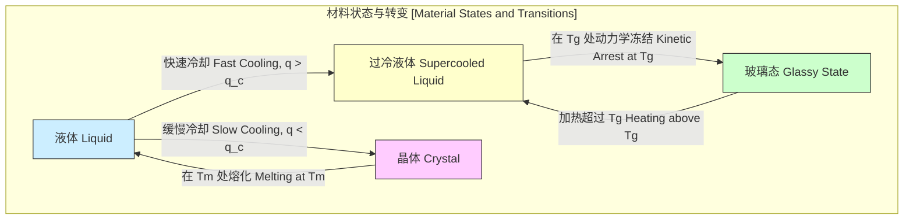
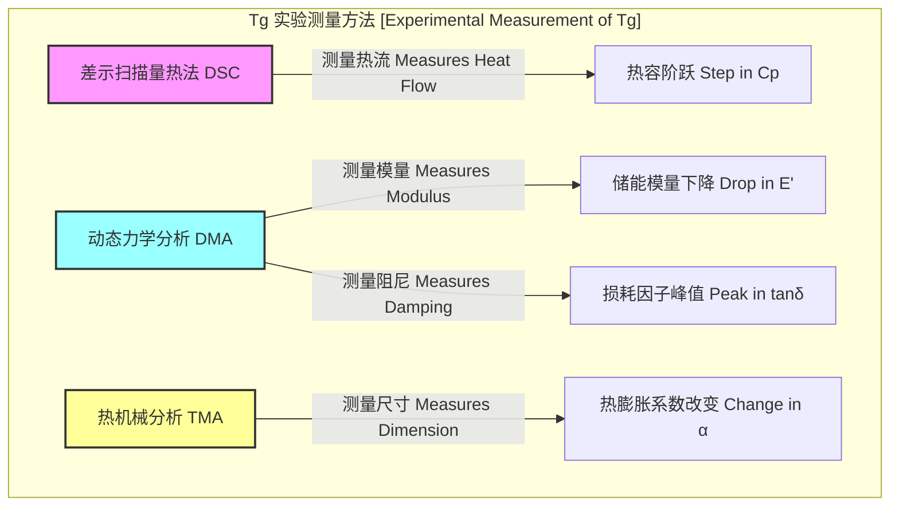
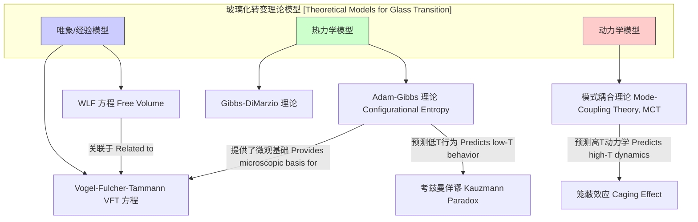

## 玻璃化转变线

玻璃化转变线（Glass Transition Line）是在压力-温度（P-T）相图中表示材料从过冷液体状态转变为玻璃态的界线。与明确的熔化线不同，玻璃化转变不是一个热力学一级或二级相变，而是一个动力学转变。这意味着转变的精确位置（即玻璃化转变温度 $T_g$）取决于测量时间尺度，例如冷却或加热速率。因此，它通常被描述为一个转变区域，而非一个无限细的线。

### 1. 核心概念与数学基础

玻璃化转变是无定形材料（如聚合物和金属玻璃）或半结晶材料的无定形区域所特有的现象。当一个液体被冷却到其平衡熔点 $T_m$ 以下而没有结晶时，它就成为过冷液体。随着温度的进一步降低，过冷液体的粘度急剧增加。当粘度达到一个极高的值（通常定义为 $10^{12}$ Pa·s）时，分子的平动和转动自由度被“冻结”，材料在宏观上表现为固体，即玻璃态。

#### 1.1 热力学表征

尽管玻璃化转变是动力学性质的，但它在热力学量上表现出类似二级相变的特征。在 $T_g$ 附近，材料的吉布斯自由能 $G$ 及其一阶导数（如熵 $S$ 和体积 $V$）是连续的，但其二阶导数则发生不连续或阶跃变化。

*   **等压热容 (Heat Capacity at Constant Pressure, $C_p$)**:
    $$ C_p = T \left( \frac{\partial S}{\partial T} \right)_P = -T \left( \frac{\partial^2 G}{\partial T^2} \right)_P $$
    在 $T_g$ 处，$C_p$ 发生一个阶跃式变化，$\Delta C_p = C_{p, \text{liquid}} - C_{p, \text{glass}} > 0$。

*   **热膨胀系数 (Thermal Expansion Coefficient, $\alpha$)**:
    $$ \alpha = \frac{1}{V} \left( \frac{\partial V}{\partial T} \right)_P = \frac{1}{V} \left( \frac{\partial^2 G}{\partial P \partial T} \right) $$
    在 $T_g$ 处，$\alpha$ 也发生阶跃式变化，$\Delta \alpha = \alpha_{\text{liquid}} - \alpha_{\text{glass}} > 0$。

*   **等温压缩系数 (Isothermal Compressibility, $\kappa_T$)**:
    $$ \kappa_T = -\frac{1}{V} \left( \frac{\partial V}{\partial P} \right)_T = -\frac{1}{V} \left( \frac{\partial^2 G}{\partial P^2} \right)_T $$
    在 $T_g$ 处，$\kappa_T$ 同样发生阶跃式变化，$\Delta \kappa_T = \kappa_{T, \text{liquid}} - \kappa_{T, \text{glass}} > 0$。

#### 1.2 玻璃化转变线斜率：Ehrenfest 关系

对于一个真正的二级相变，其在P-T图上的线斜率可以通过两个 Ehrenfest 方程给出：
$$ \frac{dP}{dT} = \frac{\Delta C_p}{T V \Delta \alpha} $$
$$ \frac{dP}{dT} = \frac{\Delta \alpha}{\Delta \kappa_T} $$
然而，对于玻璃化转变，这两个方程计算出的斜率通常不相等。这引出了 Prigogine-Defay 比率：
$$ \Pi = \frac{\Delta C_p \Delta \kappa_T}{T_g V (\Delta \alpha)^2} $$
其中：
*   $\Pi$ 是 Prigogine-Defay 比率。
*   $\Delta C_p$, $\Delta \alpha$, $\Delta \kappa_T$ 分别是热容、热膨胀系数和压缩系数在 $T_g$ 处的阶跃变化量。
*   $T_g$ 是玻璃化转变温度。
*   $V$ 是在 $T_g$ 时的比容。

对于玻璃化转变，实验上通常发现 $\Pi > 1$（通常在 2 到 5 之间），这表明需要一个以上的序参量来描述玻璃态，从而证实了其非平衡、动力学的本质。

#### 1.3 动力学依赖性

玻璃化转变温度 $T_g$ 强烈依赖于冷却速率 $q = |dT/dt|$。更快的冷却速率导致分子没有足够的时间弛豫到平衡的过冷液体结构，因此在更高的温度下被“冻结”，导致测得的 $T_g$ 更高。这种依赖性可以通过经验公式描述，例如：
$$ \frac{1}{T_g} = A - B \log(q) $$
其中 $A$ 和 $B$ 是材料相关的常数。

### 2. 关键技术规格

玻璃化转变线的位置由 $T_g$ 及其对压力的依赖性 $dT_g/dP$ 决定。下表列出了一些常见无定形材料的典型值。

| 材料 (Material) | $T_g$ (K, at 1 atm) | $dT_g/dP$ (K/GPa) | 备注 (Notes) |
| :--- | :--- | :--- | :--- |
| 聚苯乙烯 (Polystyrene) | ~373 | 200 - 320 | 常用热塑性塑料 |
| 聚碳酸酯 (Polycarbonate) | ~423 | 300 - 500 | 高强度工程塑料 |
| 聚甲基丙烯酸甲酯 (PMMA) | ~378 | 200 - 250 | 透明塑料（亚克力） |
| 二氧化硅 (Silica, $SiO_2$) | ~1475 | ~30 | 主要的玻璃形成氧化物 |
| $Pd_{40}Ni_{40}P_{20}$ (金属玻璃) | ~580 | 30 - 50 | 典型的块状金属玻璃 |
| 甘油 (Glycerol) | ~190 | ~50 | 模型分子玻璃形成液体 |

**注意**: $T_g$ 的值受多种因素影响，包括聚合物的分子量、共聚、增塑剂的存在以及测量方法和速率。

### 3. 常见用例与性能指标

玻璃化转变线是材料科学和工程中一个至关重要的概念，因为它决定了材料的使用温度范围和加工条件。

*   **聚合物加工**:
    *   **热成型**: 热塑性塑料片材被加热到其 $T_g$ 以上，此时它变得柔软且有延展性，可以被模塑成所需的形状，然后在冷却到 $T_g$ 以下后保持形状。
    *   **性能指标**: 加工窗口通常定义为 $T_g$ 以上的一个温度范围，但需远低于降解温度。例如，聚苯乙烯的加工温度通常在 $T_g + 50$ K 左右。

*   **材料选择**:
    *   **橡胶 vs. 塑料**: 弹性体（橡胶）的使用温度远高于其 $T_g$，使其处于柔软、高弹性的状态。相反，刚性塑料则在其 $T_g$ 以下使用，以利用其硬度和刚度。
    *   **性能指标**: 杨氏模量 (Young's Modulus) 在穿过 $T_g$ 时会发生数量级的变化（通常下降2-3个数量级）。例如，PMMA 在 298 K ($< T_g$) 时的模量约为 3 GPa，而在 400 K ($> T_g$) 时降至 MPa 级别。

*   **食品科学**:
    *   **质构与保质期**: 许多食品的脆性（如饼干、薯片）依赖于其无定形基质处于玻璃态。当暴露于湿气中时，水作为增塑剂会降低 $T_g$，导致材料转变为橡胶态，失去脆性。
    *   **性能指标**: 临界水活度 ($a_w$)，即导致 $T_g$ 降低到储存温度以下的水活度，是预测食品保质期的关键参数。

### 4. 实验测量与数据分析

$T_g$ 的测量没有标准化的单一方法，结果依赖于所用技术。

*   **差示扫描量热法 (DSC)**:
    *   **原理**: 测量样品与参比物之间维持相同温度所需的热流差。在 $T_g$ 处，热容 $C_p$ 的变化导致热流曲线出现一个阶跃。
    *   **数据分析**: $T_g$ 通常被定义为阶跃的半高点（中点法）或通过外推阶跃前后的基线与转变区切线的交点（切线法）来确定。分析算法通常是基于导数或积分的数值方法，用于精确定位转变点。其算法复杂度主要为 $O(N)$，其中 $N$ 是数据点数。

*   **动态力学分析 (DMA)**:
    *   **原理**: 对样品施加一个周期性振荡的应力，并测量其应变响应。结果表示为储能模量 $E'$（弹性部分）和损耗模量 $E''$（粘性部分）。
    *   **数据分析**: $T_g$ 可以被定义为储能模量 $E'$ 开始急剧下降的温度、损耗模量 $E''$ 峰值的温度，或损耗因子 $\tan(\delta) = E''/E'$ 峰值的温度。这三种定义会给出略有不同的 $T_g$ 值。

*   **热机械分析 (TMA) / 膨胀计法 (Dilatometry)**:
    *   **原理**: 测量材料尺寸随温度的变化。在 $T_g$ 处，热膨胀系数 $\alpha$ 发生变化，导致膨胀-温度曲线的斜率改变。
    *   **数据分析**: $T_g$ 被确定为两条不同斜率的线性区域的切线交点。

### 5. 性能特征与统计度量

*   **速率依赖性**: 如前所述，$T_g$ 不是一个固定的材料常数。在 DSC 实验中，典型的加热/冷却速率为 10-20 K/min。若将速率提高一个数量级，测得的 $T_g$ 值通常会增加 3-5 K。这种行为是玻璃化动力学性质的直接证据。
*   **转变宽度**: 玻璃化转变发生在一个温度区间内，而非一个点。这个区间的宽度（例如，DSC 曲线上转变的起始和结束温度之差）可以提供关于材料结构异质性的信息。一个更宽的转变通常意味着更复杂的分子结构或更宽的分子量分布。
*   **物理老化 (Physical Aging)**: 当材料在低于 $T_g$ 的温度下退火时，其性能会随时间缓慢变化。这是因为玻璃态是一个非平衡态，材料会朝着能量更低的、更接近平衡过冷液体的结构进行弛豫。这会导致体积收缩、模量增加和材料变脆。老化速率对温度和时间呈对数依赖性。

### 6. 相关理论与比较数学模型

多种理论试图解释玻璃化转变的物理本质。

#### 6.1 自由体积理论 (Free Volume Theory)

该理论假设分子运动需要局部存在足够的“自由体积”。当温度降低时，总自由体积减小。当自由体积分数降至某个临界值（通常为~2.5%）以下时，大规模的分子运动被冻结，系统发生玻璃化。

**Williams-Landel-Ferry (WLF) 方程** 是基于自由体积概念的一个重要经验方程，它描述了粘度或弛豫时间随温度的变化：
$$ \log_{10}(a_T) = \log_{10}\left(\frac{\tau(T)}{\tau(T_g)}\right) = \frac{-C_1(T - T_g)}{C_2 + (T - T_g)} $$
其中：
*   $a_T$ 是移位因子 (shift factor)。
*   $\tau(T)$ 和 $\tau(T_g)$ 分别是在温度 $T$ 和参考温度 $T_g$ 时的弛豫时间。
*   $C_1$ 和 $C_2$ 是 WLF 参数。对于许多聚合物，“普适”值近似为 $C_1 \approx 17.44$ 和 $C_2 \approx 51.6$ K (当参考温度选为 $T_g$ 时)。

#### 6.2 熵理论 (Entropy Theory)

该理论将玻璃化转变与系统的构型熵 $S_c$ 联系起来。构型熵是与系统可访问的微观构象数量相关的熵。

**Adam-Gibbs 理论** 提出，动力学弛豫是由最小的、能够协同重排的区域（Cooperative-Rearranging Region, CRR）的运动所控制的。弛豫时间 $\tau$ 与构型熵 $S_c$ 的关系为：
$$ \tau(T) = \tau_0 \exp\left(\frac{A}{T S_c(T)}\right) $$
其中：
*   $\tau_0$ 是前指数因子，约为分子振动时间（~10⁻¹³ s）。
*   $A$ 是一个与势垒高度相关的常数。
*   $S_c(T)$ 是单位质量的构型熵，随温度降低而减小。

该理论预测，当 $S_c(T)$ 趋于零时，弛豫时间将发散。这个发生“熵危机”的温度被称为 Kauzmann 温度 $T_K$，通常位于 $T_g$ 以下。

#### 6.3 模式耦合理论 (Mode-Coupling Theory, MCT)

MCT 是一种从第一性原理出发的动力学理论，它描述了液体中密度涨落的演化。该理论预测，在某个临界温度 $T_c$（通常远高于实验 $T_g$），由于分子间的“笼蔽效应”（caging effect），结构弛豫会发生动力学突变，导致非遍历性（non-ergodicity）的出现。虽然 MCT 在预测高温柔性液体动力学方面取得了成功，但它无法完全描述 $T_g$ 附近的活化过程。

#### 模型比较

**Vogel-Fulcher-Tammann (VFT) 方程** 是一个广泛使用的拟合粘度或弛豫时间数据的经验公式，其形式与 Adam-Gibbs 理论的预测一致：
$$ \eta(T) = \eta_0 \exp\left(\frac{B}{T - T_0}\right) $$
其中：
*   $\eta(T)$ 是温度 $T$ 下的粘度。
*   $\eta_0$ 和 $B$ 是材料常数。
*   $T_0$ 是理想玻璃化转变温度或 Vogel 温度，此时粘度发散。$T_0$ 通常被认为与 Kauzmann 温度 $T_K$ 有关。

### 7. 参考文献

*   Williams, M. L., Landel, R. F., & Ferry, J. D. (1955). The Temperature Dependence of Relaxation Mechanisms in Amorphous Polymers and Other Glass-forming Liquids. *Journal of the American Chemical Society*, 77(14), 3701–3707. DOI: `10.1021/ja01619a008`
*   Adam, G., & Gibbs, J. H. (1965). On the Temperature Dependence of Cooperative Relaxation Properties in Glass-Forming Liquids. *The Journal of Chemical Physics*, 43(1), 139–146. DOI: `10.1063/1.1696442`
*   Angell, C. A. (1995). Formation of Glasses from Liquids and Biopolymers. *Science*, 267(5206), 1924–1935. DOI: `10.1126/science.267.5206.1924`
*   Berthier, L., & Ediger, M. D. (2016). Facets of the glass transition. *Physics Today*, 69(1), 40-46. DOI: `10.1063/PT.3.3048`
*   Prigogine, I., & Defay, R. (1954). *Chemical Thermodynamics*. Longmans Green, London. (This is a book reference for the Prigogine-Defay ratio).