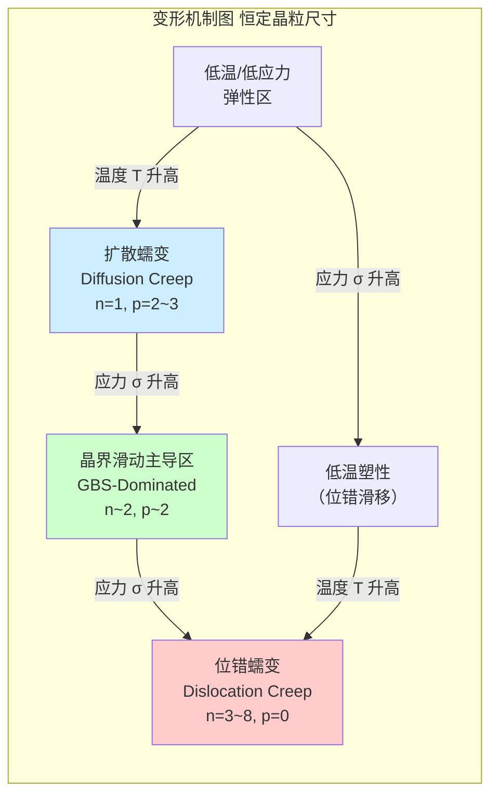

## 晶界滑动 (Grain Boundary Sliding)

晶界滑动（GBS）是多晶材料在高温（通常大于0.5 $T_m$，其中 $T_m$ 为材料的绝对熔点）和中等应力下的一种重要塑性变形机制。该机制涉及晶粒沿着它们共同的晶界相互滑动。GBS本身不能独立产生宏观应变，因为它会在晶粒的三叉晶界或晶界台阶处引起应力集中和几何不相容性。因此，它必须由一个或多个协调机制（Accommodation Mechanisms）来辅助进行，例如晶内位错运动或扩散流。GBS是高温蠕变和超塑性现象的核心。

### 核心概念与数学基础

晶界滑动对总应变的贡献可以通过测量垂直于应力轴的晶界（纵向晶界）和与应力轴平行的晶界（横向晶界）的位移来量化。其核心的本构关系描述了应变速率与外加应力、温度和材料微观结构（主要是晶粒尺寸）之间的关系。

一个被广泛接受的描述晶界滑动应变速率（$\dot{\epsilon}_{gbs}$）的唯象方程如下：

$$
\dot{\epsilon}_{gbs} = A \frac{D_{gb} G b}{kT} \left(\frac{b}{d}\right)^p \left(\frac{\sigma}{G}\right)^n
$$

其中，各参数定义如下：
*   $\dot{\epsilon}_{gbs}$：由晶界滑动产生的应变速率 (s⁻¹)。
*   $A$：一个无量纲的常数，其值取决于具体的滑动和协调模型。
*   $D_{gb}$：晶界扩散系数 (m²·s⁻¹)。它与温度有强烈的依赖关系，遵循阿伦尼乌斯方程：$D_{gb} = D_{0,gb} \exp(-\frac{Q_{gb}}{RT})$，其中 $D_{0,gb}$ 是指前因子， $Q_{gb}$ 是晶界扩散激活能， $R$ 是理想气体常数， $T$ 是绝对温度。
*   $G$：剪切模量 (Pa)，它也随温度变化。
*   $b$：柏氏矢量（Burgers vector）的大小 (m)，代表了晶格畸变的最小单位。
*   $k$：玻尔兹曼常数 ($1.38 \times 10^{-23}$ J/K)。
*   $T$：绝对温度 (K)。
*   $d$：平均晶粒尺寸 (m)。
*   $p$：晶粒尺寸指数，通常取值为2或3，取决于协调机制。
*   $\sigma$：外加（单轴）应力 (Pa)。
*   $n$：应力指数，对于纯晶界滑动（例如在超塑性中），其值通常在2附近。

这个方程表明，晶界滑动速率随着温度和应力的增加而显著加快，并且随着晶粒尺寸的减小而加快。细化晶粒是促进晶界滑动和实现超塑性变形的关键策略。

下图展示了晶界滑动的基本机制及其协调过程。

```mermaid
graph TD
    subgraph "晶界滑动 GBS 过程"
        A["外加剪切应力 Applied Shear Stress, τ"] --> B晶粒沿晶界相对滑动;
        B --> C["在三叉晶界或台阶处产生几何不相容"];
        C --> D["需要协调机制以避免空洞形成[";
        D -- "机制1" --> E["扩散流 Diffusional Flow<br>原子从受压晶界向受拉晶界迁移"];
        D -- "机制2" --> F["晶内位错运动 Intragranular Dislocation Motion<br>位错在应力集中区产生并运动"];
        E --> G["滑动持续进行"];
        F --> G;
    end

    style C fill:#ffcccc,stroke:#990000
    style D fill:#e6e6fa,stroke:#333
```

### 关键技术规格

不同材料在不同条件下表现出的晶界滑动行为有显著差异。下表列出了一些典型材料中与GBS相关的关键参数。

| 参数 | 符号 | 典型值 | 单位 | 适用材料/条件 |
| :--- | :--- | :--- | :--- | :--- |
| 应力指数 | $n$ | 1.8 - 2.5 | 无量纲 | 细晶粒金属和陶瓷的超塑性区 |
| 晶粒尺寸指数 | $p$ | 2 - 3 | 无量纲 | 取决于协调机制（p=2对应晶内位错，p=3对应扩散） |
| 晶界扩散激活能 | $Q_{gb}$ | 80 - 150 | kJ/mol | 铝合金、钛合金 |
| 晶格扩散激活能 | $Q_{L}$ | 140 - 250 | kJ/mol | 铝合金、钛合金（用于对比） |
| 应变速率敏感指数 | $m = 1/n$ | 0.4 - 0.8 | 无量纲 | 超塑性材料（高m值表示抗颈缩能力强） |

**注意:** $Q_{gb}$ 通常约为晶格扩散激活能 $Q_{L}$ 的0.5到0.7倍，这使得晶界扩散在更低的温度下变得重要。

### 常见用例与性能指标

1.  **超塑性成形 (Superplastic Forming, SPF)**
    *   **描述:** 超塑性是指某些细晶粒材料在特定温度和应变速率下，能够实现几百甚至几千的均匀延伸率而不断裂的现象。GBS是实现超塑性的主要变形机制，通常贡献总应变的50-80%。
    *   **性能指标:**
        *   **最大延伸率:** 对于Ti-6Al-4V合金，在约900°C下可达到 > 1000% 的延伸率。
        *   **应变速率敏感指数 (m):** 理想的超塑性材料 $m \ge 0.5$。例如，AA5083铝合金在550°C下的 $m$ 值可达0.6-0.7。
        *   **最佳应变速率:** 通常在 $10^{-4}$ 到 $10^{-2}$ s⁻¹ 的范围内。

2.  **高温蠕变 (High-Temperature Creep)**
    *   **描述:** 在航空发动机涡轮叶片、核反应堆部件等高温服役环境中，GBS是蠕变变形的重要组成部分，尤其是在中等应力水平下。不受控制的GBS可能导致晶界开裂和空洞形成，最终引发蠕变断裂。
    *   **性能指标:**
        *   **蠕变应变速率 ($\dot{\epsilon}$):** 对于镍基高温合金，在1000°C和150 MPa应力下，稳态蠕变速率需低于 $10^{-7}$ s⁻¹ 以保证长时服役寿命。
        *   **GBS贡献率 ($\gamma_{gbs}$):** 在某些蠕变条件下，$\gamma_{gbs} = \epsilon_{gbs} / \epsilon_{total}$ 可达到20-40%。设计抗蠕变合金时，常通过添加强化晶界的元素（如B, Zr, C）来抑制GBS。

### 实现考量（数值模拟）

在计算材料科学中，“实现”晶界滑动通常指通过数值模型来模拟其行为。

*   **有限元法 (Finite Element Method, FEM)**
    *   **方法:** 采用多晶体模型，其中每个晶粒被离散为有限元网格。晶界可以被建模为具有特定本构关系的零厚度内聚区单元（Cohesive Zone Elements）或薄层实体单元。
    *   **算法:**
        1.  生成代表性体积单元（RVE）或实际微观结构的几何模型。
        2.  为晶粒（例如，使用晶体塑性模型）和晶界（例如，使用前面提到的GBS方程的变体）分配材料属性。
        3.  施加宏观边界条件（应力/应变、温度）。
        4.  求解非线性方程组以获得每个时间步长的位移和应力场。
    *   **算法复杂度:** 对于隐式求解器，复杂度通常与自由度数量（$N_{dof}$）的平方或更高有关，即 $O(N_{dof}^k)$ 其中 $1.5 < k < 2$。对于大型模型，迭代求解器可将复杂度降低到接近线性 $O(N_{dof})$。

*   **分子动力学 (Molecular Dynamics, MD)**
    *   **方法:** 直接模拟原子在高温和应力下的运动。可以从第一性原理上观察GBS及其与位错和扩散的相互作用。
    *   **算法:** 在每个时间步长（通常是飞秒量级），计算每个原子上的力（根据原子间势），并根据牛顿第二定律更新其位置和速度。
    *   **算法复杂度:** 对于使用短程势函数的标准MD，复杂度为 $O(N)$，其中 $N$ 是原子数。然而，由于时间步长极小，模拟宏观时间和尺寸的成本极高。

### 性能特征与统计度量

GBS对材料宏观性能的影响是显著的，其贡献率可以通过实验测量或模型预测。

*   **GBS贡献率 ($\gamma_{gbs}$):**
    $$
    \gamma_{gbs} = \frac{\epsilon_{gbs}}{\epsilon_{total}} = \frac{\bar{u}_{||}}{\bar{l} \cdot \epsilon_{total}}
    $$
    其中 $\bar{u}_{||}$ 是沿晶界滑动的平均切向位移，$\bar{l}$ 是晶界的平均长度。实验上，通过在抛光表面上刻画标记线，并在变形后观察标记线在晶界处的不连续性来测量 $\bar{u}_{||}$。

*   **统计分布:** 实验测量的GBS贡献率通常存在分散性。例如，对于一种特定的镁合金在150°C下的蠕变测试，GBS的贡献率可能报告为 $45\% \pm 8\%$（95%置信区间），这反映了材料微观结构的不均匀性和测量误差。

### 相关技术与比较模型

GBS是与多种高温变形机制并存并竞争的。变形机制图（Deformation Mechanism Map）是可视化这些机制主导区域的有力工具。



1.  **位错蠕变 (Dislocation Creep / Power-Law Creep)**
    *   **描述:** 在较高应力和中高温下占主导。变形由晶粒内部的位错攀移和滑移控制。
    *   **数学模型 (Norton Power Law):**
        $$
        \dot{\epsilon}_{disl} = A' \left(\frac{\sigma}{G}\right)^{n'} \exp\left(-\frac{Q_L}{RT}\right)
        $$
        *   **比较:** 与GBS相比，位错蠕变的应力指数 $n'$ 更高（通常为3-8），且几乎不依赖于晶粒尺寸（$p=0$）。其激活能为晶格扩散激活能 $Q_L$。

2.  **扩散蠕变 (Diffusion Creep)**
    *   **描述:** 在低应力和高温下占主导。变形由原子通过晶格（Nabarro-Herring蠕变）或沿晶界（Coble蠕变）的定向扩散驱动。
    *   **数学模型:**
        *   **Nabarro-Herring (N-H) Creep:**
            $$
            \dot{\epsilon}_{NH} = A_{NH} \frac{D_v \sigma \Omega}{d^2 kT}
            $$
        *   **Coble Creep:**
            $$
            \dot{\epsilon}_{C} = A_{C} \frac{D_{gb} \delta_{gb} \sigma \Omega}{d^3 kT}
            $$
        *   **参数:** $D_v$ 是晶格扩散系数，$\Omega$ 是原子体积，$\delta_{gb}$ 是晶界有效厚度。
        *   **比较:** 扩散蠕变对应力是线性的（$n=1$），但对晶粒尺寸有更强的依赖性（$p=2$ for N-H, $p=3$ for Coble）。在晶粒非常细或温度相对较低时，Coble蠕变比N-H蠕变更重要。

GBS通常被视为一个过渡区域，介于扩散蠕变和位错蠕变之间，并且其协调机制本身就涉及扩散和位错活动。

### 参考文献

1.  Langdon, T. G. (2006). "Grain boundary sliding revisited: Developments in sliding and related deformation mechanisms." *Journal of Materials Science*, 41(3), 597-609. DOI: `10.1007/s10853-006-7522-8`
2.  Ashby, M. F. (1972). "A first report on deformation-mechanism maps." *Acta Metallurgica*, 20(7), 887-897. DOI: `10.1016/0001-6160(72)90082-X`
3.  Gifkins, R. C. (1976). "Grain-boundary sliding and its accommodation." *Metallurgical Transactions A*, 7(8), 1225-1232. DOI: `10.1007/BF02656578`
4.  Ruano, O. A., & Sherby, O. D. (1982). "On the creep behavior of fine grained materials." *Materials Science and Engineering*, 56(2), 167-175. DOI: `10.1016/0025-5416(82)90151-X`