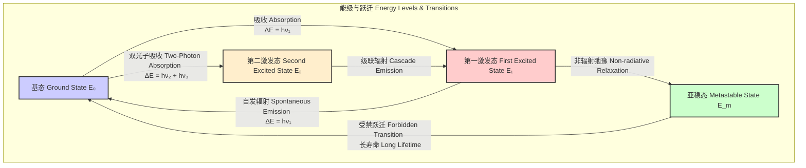
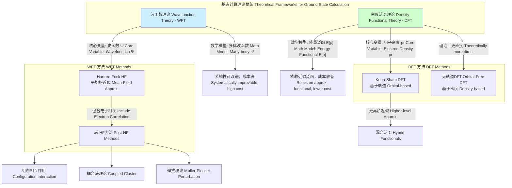

## 基态 (ground state)

基态是量子力学系统中能量最低的定态，也称为零点能态。系统处于基态时，其能量是哈密顿算符的最低本征值。根据量子力学第三定律，在绝对零度（0 K）时，任何纯物质的完美晶体都处于其基态。基态是理解物质的电子结构、化学键合、光谱特性和宏观性质（如电导率和磁性）的基石。

### 核心概念及其数学基础

#### 时间无关薛定谔方程 (Time-Independent Schrödinger Equation)

对于一个不含时的量子系统，其状态由时间无关的薛定谔方程描述。该方程是一个本征值方程，其解为系统的能量本征态和对应的能量本征值。

$$
\hat{H} |\Psi_n\rangle = E_n |\Psi_n\rangle
$$

其中：
*   $\hat{H}$ 是哈密顿算符 (Hamiltonian operator)，代表系统的总能量。它通常是动能算符 $\hat{T}$ 和势能算符 $\hat{V}$ 的和：$\hat{H} = \hat{T} + \hat{V}$。
*   $|\Psi_n\rangle$ 是系统的第 $n$ 个能量本征态 (energy eigenstate)，用狄拉克符号表示的波函数。
*   $E_n$ 是与本征态 $|\Psi_n\rangle$ 对应的能量本征值 (energy eigenvalue)，是系统可能具有的离散或连续的能量值。

基态是具有最低能量本征值 $E_0$ 的态 $|\Psi_0\rangle$。

$$
E_0 = \min(E_n)
$$

对于基态 $|\Psi_0\rangle$，方程为 $\hat{H} |\Psi_0\rangle = E_0 |\Psi_0\rangle$。所有其他能量高于 $E_0$ 的态 $(E_n > E_0)$ 均被称为激发态 (excited states)。

#### 变分原理 (Variational Principle)

对于多体系统，精确求解薛定谔方程通常是不可能的。变分原理为寻找基态能量提供了一个强大的近似方法。该原理指出，对于任意一个归一化的试探波函数 $|\Psi_T\rangle$（即 $\langle\Psi_T|\Psi_T\rangle = 1$），其能量期望值总是大于或等于真实的基态能量 $E_0$。

$$
E_T = \langle\Psi_T|\hat{H}|\Psi_T\rangle \ge E_0
$$

如果试探波函数未归一化，则表达式为：

$$
E_T = \frac{\langle\Psi_T|\hat{H}|\Psi_T\rangle}{\langle\Psi_T|\Psi_T\rangle} \ge E_0
$$

其中：
*   $|\Psi_T\rangle$ 是任意一个满足系统边界条件的试探波函数 (trial wavefunction)。
*   $E_T$ 是该试探波函数下的能量期望值。
*   $E_0$ 是真实的基态能量。

通过最小化 $E_T$ 来优化试探波函数 $|\Psi_T\rangle$，可以获得对基态能量 $E_0$ 和基态波函数 $|\Psi_0\rangle$ 的最佳近似。诸如 Hartree-Fock (HF) 和密度泛函理论 (DFT) 等现代计算化学方法均基于此原理。

### 关键技术指标

下表列出了一些典型量子系统的精确基态能量。

| 系统 (System) | 哈密顿算符 ($\hat{H}$) | 基态能量 ($E_0$) | 单位 (Units) |
| :--- | :--- | :--- | :--- |
| 一维无限深势阱 (1D Infinite Potential Well) | $-\frac{\hbar^2}{2m}\frac{d^2}{dx^2}$ | $\frac{\pi^2\hbar^2}{2mL^2}$ | J |
| 量子谐振子 (Quantum Harmonic Oscillator) | $-\frac{\hbar^2}{2m}\frac{d^2}{dx^2} + \frac{1}{2}m\omega^2x^2$ | $\frac{1}{2}\hbar\omega$ | J |
| 氢原子 (Hydrogen Atom) | $-\frac{\hbar^2}{2m_e}\nabla^2 - \frac{e^2}{4\pi\epsilon_0 r}$ | $-\frac{m_e e^4}{2(4\pi\epsilon_0)^2\hbar^2} \approx -13.606$ | eV |
| 氦原子 (Helium Atom) | $-\frac{\hbar^2}{2m_e}(\nabla_1^2 + \nabla_2^2) - \frac{2e^2}{4\pi\epsilon_0 r_1} - \frac{2e^2}{4\pi\epsilon_0 r_2} + \frac{e^2}{4\pi\epsilon_0 |\mathbf{r}_1-\mathbf{r}_2|}$ | $\approx -79.005$ | eV |

**参数定义:**
*   $\hbar$: 约化普朗克常数 ($1.054 \times 10^{-34}$ J·s)
*   $m$: 粒子质量
*   $L$: 势阱宽度
*   $\omega$: 谐振子角频率
*   $m_e$: 电子质量
*   $e$: 基本电荷
*   $\epsilon_0$: 真空介电常数
*   $r$: 电子到核的距离

### 常见用例

基态的计算和分析在多个科学领域中至关重要。

*   **量子化学 (Quantum Chemistry):**
    *   **用途:** 预测分子结构、稳定性和反应性。分子的平衡几何构型对应于其势能面的最低点，即其电子基态。
    *   **性能指标:** 计算的键长与实验值的偏差通常在 ±0.02 Å 以内（使用高精度方法如 CCSD(T)）。计算的反应能垒与实验值的偏差通常在 ±1-2 kcal/mol 范围内。

*   **凝聚态物理 (Condensed Matter Physics):**
    *   **用途:** 理解材料的宏观性质，如超导性、磁有序和拓扑相。例如，BCS 理论描述了在低温下电子如何形成库珀对，从而进入一个能量更低的集体基态，即超导态。
    *   **性能指标:** 预测材料的能带隙 (band gap) 精度。标准 DFT (LDA/GGA) 的带隙预测误差可能高达 30-50%，而混合泛函或 GW 方法可将误差降低至 10% 以内。

*   **原子物理与光谱学 (Atomic Physics & Spectroscopy):**
    *   **用途:** 解释原子和分子的吸收光谱和发射光谱。当一个系统吸收一个光子时，它从基态跃迁到激发态。当它从激发态回到基态时，会发射一个光子。
    *   **性能指标:** 计算的跃迁频率 ($\Delta E / h$) 与光谱实验测量值的吻合度，高精度计算可以达到 99.9% 以上的准确性。

### 实现考量

寻找多体系统的基态是一个计算密集型问题。不同的算法在精度和计算成本之间进行权衡。

#### 算法与复杂度分析

*   **精确对角化 (Exact Diagonalization, ED):**
    *   **描述:** 在一个有限的基组中直接构建并对角化哈密顿矩阵。
    *   **复杂度:** $O(D^3)$，其中 $D$ 是希尔伯特空间的维度。对于自旋系统，维度随粒子数 $N$ 指数增长 ($D \sim 2^N$)，因此该方法仅适用于非常小的系统（通常 $N < 40$）。

*   **Hartree-Fock (HF) 方法:**
    *   **描述:** 一种基于变分原理的平均场近似方法，它使用单个斯莱特行列式来近似多电子波函数。
    *   **复杂度:** $O(N^4)$，其中 $N$ 是基函数的数量。它忽略了电子相关能，因此精度有限。

*   **密度泛函理论 (Density Functional Theory, DFT):**
    *   **描述:** 同样基于变分原理，但变量是电子密度 $\rho(\mathbf{r})$ 而非波函数。Hohenberg-Kohn 定理保证了基态能量是密度的唯一泛函。在实践中，通过求解 Kohn-Sham 方程来执行。
    *   **复杂度:** 通常为 $O(N^3)$，其中 $N$ 是基函数的数量。DFT 在成本和精度之间取得了很好的平衡，是目前最流行的电子结构计算方法。

*   **量子蒙特卡洛 (Quantum Monte Carlo, QMC):**
    *   **描述:** 一类使用随机抽样来求解薛定谔方程的随机方法。例如，扩散蒙特卡洛 (DMC) 可以在费米子节点近似下获得极高精度的基态能量。
    *   **复杂度:** 复杂度通常为 $O(N^{3-4})$，但前置因子较大。对于大型系统，其扩展性优于高精度波函数方法。

### 性能特征

下表比较了不同计算方法在计算分子基态能量时的典型性能。参考系统为一系列小分子（如 G2/97 测试集），性能指标为与高精度实验值或耦合簇理论 (CCSD(T)) 结果的比较。

| 方法 (Method) | 平均绝对误差 (Mean Absolute Error, kcal/mol) | 计算成本标度 (Scaling) | 95% 置信区间 (kcal/mol) | 优点 (Pros) | 缺点 (Cons) |
| :--- | :--- | :--- | :--- | :--- | :--- |
| Hartree-Fock | ~10-20 | $O(N^4)$ | ± 5.0 | 速度快，概念简单 | 忽略电子相关能 |
| DFT (GGA, e.g., B3LYP) | ~2-4 | $O(N^3)$ | ± 1.5 | 成本与精度平衡 | 依赖于近似的交换相关泛函 |
| MP2 | ~3-5 | $O(N^5)$ | ± 2.0 | 系统性改进 HF | 对某些系统可能发散，成本高 |
| CCSD(T) | < 1 ("黄金标准") | $O(N^7)$ | ± 0.5 | 精度极高 | 计算成本极高，仅限小系统 |
| DMC-QMC | < 1.5 | $O(N^{3-4})$ | ± 0.8 | 精度高，扩展性好 | 费米节点近似，统计误差 |

### 相关技术

#### 基态、激发态与亚稳态

一个量子系统不仅有基态，还有一系列能量更高的激发态和特殊的亚稳态。它们之间的关系可以通过能级图来可视化。

*   **激发态 (Excited State):** 能量高于基态的任何定态。系统可以通过吸收能量（如光子）从基态跃迁到激发态。激发态通常不稳定，会通过辐射或非辐射过程弛豫回能量较低的态。
*   **亚稳态 (Metastable State):** 一种特殊的激发态，其向低能级态的跃迁受到选择定则的禁戒。因此，亚稳态的寿命比普通激发态长得多，这在激光（如氦氖激光器）和磷光现象中至关重要。

#### 计算框架比较

寻找基态能量的理论框架主要分为两类：波函数理论 (Wavefunction Theory, WFT) 和密度泛函理论 (DFT)。

### 参考文献

1.  Hohenberg, P., & Kohn, W. (1964). Inhomogeneous Electron Gas. *Physical Review*, 136(3B), B864–B871. **DOI:** [10.1103/PhysRev.136.B864](https://doi.org/10.1103/PhysRev.136.B864)
2.  Kohn, W., & Sham, L. J. (1965). Self-Consistent Equations Including Exchange and Correlation Effects. *Physical Review*, 140(4A), A1133–A1138. **DOI:** [10.1103/PhysRev.140.A1133](https://doi.org/10.1103/PhysRev.140.A1133)
3.  Čížek, J. (1966). On the Correlation Problem in Atomic and Molecular Systems. Calculation of Wavefunction Components in Ursell-Type Expansion Using Quantum-Field Theoretical Methods. *The Journal of Chemical Physics*, 45(11), 4256–4266. **DOI:** [10.1063/1.1727484](https://doi.org/10.1063/1.1727484)
4.  Foulkes, W. M. C., Mitas, L., Needs, R. J., & Rajagopal, G. (2001). Quantum Monte Carlo simulations of solids. *Reviews of Modern Physics*, 73(1), 33–83. **DOI:** [10.1103/RevModPhys.73.33](https://doi.org/10.1103/RevModPhys.73.33)