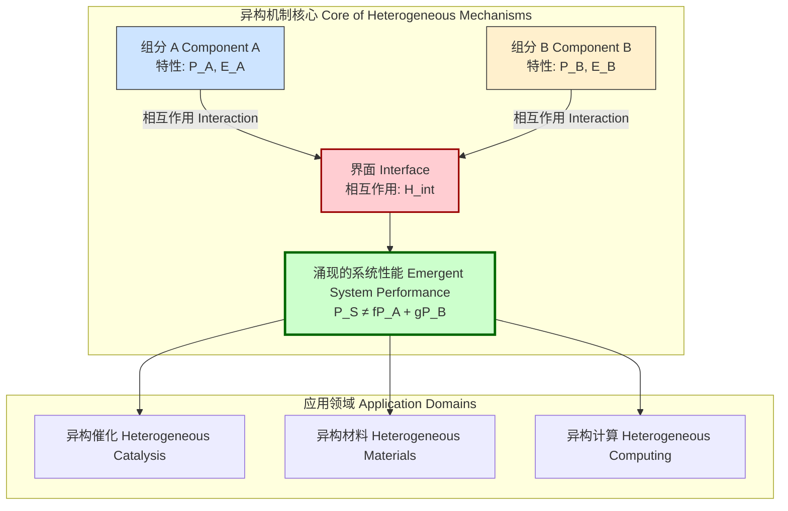
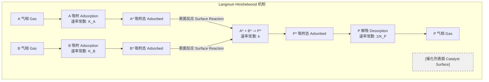
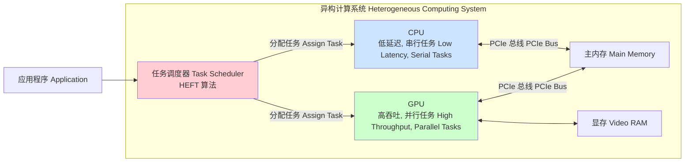

## 异构机制 (Heterogeneous Mechanisms)

异构机制是一个基础科学与工程概念，指由两种或多种在物理、化学或计算特性上存在显著差异的组分或相构成的系统，其整体行为由各组分间的相互作用和界面效应所决定。与均相系统（Homogeneous Systems）相比，异构系统的关键在于其不均匀性，这种不均匀性是系统功能和性能的来源，而非缺陷。本篇文档将从数学基础、关键技术、性能特征等多个维度，对异构机制进行系统性阐述。

### 1. 核心概念与数学基础

从根本上说，一个异构系统 $\mathbb{S}$ 可以被数学地描述为其多个不同子系统 $\mathbb{S}_i$ 的集合，以及定义它们之间相互作用的界面 $\mathcal{I}_{ij}$。

#### 1.1 系统哈密顿量表述 (System Hamiltonian Formulation)

系统的总能量或哈密顿量 $H_{\text{total}}$ 可以分解为各个独立组分的哈密顿量之和，以及它们之间的相互作用哈密顿量。

$$
H_{\text{total}} = \sum_{i=1}^{N} H_i + \sum_{i<j}^{N} H_{\text{int}}(\mathbb{S}_i, \mathbb{S}_j, \mathcal{I}_{ij})
$$

其中：
*   $H_{\text{total}}$: 系统的总哈密顿量。
*   $H_i$: 第 $i$ 个独立组分或相的哈密顿量，描述其内部状态和能量。
*   $H_{\text{int}}$: 组分 $i$ 和 $j$ 之间的相互作用哈密顿量，它依赖于两个组分的性质以及它们接触的界面 $\mathcal{I}_{ij}$ 的特性（如表面能、晶格失配、电势差等）。
*   $N$: 系统中独立组分的总数。

这个相互作用项 $H_{\text{int}}$ 是异构机制的核心。正是它导致了系统整体性能（如催化活性、材料强度、计算效率）的非线性涌现，而不仅仅是各组分性能的简单加权平均。

#### 1.2 界面动力学 (Interface Dynamics)

物质、能量或信息在异构界面上的传输是决定系统宏观行为的关键。其通量 $J$ 通常可以用一个广义的输运方程来描述：

$$
J = -M \nabla \mu
$$

其中：
*   $J$: 穿过界面的通量（例如，质量通量、热通量、电荷通量）。
*   $M$: 迁移率或输运系数，是与界面特性相关的张量。对于异构界面， $M$ 具有高度的空间依赖性。
*   $\nabla \mu$: 广义化学势的梯度，是驱动力（例如，浓度梯度、温度梯度、电势梯度）。

下图展示了异构机制在不同科学领域中的体现。

### 2. 关键技术领域与规范

异构机制在多个前沿科技领域中扮演着核心角色。

#### 2.1 异构催化 (Heterogeneous Catalysis)

在异构催化中，催化剂的相（通常是固体）与反应物（通常是气体或液体）的相不同。反应发生在催化剂的“活性位点”上。

**关键技术规范**

| 参数 (Parameter) | 符号 (Symbol) | 典型值 (Typical Value) | 单位 (Unit) | 描述 (Description) |
| :--- | :---: | :--- | :---: | :--- |
| 比表面积 (Specific Surface Area) | $S_A$ | 50 - 1000 | m²/g | 提供反应的物理场所面积 |
| 孔径 (Pore Diameter) | $d_p$ | 2 - 50 | nm | 影响反应物和产物的传质 |
| 活性位点密度 (Active Site Density) | $\rho_s$ | $10^{12}$ - $10^{15}$ | sites/cm² | 单位面积上有效催化中心的数量 |
| 金属分散度 (Metal Dispersion) | $D$ | 0.1 - 1.0 | (无量纲) | 暴露在表面的金属原子数与总金属原子数的比率 |

**Langmuir-Hinshelwood (L-H) 模型**
L-H模型是描述异构催化表面反应动力学的经典模型。对于一个双分子反应 $A + B \rightarrow P$，其反应速率 $r$ 可以表示为：

$$
r = \frac{k K_A K_B C_A C_B}{(1 + K_A C_A + K_B C_B + K_P C_P)^2}
$$

其中：
*   $r$: 反应速率 (mol·m⁻²·s⁻¹)。
*   $k$: 表面反应的速率常数 (mol·m⁻²·s⁻¹)。
*   $K_A, K_B, K_P$: 反应物A、B和产物P的吸附平衡常数 (m³/mol)。
*   $C_A, C_B, C_P$: 反应物A、B和产物P的体相浓度 (mol/m³)。

该模型假设反应发生在两个已被吸附的分子之间。

#### 2.2 异构材料 (Heterogeneous Materials)

异构材料，如复合材料，由两种或多种物理或化学性质不同的材料组成，以获得比单一组分更优越的性能。

**关键技术规范 (以碳纤维增强聚合物为例)**

| 参数 (Parameter) | 符号 (Symbol) | 典型值 (Typical Value) | 单位 (Unit) | 描述 (Description) |
| :--- | :---: | :--- | :---: | :--- |
| 纤维体积分数 (Fiber Volume Fraction) | $V_f$ | 0.5 - 0.7 | (无量纲) | 纤维在复合材料总体积中的占比 |
| 纤维拉伸模量 (Fiber Tensile Modulus) | $E_f$ | 200 - 800 | GPa | 纤维的刚度 |
| 基体拉伸模量 (Matrix Tensile Modulus) | $E_m$ | 2 - 5 | GPa | 基体材料的刚度 |
| 界面剪切强度 (Interfacial Shear Strength) | $\tau_{iss}$ | 20 - 100 | MPa | 纤维与基体界面的结合强度 |

**混合律 (Rule of Mixtures)**
混合律是预测复合材料宏观性能的简化一阶模型。
*   **Voigt 模型 (纵向模量):** 假设在载荷方向上应变相等。
    $$ E_L = E_f V_f + E_m (1-V_f) $$
*   **Reuss 模型 (横向模量):** 假设在垂直载荷方向上应力相等。
    $$ E_T = \frac{E_f E_m}{E_f (1-V_f) + E_m V_f} $$

其中：
*   $E_L, E_T$: 复合材料的纵向和横向杨氏模量 (GPa)。
*   $E_f, E_m$: 纤维和基体的杨氏模量 (GPa)。
*   $V_f$: 纤维的体积分数。

这些模型是理想化的边界，实际性能通常介于两者之间，并受界面特性和纤维排列等因素影响。

#### 2.3 异构计算 (Heterogeneous Computing)

异构计算系统使用多种类型的处理器（如 CPU, GPU, FPGA, TPU）来最大化性能或能效。

**关键技术规范**

| 参数 (Parameter) | 单元 (Unit) | CPU (典型值) | GPU (典型值) | TPU (典型值) |
| :--- | :---: | :---: | :---: | :---: |
| 峰值算力 (Peak Performance) | TFLOPS | ~1-5 (FP64) | ~10-20 (FP64), >100 (FP16) | >100 (INT8) |
| 内存带宽 (Memory Bandwidth) | GB/s | ~100-200 | ~800-1500 | >1000 |
| 功耗 (Power Consumption) | W | 150 - 300 | 300 - 500 | 75 - 250 |
| 延迟 (Latency) | ns | ~1-10 (L1 Cache) | ~20-50 (L1 Cache) | N/A |

**Amdahl 定律的扩展**
对于异构系统，Amdahl 定律可以扩展以评估多处理器加速效果。假设一个任务中，可被处理器类型1加速的部分为 $P_1$，被类型2加速的部分为 $P_2$，以此类推，串行部分为 $1 - \sum P_i$。总加速比 $S$ 为：
$$
S_{\text{het}} = \frac{1}{(1 - \sum_{i=1}^{N} P_i) + \sum_{i=1}^{N} \frac{P_i}{S_i}}
$$
其中：
*   $S_{\text{het}}$: 整个系统的总加速比。
*   $P_i$: 任务中可以由第 $i$ 类处理器执行的部分所占的比例。
*   $S_i$: 第 $i$ 类处理器相对于基准处理器的加速比。

### 3. 典型用例与性能指标

| 领域 (Domain) | 用例 (Use Case) | 关键性能指标 (KPI) | 定量值示例 (Quantitative Example) |
| :--- | :--- | :--- | :--- |
| 异构催化 | 哈伯-博斯法合成氨 (Haber-Bosch Process) | 转换频率 (Turnover Frequency, TOF) | 0.1 - 10 s⁻¹ (在 400°C, 200 atm) |
| | | 选择性 (Selectivity) | >98% for NH₃ |
| 异构材料 | 航空航天中的CFRP (CFRP in Aerospace) | 比强度 (Specific Strength) | > 2000 kN·m/kg |
| | | 比模量 (Specific Modulus) | > 120 MN·m/kg |
| 异构计算 | 深度学习模型训练 (Deep Learning Training) | 训练时间 (Time-to-Train) | ResNet-50 on ImageNet: < 5 min |
| | | 能效 (Energy Efficiency) | > 2 GFLOPS/Watt |

### 4. 实现考量与算法分析

#### 异构计算中的任务调度
在异构计算中，如何将任务有效分配给最合适的处理器是核心挑战。**异构最早完成时间 (Heterogeneous Earliest Finish Time, HEFT)** 算法是一种经典的列表调度启发式算法。

**HEFT 算法步骤:**
1.  **任务排序阶段:** 计算每个任务的向上排名 (upward rank)，这是一个基于任务计算成本和通信成本的递归定义：
    $$ \text{rank}_u(t_i) = \overline{w_i} + \max_{t_j \in \text{succ}(t_i)} (\overline{c_{i,j}} + \text{rank}_u(t_j)) $$
    其中 $\overline{w_i}$ 是任务 $t_i$ 在所有处理器上的平均计算成本，$\overline{c_{i,j}}$ 是平均通信成本。按 $\text{rank}_u$ 值降序排列任务。
2.  **处理器选择阶段:** 按照排名顺序，为每个任务选择能使其最早完成（包括数据传输时间）的处理器。

**算法复杂度:**
HEFT 算法的复杂度为 $O(v^2 \cdot p)$，其中 $v$ 是任务数量， $p$ 是处理器数量。对于任务依赖关系复杂的场景，这是一个计算密集但效果通常较好的调度策略。

### 5. 性能特征与统计度量

异构系统的性能通常不是一个确定值，而是呈现出一种分布，这源于其内在的随机性（如催化剂活性位点分布、材料微观缺陷、计算任务的动态变化）。

*   **材料强度:** 对于陶瓷或复合材料等脆性材料，其强度通常不遵循高斯分布，而是遵循 **Weibull 分布**。Weibull 分布的累积分布函数 (CDF) 为：
    $$ F(\sigma; \lambda, k) = 1 - e^{-(\sigma/\lambda)^k} \quad \text{for} \quad \sigma \ge 0 $$
    其中：
    *   $\sigma$: 材料承受的应力。
    *   $\lambda$: 尺度参数（特征强度）。
    *   $k$: 形状参数（Weibull 模数），描述了材料强度的离散程度。$k$ 值越高，材料性能越均匀。

*   **计算性能:** 在评估异构计算系统性能时，应报告多次运行的统计结果。例如，模型推理延迟可以报告为：**平均值 ± 95% 置信区间 (Mean ± 95% Confidence Interval)**，如 $10.2 \pm 0.3$ ms。这比单一的数值更能反映系统性能的稳定性和真实表现。

### 6. 相关技术与数学模型对比

异构机制最直接的对立面是均相机制。

| 对比维度 (Dimension) | 均相机制 (Homogeneous Mechanism) | 异构机制 (Heterogeneous Mechanism) |
| :--- | :--- | :--- |
| **物理状态** | 所有组分处于同一相 (如全液体) | 组分处于不同相 (如固-液) |
| **关键区域** | 整个体积 (Bulk volume) | 界面/表面 (Interface/Surface) |
| **传质限制** | 通常较小，受限于分子扩散 | 显著，通常是速率决定步骤之一 |
| **分离与回收** | 困难，需要蒸馏、萃取等 | 简单，通过过滤、沉降等物理方法 |
| **数学模型** | 质量作用定律，速率方程简单 | 复杂，需考虑吸附、解吸、表面扩散 (如L-H模型) |
| **应用示例** | 酸碱中和反应 | 汽车尾气净化 (三元催化剂) |

### 7. 参考文献

1.  Ertl, G. (1990). The microscopic nature of heterogeneous catalysis. *Angewandte Chemie International Edition in English*, 29(11), 1219-1227. **DOI:** [10.1002/anie.199012191](https://doi.org/10.1002/anie.199012191)
2.  Hull, D., & Clyne, T. W. (1996). *An introduction to composite materials*. Cambridge university press. (A foundational text on the mechanics of heterogeneous materials).
3.  Topcuoglu, H., Hariri, S., & Wu, M. Y. (2002). Performance-effective and low-complexity task scheduling for heterogeneous computing. *IEEE transactions on parallel and distributed systems*, 13(3), 260-274. **DOI:** [10.1109/71.993206](https://doi.org/10.1109/71.993206)
4.  Weibull, W. (1951). A statistical distribution function of wide applicability. *Journal of applied mechanics*, 18(3), 293-297. **DOI:** [10.1115/1.4010337](https://doi.org/10.1115/1.4010337)