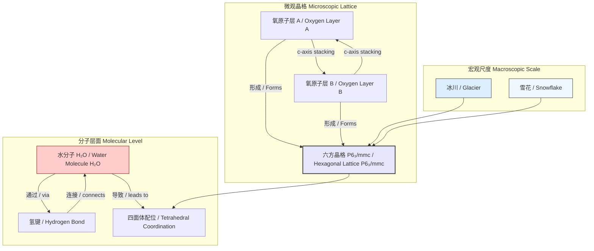
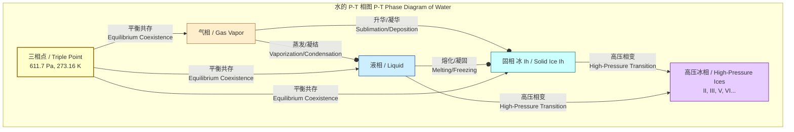

## 六方冰 (Ice Ih)

六方冰，在科学上表示为冰 Ih，是地球上自然存在的最常见的冰的晶体形态。它构成了几乎所有的天然雪和冰，从冰川到霜。其独特的物理和化学性质源于其由水分子通过氢键网络构成的特定的六方晶体结构。

### 核心概念及其数学基础

六方冰的宏观性质是其微观结构和分子间相互作用的直接结果。

#### 晶体结构

冰 Ih 属于六方晶系，其空间群为 **P6₃/mmc** (No. 194)。在此结构中：
*   **氧原子晶格**: 氧原子排列成一个纤锌矿（Wurtzite）类型的晶格。该晶格具有 ABAB... 的堆叠序列，形成了具有六重对称性的层。
*   **四面体配位**: 每个水分子都与另外四个水分子形成四面体配位。氧原子位于四面体的中心，而四个相邻的氧原子位于其顶点。
*   **氢键**: 这些水分子通过氢键连接在一起。每个水分子作为两个氢键的供体（通过其自身的氢原子）和两个氢键的受体（通过其孤对电子）。

#### 伯纳尔-福勒规则 (Bernal-Fowler Rules)

水分子在晶格中的取向遵循由 J.D. Bernal 和 R.H. Fowler 于1933年提出的两条基本规则，这些规则支配着质子（氢原子）的排列：
1.  每个氧原子共价键合两个氢原子。
2.  在连接两个相邻氧原子的氢键中，只存在一个氢原子。

这些规则确保了水分子的完整性，并定义了氢键的结构。

#### 质子无序与残余熵

伯纳尔-福勒规则允许质子在晶格中存在大量的可能构象。这种固有的无序状态导致即使在绝对零度（0 K）下，冰 Ih 也具有非零的熵，这被称为**残余熵**。莱纳斯·鲍林（Linus Pauling）在1935年首次对此进行了计算。

考虑一个由 $N$ 个水分子组成的晶体。
*   每个水分子周围有四个氢键位点。根据规则1，必须有两个质子靠近该氧原子（共价键），两个质子远离该氧原子（氢键）。
*   围绕一个氧原子的四个键位点，选择两个位置放置质子的方式有 $\binom{4}{2} = 6$ 种。
*   对于整个晶体，总的可能构象数 $W$ 可以近似为：
    $$ W \approx \left(\frac{3}{2}\right)^N $$
*   系统的残余熵 $S_0$ 由玻尔兹曼熵公式给出：
    $$ S_0 = k_B \ln(W) = N k_B \ln\left(\frac{3}{2}\right) $$
    其中：
    *   $S_0$ 是绝对零度下的残余熵。
    *   $N$ 是系统中水分子的数量。
    *   $k_B$ 是玻尔兹曼常数 ($1.380649 \times 10^{-23} \text{ J/K}$)。
    *   $W$ 是系统的微观状态数（构象数）。

对于1摩尔的冰，其理论残余熵为 $S_{0,m} = N_A k_B \ln(3/2) \approx 3.37 \text{ J/(mol·K)}$，这与实验测量值（$3.41 \text{ J/(mol·K)}$）非常吻合。

#### 晶格衍射

冰 Ih 的晶体结构主要通过 X 射线和中子衍射技术来确定。衍射图样由**布拉格定律**描述：
$$ n\lambda = 2d_{hkl} \sin\theta $$
其中：
*   $n$ 是一个正整数，代表衍射级数。
*   $\lambda$ 是入射波（X射线或中子）的波长。
*   $d_{hkl}$ 是晶体中米勒指数为 $(hkl)$ 的晶面族之间的间距。
*   $\theta$ 是入射波与衍射晶面之间的夹角，称为布拉格角。

对于六方晶系，晶面间距 $d_{hkl}$ 由晶格参数 $a$ 和 $c$ 决定：
$$ \frac{1}{d_{hkl}^2} = \frac{4}{3} \frac{h^2 + hk + k^2}{a^2} + \frac{l^2}{c^2} $$

### 关键技术规格

下表总结了冰 Ih 在标准大气压（101.325 kPa）下的关键物理性质。

| 属性 (Property) | 值 (Value) | 单位 (Unit) | 条件 (Conditions) |
| :--- | :--- | :--- | :--- |
| 晶体结构 (Crystal System) | 六方 (Hexagonal) | - | - |
| 空间群 (Space Group) | P6₃/mmc (No. 194) | - | - |
| 密度 (Density) | 916.7 | kg/m³ | 0 °C |
| 晶格参数 $a$ (Lattice Parameter $a$) | 4.523 | Å | 0 °C |
| 晶格参数 $c$ (Lattice Parameter $c$) | 7.367 | Å | 0 °C |
| 比热容 (Specific Heat Capacity) | 2108 | J/(kg·K) | 0 °C |
| 熔化潜热 (Latent Heat of Fusion) | 333.55 | kJ/kg | 0 °C |
| 热导率 (Thermal Conductivity) | 2.22 | W/(m·K) | 0 °C |
| 杨氏模量 (Young's Modulus) | ~9.3 | GPa | -20 °C, 多晶 (polycrystalline) |
| 泊松比 (Poisson's Ratio) | 0.325 | - | 多晶 (polycrystalline) |
| 折射率 (Refractive Index, $n_D$) | 1.31 | - | 589 nm, 0 °C |

### 常见用例与定量性能指标

| 用例 (Use Case) | 领域 (Field) | 关键性能指标 (Quantitative Performance Metric) | 描述 (Description) |
| :--- | :--- | :--- | :--- |
| 冰川流动建模 | 冰川学 (Glaciology) | **应变率**: $\dot{\epsilon} \propto \tau^n$ (Glen's Flow Law, $n \approx 3$) | 冰的非牛顿流体行为是预测冰川和冰盖动态的基础。应力指数 $n$ 控制着流动对剪应力的敏感度。 |
| 云的形成 | 大气科学 (Atmospheric Science) | **成核率**: $J(T)$ (单位体积单位时间的成核事件数) | 冰 Ih 晶体是高空卷云的主要成分。其形成依赖于过冷水滴的均相或异相成核过程。 |
| 冷冻保存 | 生物技术 (Biotechnology) | **冷却速率**: > $10^5$ K/s (用于玻璃化) | 在细胞和组织的冷冻保存中，必须控制冰 Ih 的形成以避免机械损伤。快速冷却可以绕过结晶，形成玻璃态。 |
| 材料科学 | 材料学 (Materials Science) | **断裂韧性**: $K_{IC} \approx 0.1 \text{ MPa} \cdot \text{m}^{1/2}$ | 冰的力学性能对于理解冰在工程环境（如冰路、海上平台）中的行为至关重要。 |

### 实施考量与算法复杂性

研究冰 Ih 的性质通常依赖于计算模拟，例如分子动力学（MD）和蒙特卡洛（MC）方法。

#### 分子动力学 (Molecular Dynamics, MD)
MD 模拟通过数值求解牛顿运动方程来模拟原子和分子的时间演化。
*   **核心算法**: Verlet 积分算法是一种常用的数值积分器，因为它具有良好的能量守恒性和时间可逆性。
    $$ \mathbf{r}(t+\Delta t) = 2\mathbf{r}(t) - \mathbf{r}(t-\Delta t) + \frac{\mathbf{F}(t)}{m} (\Delta t)^2 $$
    其中 $\mathbf{r}$ 是位置向量，$\mathbf{F}$ 是作用在质量为 $m$ 的粒子上的力，$\Delta t$ 是时间步长。
*   **算法复杂性**:
    *   **朴素计算**: 计算所有粒子对之间的相互作用力，复杂度为 $O(N^2)$。
    *   **优化算法**: 对于长程静电相互作用，使用**粒子网格埃瓦尔德 (Particle-Mesh Ewald, PME)** 等方法可以将复杂度降低到 $O(N \log N)$ 或 $O(N)$，从而可以模拟更大的系统。

#### 蒙特卡洛 (Monte Carlo, MC)
MC 方法使用随机抽样来探索系统的相空间，特别适用于研究平衡性质，如质子构型。
*   **核心算法**: Metropolis-Hastings 算法。从状态 $i$ 到状态 $j$ 的转移（例如，移动一个质子）被接受的概率为：
    $$ P_{\text{acc}}(i \to j) = \min\left(1, \exp\left(-\frac{E_j - E_i}{k_B T}\right)\right) $$
    其中 $E_i$ 和 $E_j$ 是状态的能量。
*   **算法复杂性**: 对于局部移动，每次移动的能量计算通常只涉及少数几个粒子，因此每次 MC 步的复杂度为 $O(1)$。完成一次对所有 $N$ 个粒子的尝试（一次“扫描”），总复杂度为 $O(N)$。

### 性能特征

冰 Ih 的物理性质表现出显著的各向异性，这是其六方晶体结构的直接后果。

*   **力学性能**: 冰单晶在不同方向上具有不同的弹性。沿 c 轴（垂直于六方层面）的弹性模量（由弹性常数 $C_{33}$ 表征）大于基面（basal plane）内的弹性模量（由 $C_{11}$ 表征）。这使得冰在基面上更容易发生滑移和变形。
    *   $C_{11} \approx 13.9 \text{ GPa}$
    *   $C_{33} \approx 15.0 \text{ GPa}$
    *   $C_{44} \approx 3.0 \text{ GPa}$ (剪切模量)
    (值在 -16 °C)
*   **热性能**: 热导率也是各向异性的，沿基面的传导效率略高于沿 c 轴的传导效率。
*   **相变动力学**: 液态水可以被过冷到远低于 0 °C 的温度（在纯净条件下可达约 -40 °C）才结晶成冰 Ih。相变过程的统计分布通常用经典成核理论来描述。

### 冰 Ih 的结构关系

下面的图表说明了冰 Ih 的多层次结构。

### 相关技术与比较数学模型

冰 Ih 只是水众多固相中的一种。其他冰的多形体在不同温度和压力条件下是稳定的。

#### 立方冰 (Ice Ic)
*   **结构**: 立方冰具有与金刚石相同的立方晶体结构（空间群 Fd$\bar{3}$m）。其氧原子晶格具有 ABCABC... 的堆叠序列。
*   **稳定性**: 在大气压下，冰 Ic 是亚稳态的，通常在低于 -120 °C 的温度下通过沉积水蒸气形成。加热到约 -70 °C 以上时，它会不可逆地转变为稳定的冰 Ih。
*   **能量比较**: 冰 Ic 和冰 Ih 的吉布斯自由能非常接近，但冰 Ih 的自由能始终略低，因此是更稳定的相。
    $$ G_{Ih}(T, P) < G_{Ic}(T, P) $$

#### 高压冰相
在更高的压力下，水分子被压缩成更致密的排列，形成多种高压冰相（如冰 II, III, V, VI 等）。这些相之间的转变由其吉布斯自由能决定。
*   **相边界**: 两个相 $\alpha$ 和 $\beta$ 之间的平衡边界由**克劳修斯-克拉佩龙方程**描述：
    $$ \frac{dP}{dT} = \frac{\Delta H}{T\Delta V} = \frac{L}{T\Delta V} $$
    其中：
    *   $dP/dT$ 是相平衡线上压力随温度的变化率（斜率）。
    *   $\Delta H = L$ 是相变的潜热。
    *   $\Delta V$ 是相变过程中的体积变化。
    *   $T$ 是绝对温度。

对于冰 Ih 和液态水之间的转变，$\Delta V = V_{\text{liquid}} - V_{\text{ice}} < 0$（冰的密度比水小），因此 $dP/dT$ 为负值，这解释了为什么增加压力会降低水的凝固点。

#### 水的相图

下图简化了水的压力-温度（P-T）相图，显示了冰 Ih 的稳定区域。

### 参考文献

1.  Bernal, J. D., & Fowler, R. H. (1933). A theory of water and ionic solution, with particular reference to hydrogen and hydroxyl ions. *The Journal of Chemical Physics*, 1(8), 515-548. DOI: [10.1063/1.1749327](https://doi.org/10.1063/1.1749327)
2.  Pauling, L. (1935). The structure and entropy of ice and of other crystals with some randomness of atomic arrangement. *Journal of the American Chemical Society*, 57(12), 2680-2684. DOI: [10.1021/ja01315a102](https://doi.org/10.1021/ja01315a102)
3.  Petrenko, V. F., & Whitworth, R. W. (1999). *Physics of Ice*. Oxford University Press. ISBN: 978-0198518945.
4.  Salzmann, C. G. (2019). Advances in the experimental exploration of the phase diagram of water. *The Journal of Chemical Physics*, 150(6), 060901. DOI: [10.1063/1.5085163](https://doi.org/10.1063/1.5085163)