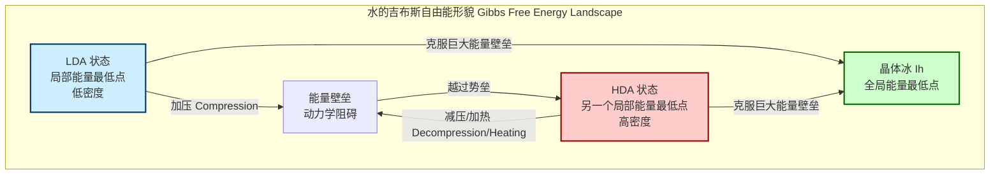
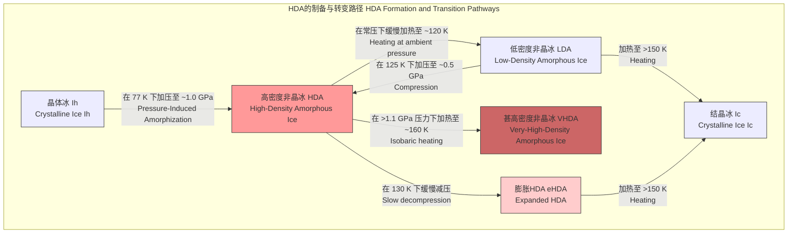

## 高密度非晶冰

高密度非晶冰（High Density Amorphous Ice, HDA）是一种非晶态（或称玻璃态）的固态水，其密度显著高于普通的结晶冰和低密度非晶冰（LDA）。HDA是水的多形性（polymorphism）和多非晶性（polyamorphism）现象的关键例证，即同一种化学物质可以存在于多种不同的非晶结构中。HDA的发现和研究对于理解水在极端条件下的行为、行星科学（如木卫二等冰卫星的内部结构）以及材料科学中的玻璃转变理论具有深远意义。

### 核心概念及其数学基础

#### 1. 多非晶性 (Polyamorphism)

多非晶性是指单一物质能够以两种或多种密度和结构不同的非晶态形式存在。HDA和LDA是水的多非晶性的典型代表。这两种状态可以被视为在系统的吉布斯自由能（Gibbs Free Energy）景观中处于不同的局部最小值。

系统的吉布斯自由能 $G$ 定义为：
$$ G(P, T) = U + PV - TS $$
其中：
*   $G$ 是吉布斯自由能
*   $U$ 是系统的内能
*   $P$ 是压力
*   $V$ 是体积
*   $T$ 是绝对温度
*   $S$ 是熵

在低温下，系统由于动能不足，可能被困在一个能量的局部最低点（即亚稳态），而不是全局最低点（晶体态）。HDA和LDA就对应于这样的两个不同的亚稳态盆地。它们之间的转换是一个类一级相变，可以通过改变压力或温度来诱导。

#### 2. 结构表征：对分布函数 (Pair Distribution Function)

HDA和LDA的结构差异可以通过对分布函数 $g(r)$ 来量化。$g(r)$ 描述了在一个给定原子周围，距离为 $r$ 的地方找到另一个原子的概率密度，相对于完全随机分布的概率。

$$ g(r) = \frac{V}{N^2} \left\langle \sum_{i \neq j} \delta(r - |\mathbf{r}_i - \mathbf{r}_j|) \right\rangle $$

其中：
*   $N$ 是系统中的粒子总数
*   $V$ 是系统的体积
*   $\mathbf{r}_i$ 和 $\mathbf{r}_j$ 是粒子 $i$ 和 $j$ 的位置矢量
*   $\delta$ 是狄拉克δ函数
*   $\langle \dots \rangle$ 表示系综平均

对于水分子，通常分析氧-氧对分布函数 $g_{OO}(r)$。
*   **LDA**：$g_{OO}(r)$ 在约 $r=0.276$ nm处有尖锐的第一峰，对应水分子的氢键键长。在约 $r=0.45$ nm处有显著的第二峰，这表明了一个有序的、由四面体单元构成的开放网络结构，类似于晶体冰Ih。
*   **HDA**：$g_{OO}(r)$ 的第一峰位置与LDA相似，但其第二近邻峰消失，取而代之的是在约 $r=0.35$ nm处的一个宽泛的“鼓包”。这表明HDA的四面体网络结构已经坍缩，第二个水分子壳层侵入到了第一个壳层之间的空隙中，导致密度增加。

#### 3. 状态方程 (Equation of State)

状态方程描述了物质的压力、体积和温度之间的关系。为了描述HDA在高压下的压缩行为，通常使用Birch-Murnaghan状态方程。三阶Birch-Murnaghan状态方程的形式如下：

$$ P(V) = \frac{3B_0}{2} \left[ \left(\frac{V_0}{V}\right)^{7/3} - \left(\frac{V_0}{V}\right)^{5/3} \right] \left\{ 1 + \frac{3}{4}(B_0' - 4) \left[ \left(\frac{V_0}{V}\right)^{2/3} - 1 \right] \right\} $$

其中：
*   $P(V)$ 是体积为 $V$ 时的压力
*   $V_0$ 是零压下的参考体积
*   $B_0$ 是零压下的体弹模量 (Bulk Modulus)
*   $B_0'$ 是体弹模量对压力的一阶导数，即 $B_0' = \left( \frac{\partial B}{\partial P} \right)_{T, P=0}$

通过将实验测得的压力-体积数据拟合到此方程，可以精确确定HDA的体弹模量等力学性质。

### 关键技术规格

下表总结了HDA及其相关非晶冰相在低温（约80 K）下的关键物理参数。

| 参数 (Parameter) | HDA | LDA | VHDA | 单位 (Unit) |
| :--- | :--- | :--- | :--- | :--- |
| **密度 (Density)** | 1.17 ± 0.02 | 0.94 ± 0.02 | 1.25 ± 0.02 | g/cm³ |
| **形成压力 (Formation Pressure)** | ~1.0 GPa (从 Ih) | ~10⁻⁷ Pa (气相沉积) | ~1.2 GPa (从 HDA) | GPa / Pa |
| **形成温度 (Formation Temperature)** | 77 | < 120 | ~160 (等压加热HDA) | K |
| **体弹模量 (Bulk Modulus, B₀)** | 11.3 ± 0.5 | 5.5 ± 0.5 | ~14 | GPa |
| **氧-氧第一近邻距离** | ~2.78 | ~2.76 | ~2.79 | Å |
| **氧-氧第二近邻距离** | ~3.5 (宽峰) | ~4.5 | ~3.3 (宽峰) | Å |

*注意：数值可能因具体实验条件（如加压/减压速率、温度控制精度）而略有差异。*

### HDA的形成与相变

HDA的制备和转变过程是理解其性质的核心。

### 常见用例与定量性能

1.  **行星科学模型**:
    *   **用例**: 模拟木卫二（Europa）、土卫二（Enceladus）等冰卫星的内部结构和地质活动。这些卫星的冰壳深处压力可达数百MPa至GPa级别，温度较低，HDA可能是其内部的重要组成部分。
    *   **性能指标**: HDA的密度（~1.17 g/cm³）和流变学性质被用作输入参数，构建多层海洋模型。HDA的存在可以解释卫星表面观测到的某些地质特征，如混沌地形的形成。HDA到LDA的放热相变（约1.6 kJ/mol）可能为卫星内部提供局部热源，驱动冰火山等活动。

2.  **基础物理学研究**:
    *   **用例**: 验证和发展关于玻璃态物质和液体过冷的理论，特别是“双液体”模型（two-liquid model）。该模型假设在过冷水区域存在一个液-液临界点，HDA和LDA可以被看作是这两种不同密度液体的玻璃化形式。
    *   **性能指标**: 通过测量LDA-HDA转变的压力-温度依赖关系，可以外推出液-液相变线。Clausius-Clapeyron方程描述了该相变线的斜率：
        $$ \frac{dP}{dT} = \frac{\Delta H}{T \Delta V} $$
        其中 $\Delta H$ 是相变焓，$\Delta V$ 是体积变化。实验测得的 $dP/dT$ 值约为 2.0 MPa/K，这为约束理论模型提供了关键数据。

### 实施考量：分子动力学模拟

通过分子动力学（MD）模拟来研究HDA的形成和性质是一种重要的“计算实验”方法。

*   **算法**:
    1.  **系统初始化**: 构建一个包含数百至数千个水分子的晶体冰（如Ih）超晶胞。
    2.  **力场选择**: 选择一个能准确描述水分子间相互作用的力场，如TIP4P/2005或TIP5P。这些力场是基于经典力学的经验势函数。
    3.  **系综选择**: 在恒定温度和压力下（NPT系综）进行模拟，使用Nosé-Hoover恒温器和Parrinello-Rahman恒压器来控制热力学变量。
    4.  **模拟过程**: 在低温（如77 K）下，逐步增加模拟体系的压力至1-2 GPa。
    5.  **分析**: 监测系统的体积、能量以及计算径向分布函数 $g(r)$，以确认晶体结构已坍缩为非晶态的HDA。

*   **算法复杂度分析**:
    *   MD模拟的主要计算开销在于计算粒子间的相互作用力。
    *   对于一个包含 $N$ 个粒子的系统，若计算所有粒子对的相互作用，则计算复杂度为 $O(N^2)$。
    *   为了提高效率，通常使用截断半径（cutoff radius）来忽略远距离相互作用，这可以将复杂度降低到 $O(N)$。
    *   对于需要考虑长程静电相互作用的系统（如水），则使用粒子网格Ewald（PME）等算法，其复杂度约为 $O(N \log N)$。

### 性能特征与统计度量

HDA的物理性质具有统计分布特征，以下是一些关键的性能表征：

*   **结构因子 S(Q)**: 它是对分布函数 $g(r)$ 在倒易空间（动量转移空间）的对应物，通过中子或X射线衍射实验直接测量。
    $$ S(Q) = 1 + \frac{4\pi \rho_0}{Q} \int_0^\infty r[g(r)-1]\sin(Qr)dr $$
    其中 $Q$ 是动量转移的大小，$Q = \frac{4\pi}{\lambda}\sin(\theta)$，$\rho_0$ 是平均数密度。HDA的 $S(Q)$ 在 $Q \approx 2.2$ Å⁻¹ 处有一个主峰，其位置和宽度是其结构的指纹。

*   **相变压力分布**: LDA到HDA的转变压力并非一个绝对值，而是在一个压力范围内发生，呈现出一定的统计分布。例如，在130 K下，转变通常在 $P = 0.5 \pm 0.1$ GPa 的范围内开始和完成，这反映了相变成核的随机性。

*   **能量弛豫**: HDA作为一种亚稳态，会随着时间缓慢地向能量更低的状态弛豫。弛豫速率遵循Arrhenius定律：
    $$ k = A e^{-E_a / (k_B T)} $$
    其中 $k$ 是速率常数，$A$ 是指前因子，$E_a$ 是活化能，$k_B$ 是玻尔兹曼常数。在极低温下（< 100 K），弛豫速率极低，HDA可以稳定存在很长时间。

### 相关技术与比较模型

HDA与水的其他固态形式（特别是其他非晶冰）密切相关。

| 相 (Phase) | 结构模型 | 密度 (g/cm³) | 关键特征 | 数学描述/模型 |
| :--- | :--- | :--- | :--- | :--- |
| **HDA** | 坍缩的四面体网络 | 1.17 | 第二近邻壳层侵入，高配位数 | Birch-Murnaghan EoS, 描述高压行为 |
| **LDA** | 有序的四面体网络 | 0.94 | 类似液态水的瞬时结构，但被冻结 | "连续随机网络" (Continuous Random Network) 模型 |
| **VHDA** | 进一步致密化的HDA | 1.25 | 可能是更高配位或扭曲更严重的网络 | 可视为HDA在高压下的延伸，遵循相似的状态方程 |
| **晶体冰 Ih** | 完美的六方晶格 | 0.92 | 周期性排列，长程有序 | 晶体学空间群 $P6_3/mmc$ |

**双液体模型 (Two-Liquid Model)**
该模型是解释HDA和LDA存在的最重要理论框架之一。它假设在水的P-T相图的低温过冷区域，存在一个液-液相变（LLPT），将低密度液体（LDL）和高密度液体（HDL）分开。
*   **HDA** 被认为是高密度液体（HDL）的玻璃化产物。
*   **LDA** 被认为是低密度液体（LDL）的玻璃化产物。

这个液-液相变线终止于一个“第二临界点”（Second Critical Point），类似于普通的气-液临界点。该临界点的存在性是当前水科学研究的前沿热点。

### 参考文献

1.  Mishima, O., Calvert, L. D., & Whalley, E. (1984). An apparently first-order transition between two amorphous phases of ice induced by pressure. *Nature*, 310(5976), 393–395. DOI: [10.1038/310393a0](https://doi.org/10.1038/310393a0)
2.  Loerting, T., & Giovambattista, N. (2006). Amorphous ices: a playground for theories and experiments. *Journal of Physics: Condensed Matter*, 18(50), R919–R977. DOI: [10.1088/0953-8984/18/50/R01](https://doi.org/10.1088/0953-8984/18/50/R01)
3.  Winkel, K., Elsaesser, M. S., Mayer, E., & Loerting, T. (2011). Water polyamorphism: reversibility and (dis)continuity. *Journal of Physics: Condensed Matter*, 23(3), 033101. DOI: [10.1088/0953-8984/23/3/033101](https://doi.org/10.1088/0953-8984/23/3/033101)
4.  Debenedetti, P. G. (2003). Supercooled and glassy water. *Journal of Physics: Condensed Matter*, 15(45), R1669–R1726. DOI: [10.1088/0953-8984/15/45/R01](https://doi.org/10.1088/0953-8984/15/45/R01)