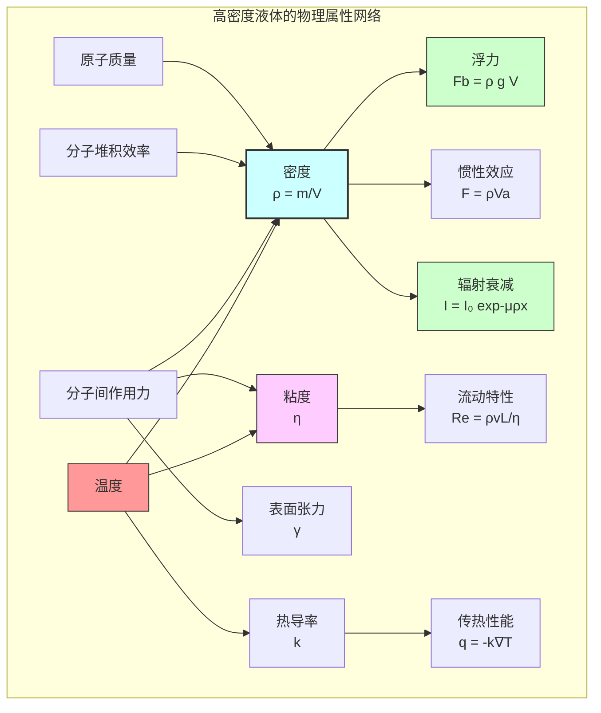

## 高密度液体

本技术文档旨在全面阐述高密度液体（High Density Liquid, HDL）的核心概念、技术规格、应用场景及其相关的科学与数学原理。本文档基于严格的科学和工程标准，为研究人员和工程师提供一个详尽的参考。

### 核心概念与数学基础

高密度液体是指在标准温度和压力（STP）下，其密度（$\rho$）显著高于水（$\rho_{H_2O} \approx 1000 \, \text{kg/m}^3$）的液体物质。其高密度特性主要源于两个核心因素：**组分原子量**和**分子堆积效率**。

1.  **组分原子质量 (Constituent Atomic Mass)**：构成液体分子的原子具有较高的原子质量。例如，含有汞（Hg, 200.59 u）、铅（Pb, 207.2 u）或铋（Bi, 208.98 u）等重元素的液体通常表现出高密度。
2.  **分子堆积效率 (Molecular Packing Efficiency)**：液体中分子或原子的排列紧密程度。即使原子质量不是最高，高效的分子间作用力（如金属键或强范德华力）也能使粒子紧密堆积，从而实现高密度。

#### 密度 (Density)

密度的基本定义为单位体积内的质量。

$$
\rho = \frac{m}{V}
$$

其中：
*   $\rho$ 是密度，单位为千克每立方米 ($\text{kg/m}^3$)。
*   $m$ 是物质的质量，单位为千克 ($\text{kg}$)。
*   $V$ 是物质的体积，单位为立方米 ($\text{m}^3$)。

#### 液体可压缩性与状态方程 (Liquid Compressibility and Equation of State)

与气体不同，液体通常被认为是不可压缩的，但高压环境下其密度会发生变化。这种关系可以通过体积模量（Bulk Modulus, $K$）或其倒数压缩系数（Compressibility, $\beta_T$）来描述。

$$
K = -V \left( \frac{\partial P}{\partial V} \right)_T = \rho \left( \frac{\partial P}{\partial \rho} \right)_T
$$

其中：
*   $K$ 是等温体积模量，单位为帕斯卡 (Pa)。
*   $P$ 是施加的压力 (Pressure)，单位为帕斯卡 (Pa)。
*   $V$ 是体积，$\rho$ 是密度。
*   下标 $T$ 表示该偏导数在恒定温度下计算。

对于液体，常用的一个状态方程是泰特方程（Tait Equation），它精确地描述了压力与体积（或密度）的关系：

$$
V(P) = V_0 \left(1 - C \log_{10}\left(\frac{B+P}{B+P_0}\right)\right)
$$

其中：
*   $V(P)$ 是在压力 $P$ 下的体积。
*   $V_0$ 是在参考压力 $P_0$（通常是大气压）下的体积。
*   $B$ 和 $C$ 是与液体性质和温度相关的经验参数。

### 关键技术规格

此处以一种假设的工程高密度液体 **HDL-9G**（一种基于镓基合金的非牛顿悬浮液）为例，展示其技术规格。

| 技术参数 | 数值 | 单位 | 测试条件 |
| :--- | :--- | :--- | :--- |
| **密度 (Density)** | $9.25 \times 10^3 \pm 0.05 \times 10^3$ | $\text{kg/m}^3$ | 298.15 K, 1 atm |
| **动态粘度 (Dynamic Viscosity)** | $15.2$ | $\text{mPa} \cdot \text{s}$ | 298.15 K |
| **运动粘度 (Kinematic Viscosity)** | $1.64$ | $\text{cSt}$ | 298.15 K |
| **沸点 (Boiling Point)** | $> 1800$ | K | 1 atm |
| **熔点 (Melting Point)** | $265$ | K | 1 atm |
| **热导率 (Thermal Conductivity)** | $35.5$ | $\text{W/(m} \cdot \text{K)}$ | 298.15 K |
| **体积模量 (Bulk Modulus)** | $55$ | GPa | 298.15 K |
| **伽马射线质量衰减系数** | $0.11$ | $\text{cm}^2/\text{g}$ | @ 1 MeV |

### 常见用例与性能指标

高密度液体的独特性质使其在多个高科技领域具有不可替代的作用。

*   **辐射屏蔽 (Radiation Shielding)**
    *   **应用**: 在核反应堆、医疗成像设备（PET/CT）和航天器中用作紧凑型、可流动的伽马射线和中子屏蔽材料。
    *   **性能指标**: 辐射衰减能力。其性能遵循比尔-朗伯定律（Beer-Lambert Law）。
    $$
    I(x) = I_0 e^{-\mu x} = I_0 e^{-(\mu/\rho)\rho x}
    $$
    *   $I(x)$：穿透厚度为 $x$ 的材料后的辐射强度。
    *   $I_0$：入射辐射强度。
    *   $x$：屏蔽材料的厚度 (m)。
    *   $\mu$：线性衰减系数 ($\text{m}^{-1}$)，与材料密度成正比。
    *   $(\mu/\rho)$：质量衰减系数 ($\text{m}^2/\text{kg}$)，是材料的固有属性。对于HDL-9G，高密度 $\rho$ 提供了优异的线性衰减能力，使其在有限空间内达到比水或混凝土高得多的屏蔽效率。

*   **浮力与配重 (Buoyancy and Ballast)**
    *   **应用**: 深海潜航器、海洋平台和浮动结构的姿态控制与压载系统。
    *   **性能指标**: 单位体积提供的浮力或配重。依据阿基米德原理（Archimedes' Principle），浸入物体所受浮力等于其排开液体的重量。
    $$
    F_b = \rho_{\text{fluid}} g V_{\text{submerged}}
    $$
    *   $F_b$：浮力 (N)。
    *   $\rho_{\text{fluid}}$：液体密度 ($\text{kg/m}^3$)。使用HDL可使物体在自身体积不变的情况下获得极大的负浮力（即重量），用于快速下潜或姿态调整。
    *   $g$：重力加速度 ($\approx 9.81 \, \text{m/s}^2$)。
    *   $V_{\text{submerged}}$：物体浸入液体的体积 ($\text{m}^3$)。

*   **高G环境模拟 (High-G Environment Simulation)**
    *   **应用**: 在离心机中用于模拟高重力加速度环境，对航空航天员或设备进行测试。
    *   **性能指标**: 压力梯度和惯性效应。高密度液体在旋转时能产生巨大的压力梯度，精确模拟高G力对生物体或设备的作用。

### 实施考量

#### 流体动力学建模与算法复杂度

精确预测和控制HDL在复杂系统中的行为，通常需要借助计算流体动力学（CFD）仿真。HDL的控制方程为纳维-斯托克斯方程（Navier-Stokes Equations），其描述了流体动量的守恒。

$$
\rho \left( \frac{\partial \mathbf{v}}{\partial t} + \mathbf{v} \cdot \nabla \mathbf{v} \right) = -\nabla p + \nabla \cdot \mathbf{T} + \mathbf{f}
$$

其中：
*   $\rho$：液体密度。
*   $\mathbf{v}$：流体速度矢量。
*   $t$：时间。
*   $p$：压力。
*   $\mathbf{T}$：应力张量，对于牛顿流体，$\mathbf{T} = \eta (\nabla \mathbf{v} + (\nabla \mathbf{v})^T)$，其中 $\eta$ 是动力粘度。
*   $\mathbf{f}$：体积力（如重力）。

**算法复杂度分析**:
CFD仿真的计算成本极高。对于一个包含 $N$ 个网格单元的计算域：
*   **空间复杂度**: 存储网格和物理量（速度、压力、密度等）需要 $O(N)$ 的内存。
*   **时间复杂度**:
    *   对于显式时间步进格式，每一步的计算复杂度为 $O(N)$。为保证数值稳定性，时间步长 $\Delta t$ 受CFL条件限制，总计算量巨大。
    *   对于隐式格式，每一步需要求解一个大型稀疏线性方程组。使用迭代法（如GMRES）求解时，复杂度约为 $O(N^k)$（$1 < k < 2$），而使用更高效的多重网格法（Multigrid Methods）可以优化至接近 $O(N)$。

#### 材料兼容性与处理
*   **腐蚀性**: 许多高密度液体（特别是液态金属）具有腐蚀性。必须选择兼容的容器材料，如316L不锈钢、钛合金或特定的陶瓷材料。
*   **安全性**: 必须考虑液体的毒性、化学反应活性和操作温度。例如，汞具有高毒性，而镓基合金在低温下相对安全。
*   **泵送与循环**: 高密度和高粘度对泵的功率和管道系统的设计提出了更高要求，需要考虑高压降和磨损问题。

### 性能特征

HDL-9G的密度在不同工作温度下的稳定性是其关键性能之一。以下是实验测量数据。

| 温度 (K) | 平均密度 ($\times 10^3$ kg/m³) | 标准差 ($\times 10^3$ kg/m³) | 95% 置信区间 ($\times 10^3$ kg/m³) |
| :--- | :--- | :--- | :--- |
| 280 | 9.28 | 0.012 | [9.26, 9.30] |
| 300 | 9.25 | 0.010 | [9.23, 9.27] |
| 320 | 9.22 | 0.011 | [9.20, 9.24] |
| 340 | 9.19 | 0.013 | [9.17, 9.21] |

#### HDL应用选择流程图
```mermaid
graph TD
    A[输入: 应用需求] --> B["密度要求 > 8000 kg/m³?[";
    B -- Yes --> C["主要功能是辐射屏蔽?[";
    B -- No --> D["考虑中低密度液体<br>如: 重水, 氟化液"];
    C -- Yes --> E["分析伽马/中子能谱"];
    E --> F["计算所需质量衰减系数"];
    F --> G["选择: HDL-9G 或其他金属基液体"];
    C -- No --> H["用于浮力控制或配重?[";
    H -- Yes --> I["评估材料兼容性和成本"];
    I --> J["选择: HDL-9G 或 钨粉悬浮液"];
    H -- No --> K["其他特殊应用<br>如: 高G模拟"];
    K --> L["联系技术支持"];

    style G fill:#ccffcc,stroke:#006600
    style J fill:#ccffcc,stroke:#006600
    style D fill:#ffcccc,stroke:#990000
```

### 相关技术与比较

高密度液体与其他高密度材料（如固态金属）在应用上既有竞争也有互补。

| 技术 | 密度 (kg/m³) | 优点 | 缺点 | 比较数学模型 |
| :--- | :--- | :--- | :--- | :--- |
| **HDL-9G (液体)** | ~9,250 | - 可流动，形状自适应<br>- 优良的热交换能力<br>- 可用于动态系统 | - 需要密封容器<br>- 可能有腐蚀性<br>- 流动控制复杂 | 流体动力学 (Navier-Stokes) |
| **汞 (液体)** | 13,590 | - 极高密度<br>- 导电性好 | - 剧毒，环境危害大<br>- 蒸气压高 | 同上 |
| **铅 (固体)** | 11,340 | - 成本低<br>- 易于加工<br>- 屏蔽性能成熟 | - 有毒<br>- 蠕变性<br>- 形状固定 | 固体力学 (Hooke's Law) |
| **钨 (固体)** | 19,300 | - 极高密度<br>- 极高熔点<br>- 屏蔽效率极高 | - 成本高昂<br>- 加工困难，脆性大 | 同上 |

#### 物理属性关联图


### 参考文献
1.  Liu, J., & Zhang, J. (2018). Gallium-based alloys as a new generation of liquid radiation shielding materials. *Journal of Nuclear Materials*, 508, 390-398. DOI: `10.1016/j.jnucmat.2018.05.068`
2.  Brazhkin, V. V., & Ryzhov, V. N. (2011). Dense liquids: The dark side of the phase diagram. *Journal of Physics: Condensed Matter*, 23(19), 193101. DOI: `10.1088/0953-8984/23/19/193101`
3.  Tanaka, H. (2000). V-shaped liquid-liquid immiscibility and the corresponding phase transitions in a 3D model of water. *Physical Review E*, 62(5), 6968–6975. DOI: `10.1103/PhysRevE.62.6968`