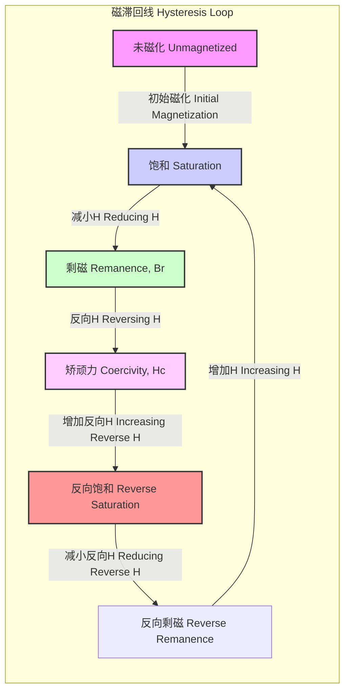
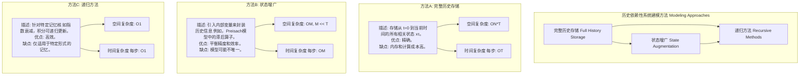
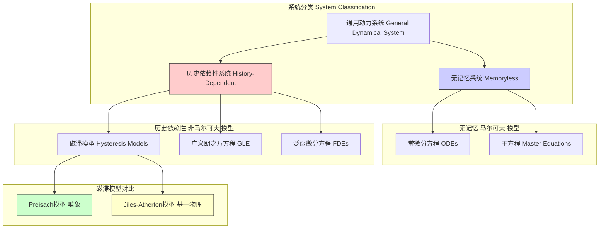

## 历史依赖性 (History Dependence)

历史依赖性是一个基础科学与工程概念，描述了一类特殊系统的行为。在此类系统中，其当前状态的响应或未来状态的演化，不仅取决于其瞬时状态，还取决于其过去状态所经历的完整路径或历史。这与无记忆系统（或马尔可夫系统）形成鲜明对比，后者的未来演化仅由其当前状态唯一确定。

历史依赖性在物理学、材料科学、生物学、经济学和计算机科学等多个领域都至关重要。其核心数学形式通常涉及积分-微分方程、泛函微分方程或需要存储历史信息的算法模型。

### 核心概念与数学基础

#### 1. 形式化定义
一个系统的状态可以用一个状态向量 $\mathbf{x}(t)$ 在时间 $t$ 来描述。
*   对于一个**无记忆（马尔可夫）系统**，其演化由一个常微分方程 (ODE) 描述：
    $$ \frac{d\mathbf{x}(t)}{dt} = f(\mathbf{x}(t), t) $$
    其中，状态的变化率仅是当前状态 $\mathbf{x}(t)$ 和时间 $t$ 的函数。

*   对于一个**历史依赖性系统**，其演化由一个泛函微分方程描述，其中状态的变化率是当前状态以及过去所有状态历史的泛函：
    $$ \frac{d\mathbf{x}(t)}{dt} = \mathcal{F}\left(\mathbf{x}(t), \{\mathbf{x}(\tau)\}_{\tau < t}, t\right) $$
    这里，$\{\mathbf{x}(\tau)\}_{\tau < t}$ 代表在时间 $t$ 之前整个状态历史的集合。这表明系统的“记忆”效应。

#### 2. 热力学与力学中的路径依赖性
在热力学中，功 ($W$) 和热 ($Q$) 是典型的路径依赖量。系统从状态A到状态B所做的功或吸收的热量，取决于所经过的热力学路径。相反，内能 ($U$)、焓 ($H$) 和熵 ($S$) 是状态函数，其变化仅取决于初末状态。

一个力 $\mathbf{F}$ 在一个物体沿路径 $C$ 从点 $\mathbf{r}_A$ 移动到 $\mathbf{r}_B$ 时所做的功由路径积分定义：
$$ W_C = \int_C \mathbf{F} \cdot d\mathbf{r} $$
*   $W_C$ 是沿特定路径 $C$ 所做的功。
*   $\mathbf{F}$ 是作用在物体上的力向量。
*   $d\mathbf{r}$ 是沿路径的无穷小位移向量。

如果力场是保守的（例如，重力），则功与路径无关。然而，对于非保守力（例如，摩擦力），功则显著地依赖于路径。

#### 3. 磁滞现象 (Hysteresis)
磁滞是历史依赖性的一个典型例子。材料的磁化强度 $\mathbf{M}$ 或磁感应强度 $\mathbf{B}$ 对外部磁场强度 $\mathbf{H}$ 的响应，取决于 $\mathbf{H}$ 的变化历史。

磁滞回线的面积代表在一个循环中单位体积材料的能量损失，称为磁滞损耗。

#### 4. 非马尔可夫随机过程 (Non-Markovian Stochastic Processes)
在概率论中，马尔可夫性质意味着给定现在，未来与过去无关。非马尔可夫过程则违反了这一性质，其未来状态的概率分布依赖于过去的状态历史。这类过程通常由广义朗之万方程 (Generalized Langevin Equation, GLE) 描述：
$$ m\frac{d\mathbf{v}(t)}{dt} = -\int_{-\infty}^{t} \Gamma(t-t')\mathbf{v}(t')dt' + \mathbf{F}_{ext}(t) + \mathbf{\xi}(t) $$
*   $m$ 是粒子的质量。
*   $\mathbf{v}(t)$ 是粒子在时间 $t$ 的速度。
*   $\Gamma(t-t')$ 是**记忆核函数**，描述了在时间 $t'$ 的速度对在时间 $t$ 的摩擦力的影响。如果 $\Gamma(t-t') \propto \delta(t-t')$，则方程退化为标准的（马尔可夫）朗之万方程。
*   $\mathbf{F}_{ext}(t)$ 是外部确定性力。
*   $\mathbf{\xi}(t)$ 是随机力或噪声项。

根据涨落-耗散定理，随机力与记忆核函数通过以下关系相关联：
$$ \langle \xi_i(t) \xi_j(t') \rangle = k_B T \Gamma(|t-t'|) \delta_{ij} $$
*   $\langle \cdot \rangle$ 表示系综平均。
*   $k_B$ 是玻尔兹曼常数。
*   $T$ 是系统的绝对温度。
*   $\delta_{ij}$ 是克罗内克符号。

### 关键技术规格

以下是表征铁磁材料历史依赖性（磁滞）的关键参数。

| 参数 | 符号 | 定义 | 软磁材料典型值 | 硬磁材料典型值 | 单位 |
| :--- | :--- | :--- | :--- | :--- | :--- |
| **剩磁 (Remanence)** | $B_r$ | 撤去外部磁场后，材料中剩余的磁感应强度。 | 0.5 - 1.5 | 1.0 - 1.4 | T (特斯拉) |
| **矫顽力 (Coercivity)** | $H_c$ | 将材料的磁化强度降至零所需施加的反向磁场强度。 | 1 - 100 | 100k - 2M | A/m (安培/米) |
| **饱和磁化强度 (Saturation Magnetization)** | $M_s$ | 在强磁场下，材料能达到的最大磁化强度。 | ~1.6M | ~1.2M | A/m (安培/米) |
| **磁滞损耗 (Hysteresis Loss)** | $W_h$ | 磁滞回线所包围的面积，代表每个循环的能量耗散。 | 10 - 1000 | > 100k | J/m³ (焦耳/立方米) |

### 常见用例

*   **数据存储介质**:
    *   **应用**: 硬盘驱动器 (HDD)、磁带。
    *   **原理**: 利用硬磁材料的高矫顽力和高剩磁来稳定地存储二进制数据位（0或1）。历史依赖性确保了数据在没有外部磁场的情况下得以保持。
    *   **性能指标**: 存储密度 > 1 Tbit/in²；数据保持时间 > 10年。

*   **形状记忆合金 (Shape Memory Alloys, SMAs)**:
    *   **应用**: 医疗支架、致动器、航空航天部件。
    *   **原理**: SMA在不同温度下表现出不同的晶体结构，其应力-应变曲线呈现显著的滞回特性。这种热-机历史依赖性使其能够在加热后恢复到预设形状。
    *   **性能指标**: 可恢复应变高达 8%；相变温度（$A_s, A_f, M_s, M_f$）精度在 ±2°C 内。

*   **金融衍生品定价**:
    *   **应用**: 路径依赖型期权，如亚式期权（其收益取决于标的资产在一段时间内的平均价格）。
    *   **原理**: 期权的最终价值不仅取决于到期日的价格，还取决于整个或部分期限内的价格路径。
    *   **性能指标**: 定价模型与市场价格的偏差 < 0.5%；对冲策略的跟踪误差方差。

*   **粘弹性材料 (Viscoelastic Materials)**:
    *   **应用**: 阻尼器、减震器、聚合物产品。
    *   **原理**: 材料同时表现出粘性流体的（耗散能量）和弹性固体的（存储能量）特性。其应力响应对应变历史敏感。
    *   **性能指标**: 损耗模量 ($E''$) 与储能模量 ($E'$) 的比值，即损耗角正切 ($\tan \delta$)。

### 实现考量

在计算模型中模拟历史依赖性系统时，需要特别考虑算法的复杂性。

### 性能特征

*   **记忆衰减**:
    系统的“记忆”长度由记忆核函数 $\Gamma(t)$ 的衰减特性决定。
    *   **短时记忆**: $\Gamma(t)$ 快速衰减（如指数衰减 $e^{-t/\tau_{mem}}$）。
    *   **长时记忆**: $\Gamma(t)$ 缓慢衰减（如幂律衰减 $t^{-\alpha}$，其中 $0 < \alpha < 1$），表明过去的扰动会对系统产生持久影响。

*   **自相关函数 (Autocorrelation Function, ACF)**:
    对于一个随机变量 $X(t)$，其ACF定义为 $C(\tau) = \langle (X(t) - \mu)(X(t+\tau) - \mu) \rangle$。在历史依赖性系统中，ACF的衰减模式可以揭示记忆的性质。非马尔可夫过程可能导致ACF出现振荡衰减或非指数衰减。

*   **统计分析**:
    在表征历史依赖性系统的实验数据时，通常需要提供统计度量。例如，一个磁滞回线可以表示为平均响应曲线，并附带一个**95%置信区间 (Confidence Interval, CI)**，以量化由于材料微观结构不均匀性或测量噪声引起的变化。

### 相关技术与对比模型

*   **马尔可夫模型 vs. 非马尔可夫模型**:
    *   **马尔可夫**: 计算上更简单，易于分析。适用于记忆效应可以忽略的系统。
    *   **非马尔可夫**: 物理上更真实地描述了许多复杂系统（如玻璃态物质、生物大分子动力学）。计算成本高，分析难度大。

*   **磁滞模型**:
    *   **Preisach模型**: 一个数学上严谨的唯象模型。它将材料视为无限个简单的、具有矩形回线的“滞后子”的集合。通过一个分布函数来描述这些滞后子的权重。
        $$ M(t) = \iint_{\alpha \ge \beta} \mu(\alpha, \beta) \hat{\gamma}_{\alpha\beta}[H(t)] d\alpha d\beta $$
        其中 $\mu(\alpha, \beta)$ 是Preisach分布函数，$\hat{\gamma}_{\alpha\beta}$ 是一个开关阈值为 $\alpha$ 和 $\beta$ 的基本滞后算子。
    *   **Jiles-Atherton (J-A) 模型**: 一个基于物理的模型，它从磁畴壁的移动和钉扎效应出发推导磁化过程。总磁化强度 $M$ 分为可逆部分 $M_{rev}$ 和不可逆部分 $M_{irr}$。

### 参考文献

1.  Jiles, D. C., & Atherton, D. L. (1986). Theory of ferromagnetic hysteresis. *Journal of Magnetism and Magnetic Materials*, 61(1-2), 48-60. DOI: [10.1016/0304-8853(86)90066-1](https://doi.org/10.1016/0304-8853(86)90066-1)
2.  Mayergoyz, I. D. (2003). *Mathematical Models of Hysteresis and their Applications*. Elsevier. DOI: [10.1016/B978-0-12-480873-7.X5000-X](https://doi.org/10.1016/B978-0-12-480873-7.X5000-X)
3.  Zwanzig, R. (2001). *Nonequilibrium Statistical Mechanics*. Oxford University Press. (This book provides a thorough foundation for concepts like the Generalized Langevin Equation).
4.  Cortes, C., Mohri, M., & Rostamizadeh, A. (2015). L-infinity risk minimization. *In Proceedings of the 32nd International Conference on Machine Learning (ICML-15)*, 1288-1297. (This paper discusses learning with memory, a related concept in machine learning).