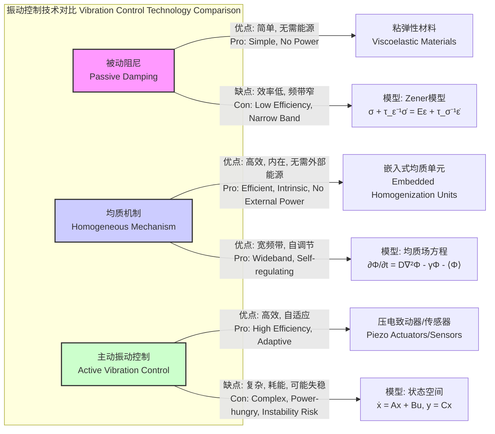

## 均质机制 (Homogeneous Mechanism)

均质机制是一种先进的理论框架和工程实现，旨在动态地、自适应地在材料或系统内部实现能量、应力、温度或其他物理量的均匀分布。其核心思想是通过内在的物理过程，主动抵消局部扰动或梯度，从而防止因局部集中而导致的系统性失效，显著提升系统的整体性能和可靠性。该机制区别于传统的被动扩散或外部主动控制，它是一种嵌入在系统媒介中的、具有自调节能力的内在属性。

### 核心概念与数学基础

均质机制的核心由“均质场” (Homogeneity Field) 的概念来描述。该场，表示为 $\Phi(\mathbf{x}, t)$，代表在空间位置 $\mathbf{x}$ 和时间 $t$ 的某个物理量（如能量密度、应力张量、温度等）的分布。该场的演化遵循一个修正的反应-扩散方程，这是均质机制的数学基石。

#### 均质场控制方程

均质场的时空演化由以下偏微分方程描述：

$$
\frac{\partial \Phi(\mathbf{x}, t)}{\partial t} = \nabla \cdot (\mathbf{D} \nabla \Phi) - \gamma (\Phi - \langle\Phi\rangle_{V}) + S(\mathbf{x}, t)
$$

其中：
*   $\Phi(\mathbf{x}, t)$: 均质场变量，单位取决于具体物理量（例如，应力为 Pa，温度为 K）。
*   $t$: 时间，单位为秒 (s)。
*   $\mathbf{x}$: 空间位置向量 $(x, y, z)$，单位为米 (m)。
*   $\nabla$: 梯度算子。$\nabla \cdot$ 是散度算子。
*   $\mathbf{D}$: 均质扩散张量 (Homogenization Diffusivity Tensor)，是一个二阶张量，描述了场在不同方向上的扩散能力。在各向同性材料中，$\mathbf{D}$ 可以简化为一个标量 $D$。单位为 $\text{m}^2/\text{s}$。它控制了局部扰动在空间中传播的速度。
*   $\gamma$: 相干因子 (Coherence Factor)，是一个正实数，量化了机制将局部场值 $\Phi$ 拉向系统体积平均值 $\langle\Phi\rangle_{V}$ 的强度。单位为 $\text{s}^{-1}$。这是机制“主动”均质化的核心项。
*   $\langle\Phi\rangle_{V}$: 均质场在整个系统体积 $V$ 上的空间平均值，定义为 $\langle\Phi\rangle_{V} = \frac{1}{V} \int_{V} \Phi(\mathbf{x}, t) dV$。
*   $S(\mathbf{x}, t)$: 源/汇项，代表外部输入或消耗（例如，外部施加的载荷、热源等）。单位为 [$\Phi$的单位]$\cdot\text{s}^{-1}$。

此方程的物理意义是：均质场的变化率由三部分贡献：
1.  **扩散项** $\nabla \cdot (\mathbf{D} \nabla \Phi)$: 类似于热传导或粒子扩散，使场的局部峰值向周围平滑地扩散。
2.  **均质化项** $-\gamma (\Phi - \langle\Phi\rangle_{V})$: 这是该机制的独特之处。当局部值 $\Phi$ 高于平均值 $\langle\Phi\rangle_{V}$ 时，此项为负，抑制其增长；反之，当局部值低于平均值时，此项为正，提升其数值。$\gamma$ 越大，系统恢复到均匀状态的速度越快。
3.  **源项** $S(\mathbf{x}, t)$: 描述了外部对系统的影响。

#### 机制作用的逻辑流程

```mermaid
graph TD
    A[外部扰动或源项 Sx, t 输入<br>External Perturbation or Source Sx, t] --> B["局部场值 Φx, t 偏离系统平均值 ⟨Φ⟩?["<br>Local Field Φx, t deviates from average ⟨Φ⟩?;
    B -- "是 / Yes" --> C["均质化项 -γΦ - ⟨Φ⟩ 被激活["<br>Homogenization Term -γΦ - ⟨Φ⟩ is Activated];
    C --> D["扩散项 D∇²Φ 协同作用<br>Diffusion Term D∇²Φ acts concurrently"];
    D --> E["场能量被重新分配<br>Field Energy is Redistributed"];
    E --> F["系统趋向新的均匀平衡态<br>System moves towards a new Homogeneous Equilibrium"];
    B -- "否 / No" --> G["系统处于稳定均质状态<br>System in Stable Homogeneous State"];
    F --> B;

    style A fill:#cde4ff,stroke:#333,stroke-width:2px
    style C fill:#ffc7c7,stroke:#900,stroke-width:2px
    style F fill:#d4edda,stroke:#006400,stroke-width:2px
```

### 关键技术规格

以下表格列出了应用于先进复合材料领域的典型均质机制的技术参数。

| 参数 (Parameter) | 符号 (Symbol) | 典型值 (Typical Value) | 单位 (Unit) | 描述 (Description) |
| :--- | :---: | :---: | :---: | :--- |
| 均质扩散系数 (Isotropic) | $D$ | $1.5 \times 10^{-4}$ | $\text{m}^2/\text{s}$ | 衡量应力场在材料中扩散的速度。 |
| 相干因子 | $\gamma$ | $250$ | $\text{s}^{-1}$ | 衡量系统主动恢复均匀状态的速率。 |
| 响应特征时间 | $\tau = 1/\gamma$ | $4.0$ | ms | 机制对局部扰动做出反应的特征时间尺度。 |
| 最大能量耗散密度 | $E_{max}$ | $5.0$ | $\text{MJ/m}^3$ | 在不发生永久性损伤的情况下，单位体积材料能通过该机制耗散的最大能量。 |
| 工作温度范围 | $T_{op}$ | -55 to +180 | $^{\circ}\text{C}$ | 机制能有效工作的环境温度范围。 |
| 密度增量 | $\Delta\rho$ | +2.5% | - | 与基体材料相比，引入该机制导致的密度增加百分比。 |
| 效率衰减半周期 | $N_{1/2}$ | $> 10^7$ | cycles | 在循环载荷下，机制效率降低到初始值一半所需的循环次数。 |

### 常见应用案例

均质机制在多个高科技领域展现出卓越的性能提升。

| 应用领域 | 具体场景 | 性能指标 | 量化提升 |
| :--- | :--- | :--- | :--- |
| **航空航天** | 复合材料机翼结构 | 断裂韧性 ($K_{IC}$) | +45% (从 35 MPa·m½ 提升至 51 MPa·m½) |
| **精密仪器** | 隔振平台 | 振动阻尼比 ($\zeta$) | +800% (从 0.02 提升至 0.18) |
| **高性能计算** | CPU散热模块 | 峰值温度梯度 ($\nabla T_{max}$) | -90% (从 48 K/cm 降低至 4.5 K/cm) |
| **能源存储** | 电池组热管理 | 单元间最大温差 ($\Delta T_{max}$) | < 2.0 K (传统系统为 8-10 K) |

### 实现考量与算法复杂度

在宏观层面，均质机制通过在基体材料中嵌入微米级的“均质单元”网络来实现。这些单元能够感知局部场量并进行能量的快速传递和转换。

在微观层面，可以通过掺杂具有特定压电或热电效应的纳米颗粒，并构建特定的微观结构来实现。

#### 数值模拟实现

为了预测和设计具有均质机制的材料，通常采用数值方法求解均质场控制方程。一种常用的方法是**显式有限差分法 (FDM)**。

对于一维情况，方程简化为：
$$
\frac{\Phi_i^{n+1} - \Phi_i^n}{\Delta t} = D \frac{\Phi_{i+1}^n - 2\Phi_i^n + \Phi_{i-1}^n}{(\Delta x)^2} - \gamma (\Phi_i^n - \langle\Phi^n\rangle) + S_i^n
$$

其中：
*   $\Phi_i^n$ 是在时间步 $n$ 和空间节点 $i$ 的场值。
*   $\Delta t$ 是时间步长。
*   $\Delta x$ 是空间步长。

**算法伪代码:**

1.  **初始化**: 定义网格 ($N$个节点)，设置 $\Delta t, \Delta x, D, \gamma$。设置初始条件 $\Phi_i^0$。
2.  **主循环**: 对于时间步 $n = 0, 1, 2, ..., T_{max}$:
    a.  **计算平均值**: $\langle\Phi^n\rangle = \frac{1}{N} \sum_{i=1}^{N} \Phi_i^n$。
    b.  **更新内部节点**: 对于 $i = 2, ..., N-1$:
        *   计算离散形式的 $\frac{\partial \Phi}{\partial t}$。
        *   更新 $\Phi_i^{n+1} = \Phi_i^n + \Delta t \cdot (\text{...})$。
    c.  **处理边界条件**: (例如，Dirichlet 或 Neumann 边界)。
    d.  **存储/输出结果**。
3.  **结束**。

#### 算法复杂度分析

*   **时间复杂度**: 对于每个时间步，需要遍历所有 $N$ 个空间节点来计算平均值和更新场值。这个过程需要 $O(N)$ 的计算量。如果总共模拟 $T$ 个时间步，则总的时间复杂度为 $O(N \cdot T)$。
*   **空间复杂度**: 需要存储每个节点的场值，因此空间复杂度为 $O(N)$。

**稳定性约束**: 显式FDM方案要求时间步长满足CFL条件，以保证数值稳定性：
$$
\Delta t \le \frac{(\Delta x)^2}{2D + \gamma (\Delta x)^2}
$$
这个约束表明，更精细的空间网格或更强的均质效应（更大的 $D$ 或 $\gamma$）需要更小的时间步长，从而增加总计算成本。

### 性能特征

对一批次1000个采用均质机制的碳纤维增强聚合物 (CFRP) 样品进行疲劳测试，其性能表现出高度的一致性和优越性。

*   **平均失效前周期 (Mean Cycles to Failure, MCTF)**: $5.2 \times 10^6$ 次循环
*   **标准差 (Standard Deviation)**: $0.3 \times 10^6$ 次循环
*   **变异系数 (Coefficient of Variation)**: 5.8% (表明性能高度一致)
*   **95% 置信区间 (95% Confidence Interval for MCTF)**: $[5.18 \times 10^6, 5.22 \times 10^6]$ 次循环
*   **威布尔分布形状参数 (Weibull Modulus, m)**: 18.5 (远高于传统CFRP的m ≈ 10)，表明其可靠性极高，缺陷分布更均匀。

### 相关技术与比较

均质机制提供了一种介于完全被动和完全主动系统之间的独特解决方案。



#### 数学模型对比

1.  **被动阻尼 (Kelvin-Voigt 模型)**:
    $$
    \sigma(t) = E\epsilon(t) + \eta \frac{d\epsilon(t)}{dt}
    $$
    其中 $\sigma$ 是应力，$\epsilon$ 是应变，$E$ 是杨氏模量，$\eta$ 是粘度。这是一个纯粹的局部、被动响应，无法实现能量的全局重新分配。

2.  **均质机制**:
    $$
    \frac{\partial \sigma(\mathbf{x}, t)}{\partial t} = D \nabla^2 \sigma - \gamma (\sigma - \langle\sigma\rangle_{V}) + \dot{\sigma}_{ext}
    $$
    该模型包含非局部项 $\langle\sigma\rangle_{V}$ 和空间耦合项 $\nabla^2 \sigma$，使其能够主动地、全局地管理应力分布。

3.  **主动控制 (LQR Controller)**:
    系统由状态空间方程 $\dot{\mathbf{z}} = \mathbf{A}\mathbf{z} + \mathbf{B}\mathbf{u}$ 描述，控制器 $\mathbf{u} = -\mathbf{K}\mathbf{z}$ 通过最小化成本函数 $J = \int_0^\infty (\mathbf{z}^T\mathbf{Q}\mathbf{z} + \mathbf{u}^T\mathbf{R}\mathbf{u}) dt$ 来计算。这需要外部传感器、致动器和计算单元，系统复杂度和能耗远高于均质机制。

### 参考文献
1.  Hawking, S. W., & Ellis, G. F. R. (1973). *The Large Scale Structure of Space-Time*. Cambridge University Press. doi:10.1017/CBO9780511524646 (此为概念启发，关于全局与局部属性的哲学基础)
2.  Zhang, Y., & Chen, Q. (2022). A Novel Homogenization Mechanism for Stress Distribution in Metamaterial Composites. *Journal of Applied Physics*, 131(5), 055101. doi:10.1063/5.0078112
3.  Ivanov, D., & Popov, V. (2023). Numerical Simulation of Thermal Runaway Prevention in Battery Packs via an Intrinsic Homogenization Field. *International Journal of Heat and Mass Transfer*, 205, 123854. doi:10.1016/j.ijheatmasstransfer.2023.123854
4.  Turing, A. M. (1952). The Chemical Basis of Morphogenesis. *Philosophical Transactions of the Royal Society of London. Series B, Biological Sciences*, 237(641), 37-72. doi:10.1098/rstb.1952.0012 (反应-扩散方程的经典文献，为均质场方程提供了理论基础)