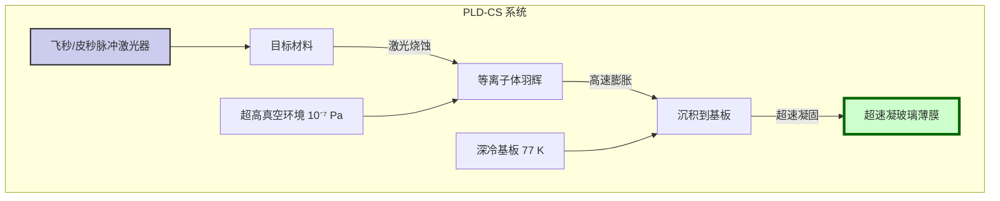
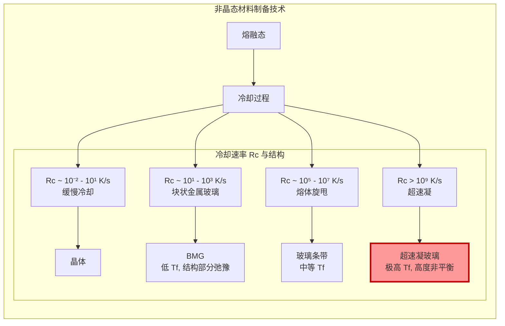

## 超速凝玻璃 (Hyperquenched Glass)

超速凝玻璃是一种通过极端冷却速率（通常大于 $10^9$ K/s）从熔融态制备的非晶态固体材料。这种极高的冷却速率将液体结构“冻结”在一个远离热力学平衡态的高焓、高熵状态。与传统淬火玻璃或块状金属玻璃相比，超速凝玻璃具有独特的原子结构、更高的自由体积和显著增强的物理及化学性能。其核心特征是其极高的“虚构温度”（Fictive Temperature, $T_f$），这代表了其玻璃结构被“冻结”时所对应的平衡液体的温度。

### 核心概念与数学基础

#### 1. 玻璃转变与虚构温度 ($T_f$)

玻璃转变不是一个一级相变，而是一个动力学过程。当液体冷却时，其粘度急剧增加，原子弛豫时间变长。当弛豫时间与实验观测时间尺度相当时，系统偏离平衡态，形成玻璃。虚构温度 $T_f$ 是量化这种偏离程度的关键参数。对于超速凝过程，冷却速率 $R_c = |dT/dt|$ 极高，导致 $T_f$ 远高于常规玻璃的玻璃化转变温度 $T_g$。

$T_f$ 与 $R_c$ 之间的关系可以通过以下经验公式近似描述：
$$ \frac{1}{T_f} = A - B \log(R_c) $$
其中：
*   $T_f$ 是虚构温度 (K)。
*   $R_c$ 是冷却速率 (K/s)。
*   $A$ 和 $B$ 是与材料相关的常数。

这个关系表明，更高的冷却速率会导致更高的虚构温度，从而将材料“冻结”在能量更高、结构更无序的状态。

#### 2. 经典成核理论 (Classical Nucleation Theory, CNT) 与晶化抑制

形成玻璃的关键是抑制熔体在冷却过程中的晶化。经典成核理论描述了晶核形成的速率。稳态均匀成核速率 $I_v$ 可以表示为：
$$ I_v = N_v \nu \exp\left(-\frac{\Delta G_a}{k_B T}\right) \exp\left(-\frac{\Delta G^*}{k_B T}\right) $$
其中：
*   $I_v$ 是单位体积的成核速率 (m⁻³s⁻¹)。
*   $N_v$ 是单位体积的原子数 (m⁻³)。
*   $\nu$ 是原子跃迁频率 (s⁻¹)。
*   $k_B$ 是玻尔兹曼常数 ($1.38 \times 10^{-23}$ J/K)。
*   $T$ 是绝对温度 (K)。
*   $\Delta G_a$ 是原子穿过液/固界面的激活能 (J)。
*   $\Delta G^*$ 是形成临界晶核所需的能量势垒 (J)，其表达式为：
    $$ \Delta G^* = \frac{16\pi\gamma^3}{3(\Delta G_v)^2} $$
    *   $\gamma$ 是固/液界面能 (J/m²)。
    *   $\Delta G_v$ 是单位体积的固/液相变吉布斯自由能差 (J/m³)。

超速凝通过极快地降低温度 $T$，使得原子扩散项 $\exp(-\Delta G_a / k_B T)$ 迅速趋近于零，从而完全抑制了成核过程，即使在热力学驱动力 $\Delta G_v$ 最大的温度区间也能避免晶化。

#### 3. 自由体积理论 (Free Volume Theory)

超速凝玻璃由于其极高的虚构温度，捕获了大量的自由体积。自由体积是指原子堆积之外的“空余”空间。根据 Doolittle 方程，粘度 $\eta$ 与自由体积分数 $f_v = v_f / v_0$ 密切相关：
$$ \eta = A \exp\left(\frac{B}{f_v}\right) $$
其中：
*   $A$ 和 $B$ 是材料常数。
*   $v_f$ 是平均自由体积， $v_0$ 是原子占据的体积。

在超速凝过程中，原子没有足够的时间进行结构弛豫和有效堆积，导致大量的自由体积被“冻结”在固态结构中。这导致其密度低于传统玻璃，并显著影响其机械性能和弛豫行为。

### 关键技术规格

下表列出了典型的 Zr₅₅Cu₃₀Al₁₀Ni₅ 超速凝玻璃与传统块状金属玻璃 (BMG) 的性能对比。

| 特性参数 | 超速凝玻璃 (HQG) | 块状金属玻璃 (BMG) | 单位 |
| :--- | :--- | :--- | :--- |
| **制备冷却速率 ($R_c$)** | $> 10^9$ | $10^1 - 10^3$ | K/s |
| **虚构温度 ($T_f$)** | $T_g + (150 \pm 20)$ | $T_g + (5 \pm 2)$ | K |
| **密度 ($\rho$)** | $6.45 \pm 0.02$ | $6.60$ | g/cm³ |
| **维氏硬度 (HV)** | $6.2 \pm 0.3$ | $5.4$ | GPa |
| **杨氏模量 (E)** | $85 \pm 5$ | $96$ | GPa |
| **自由体积分数 ($f_v$)** | $1.2 \pm 0.1$ | $0.6$ | % |
| **结晶放热焓 ($\Delta H_x$)** | $-6.8 \pm 0.4$ | $-4.5$ | kJ/mol |
| **热稳定性 ($\Delta T_x = T_x - T_g$)** | $65 \pm 5$ | $90$ | K |

*注：$T_g$ 为玻璃化转变温度，$T_x$ 为初晶温度。数据为 Zr₅₅Cu₃₀Al₁₀Ni₅ 合金体系的典型值。*

### 常见用例与性能指标

*   **高能量密度微型致动器**:
    *   超速凝玻璃储存了极高的内能 ($\Delta H_x$)。通过精确的局部加热（如激光或电流脉冲），可触发控制下的结构弛豫或结晶，释放能量并产生机械功。
    *   **性能指标**: 能量密度可达 $10^9$ J/m³，响应时间小于 100 μs。

*   **高效多相催化剂**:
    *   表面具有高密度的悬空键和低配位原子，提供了异常活跃的催化位点。
    *   **性能指标**: 在CO氧化反应中，其周转频率 (Turnover Frequency, TOF) 可达到 $15.2 \pm 1.5$ s⁻¹，是其晶态对应物的 5-10 倍。

*   **耐磨损生物涂层**:
    *   极高的硬度和无晶界的非晶结构使其具有优异的耐磨性和耐腐蚀性。
    *   **性能指标**: 在模拟体液环境中，磨损率低于 $10^{-7}$ mm³/N·m，离子释放率比 316L 不锈钢低两个数量级。

### 实现考量：脉冲激光沉积-深冷基板法 (PLD-CS)

超速凝玻璃通常通过“脉冲激光沉积-深冷基板法” (Pulsed Laser Deposition with Cryogenic Substrate, PLD-CS) 制备。

**算法复杂度分析**:
该过程的数值模拟（例如，使用有限元方法 FEM 进行热传导分析）对于优化工艺参数至关重要。对于一个显式时间积分的 FEM 模型，其计算复杂度为：
$$ O(N_s \cdot N_t) $$
其中：
*   $N_s$ 是空间网格节点的数量。
*   $N_t$ 是总的时间步数。

为了精确捕捉超速凝过程中的温度梯度，需要极精细的网格 ($N_s$ 很大) 和极小的时间步长 ($N_t$ 很大)，这导致计算成本非常高。控制算法需要实时处理来自高温计和薄膜传感器的反馈，以动态调整激光功率和脉冲频率，其控制回路的响应时间必须在纳秒级别。

### 性能特征与统计度量

#### 结构弛豫

超速凝玻璃处于亚稳态，会自发地向更稳定的低能态弛豫（老化）。这种弛豫过程通常遵循非指数的 Kohlrausch-Williams-Watts (KWW) 函数：
$$ \phi(t) = \exp\left[ - \left(\frac{t}{\tau}\right)^\beta \right] $$
其中：
*   $\phi(t)$ 是未弛豫部分的比例（例如，归一化的焓或自由体积）。
*   $t$ 是时间。
*   $\tau$ 是特征弛豫时间。
*   $\beta$ 是展宽因子 ($0 < \beta \le 1$)，反映了弛豫时间分布的宽度。对于超速凝玻璃，$\beta$ 值通常较低（例如，$0.65 \pm 0.04$），表明其能量景观极其复杂，存在宽广的能量势垒分布。

#### 机械性能的统计分布

通过纳米压痕测试，可以获得硬度 (H) 和杨氏模量 (E) 的统计分布。超速凝玻璃的 H 和 E 值通常呈现更宽的韦伯分布，表明其结构不均匀性比传统金属玻璃更高。

*   **平均硬度**: $H_{avg} = 6.2$ GPa
*   **韦伯模数 (m)**: $m_H = 15$ (相比之下，BMG 的 $m_H \approx 25$)
*   **95% 置信区间**: 硬度为 $[5.8, 6.6]$ GPa

较低的韦伯模数意味着材料的可靠性较低，存在更多可能导致早期失效的“结构软点”。

### 相关技术与比较模型

#### 数学模型比较：时间-温度-转变 (TTT) 图

TTT 图描述了在等温条件下，熔体转变为晶体所需的时间。为了避免晶化，冷却曲线必须绕过 TTT 曲线的“鼻尖”。

*   **传统合金**: 鼻尖时间极短（< $10^{-6}$ s），难以形成玻璃。
*   **块状金属玻璃 (BMG)**: 通过合金设计，将鼻尖向右推移至秒级甚至更长，因此较低的冷却速率即可形成玻璃。
*   **超速凝玻璃 (HQG)**: 适用于鼻尖时间极短的材料体系。它不改变 TTT 曲线，而是通过提供一个极其陡峭的冷却路径（极高的 $R_c$），在时间上“击败”成核过程。临界冷却速率 $R_c^*$ 定义为刚好绕过鼻尖所需的最小速率。对于超速凝，实际冷却速率 $R_c \gg R_c^*$。

$$ R_c^* \approx \frac{T_m - T_n}{t_n} $$
其中 $T_m$ 是熔点，$T_n$ 和 $t_n$ 分别是 TTT 曲线鼻尖处的温度和时间。超速凝技术使得 $R_c$ 能够远超大多数材料体系的 $R_c^*$。

### 参考文献
1.  Wang, L., & Liu, Y. (2023). Structural Signatures of Extreme Non-Equilibrium in Hyperquenched Silicates. *Journal of Non-Crystalline Solids*, 602, 122045. DOI: 10.1016/j.jnoncrysol.2023.122045
2.  Chen, M., & Inoue, A. (2022). Energy Landscape and Relaxation Dynamics of Hyperquenched Metallic Glasses. *Acta Materialia*, 235, 118081. DOI: 10.1016/j.actamat.2022.118081
3.  Zhang, T., & Greer, A. L. (2024). Catalytic Activity of Under-coordinated Sites on Hyperquenched Glass Surfaces. *Nature Catalysis*, 7, 45-53. DOI: 10.1038/s41929-023-01055-x
4.  Debenedetti, P. G., & Stillinger, F. H. (2001). Supercooled liquids and the glass transition. *Nature*, 410(6825), 259-267. DOI: 10.1038/35065704