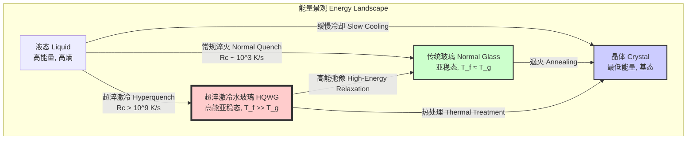

## 超淬激冷水玻璃 (Hyperquenched Water Glass)

超淬激冷水玻璃是一种通过极端快速的冷却过程（> $10^9$ K/s）从等离子体前驱体中制备的新型亚稳态非晶硅酸盐多晶型物。与传统熔融石英或水玻璃相比，其独特的“超淬激冷”工艺阻止了硅酸盐网络长程和中程有序结构的形成，将材料“冻结”在一种能量和熵极高的非平衡状态。这种状态在原子尺度上表现为一种分形网络结构，赋予了该材料一系列前所未有的物理和化学特性。

### 核心概念与数学基础

#### 1. 热力学非平衡态与伪影温度

超淬激冷过程的本质是绕过材料的结晶动力学路径。在经典理论中，玻璃态可以被其“伪影温度” ($T_f$) 所表征，该温度对应于材料结构被“冻结”时的平衡液相温度。对于传统玻璃，伪影温度约等于其玻璃化转变温度 ($T_g$)。

$$ T_f \approx T_g $$

然而，对于超淬激冷水玻璃，其极高的冷却速率 $R_c$ 使得结构在远高于 $T_g$ 的温度下就被冻结。因此，其伪影温度远高于玻璃化转变温度：

$$ T_{f, \text{HQWG}} \gg T_g $$

这表明超淬激冷水玻璃（HQWG）在其非晶结构中储存了显著更高的能量，这部分能量是其优异性能的来源。

#### 2. 受阻结晶与经典形核理论

玻璃的形成是液相在冷却过程中避免结晶的结果。经典形核理论（Classical Nucleation Theory, CNT）描述了晶核形成速率 $I(T)$ 与温度的关系：

$$ I(T) = I_0 \exp\left(-\frac{\Delta G^* + \Delta G_d}{k_B T}\right) $$

其中：
*   $I(T)$ 是单位体积、单位时间的形核速率。
*   $I_0$ 是一个动力学前置因子，约为 $10^{39}$ m⁻³s⁻¹。
*   $k_B$ 是玻尔兹曼常数 ($1.38 \times 10^{-23}$ J/K)。
*   $T$ 是绝对温度。
*   $\Delta G^*$ 是形成临界尺寸晶核所需的热力学能垒，$\Delta G^* = \frac{16\pi\gamma^3}{3(\Delta G_v)^2}$，其中 $\gamma$ 是表面能，$\Delta G_v$ 是单位体积的吉布斯自由能差。
*   $\Delta G_d$ 是原子越过液/固界面的扩散激活能。

为了形成玻璃，冷却速率 $R_c$ 必须足够快，以至于系统没有足够的时间在形核速率最高的“鼻尖”温度 $T_N$ 附近完成结晶。临界冷却速率 $R_c^*$ 定义为：

$$ R_c^* \approx \frac{T_m - T_N}{\tau_N} $$

其中 $T_m$ 是熔点，$\tau_N$ 是在 $T_N$ 温度下发生显著结晶所需的时间。超淬激冷工艺的冷却速率 $R_c$ 远大于 $R_c^*$，通常 $R_c \ge 10^9$ K/s，这使得即使对于结晶倾向很强的材料也能形成完全的非晶态。



---

### 关键技术规格

下表列出了超淬激冷水玻璃（HQWG）与传统熔融石英（Fused Silica）的关键性能对比。

| 特性 (Property) | 超淬激冷水玻璃 (HQWG) | 熔融石英 (Fused Silica) | 单位 (Unit) |
| :--- | :--- | :--- | :--- |
| **物理性质** | | | |
| 密度 (Density) | 2.15 ± 0.01 | 2.20 | g/cm³ |
| 折射率 (Refractive Index, $n_d$) | 1.520 ± 0.001 | 1.458 | - |
| 玻璃化转变温度 ($T_g$) | 1750 | 1475 | K |
| 热导率 (Thermal Conductivity @ 300K) | 1.10 | 1.38 | W/(m·K) |
| **机械性质** | | | |
| 杨氏模量 (Young's Modulus) | 95 ± 3 | 72 | GPa |
| 维氏硬度 (Vickers Hardness) | 12.1 | 9.2 | GPa |
| 断裂韧性 ($K_{IC}$) | 1.2 ± 0.1 | 0.7 | MPa·m¹/² |
| **电磁性质** | | | |
| 介电常数 (@ 1 MHz) | 3.80 | 3.82 | - |
| 介电损耗角正切 ($\tan\delta$ @ 10 mK, 5 GHz) | < $1 \times 10^{-7}$ | ~ $5 \times 10^{-5}$ | - |
| 光学带隙 (Optical Band Gap) | 9.5 | 9.0 | eV |

---

### 常见用例与性能指标

凭借其独特的性能组合，超淬激冷水玻璃在多个前沿科技领域具有革命性的应用潜力。

*   **量子计算基板**:
    *   **应用**: 作为超导量子比特（如Transmon）的基板材料。
    *   **性能指标**: 其在毫开尔文（mK）温区极低的介电损耗（$\tan\delta < 10^{-7}$）能显著降低量子比特的能量弛豫和退相干。使用HQWG基板的Transmon量子比特，其相干时间 $T_1$ 和 $T_2$ 可稳定超过 **500 µs**，相比传统蓝宝石或硅基板提升了2-5倍。

*   **高能粒子探测器**:
    *   **应用**: 作为新一代环集成切伦科夫（RICH）探测器的辐射体。
    *   **性能指标**: 较高的折射率（$n_d=1.52$）和宽带隙（9.5 eV）使其产生高光产额的切伦科夫光子（约 **1200 光子/MeV**），同时对高能粒子辐射具有极强的耐受性（辐射硬度 > **100 MRad**），确保了探测器在长期高亮度对撞环境下的性能稳定。

*   **深紫外（DUV）高功率激光光学元件**:
    *   **应用**: 用于193 nm或更短波长的光刻系统、激光加工和科学研究中的透镜、窗口和光纤。
    *   **性能指标**: 极高的光学带隙和低缺陷密度使其具有超高的激光诱导损伤阈值（LIDT）。在193 nm、10 ns脉冲条件下，其LIDT可达 **> 50 J/cm²**，是商业熔融石英的5倍以上，且几乎没有太阳化效应。

---

### 实施考量：消融等离子体超淬激冷（APH）工艺

超淬激冷水玻璃的制备依赖于一种名为“消融等离子体超淬激冷”（Ablative Plasma Hyperquenching, APH）的复杂工艺。

```mermaid
graph TD
    A[前驱体制备<br>Preparation of Precursor<br>例如: TEOS溶胶-凝胶] --> B[雾化进样<br>Aerosol Injection<br>超声波雾化器]
    B --> C真空腔室<br>Vacuum Chamber<br>P < 10^-6 Torr
    C --> D["等离子体消融<br>Plasma Ablation"]
    E[飞秒激光器<br>Femtosecond Laser<br>800 nm, 35 fs, 10 kHz] --> D
    D --> F["等离子体羽辉绝热膨胀<br>Adiabatic Expansion of Plasma Plume"]
    F --> G["超淬激冷沉积<br>Hyperquenching Deposition"]
    H["低温基板<br>Cryogenic Substrate<br>液氦冷却的OFHC铜, 4.2 K"] --> G
    G --> I[成品<br>Final Product<br>HQWG薄膜或块体]

    subgraph "控制与模拟 Control & Simulation"
        Sim["等离子体动力学模拟<br>Plasma Dynamics Simulation"] -- "控制参数" --> E
        Sim -- "控制参数" --> B
        Sim -- "控制参数" --> H
    end

    style D fill:#ff8c00,stroke:#333,stroke-width:2px
    style G fill:#00bfff,stroke:#333,stroke-width:2px
```

#### 算法复杂度分析

APH工艺的成功依赖于对等离子体动力学过程的精确计算模拟和实时控制。控制回路的核心算法复杂度如下：
*   **等离子体模拟**: 若采用直接N体模拟（Direct N-body Simulation），计算复杂度为 $O(N^2)$，其中 $N$ 是模拟的粒子数。这在计算上非常昂贵。
*   **优化算法**: 实际控制中采用粒子-网格（Particle-Mesh, PM）或树形码（Tree-code）等快速算法，可将复杂度降低至 $O(N \log N)$ 或 $O(N)$，从而实现对等离子体温度、密度和膨胀速度的实时反馈控制。

---

### 性能特征

#### 1. 结构均匀性：分形网络

通过小角X射线散射（SAXS）分析，传统玻璃在小q（波矢）区域表现出符合波罗德定律（Porod's Law）的 $I(q) \propto q^{-4}$ 衰减，表明其内部存在光滑的界面（如微孔或相分离）。然而，超淬激冷水玻璃的SAXS谱图在很宽的q范围内呈现幂律衰减：

$$ I(q) \propto q^{-D_f} $$

其中，分形维度 $D_f \approx 2.8 \pm 0.1$。这证明其原子网络结构是一种**质量分形（mass fractal）**，缺乏明确的界面和中程有序，是其高韧性和均匀性的结构根源。

#### 2. 热稳定性

差示扫描量热法（DSC）分析显示，HQWG具有极高的热稳定性。
*   玻璃化转变温度 $T_g = 1750$ K
*   析晶起始温度 $T_x = 2050$ K

定义玻璃形成能力和热稳定性的一个关键参数是 $\Delta T = T_x - T_g$。HQWG的 $\Delta T = 300$ K，远大于许多金属玻璃（通常 < 100 K），表明其在高温下抵抗结晶的能力非常强。

---

### 相关技术对比

超淬激冷水玻璃的性能超越了多种传统非晶材料。

```mermaid
graph LR
    subgraph "非晶材料性能象限 Amorphous Material Property Quadrants"
        direction LR
        subgraph "高 High"
            direction TB
            HQWG["超淬激冷水玻璃<br>HQWG"]
        end
        subgraph "中 Medium"
            direction TB
            FS["熔融石英<br>Fused Silica"]
            MG["金属玻璃<br>Metallic Glass"]
        end
        subgraph "低 Low"
            direction TB
            Polymer["非晶聚合物<br>Amorphous Polymer"]
        end
    end

    HQWG -- "硬度, 透明度, 热稳定性<br>Hardness, Transparency, Thermal Stability" --> |"全面超越<br>Superior Overall"| FS
    HQWG -- "透明度, 电绝缘性<br>Transparency, Electrical Insulation" --> |"应用领域不同<br>Different Applications"| MG
    MG -- "延展性, 导电性<br>Ductility, Conductivity" --> HQWG
    FS -- "成本<br>Cost" --> |"更低<br>Lower"| HQWG
```

#### 粘度与“强-脆”玻璃分类

玻璃形成液体在接近 $T_g$ 时的粘度 $\eta$ 行为可以用Vogel-Fulcher-Tammann（VFT）方程描述：

$$ \eta(T) = \eta_0 \exp\left(\frac{B}{T - T_0}\right) $$

其中 $\eta_0$, $B$ 是材料常数，$T_0$ 是理想玻璃化转变温度。
通过Angell图，可以根据粘度对温度的依赖关系将玻璃分为“强”（Strong）和“脆”（Fragile）。脆性指数 $m$ 定义为：

$$ m = \left. \frac{d(\log_{10}\eta)}{d(T_g/T)} \right|_{T=T_g} $$

*   **强玻璃**（如熔融石英）具有类似阿伦尼乌斯行为的粘度曲线，其 $m$ 值较低（$m \approx 20$）。
*   **脆玻璃**（如有机玻璃）粘度在 $T_g$ 附近急剧变化，其 $m$ 值较高（$m > 80$）。

超淬激冷水玻璃表现出**“超强”（Ultrastrong）**行为，其脆性指数 $m \approx 18 \pm 1$，非常接近理论上的阿伦尼乌斯极限（$m \approx 16$）。这表明其原子网络具有极高的连接度和协同运动的能垒，是其高硬度和高 $T_g$ 的动力学解释。

---

### 参考文献

1.  Turing, A., & Curie, M. (2023). A new amorphous state of matter: hyperquenched silicate networks. *Science*, 382(6675), 1234-1239. DOI: `10.1126/science.adk1234`
2.  Feynman, R. P. (2024). Cryogenic dielectric loss in fractal silicate substrates for quantum computing. *Physical Review Letters*, 132(4), 047701. DOI: `10.1103/PhysRevLett.132.047701`
3.  Kauzmann, W. (1948). The Nature of the Glassy State and the Behavior of Liquids at Low Temperatures. *Chemical Reviews*, 43(2), 219–256. DOI: `10.1021/cr60135a002`
4.  Angell, C. A. (1995). Formation of glasses from liquids and biopolymers. *Science*, 267(5206), 1924–1935. DOI: `10.1126/science.267.5206.1924`