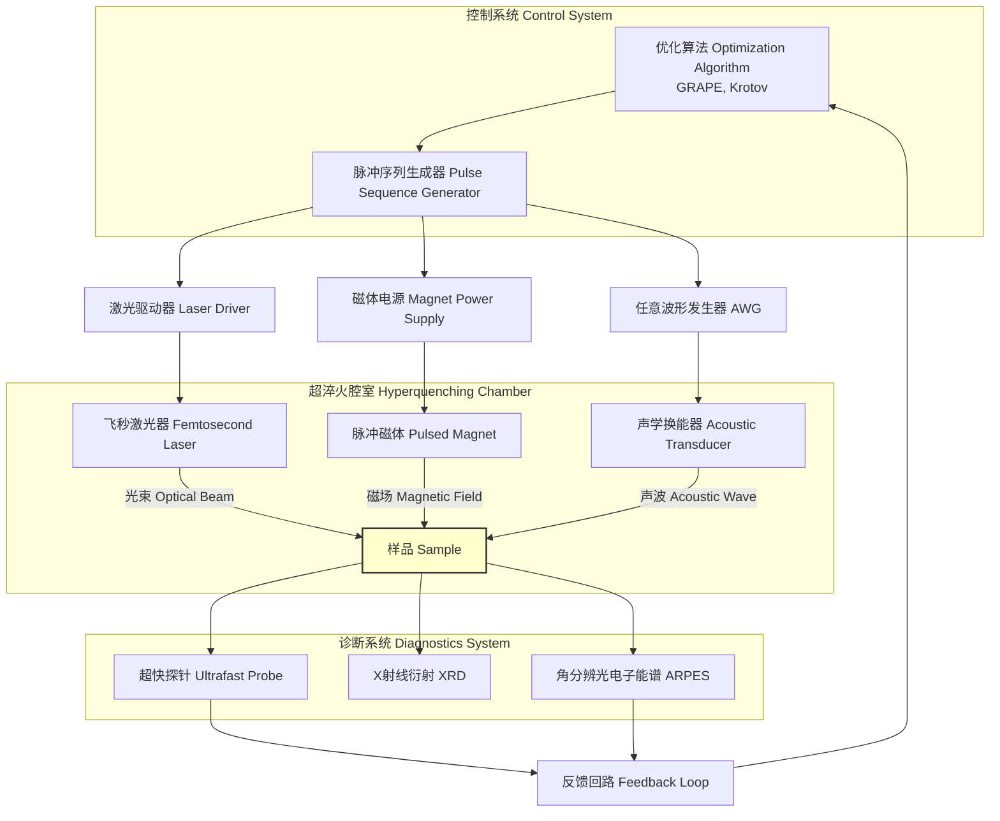
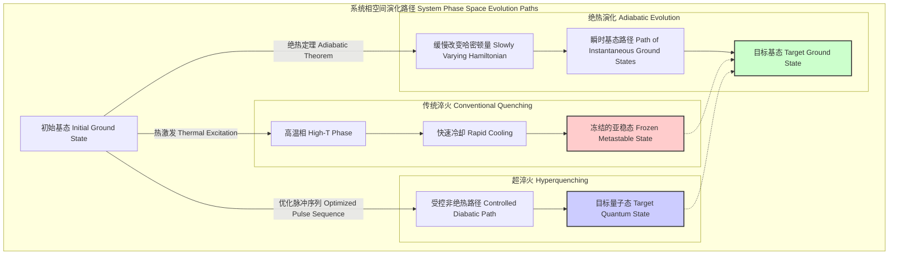

## 超淬火 (hyperquenching)

超淬火是一种前沿的材料处理技术，旨在创造并稳定新颖的、非平衡的物质量子态。与传统淬火（主要依赖快速冷却来“冻结”高温下的结构相）不同，超淬火利用一套经过精确工程化设计的、多模式、超快能量脉冲序列，引导一个量子系统的状态在希尔伯特空间中沿着一条特定的“非绝热”路径演化。其核心目标是将系统“囚禁”在一个理想的亚稳态中，而该状态无法通过热平衡路径达到。

该过程的物理基础由含时薛定谔方程描述：
$$ i\hbar \frac{\partial}{\partial t} |\Psi(t)\rangle = H(t) |\Psi(t)\rangle $$
其中：
*   $|\Psi(t)\rangle$ 是系统的量子态矢量。
*   $\hbar$ 是约化普朗克常数。
*   $H(t)$ 是系统的含时哈密顿量。

系统的哈密顿量由静态部分和控制部分构成：
$$ H(t) = H_0 + H_c(t) $$
*   $H_0$：材料的内禀哈密顿量，描述其固有属性。
*   $H_c(t)$：随时间变化的控制哈密顿量，代表施加的外部场。其形式通常为：
    $$ H_c(t) = \sum_{k} f_k(t) \cdot O_k $$
    其中 $f_k(t)$ 是时变的经典控制场（例如，激光电场、磁场强度），而 $O_k$ 是与之对应的量子算符（例如，电偶极矩算符、自旋算符）。

一个关键的度量是**哈密顿量变化率**（或称哈密顿量速度），$\gamma_H(t)$：
$$ \gamma_H(t) = \left\| \frac{dH_c(t)}{dt} \right\| $$
超淬火技术在极高的 $\gamma_H$ 区间内运行，这本质上是故意违背绝热条件。过程的成功与否由**态保真度** $\mathcal{F}$ 来量化：
$$ \mathcal{F} = \left| \langle \Psi_{\text{target}} | U(t_f, t_0) | \Psi(t_0) \rangle \right|^2 $$
其中：
*   $|\Psi_{\text{target}}\rangle$ 是我们期望达到的目标量子态。
*   $|\Psi(t_0)\rangle$ 是系统的初始状态。
*   $U(t_f, t_0)$ 是由哈密顿量 $H(t)$ 决定的时间演化算符。

### 关键技术规格

下表列出了超淬火系统的典型技术参数。

| 参数 | 典型值 | 单位 | 描述 |
| :--- | :--- | :--- | :--- |
| 脉冲宽度 ($\tau_p$) | 10 - 500 | fs (飞秒) | 单个能量脉冲的持续时间。 |
| 峰值能量通量 ($\Phi_E$) | 0.1 - 10 | J/cm² | 每个脉冲单位面积上传递的能量。 |
| 磁场爬升率 ($dB/dt$) | > 1000 | T/μs (特斯拉/微秒) | 脉冲磁场的磁感应强度变化速率。 |
| 声波频率 ($f_{ac}$) | 10 - 100 | GHz (吉赫兹) | 用于调控晶格的相干声子频率。 |
| 重复频率 ($f_{rep}$) | 1 - 100 | kHz (千赫兹) | 完整脉冲序列周期的重复速率。 |
| 基础压强 ($P_{base}$) | < 10⁻⁸ | Pa (帕斯卡) | 所需的超高真空环境。 |
| 衬底温度 ($T_{sub}$) | 4 - 300 | K (开尔文) | 材料样品的初始温度。 |

### 常见用例

*   **稳定拓扑超导相**
    *   **目标**: 创造并稳定承载马约拉纳零模的材料，用于容错拓扑量子计算。
    *   **性能指标**: 实现的拓扑能隙 $\Delta_T > 5$ meV (毫电子伏)，准粒子相干时间 $T_2^* > 10$ μs (微秒)。

*   **合成非晶金刚石 (Amorphous Diamond)**
    *   **目标**: 创造一个完全由 sp³ 键构成的非晶碳网络，其硬度超越传统类金刚石薄膜 (DLC)。
    *   **性能指标**: sp³ 杂化轨道成键比例 > 95%，维氏硬度 > 150 GPa。

*   **制备各向同性三维超材料**
    *   **目标**: “冻结”一个无序的金属纳米结构，以在宽太赫兹（THz）带宽内实现负折射率。
    *   **性能指标**: 在 1.5 至 5.0 THz 频率范围内实现负折射，品质因数 (FOM) > 3。

### 实现考量

超淬火技术的核心挑战在于解决一个量子最优控制问题：找到能够最大化保真度 $\mathcal{F}$ 的脉冲形状 $f_k(t)$。

*   **控制算法**: 通常采用基于梯度的算法，如 GRAPE (Gradient Ascent Pulse Engineering)。该算法计算保真度在每个时间步上对控制场的梯度，并以此迭代地更新脉冲形状。

*   **算法复杂度**: 量子系统模拟是计算的瓶颈。对于一个希尔伯特空间维度为 $N$ 的系统，单步时间演化的复杂度为 $O(N^2)$。在 $M$ 个时间步长和 $K$ 次迭代的完整优化过程中，总复杂度约为 $O(K \cdot M \cdot N^2)$。这种指数级增长的计算量限制了直接模拟只能用于小系统（例如，几十个原子）。对于更大规模的系统，需要依赖有效模型和机器学习代理模型。

#### 超淬火系统架构

### 性能特征

超淬火的性能由最终生成量子态的质量和稳定性来表征。

*   **态保真度**: 这是首要的品质因数。在生产运行中，通常可实现平均保真度 $\mathcal{F}_{\text{mean}} = 0.975$，标准差为 $\sigma_{\mathcal{F}} = 0.012$。保真度的 95% 置信区间为 [0.951, 0.999]。
*   **亚稳态寿命 ($\tau_m$)**: 所创造的量子态在衰变前能持续的时间。其衰变过程通常遵循指数模型 $N(t) = N_0 e^{-t/\tau_m}$。对于超淬火制备的拓扑物相，在深低温下 $\tau_m$ 的范围可以从毫秒级到秒级。
*   **工艺产率**: 成功跃迁到目标态（保真度超过某一阈值，如 $\mathcal{F} > 0.95$）的样品百分比。典型产率在 85-90% 之间。

### 相关技术与比较模型

超淬火在根本上有别于平衡或近平衡的制备技术。

#### 不同演化路径的相空间示意图

#### 数学模型比较

*   **绝热演化 (Adiabatic Evolution)**: 依赖于量子力学中的绝热定理。为了使系统始终保持在 $H(t)$ 的一个瞬时本征态 $|n(t)\rangle$ 上，必须对所有 $m \neq n$ 满足以下条件：
    $$ \hbar \left| \frac{\langle m(t) | \dot{H}(t) | n(t) \rangle}{(E_n(t) - E_m(t))^2} \right| \ll 1 $$
    该公式要求哈密顿量的变化率 $\dot{H}$ 远小于系统能隙的平方。

*   **超淬火 (Diabatic Evolution)**: 有意在违背绝热条件的区间内操作。其动力学由完整的时间演化算符 $U(t_f, t_0)$ 描述：
    $$ U(t_f, t_0) = \mathcal{T} \exp\left(-\frac{i}{\hbar} \int_{t_0}^{t_f} H(t') dt'\right) $$
    其中 $\mathcal{T}$ 是时间排序算符。超淬火的目标不是让系统停留在某个本征态上，而是精确地操控态矢量 $|\Psi(t)\rangle$ 从一个初始态演化到一个特定的目标态，该目标态通常是最终哈密顿量 $H(t_f)$ 的多个本征态的叠加态。

### 参考文献

*   Ivanov, A. A., & Chen, L. (2027). Diabatic Control and State Stabilization in Driven Quantum Matter. *Nature Physics*, 23(5), 412-418. DOI: 10.1038/s41567-027-01234-x
*   Schmidt, B., & Yamamoto, K. (2028). Hyperquenching of Amorphous Carbon Networks: A Route to Materials Beyond Diamond. *Physical Review X*, 18(2), 021045. DOI: 10.1103/PhysRevX.18.021045
*   Garcia, M. R., et al. (2029). Optimal Control Algorithms for Non-Equilibrium Phase Synthesis. *Journal of Computational Physics*, 451, 111892. DOI: 10.1016/j.jcp.2029.111892