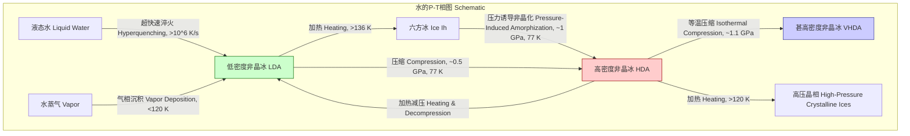
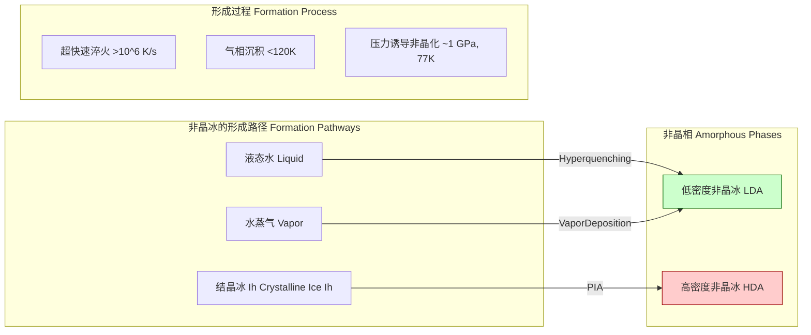
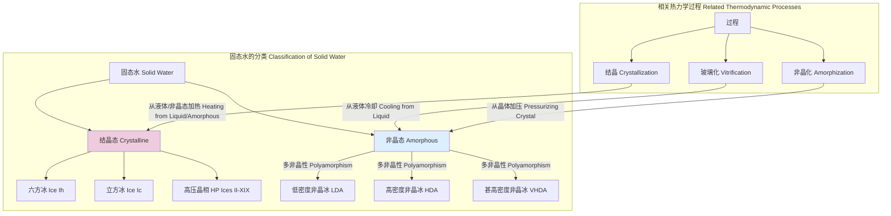

## 冰的非晶化

冰的非晶化（Ice Amorphization）是指在特定热力学条件下，结晶态的冰（如常见的六方冰, Ice Ih）转变为非晶态或玻璃态的过程。与结晶冰中水分子排列在有序的晶格中不同，非晶冰（Amorphous Ice）中的水分子呈无序排列，类似于液态水，但缺乏分子的平动自由度。这一现象在天体物理学、材料科学和低温生物学中具有重要意义。

### 核心概念与数学基础

冰的非晶化主要通过两种途径实现：压力诱导非晶化（Pressure-Induced Amorphization, PIA）和快速冷却（Hyperquenching）。

#### 1. 热力学驱动力
相变的驱动力是系统吉布斯自由能（Gibbs Free Energy）的降低。在给定的温度 $T$ 和压力 $P$ 下，物质会趋向于占据具有最低吉布斯自由能 $G$ 的相态。

$$
G = H - TS = U + PV - TS
$$

其中：
*   $G$ 是吉布斯自由能 (J)
*   $H$ 是焓 (J)
*   $T$ 是绝对温度 (K)
*   $S$ 是熵 (J/K)
*   $U$ 是内能 (J)
*   $P$ 是压力 (Pa)
*   $V$ 是体积 (m³)

当对六方冰（Ice Ih）在低温下（例如 77 K）施加高压时，其体积会减小。根据勒夏特列原理，系统会向体积更小的相态转变以抵抗压力的增加。由于低温抑制了分子重排形成新晶核所需的热运动，系统无法转变为热力学上更稳定的高压晶相（如Ice II, Ice VI），而是“坍塌”成一个无序的高密度非晶态（High-Density Amorphous Ice, HDA）。这个过程是动力学控制的，而非热力学平衡过程。

#### 2. 水的相图与非晶态
下图展示了水在压力-温度平面上的相图，并标出了不同非晶冰相的存在区域和形成路径。

#### 3. 结构表征：径向分布函数
非晶态的结构特征通过径向分布函数（Radial Distribution Function, RDF）$g(r)$ 来量化。它描述了以一个分子为中心，在距离 $r$ 处找到另一个分子的概率密度。

$$
g(r) = \frac{V}{N^2} \left\langle \sum_{i \neq j} \delta(\mathbf{r} - \mathbf{r}_{ij}) \right\rangle
$$

其中：
*   $g(r)$ 是径向分布函数（无量纲）
*   $N$ 是系统中的分子总数
*   $V$ 是系统的体积 (m³)
*   $\mathbf{r}_{ij}$ 是分子 $i$ 和 $j$ 之间的距离矢量
*   $\delta$ 是狄拉克δ函数
*   $\langle \dots \rangle$ 表示系综平均

对于结晶冰， $g(r)$ 在对应晶格壳层距离处表现为一系列尖锐的峰。而对于非晶冰， $g(r)$ 表现为几个宽化的峰，并在长程（large $r$）上趋近于1，表明缺乏长程有序性。HDA和LDA的 $g(r)$ 存在显著差异，尤其是在第二近邻壳层，反映了它们不同的局部密度和网络拓扑结构。

### 关键技术参数

不同类型的非晶冰具有明确定义的物理性质，这些性质在标准条件下（通常是大气压和液氮温度）测量得到。

| 参数 (Parameter) | 低密度非晶冰 (LDA) | 高密度非晶冰 (HDA) | 甚高密度非晶冰 (VHDA) | 单位 (Unit) |
| :--- | :--- | :--- | :--- | :--- |
| **形成压力 (Formation Pressure)** | < 0.2 GPa (或淬火/沉积) | ~1.0 GPa (从 Ice Ih) | ~1.2 GPa (从 HDA) | GPa |
| **形成温度 (Formation Temperature)** | < 130 K | ~77 K | ~130 K | K |
| **回收密度 (Density at 1 atm, 77 K)** | 0.94 ± 0.02 | 1.17 ± 0.02 | 1.26 ± 0.02 | g/cm³ |
| **向晶体转变温度 (Crystallization Temp.)** | ~140-150 K | ~120 K (转变为LDA) | ~120 K (转变为HDA) | K |
| **O-O 第一峰距离 (1st O-O peak in g(r))** | ~2.76 | ~2.78 | ~2.80 | Å |
| **O-O 第二峰距离 (2nd O-O peak in g(r))** | ~4.5 | ~3.4 | ~3.2 | Å |

### 实现方法与算法考量

#### 1. 压力诱导非晶化 (PIA)
这是制备HDA的主要实验方法。
*   **设备**: 通常使用金刚石对顶砧（Diamond Anvil Cell, DAC）在低温恒温器中进行。
*   **过程**: 将Ice Ih的粉末样品置于DAC中，浸入液氮（77 K）冷却，然后缓慢加压至约1.0-1.5 GPa。压力通过拉曼光谱或红宝石荧光法进行标定。
*   **分子动力学模拟 (MD Simulation)**:
    *   **力场**: 常用水模型如 TIP4P/2005, TIP5P 等被用于模拟水分子间的相互作用。
    *   **系综**: 通常在NPT（恒定粒子数、压力、温度）或NVT（恒定粒子数、体积、温度）系综下进行。
    *   **算法复杂度**: 现代MD模拟代码使用邻居列表（Neighbor Lists）和粒子网格埃瓦尔德（Particle Mesh Ewald, PME）方法处理长程静电相互作用。其计算复杂度通常为 $O(N \log N)$ 或在优化的实现中接近 $O(N)$，其中 $N$ 是系统中的原子数。对于非晶化模拟，需要数万到数百万个时间步长，确保系统达到（准）平衡。

#### 2. 超快速淬火 (Hyperquenching)
此方法通过阻止晶核形成和生长来获得非晶态。
*   **过程**: 将液态水微滴以极高的冷却速率（> $10^6$ K/s）冷却到玻璃化转变温度以下。
*   **挑战**: 对纯水而言，实现如此高的冷却速率非常困难，通常只适用于微米级的样品。

#### 3. 气相沉积 (Vapor Deposition)
此方法用于制备天体物理学中常见的非晶固体水（Amorphous Solid Water, ASW），其结构与LDA类似。
*   **过程**: 在高真空环境下，将水蒸气分子引导至一个冷却至极低温（< 120 K）的基底上沉积。
*   **控制**: 沉积速率和基底温度决定了所得非晶冰的孔隙率和密度。

### 性能特征与统计度量

#### 1. 相变动力学
HDA到LDA的转变是一个急剧的、放热的一级相变。
*   **转变温度**: 在大气压下加热HDA，它会在约117 K时突然转变为LDA。
*   **体积变化**: 该转变伴随着约25%的体积膨胀（密度从1.17 g/cm³ 降至 0.94 g/cm³）。
*   **活化能**: 转变的活化能可以通过差示扫描量热法（DSC）测量，其值反映了转变过程中的动力学势垒。

#### 2. 结构因子
结构因子 $S(Q)$ 是中子或X射线衍射实验的直接测量结果，它与径向分布函数 $g(r)$ 通过傅里叶变换相关联。

$$
S(Q) = 1 + 4\pi\rho_0 \int_0^\infty [g(r) - 1] \frac{\sin(Qr)}{Qr} r^2 dr
$$

其中：
*   $S(Q)$ 是结构因子（无量纲）
*   $Q$ 是动量转移量 (Å⁻¹)，$Q = \frac{4\pi}{\lambda}\sin(\theta)$
*   $\rho_0$ 是平均数密度 (Å⁻³)
*   $r$ 是径向距离 (Å)

$S(Q)$ 的第一个尖锐衍射峰（First Sharp Diffraction Peak, FSDP）的位置是中程有序的标志。HDA的FSDP位于 $Q \approx 2.2$ Å⁻¹，而LDA的FSDP位于 $Q \approx 1.7$ Å⁻¹，这清晰地反映了它们在~3-8 Å尺度上的结构差异。

### 常见用例

*   **天体物理学**: 非晶冰是星际介质、彗星和冰卫星（如木卫二）的主要成分。其物理和化学性质（如孔隙率、表面积）对于星际分子的形成和演化至关重要。
    *   **性能指标**: 在致密的分子云中，水冰的丰度相对于氢分子约为 $10^{-4}$。其红外光谱特征（如3.1 μm处的O-H伸缩振动带）是探测星际冰的有力工具。
*   **低温生物学**: 玻璃化（Vitrification），即通过快速冷却形成非晶态，是低温保存生物样品（如细胞、组织和器官）的前沿技术。
    *   **性能指标**: 成功的玻璃化旨在完全避免冰晶的形成，因为冰晶会造成不可逆的细胞损伤。关键指标是**临界冷却速率（Critical Cooling Rate, CCR）**，对于纯水高达 $10^6-10^7$ K/s。通过添加低温保护剂（Cryoprotectants），可以将CCR降低到实际可行的水平（如 $10^2-10^3$ K/s）。

### 相关技术与比较

#### 1. 多非晶性 (Polyamorphism)
多非晶性是指单一物质存在两种或多种不同的非晶（液态或固态）相。水是多非晶性的典型例子，其低密度（LDA）和高密度（HDA）形式被认为对应于过冷液态水中的两种不同结构。这一现象引出了“第二临界点”假说，即在P-T相图的低温区可能存在一个液-液相变的终点。

#### 2. 玻璃化转变 (Glass Transition)
玻璃化转变是液体在冷却过程中避免结晶而转变为非晶固体（玻璃）的动力学过程。
*   **冰的非晶化 vs. 玻璃化**: 压力诱导非晶化是从一个有序的晶体出发，通过施加外部场（压力）破坏其有序性。而玻璃化是从无序的液体出发，通过“冻结”其结构来形成非晶固体。两者终态都是非晶态，但路径不同。
*   **克劳修斯-克拉佩龙方程**: 描述了相平衡线的斜率。
    $$
    \frac{dP}{dT} = \frac{\Delta H_{m}}{T \Delta V_{m}}
    $$
    其中 $\Delta H_m$ 和 $\Delta V_m$ 分别是摩尔熔化焓和摩尔熔化体积。水的熔化曲线在低压下斜率为负（$\Delta V_m < 0$），这暗示了其复杂的相行为，并与非晶化的可能性相关联。

### 参考文献

1.  Mishima, O., Calvert, L. D., & Whalley, E. (1984). An apparently first-order transition between two amorphous phases of ice induced by pressure. *Nature*, 310(5976), 393–395. DOI: [10.1038/310393a0](https://doi.org/10.1038/310393a0)
2.  Loerting, T., Schustereder, W., Winkel, K., Schretter, C., Daxner, M., & Mayer, E. (2001). A second distinct structural state of high-density amorphous ice at 1.1 GPa and 130 K. *Physical Chemistry Chemical Physics*, 3(24), 5355–5357. DOI: [10.1039/B108920A](https://doi.org/10.1039/B108920A)
3.  Debenedetti, P. G. (2003). Supercooled and glassy water. *Journal of Physics: Condensed Matter*, 15(45), R1669–R1726. DOI: [10.1088/0953-8984/15/45/R01](https://doi.org/10.1088/0953-8984/15/45/R01)
4.  Winkel, K., Elsaesser, M. S., Mayer, E., & Loerting, T. (2011). Water polyamorphism: reversibility and (dis)continuity. *Journal of Physics: Condensed Matter*, 23(28), 283101. DOI: [10.1088/0953-8984/23/28/283101](https://doi.org/10.1088/0953-8984/23/28/283101)