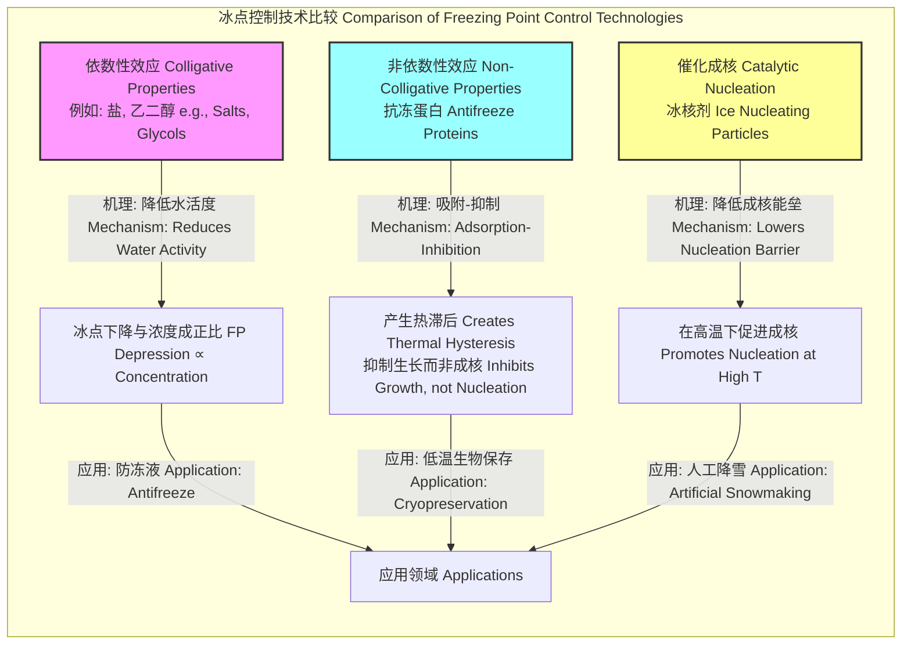

## 冰的结晶

冰的结晶是从液态水到固态冰的相变过程，是热力学和动力学共同作用的结果。该过程涉及两个主要阶段：成核（新晶相的初始形成）和晶体生长（现有晶核的尺寸增大）。对冰结晶的理解在气象学、材料科学、生物学和食品工业等多个领域都至关重要。

### 1. 核心概念与数学基础

#### 1.1 成核 (Nucleation)

成核是结晶的起始步骤，即在过冷液体中形成稳定的晶体胚芽（核）。它分为两种主要类型：均匀成核和非均匀成核。

##### 1.1.1 均匀成核 (Homogeneous Nucleation)

均匀成核发生在纯净的液相中，没有任何外来杂质或界面的帮助。根据经典成核理论（Classical Nucleation Theory, CNT），形成一个半径为 $r$ 的球形冰核所引起的吉布斯自由能变化 $\Delta G$ 包括两部分：体积自由能的降低和表面自由能的增加。

$$
\Delta G(r) = \Delta G_V + \Delta G_S = \frac{4}{3}\pi r^3 \Delta G_v + 4\pi r^2 \gamma_{sl}
$$

其中：
*   $r$: 冰核的半径 (m)。
*   $\Delta G_v$: 单位体积的固-液相变吉布斯自由能差 (J/m³)。这是一个负值，因为结晶是热力学上有利的。它约等于 $\Delta G_v \approx -\frac{L_f \Delta T}{T_m}$。
*   $\gamma_{sl}$: 固-液界面能 (J/m²)。这是一个正值，代表形成新界面所需的能量。
*   $L_f$: 熔化潜热 (J/kg)。
*   $\Delta T = T_m - T$: 过冷度 (K)，即熔点 $T_m$ 与实际温度 $T$ 之差。

$\Delta G(r)$ 存在一个能量最大值，即成核能垒 $\Delta G^*$，对应的半径为临界半径 $r^*$。只有当晶核尺寸超过 $r^*$ 时，它才能稳定存在并继续生长。通过对 $\Delta G(r)$ 求导并令其为零（$\frac{d(\Delta G)}{dr} = 0$），可得：

$$
r^* = -\frac{2\gamma_{sl}}{\Delta G_v} \approx \frac{2\gamma_{sl}T_m}{L_f \Delta T}
$$

$$
\Delta G^* = \frac{16\pi \gamma_{sl}^3}{3(\Delta G_v)^2} \approx \frac{16\pi \gamma_{sl}^3 T_m^2}{3(L_f \Delta T)^2}
$$

均匀成核速率 $J_{hom}$（单位时间单位体积内形成的临界核数量）由阿伦尼乌斯方程描述：

$$
J_{hom} = K \exp\left(-\frac{\Delta G^*}{k_B T}\right)
$$

其中：
*   $K$: 动力学前置因子 (m⁻³s⁻¹)，与分子附着到晶核表面的速率有关。
*   $k_B$: 玻尔兹曼常数 ($1.38 \times 10^{-23}$ J/K)。
*   $T$: 绝对温度 (K)。

##### 1.1.2 非均匀成核 (Heterogeneous Nucleation)

非均匀成核发生在杂质颗粒、容器壁或其他界面上。这些界面降低了形成新相所需的能量，因此非均匀成核比均匀成核更容易发生，通常在较小的过冷度下即可启动。

成核能垒被一个与接触角 $\theta$ 相关的几何因子 $S(\theta)$ 所修正：

$$
\Delta G^*_{het} = \Delta G^*_{hom} \cdot S(\theta)
$$

$$
S(\theta) = \frac{(2 + \cos\theta)(1 - \cos\theta)^2}{4}
$$

其中：
*   $\theta$: 冰核与异质基底之间的接触角。$\theta$ 越小，基底的润湿性越好，成核能垒降低得越多。当 $\theta = 0$ 时，$S(\theta) = 0$，成核没有能垒；当 $\theta = 180^\circ$ 时，$S(\theta) = 1$，恢复到均匀成核的情况。

```mermaid
graph TD
    subgraph "成核过程 Nucleation Process"
        A[过冷水 Supercooled Water] --> B["成核类型? Nucleation Type?[";
        B -- "纯净系统 Pure System" --> C[均匀成核 Homogeneous Nucleation];
        B -- "含杂质/界面 With Impurities/Interfaces" --> D[非均匀成核 Heterogeneous Nucleation];
        C --> E["高能垒 High Energy Barrier<br>ΔG*<br>需要大过冷度 Requires large ΔT"];
        D --> F["低能垒 Low Energy Barrier<br>ΔG* * Sθ<br>需要小过冷度 Requires small ΔT"];
        E --> G[稳定冰核形成 Stable Ice Nucleus Formation];
        F --> G;
        G --> H[晶体生长 Crystal Growth];
    end

    style C fill:#cceeff,stroke:#333
    style D fill:#ccffcc,stroke:#333
```

#### 1.2 晶体生长 (Crystal Growth)

一旦稳定的晶核形成，它们就会通过不断从周围的过冷液体中吸收水分子而长大。生长速率受两个主要过程的限制：界面动力学和传热。

*   **界面动力学控制生长**: 生长速率取决于水分子穿过液-固界面并整合到晶格中的微观过程。Wilson-Frenkel 方程描述了该速率 $v$：
    $$
    v = A \exp\left(-\frac{E_a}{k_B T}\right) \left[1 - \exp\left(\frac{\Delta \mu}{k_B T}\right)\right]
    $$
    其中 $A$ 是前置因子，$E_a$ 是分子跨越界面的活化能，$\Delta \mu$ 是液相和固相之间的化学势差，它与过冷度 $\Delta T$ 成正比。

*   **传热控制生长**: 结晶过程会释放熔化潜热 $L_f$。这部分热量必须从生长界面传导出去，否则界面温度会升高到熔点，从而停止生长。在许多实际情况下，尤其是在过冷度较大时，传热是主要的限速步骤。对于一个球形晶体，其半径 $R$ 随时间 $t$ 的增长可以近似为：
    $$
    R(t) \approx \sqrt{2 \alpha_L \frac{c_{pL}(T_m - T_\infty)}{L_f} t}
    $$
    其中 $\alpha_L$ 是液体的热扩散率，$c_{pL}$ 是液体的比热容，$T_\infty$ 是远离界面的液体温度。

#### 1.3 晶体形态 (Crystal Morphology)

冰晶的宏观形态（如雪花的六角形对称结构）由其内在的晶体结构（最常见的是六方冰，Ice Ih）和外部生长条件（主要是温度和水汽过饱和度）共同决定。著名的“中谷图”（Nakaya Diagram）描述了不同温度和湿度下冰晶的生长形态。

```mermaid
graph TD
    subgraph "冰晶形态与生长条件 Ice Crystal Morphology vs. Growth Conditions"
        A["环境条件 Environmental Conditions"] --> B["温度 Temperature"];
        A --> C["水汽过饱和度 Water Vapor Supersaturation"];
        
        B -- "-0 to -3°C" --> D["薄六角板 Thin Hexagonal Plates"];
        B -- "-3 to -5°C" --> E["针状 Needles"];
        B -- "-5 to -8°C" --> F["空心柱状 Hollow Columns"];
        B -- "-8 to -12°C" --> G["扇形板/星盘状 Sector Plates/Dendrites"];
        B -- "-12 to -16°C" --> H["星状树枝晶 Stellar Dendrites"];
        B -- "-16 to -25°C" --> I["板状 Plates"];

        C -- "高 High" --> H;
        C -- "低 Low" --> D;
        C -- "高 High" --> G;

        D --> J["最终形态 Final Morphology[";
        E --> J;
        F --> J;
        G --> J;
        H --> J;
        I --> J;
    end
    style H fill:#add8e6,stroke:#00008b
    style G fill:#add8e6,stroke:#00008b
```

### 2. 关键技术规格

下表列出了在标准大气压（101.325 kPa）下与冰结晶相关的关键物理参数。

| 参数 (Parameter) | 符号 (Symbol) | 数值 (Value) | 单位 (Unit) |
| :--- | :---: | :---: | :---: |
| 熔点 (Melting Point) | $T_m$ | 273.15 (0) | K (°C) |
| 熔化潜热 (Latent Heat of Fusion) | $L_f$ | $3.34 \times 10^5$ | J/kg |
| 冰-水界面能 (Ice-Water Interfacial Energy) | $\gamma_{sl}$ | $29 - 32$ | mJ/m² |
| 冰的密度 (Density of Ice Ih at 0°C) | $\rho_s$ | 916.7 | kg/m³ |
| 水的密度 (Density of Water at 4°C) | $\rho_l$ | 999.97 | kg/m³ |
| 冰的热导率 (Thermal Conductivity of Ice at 0°C) | $k_s$ | 2.22 | W/(m·K) |
| 水的热导率 (Thermal Conductivity of Water at 0°C) | $k_l$ | 0.561 | W/(m·K) |
| 冰的比热容 (Specific Heat of Ice at 0°C) | $c_{ps}$ | 2108 | J/(kg·K) |
| 水的比热容 (Specific Heat of Water at 0°C) | $c_{pl}$ | 4217 | J/(kg·K) |

### 3. 常见用例

| 应用领域 (Use Case) | 描述 (Description) | 关键性能指标 (Quantitative Performance Metrics) |
| :--- | :--- | :--- |
| **大气科学 (Atmospheric Science)** | 云中冰晶的形成是降水（雪、冰雹）的关键。非均匀成核主导了大气中的冰晶形成。 | 均匀成核温度：~ -38°C；非均匀成核温度：-5°C 至 -15°C（取决于冰核物质）。 |
| **生物低温保存 (Cryopreservation)** | 通过冷冻保存细胞、组织或器官。目标是最小化由冰晶形成引起的细胞损伤。 | 细胞存活率 > 90%；冷却速率：1-10 K/min（取决于细胞类型和抗冻剂）；冰晶尺寸 < 1 µm。 |
| **食品工业 (Food Industry)** | 冰淇淋、冷冻食品的生产。小而均匀的冰晶可提供更好的口感和质地。 | 冰淇淋中的平均冰晶直径：< 50 µm；快速冷冻（IQF）速率：> 100 K/min。 |
| **材料科学 (Materials Science)** | 冷冻铸造技术，利用冰晶作为模板制造多孔陶瓷或聚合物支架。 | 孔隙率：50-95%；孔径：10-500 µm，可通过控制冷却梯度来调节。 |

### 4. 实施考量

在工业或实验应用中控制冰结晶过程，需要考虑以下因素：

*   **过冷度控制**: 过冷度是成核和生长的主要驱动力。
    *   **高冷却速率**: 促进高成核密度，形成大量细小的晶体。
    *   **低冷却速率**: 促进现有晶体的生长，形成少量粗大的晶体。
*   **晶种引入 (Seeding)**: 人为引入高效的非均匀成核位点（晶种），可以在较低的过冷度下精确地触发结晶，从而更好地控制晶体尺寸和分布。
*   **压力效应**: 压力会影响熔点。根据克劳修斯-克拉佩龙方程，对于水，压力的增大会降低熔点（因为冰的密度小于水）。
    $$
    \frac{dP}{dT} = \frac{L_f}{T(V_l - V_s)} = \frac{L_f}{T(\frac{1}{\rho_l} - \frac{1}{\rho_s})}
    $$
    由于 $\rho_s < \rho_l$，所以 $V_s > V_l$，导致 $\frac{dP}{dT}$ 为负值。

*   **模拟算法复杂度**:
    *   **分子动力学 (Molecular Dynamics, MD)**: 从原子层面模拟成核过程。计算成本高，对于N个原子系统，复杂度通常为 $O(N^2)$ 或使用PME等远场算法后的 $O(N \log N)$。
    *   **相场模型 (Phase-Field Models)**: 在连续介质尺度上模拟晶体生长和形态演化。计算复杂度与网格点数 $M$ 相关，基于FFT的求解器可达到 $O(M \log M)$。

### 5. 性能特征

冰结晶是一个随机过程，其结果具有统计特性。

*   **成核速率 ($J$)**: 成核是一个概率性事件，其速率对温度极为敏感。在某个特征温度附近，成核速率会急剧增加几个数量级。
*   **晶体尺寸分布 (Crystal Size Distribution, CSD)**: 最终产物的晶体尺寸通常不是单一值，而是遵循一定的统计分布，如对数正态分布或伽马分布。
*   **统计测量**:
    *   **平均晶体尺寸 ($\bar{d}$)**: 描述晶体群的中心趋势。
    *   **标准差 ($\sigma_d$)**: 描述晶体尺寸的离散程度。
    *   **置信区间**: 由于成核的随机性，结晶温度通常以一个范围给出。例如，在 10 K/min 的冷却速率下，1 µL 纯水滴的均匀成核温度为 -38°C ± 1°C (95% CI)。

### 6. 相关技术

#### 6.1 抗冻蛋白 (Antifreeze Proteins, AFPs)

AFPs是生物体（如极地鱼类）产生的一类特殊蛋白质，能够抑制冰晶的生长。

*   **机理**: AFPs通过“吸附-抑制”机理起作用。它们会特异性地吸附到冰晶的特定晶面上，通过吉布斯-汤姆逊效应在局部产生高度弯曲的冰-水界面，从而阻止水分子附着，抑制晶体生长。
*   **数学模型 (吉布斯-汤姆逊效应)**: 曲率会改变相变温度。对于一个曲率为 $1/r$ 的界面，熔点下降量 $\Delta T_m$ 为：
    $$
    \Delta T_m = T_m(\infty) - T_m(r) = \frac{2\gamma_{sl} T_m}{L_f \rho_s r}
    $$
    AFPs在冰晶表面制造了微小的曲率，有效阻止其在正常熔点以下生长。
*   **比较**: AFPs产生的冰点下降被称为“热滞后”（Thermal Hysteresis, TH），这是一种非依数性效应，远比盐等溶质产生的依数性冰点下降（colligative freezing point depression）高效得多。

#### 6.2 冰核剂 (Ice Nucleating Particles, INPs)

INPs是能高效催化非均匀成核的粒子，如碘化银（AgI）、某些细菌（如丁香假单胞菌 *Pseudomonas syringae*）和高岭土等。

*   **比较**: 不同INPs的成核效率通过其特征成核温度来衡量。例如，*P. syringae* 可以在高达 -2°C 的温度下催化成核，而许多矿物粉尘则需要更低的温度。



### 7. 参考文献

1.  Turnbull, D., & Fisher, J. C. (1949). Rate of nucleation in condensed systems. *The Journal of Chemical Physics*, 17(1), 71-73. DOI: `10.1063/1.1747055`
2.  Pruppacher, H. R., & Klett, J. D. (2010). *Microphysics of Clouds and Precipitation*. Springer. DOI: `10.1007/978-0-306-48100-0`
3.  Debenedetti, P. G. (1996). *Metastable Liquids: Concepts and Principles*. Princeton University Press.
4.  Fletcher, N. H. (1958). Size effect in heterogeneous nucleation. *The Journal of Chemical Physics*, 29(3), 572-576. DOI: `10.1063/1.1744540`
5.  Mochizuki, K., Qiu, Y., & Molinero, V. (2013). Coarse-grained model of water for simulations of vapor, liquid, and ice at atmospheric-pressure conditions. *The Journal of Chemical Physics*, 138(18), 184505. DOI: `10.1063/1.4802998`
6.  DeVries, A. L. (1986). Antifreeze glycopeptides and peptides: interactions with ice and water. *Methods in Enzymology*, 127, 293-303. DOI: `10.1016/0076-6879(86)27022-7`