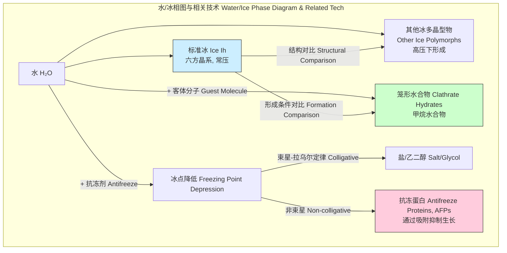

## 冰的形成

冰的形成，即水从液相到固相的相变过程，是一个在自然界和工业技术中普遍存在且至关重要的物理化学现象。该过程涉及复杂的热力学、动力学和微观结构演化。本技术文档旨在从科学和数学角度，对冰的形成机制进行全面而严谨的阐述。

### 1. 核心概念与数学基础

冰的形成主要包括两个连续的阶段：**成核（Nucleation）**和**晶体生长（Crystal Growth）**。

#### 1.1. 相变热力学

水结冰是一个放热的一阶相变过程。其自发进行的热力学驱动力是系统吉布斯自由能（Gibbs Free Energy, $G$）的降低。吉布斯自由能定义为：

$$ G = H - TS $$

其中：
*   $G$ 是吉布斯自由能 (J)
*   $H$ 是焓 (J)
*   $T$ 是绝对温度 (K)
*   $S$ 是熵 (J/K)

在恒温恒压下，当液态水转变为固态冰时，自由能的变化量 $\Delta G$ 为：

$$ \Delta G = \Delta H - T \Delta S $$

在熔点 $T_m$ 时，系统处于平衡态，$\Delta G = 0$，因此 $\Delta H_f = T_m \Delta S_f$，其中 $\Delta H_f$ 是熔化潜热。当温度 $T < T_m$ 时（即处于过冷状态），$\Delta G < 0$，相变过程在热力学上是自发的。单位体积的自由能变化 $\Delta G_v$ 可以近似表示为：

$$ \Delta G_v \approx \frac{\Delta H_f (T_m - T)}{T_m} = \frac{L_v \Delta T}{T_m} $$

其中：
*   $\Delta G_v$ 是单位体积的吉布斯自由能变化 (J/m³)
*   $L_v$ 是单位体积的熔化潜热 (J/m³)
*   $\Delta T = T_m - T$ 是过冷度 (K)

#### 1.2. 成核理论

成核是形成稳定晶胚（晶核）的初始阶段，分为均匀成核和非均匀成核。

##### 1.2.1. 经典均匀成核理论 (Classical Homogeneous Nucleation Theory)

在纯净的过冷液体中，水分子通过随机热运动偶然聚集形成冰胚。这个过程需要克服一个能量壁垒。形成一个半径为 $r$ 的球形冰胚时，总的自由能变化 $\Delta G(r)$ 由两部分组成：

1.  **体积自由能降低**：由于形成更稳定的固相而释放的能量，与冰胚体积成正比。
    $$ \Delta G_V = \frac{4}{3}\pi r^3 \Delta G_v $$
2.  **表面自由能增加**：形成新的冰-水界面所需要的能量，与冰胚表面积成正比。
    $$ \Delta G_S = 4\pi r^2 \gamma_{sl} $$

因此，总自由能变化为：

$$ \Delta G(r) = -\frac{4}{3}\pi r^3 |\Delta G_v| + 4\pi r^2 \gamma_{sl} $$

其中：
*   $\gamma_{sl}$ 是冰-水界面能 (J/m²)

通过对 $\Delta G(r)$ 求导并令其为零（$\frac{d\Delta G(r)}{dr} = 0$），可以得到临界核半径 $r^*$ 和成核能垒 $\Delta G^*$：

$$ r^* = \frac{2\gamma_{sl}}{|\Delta G_v|} = \frac{2\gamma_{sl}T_m}{L_v \Delta T} $$

$$ \Delta G^* = \frac{16\pi \gamma_{sl}^3}{3(\Delta G_v)^2} = \frac{16\pi \gamma_{sl}^3 T_m^2}{3(L_v \Delta T)^2} $$

只有当冰胚半径 $r > r^*$ 时，它才能稳定存在并继续生长。

```mermaid
graph TD
    subgraph "经典成核理论 Classical Nucleation Theory"
        A["过冷水 Supercooled Water"] --> B["形成冰胚 Ice Embryo Formation[";
        B --> C["体积自由能降低<br>ΔG_V ∝ -r³"];
        B --> D["表面自由能增加<br>ΔG_S ∝ +r²"];
        C --> E["总自由能变化<br>ΔGr = ΔG_V + ΔG_S"];
        D --> E;
        E --> F["dΔG/dr = 0 ?[";
        F -- Yes --> G["临界尺寸 r*<br>成核能垒 ΔG*"];
        F -- No --> H["冰胚不稳定<br>溶解 Unstable Embryo Dissolves"];
        G --> I["稳定冰核<br>开始生长 Stable Nucleus Growth"];
    end

    style G fill:#ccffcc,stroke:#006600
    style I fill:#99ccff,stroke:#003366
```

##### 1.2.2. 非均匀成核 (Heterogeneous Nucleation)

在实际情况中，水中总会存在悬浮的杂质颗粒（成核剂），成核过程通常发生在这些颗粒表面，即非均匀成核。这种过程的能垒远低于均匀成核。其成核能垒 $\Delta G^*_{het}$ 与均匀成核能垒 $\Delta G^*_{hom}$ 的关系为：

$$ \Delta G^*_{het} = \Delta G^*_{hom} \cdot f(\theta) $$

$$ f(\theta) = \frac{(2 + \cos\theta)(1 - \cos\theta)^2}{4} $$

其中：
*   $\theta$ 是冰胚与杂质颗粒表面之间的接触角。$0 \le \theta \le 180^\circ$。
*   $f(\theta)$ 是一个形状因子，取值范围为 $[0, 1]$。当$\theta=0^\circ$时，$f(\theta)=0$，无成核能垒；当$\theta=180^\circ$时，$f(\theta)=1$，等同于均匀成核。

#### 1.3. 晶体生长

当稳定的晶核形成后，便进入晶体生长阶段。生长速率主要受两个因素控制：
1.  **界面动力学**：水分子扩散并整合到冰晶格中的速率。
2.  **热量传输**：相变释放的潜热必须从冰-水界面传导出去。

在多数情况下，尤其是在过冷度较大时，热量传输是生长过程的限制步骤。这个过程可以通过**斯蒂芬问题（Stefan Problem）**来描述，这是一个涉及移动相变边界的热传导问题。一维简化形式的热传导方程为：

$$ \frac{\partial T_i}{\partial t} = \alpha_i \frac{\partial^2 T_i}{\partial x^2} $$

在冰-水界面 $x=s(t)$ 处，能量守恒边界条件为：

$$ L_v \rho_i \frac{ds}{dt} = k_i \left. \frac{\partial T_i}{\partial x} \right|_{x=s(t)} - k_l \left. \frac{\partial T_l}{\partial x} \right|_{x=s(t)} $$

其中：
*   $\alpha_i = k_i / (\rho_i c_{p,i})$ 是冰的热扩散系数 (m²/s)
*   $k_i, k_l$ 分别是冰和水的热导率 (W/(m·K))
*   $\rho_i$ 是冰的密度 (kg/m³)
*   $c_{p,i}$ 是冰的比热容 (J/(kg·K))
*   $s(t)$ 是界面随时间 $t$ 变化的位置 (m)
*   $ds/dt$ 是界面的生长速率 (m/s)

晶体生长的形态（如枝晶、胞状等）由过冷度、热流方向和各向异性等因素共同决定。

### 2. 关键技术规格

下表列出了在标准大气压（101.325 kPa）下，水和六方冰（Ice Ih）的一些关键物理性质。

| 属性 (Property) | 液态水 (Liquid Water) | 六方冰 (Hexagonal Ice, Ih) | 单位 (Unit) |
| :--- | :--- | :--- | :--- |
| 熔点 (Melting Point) | 0.00 | 0.00 | °C |
| 密度 (Density) | 999.8 (at 4°C) | 916.7 (at 0°C) | kg/m³ |
| 熔化潜热 (Latent Heat of Fusion) | - | 334 | kJ/kg |
| 比热容 (Specific Heat Capacity) | 4.184 (at 15°C) | 2.108 (at 0°C) | kJ/(kg·K) |
| 热导率 (Thermal Conductivity) | 0.58 (at 15°C) | 2.22 (at 0°C) | W/(m·K) |
| 冰-水界面能 ($\gamma_{sl}$) | - | ~29 - 32 | mJ/m² |
| **三相点 (Triple Point)** | \multicolumn{2}{c|}{273.16 K (0.01 °C), 611.657 Pa} | - |

### 3. 常见用例

| 用例 (Use Case) | 描述 (Description) | 关键性能指标 (Quantitative Metrics) |
| :--- | :--- | :--- |
| **大气科学** | 云中冰晶的形成是降水（雪、冰雹）的关键。利用韦格纳-贝吉龙-芬德森过程。 | 冰成核剂(INP)浓度: 0.1 - 10 L⁻¹ (在-20°C) |
| **低温生物学** | 细胞和组织的低温保存，通过快速降温或添加低温保护剂来避免破坏性的胞内结冰。 | 最佳冷却速率: 1 - 1000 °C/min (取决于细胞类型) |
| **材料制备** | 通过冰模板法（Freeze-casting）制造多孔陶瓷和聚合物支架。 | 孔隙率: 50% - 95%; 孔径: 1 - 500 μm |
| **食品工业** | 速冻技术通过快速生成微小冰晶来保持食品的质地和口感。 | 冰晶尺寸: < 50 μm (理想情况) |
| **人工影响天气** | 通过向过冷云中播撒碘化银(AgI)等成核剂来促进冰晶形成，实现人工增雨/雪。 | AgI成核效率: 在-10°C时，每克AgI可产生 $10^{14}$ 个冰晶 |

### 4. 实现考量

对冰形成过程进行建模和仿真是理解和控制该过程的重要手段。

*   **分子动力学 (Molecular Dynamics, MD)**
    *   **描述**: 在原子/分子尺度上直接模拟水分子的运动和相互作用，能够精确捕捉成核的初始瞬间。
    *   **适用性**: 研究成核机理、界面结构和动力学。
    *   **算法复杂度**: 对于N个粒子，经典算法为 $O(N^2)$。使用空间分解和邻居列表等优化方法后可降至 $O(N)$ 或 $O(N \log N)$。计算成本极高，模拟的时间和空间尺度有限。

*   **相场模型 (Phase-Field Models)**
    *   **描述**: 一种连续介质力学方法，使用一个序参量（相场变量）来描述固液相的分布，界面被处理为具有一定厚度的过渡区。
    *   **适用性**: 模拟介观尺度的晶体生长形态（如枝晶）。
    *   **算法复杂度**: 通常基于偏微分方程（如艾伦-卡恩方程）的数值解，复杂度与网格点数 $M$ 和时间步数 $T$ 的乘积成正比，即 $O(M \cdot T)$。

*   **蒙特卡洛方法 (Monte Carlo, MC)**
    *   **描述**: 基于概率统计的模拟方法，通过随机抽样来模拟分子的聚集和相变过程。
    *   **适用性**: 研究成核能垒和平衡态性质。
    *   **算法复杂度**: 复杂度与模拟步数和系统尺寸相关，通常为 $O(N)$ 每步。

### 5. 性能特征

*   **成核速率 (Nucleation Rate, $J$)**
    成核速率 $J$ 指单位时间、单位体积内形成稳定晶核的数量。其表达式为：
    $$ J = K \exp\left(-\frac{\Delta G^*}{k_B T}\right) $$
    其中：
    *   $J$ 的单位是 m⁻³s⁻¹
    *   $K$ 是动力学因子，与分子附着到晶核表面的频率有关，数量级约为 $10^{38} - 10^{40}$ m⁻³s⁻¹。
    *   $k_B$ 是玻尔兹曼常数 ($1.38 \times 10^{-23}$ J/K)。
    *   $\Delta G^*$ 是成核能垒。

*   **统计分布**
    成核是一个随机过程。对于大量独立的微小水滴，其冻结温度不是一个定值，而是遵循一个概率分布。例如，在特定冷却速率下，水滴的冻结温度分布有时可以用Gumbel极值分布来描述。
    *   **平均成核温度**: 对于一组实验，可以报告平均冻结温度 $\bar{T}_f$。
    *   **标准差**: 冻结温度的离散程度 $\sigma_T$ 反映了成核过程的随机性或样品中成核剂活性的差异。
    *   **置信区间**: 例如，95%置信区间 $[\bar{T}_f - 1.96\sigma_T/\sqrt{N}, \bar{T}_f + 1.96\sigma_T/\sqrt{N}]$ 可用于评估平均值的可靠性。

### 6. 相关技术



*   **冰的多晶型物 (Ice Polymorphs)**
    除了我们熟悉的六方冰（Ice Ih），在不同压力和温度下，水可以形成至少18种不同的晶体结构，如立方冰（Ice Ic）和各种高压冰（Ice II, Ice III, ... Ice XIX）。它们的密度、晶格结构和物理性质各不相同。

*   **笼形水合物 (Clathrate Hydrates)**
    这是一种冰状的晶体化合物，其中水分子形成笼状结构，将气体分子（如甲烷、二氧化碳）包裹在其中。它们的形成通常需要高压和低温条件，与纯冰的形成条件不同。其相平衡方程通常使用van der Waals-Platteeuw模型描述。

*   **抗冻蛋白 (Antifreeze Proteins, AFPs)**
    存在于某些极地鱼类、昆虫和植物中的一类特殊蛋白质。它们通过非依数性（non-colligative）机制起作用：优先吸附到微小冰晶的特定晶面上，通过吉布斯-汤姆森效应（Gibbs-Thomson effect）抑制冰晶的进一步生长，从而在熔点和凝固点之间产生一个热滞后（thermal hysteresis）区间。这与盐或乙二醇等传统抗冻剂通过依数性（colligative property）降低冰点的机理完全不同。

### 7. 参考文献

1.  Pruppacher, H. R., & Klett, J. D. (2010). *Microphysics of Clouds and Precipitation*. Springer. DOI: [10.1007/978-0-306-48100-0](https://doi.org/10.1007/978-0-306-48100-0)
2.  Debenedetti, P. G., & Stanley, H. E. (2003). Supercooled and Glassy Water. *Physics Today*, 56(6), 40-46. DOI: [10.1063/1.1595053](https://doi.org/10.1063/1.1595053)
3.  Molinero, V., & Moore, E. B. (2009). Water Modeled as an Adaptable Network of Trivalent and Tetravalent Molecules. *The Journal of Physical Chemistry B*, 113(13), 4008-4016. DOI: [10.1021/jp805227c](https://doi.org/10.1021/jp805227c)
4.  Turnbull, D., & Fisher, J. C. (1949). Rate of nucleation in condensed systems. *The Journal of Chemical Physics*, 17(1), 71-73. DOI: [10.1063/1.1747055](https://doi.org/10.1063/1.1747055)