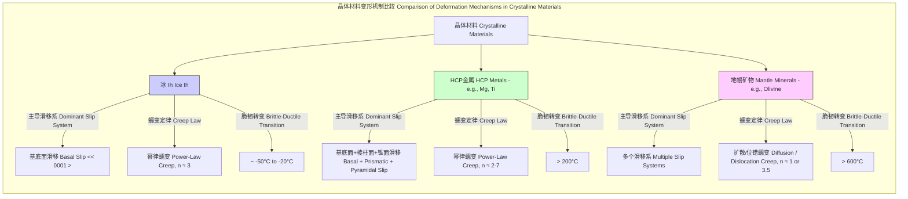

## 冰晶粒 (ice grain)

冰晶粒是指在多晶体冰（如冰川、冰盖或冰块）中存在的单个冰晶体。作为构成宏观冰体的基本单元，其微观结构、取向和相互作用决定了冰的整体物理和力学性质。对冰晶粒的研究在冰川学、材料科学、大气物理学和行星科学等领域至关重要。本文档将从科学和数学角度对冰晶粒进行全面的技术阐述。

### 核心概念及其数学基础

#### 晶体结构 (Crystal Structure)
地球上最常见的冰相是六方晶系的冰Ih（Hexagonal Ice）。其晶体结构由通过氢键连接的水分子（H₂O）网络构成。每个氧原子位于晶格点上，并与四个相邻的氢原子形成四面体配位。

冰Ih的晶格具有两个特征参数：
*   基底面内的晶格常数 $a$
*   垂直于基底面的晶格常数 $c$ (也称为c轴或光轴方向)

这种六方结构导致了冰晶粒显著的各向异性（anisotropy），即其物理性质（如力学强度、导热性、光學性质）在不同方向上有所不同。c轴是理解这种各向异性的关键。

#### 变形机制 (Deformation Mechanisms)
冰的塑性变形主要由晶体内的位错运动和晶粒间的相互作用控制。

1.  **位错蠕变 (Dislocation Creep):** 在应力作用下，晶体内的位错（线缺陷）在特定的晶体学平面（滑移面）上移动。对于冰Ih，最容易发生滑移的是**基底面 (basal plane)**，即垂直于c轴的平面。这种机制在低温和高应力下占主导地位。
2.  **晶界滑动 (Grain Boundary Sliding):** 在较高温度下，相邻的冰晶粒可以沿着它们的接触界面（晶界）相对滑动。

#### 格伦流动定律 (Glen's Flow Law)
这是一个描述多晶体冰的应力-应变率关系的经验本构方程，是冰川动力学模型的基础。该定律是一个幂律形式的蠕变方程：

$$
\dot{\varepsilon}_{ij} = A(T) \tau_e^{n-1} \tau_{ij}
$$

其中，等效形式常被简化为：

$$
\dot{\varepsilon} = A \tau^n
$$

为了包含温度依赖性，通常写成阿伦尼乌斯形式：

$$
\dot{\varepsilon} = A_0 \tau^n e^{-\frac{Q}{RT}}
$$

*   $\dot{\varepsilon}$：等效应变率 (effective strain rate)，单位是 s⁻¹ 或 a⁻¹ (每年)。
*   $\tau$：等效剪应力 (effective shear stress)，单位是 Pa 或 MPa。
*   $n$：应力指数 (stress exponent)，一个无量纲常数，对于冰的位错蠕变，通常取 $n \approx 3$。
*   $A$：流动参数 (flow parameter)，它依赖于温度、杂质含量和晶体结构。
*   $A_0$：一个预指数常数 (pre-exponential constant)。
*   $Q$：蠕变激活能 (activation energy for creep)，单位是 J/mol。表示克服位错运动或扩散障碍所需的能量。
*   $R$：理想气体常数 ($8.314 \, \text{J} \cdot \text{mol}^{-1} \cdot \text{K}^{-1}$)。
*   $T$：绝对温度 (absolute temperature)，单位是 K。

#### 施密德定律 (Schmid's Law)
该定律描述了在单轴应力下，启动晶体滑移所需的分切应力。它将宏观施加的应力与特定滑移系统上的微观应力联系起来。

$$
\tau_r = \sigma \cos(\phi) \cos(\lambda) = \sigma m
$$

*   $\tau_r$：分解剪应力 (resolved shear stress)，作用在滑移面和滑移方向上的剪应力。
*   $\sigma$：施加的单轴拉伸或压缩应力 (applied uniaxial stress)。
*   $\phi$：施加应力方向与滑移面法线之间的夹角。
*   $\lambda$：施加应力方向与滑移方向之间的夹角。
*   $m = \cos(\phi) \cos(\lambda)$：施密德因子 (Schmid factor)。其值范围从0到0.5。$m$ 值越大，该滑移系统越容易被激活。

对于冰Ih，基底面滑移的临界分解剪应力 ($\tau_{CRSS}$) 远低于其他滑移系统，因此冰的变形高度依赖于c轴相对于主应力轴的取向。

### 关键技术规格

下表列出了纯冰在-10°C (263.15 K) 时的典型物理和力学参数。

| 属性 (Property) | 单晶冰 (Single Crystal) | 多晶冰 (Polycrystalline) | 单位 (Unit) |
| :--- | :--- | :--- | :--- |
| 晶系 (Crystal System) | 六方 (Hexagonal, Ih) | - | - |
| 晶格常数 $a$ | 4.52 | - | Å (Ångström) |
| 晶格常数 $c$ | 7.37 | - | Å (Ångström) |
| 密度 (Density) | 918.7 | 917 | kg/m³ |
| 杨氏模量 $E$ | $E_{\parallel c} \approx 12.5$, $E_{\perp c} \approx 11.5$ | 9.5 | GPa |
| 剪切模量 $G$ | $G_{\parallel c} \approx 3.5$, $G_{\perp c} \approx 2.9$ | 3.6 | GPa |
| 泊松比 $\nu$ | 各向异性 | 0.33 | - |
| 导热系数 $\kappa$ | $\kappa_{\parallel c} \approx 2.33$, $\kappa_{\perp c} \approx 2.24$ | 2.2 | W/(m·K) |
| 格伦流动定律 $n$ | - | 3 | - |
| 格伦流动定律 $A_0$ | - | $2.4 \times 10^{-15}$ (for $\tau < 0.1$ MPa) | Pa⁻³ s⁻¹ |
| 蠕变激活能 $Q$ | - | 60 (for T > -10°C) | kJ/mol |

### 常见用例

*   **冰川学和冰盖动力学 (Glaciology and Ice Sheet Dynamics)**
    *   **描述:** 利用冰晶粒的集体行为（通过格伦流动定律）来模拟冰川和冰盖的流动，预测其对海平面上升的贡献。
    *   **量化性能指标:** 模型预测的冰流速与GPS或卫星雷达干涉测量（InSAR）观测数据的均方根误差（RMSE）通常在 5-10% 或 < 10 m/a 的量级。

*   **材料科学 (Materials Science)**
    *   **描述:** 将冰作为研究六方密堆（HCP）结构材料（如镁、钛、锌）在低温下蠕变行为的模型系统。
    *   **量化性能指标:** 实验室蠕变实验中，预测的应变率与测量值的偏差通常在 ±15% 以内。

*   **大气科学 (Atmospheric Science)**
    *   **描述:** 高空中悬浮的冰晶粒（卷云）通过对太阳光的散射和折射形成各种光学现象，如晕（halos）、幻日（sun dogs）等。晶粒的形状和取向决定了这些现象的几何特征。
    *   **量化性能指标:** 基于米氏散射或几何光学理论的计算，预测的 22° 晕的峰值强度位置与观测值的误差 < 0.5°。

### 实现考量

在数值模拟中，“实现”冰晶粒的行为通常涉及多尺度建模方法。

#### 宏观连续介质模型 (e.g., Finite Element Method - FEM)
用于模拟整个冰盖或冰川的流动。
*   **算法:** 将冰体离散为有限元网格，在每个单元上求解基于格伦流动定律的斯托克斯流动方程。
*   **算法复杂度:** 对于一个包含 $N$ 个节点的网格，求解线性方程组的复杂度通常在 $O(N \log N)$ 到 $O(N^2)$ 之间，具体取决于所用的求解器。

#### 微观晶体塑性模型 (e.g., VPSC - Visco-Plastic Self-Consistent)
用于模拟冰晶粒集合体（称为“组构”或“织构”，fabric）的演化。
*   **算法:**
    1.  将多晶体冰表示为大量（$10^3 - 10^4$）具有不同初始取向的晶粒集合。
    2.  在每个时间步，对宏观应力/应变场，根据施密德定律和流动定律计算每个晶粒的滑移和旋转。
    3.  通过自洽方案（self-consistent scheme）确保晶粒的响应与宏观平均场兼容。
    4.  更新每个晶粒的取向。
*   **算法复杂度:** $O(N_{grains} \times N_{steps} \times N_{systems})$，其中 $N_{grains}$ 是晶粒数量， $N_{steps}$ 是时间步数，$N_{systems}$ 是每个晶粒考虑的滑移系统数量。这是一个计算密集型任务。

```mermaid
graph TD
    subgraph "冰组构演化数值模拟流程 Numerical Simulation Workflow for Ice Fabric Evolution"
        A[输入: 初始几何, 边界条件, 初始组构] --> B有限元网格划分 FEM Meshing;
        B --> C[求解宏观场: 应力 & 应变率 Solve Macro Fields: Stress & Strain Rate];
        C -- "格伦流动定律 Glen's Flow Law" --> C;
        C --> D["晶体塑性计算 Crystal Plasticity Calculation - VPSC[";
        D -- "施密德定律 Schmid's Law" --> E[计算每个晶粒的滑移和旋转 Calculate Slip and Rotation for each Grain];
        E --> F[更新晶粒取向 Update Grain Orientations];
        F --> G更新宏观组构 Update Macroscopic Fabric;
        G --> H时间步推进 Advance Time Step;
        H -- "循环 Loop" --> C;
        H --> I[输出: 速度场, 温度场, 最终组构];
    end

    style C fill:#cde,stroke:#333
    style D fill:#fde,stroke:#333
```

### 性能特征

冰晶粒的统计特性对于理解宏观行为至关重要。

*   **晶粒尺寸分布 (Grain Size Distribution):**
    *   在天然冰（如冰芯）中，晶粒尺寸通常遵循对数正态分布。
    *   平均直径 $D$ 随深度（年龄）和温度增加而增大，范围从近表层的 < 1 mm 到深部冰中的 > 1 cm。
    *   统计测量：平均值 $\bar{D}$，标准差 $\sigma_D$。例如，南极Vostok冰芯在2500米深处的平均晶粒直径约为 5 mm，标准差为 2 mm。

*   **晶体优选定向 (Crystallographic Preferred Orientation - CPO / Fabric):**
    *   冰在持续应变下会形成非随机的晶粒取向分布，即组构。
    *   **描述方法:** 使用取向分布函数（ODF）或更简单的二阶取向张量 $a_{ij}$。
    *   **统计测量:** 取向张量的特征值 ($\lambda_1, \lambda_2, \lambda_3$)，满足 $\lambda_1 \ge \lambda_2 \ge \lambda_3$ 且 $\sum \lambda_i = 1$。
        *   **各向同性 (Isotropic):** $\lambda_1 \approx \lambda_2 \approx \lambda_3 \approx 1/3$。
        *   **强单极组构 (Strong Single Maximum):** c轴集中于一个方向，$\lambda_1 \gg \lambda_2, \lambda_3$ (e.g., $\lambda_1 > 0.8$)。这会导致流动显著增强。
        *   **环带组构 (Girdle Fabric):** c轴分布在一个平面上，$\lambda_1 \approx \lambda_2 \gg \lambda_3$ (e.g., $\lambda_3 < 0.1$)。

### 相关技术与比较

冰晶粒的行为可以与其他晶体材料进行比较，以揭示共同的物理原理和差异。



#### 数学模型比较

*   **冰 vs. HCP金属:** 冰的变形高度集中于基底面，使其成为一个理想的“简单”HCP模型。然而，金属中非基底面滑移的激活能较低，导致其在室温下具有更高的延展性。施密德定律同样适用于金属，但需要考虑多个临界分解剪应力值。
*   **冰 vs. 地幔矿物 (如橄榄石):** 两者都遵循高温蠕变定律。然而，地幔矿物在极高压力和温度下变形，其蠕变可能由扩散蠕变（Nabarro-Herring或Coble creep）主导，此时应力指数 $n=1$。其本构方程形式为：
    $$
    \dot{\varepsilon} = A_d \frac{D_{gb} \sigma}{d^p T}
    $$
    其中 $D_{gb}$ 是晶界扩散系数，$d$ 是晶粒尺寸，$p$ 是晶粒尺寸指数（通常为2或3）。这与冰中以位错运动为主的 $n=3$ 的幂律蠕变形成对比。

### 参考文献 (References)

1.  Glen, J. W. (1955). The creep of polycrystalline ice. *Proceedings of the Royal Society of London. Series A. Mathematical and Physical Sciences*, 228(1175), 519-538. DOI: `10.1098/rspa.1955.0074`
2.  Duval, P., Ashby, M. F., & Anderman, I. (1983). Rate-controlling processes in the creep of polycrystalline ice. *Journal of Physical Chemistry*, 87(21), 4066-4074. DOI: `10.1021/j100244a014`
3.  Pettit, E. C., & Waddington, E. D. (2003). Ice-crystal orientation variations in the Antarctic Vostok ice core. *Journal of Glaciology*, 49(165), 233-243. DOI: `10.3189/172756503781830799`
4.  Faria, S. H., et al. (2014). A review of the applications of the theory of fabric mechanics to ice sheets. *Annals of Glaciology*, 55(67), 103-124. DOI: `10.3189/2014AoG67A407`