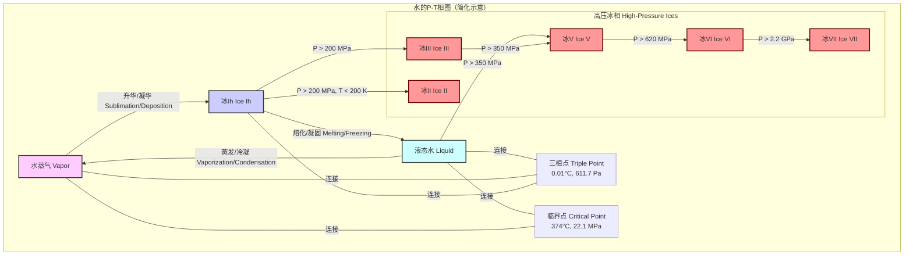
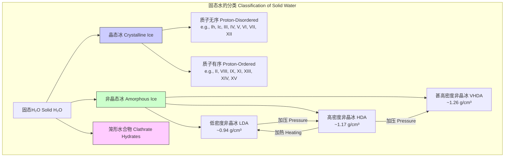

## 冰的多晶型体

冰的多晶型体（Ice Polymorphs）是指水（H₂O）在不同温度和压力条件下能够以多种不同的晶体结构存在的现象。这些不同的晶体形式被称为冰的“相”或“多晶型体”。每种多晶型体都具有独特的原子排列、晶格对称性和物理性质（如密度、弹性和光学特性）。截至2023年，已确认的冰的晶体形态已超过20种，它们通常用罗马数字（如冰I、冰II、冰III等）来命名。

对冰的多晶型体的研究不仅对于理解水这种地球上最重要物质的基本性质至关重要，而且在天体物理学（如研究冰行星和卫星的内部结构）、材料科学和高压物理学等领域也具有深远的影响。

### 核心概念与数学基础

冰的多晶型体之间的转变是由热力学定律决定的，其核心在于系统在给定条件下寻求最低的吉布斯自由能。

#### 吉布斯自由能 (Gibbs Free Energy)

在恒定温度（T）和压力（P）下，一个热力学系统的稳定性由其吉布斯自由能（G）决定。系统会自发地向G最低的状态转变。吉布斯自由能的定义为：

$$ G = H - TS = U + PV - TS $$

其中：
*   $G$ 是吉布斯自由能（单位：焦耳，J）。
*   $H$ 是焓（Enthalpy），表示系统的总能量含量（J）。
*   $T$ 是绝对温度（单位：开尔文，K）。
*   $S$ 是熵（Entropy），表示系统的无序度或混乱度（J/K）。
*   $U$ 是内能（Internal Energy），系统内部所有形式能量的总和（J）。
*   $P$ 是压力（单位：帕斯卡，Pa）。
*   $V$ 是体积（单位：立方米，m³）。

对于冰的两种不同多晶型体（例如，相$\alpha$和相$\beta$），在给定的P和T下，吉布斯自由能较低的相是更稳定的相。当$G_{\alpha} = G_{\beta}$时，两相达到平衡，这定义了它们之间的相变边界。

#### 相图 (Phase Diagram)

冰的相图是在压力-温度（P-T）坐标系中表示不同冰相稳定存在区域的图。图中的线代表两种或三种相共存的条件。

#### 克劳修斯-克拉佩龙方程 (Clausius-Clapeyron Equation)

该方程描述了在P-T相图上，两相平衡线（共存曲线）的斜率。它将相变过程中的宏观量（压强、温度）与微观量（焓变、体积变）联系起来。

$$ \frac{dP}{dT} = \frac{\Delta H_{trans}}{T \Delta V_{trans}} $$

其中：
*   $\frac{dP}{dT}$ 是共存曲线上压力随温度的变化率，即曲线的斜率。
*   $\Delta H_{trans}$ 是相变过程的摩尔焓变（或潜热）（J/mol）。
*   $T$ 是发生相变的绝对温度（K）。
*   $\Delta V_{trans}$ 是相变过程的摩尔体积变化（m³/mol）。

例如，对于冰Ih熔化为液态水，$\Delta V_{trans} = V_{liquid} - V_{ice}$ 是负值（冰的密度小于水），因此其熔化曲线的斜率为负，这解释了为什么对冰施加压力会使其熔点降低。对于大多数高压冰相，$\Delta V_{trans}$ 为正，因此它们的熔化曲线斜率为正。

### 关键技术规格

下表总结了一些主要冰多晶型体的关键物理参数。数据是在其稳定或亚稳定区域内测得的典型值。

| 冰相 (Ice Phase) | 晶系 (Crystal System) | 空间群 (Space Group) | 稳定性条件 (P, T) | 密度 (g/cm³) (在指定P, T下) | 氢键状态 (H-bond State) |
| :--- | :--- | :--- | :--- | :--- | :--- |
| **冰Ih** | 六方 (Hexagonal) | P6₃/mmc | < 0.2 GPa, ~273 K | 0.917 (在0.1 MPa, 273 K) | 质子无序 (Proton-disordered) |
| **冰Ic** | 立方 (Cubic) | Fd-3m | 亚稳态, < 140 K | 0.92 (在0.1 MPa, 110 K) | 质子无序 (Proton-disordered) |
| **冰II** | 三角 (Trigonal) | R-3 | 0.2 - 0.35 GPa, 190-250 K | 1.16 (在0.25 GPa, 198 K) | 质子有序 (Proton-ordered) |
| **冰III** | 四方 (Tetragonal) | P4₁2₁2 | 0.2 - 0.35 GPa, 250-260 K | 1.16 (在0.3 GPa, 250 K) | 质子无序 (Proton-disordered) |
| **冰V** | 单斜 (Monoclinic) | A2/a | 0.35 - 0.62 GPa, 250-270 K | 1.23 (在0.5 GPa, 250 K) | 质子无序 (Proton-disordered) |
| **冰VI** | 四方 (Tetragonal) | P4₂/nmc | 0.62 - 2.2 GPa, 270-355 K | 1.31 (在0.6 GPa, 225 K) | 质子无序 (Proton-disordered) |
| **冰VII** | 立方 (Cubic) | Pn-3m | > 2.2 GPa, > 300 K | 1.65 (在2.5 GPa, 298 K) | 质子无序 (Proton-disordered) |
| **冰VIII** | 四方 (Tetragonal) | I4₁/amd | > 2 GPa, < 273 K | 1.66 (在2.4 GPa, 100 K) | 质子有序 (Anti-ferroelectric) |
| **冰XI** | 正交 (Orthorhombic) | Cmc2₁ | < 72 K (亚稳态) | 0.92 (在0.1 MPa, 60 K) | 质子有序 (Ferroelectric) |
| **冰XV** | 单斜 (Monoclinic) | P-1 | 0.8 - 1.5 GPa, < 130 K | 1.30 (在1.1 GPa, 80 K) | 质子有序 (Anti-ferroelectric) |

### 常见用例与定量性能指标

冰的多晶型体主要出现在自然界的极端环境和实验室研究中。

*   **天体物理学与行星科学**:
    *   **应用**: 木星的卫星欧罗巴（Europa）和土星的卫星恩克拉多斯（Enceladus）等冰卫星的内部结构模型。这些卫星的冰壳下可能存在液态水海洋，而海洋底部则与高压冰相（如冰III、冰V或冰VI）接触。
    *   **定量指标**: 欧罗巴冰壳底部的压力估计约为 130 MPa，这处于冰Ih的稳定范围。但在更深的内部，如木卫三（Ganymede），其核心周围的压力可达数 GPa，足以形成冰VI和冰VII。这些冰相的密度和流变学性质（如粘度）决定了行星内部的物质循环和热传递。

*   **地球科学**:
    *   **应用**: 尽管地球表面主要是冰Ih，但在地幔深处，水可能以高压冰相（如冰VII）的形式被锁在矿物中。冰VII的发现（作为金刚石的包裹体）表明，在地球深处（>600 km）存在液态水。
    *   **定量指标**: 地球过渡带（410-660 km深度）的压力范围为 13.5 - 23.9 GPa，温度为 1700-1900 K。在这个区域，水可能以冰VII或超离子冰的形式存在。

*   **材料科学与物理化学**:
    *   **应用**: 研究氢键网络的复杂性、相变动力学以及物质在极端条件下的行为。
    *   **定量指标**: 通过金刚石对顶砧（Diamond Anvil Cell）技术，可以在实验室中产生超过 100 GPa 的压力，系统地研究冰的相变路径和新冰相的合成。例如，从冰VI到冰XV的质子有序化转变发生在约 130 K 以下，转变的焓变约为 $\Delta H = -0.34 \pm 0.02$ kJ/mol。

### 实现考量与算法复杂度

对冰多晶型体的理论研究严重依赖于计算模拟方法，这些方法用于预测晶体结构、计算自由能和模拟相变过程。

*   **分子动力学 (Molecular Dynamics, MD)**:
    *   **描述**: MD通过求解牛顿运动方程来模拟原子和分子的运动。通过对大量粒子（$10^3$ 到 $10^6$）在一段时间内的轨迹进行积分，可以计算出体系的宏观热力学性质。
    *   **用途**: 模拟相变动力学、计算扩散系数、热导率等。
    *   **算法复杂度**: 对于一个包含 $N$ 个原子的系统，计算原子间相互作用力是主要瓶颈。使用截断半径的短程势，并通过邻居列表（Neighbor List）优化，其复杂度约为 $O(N)$。对于包含长程静电相互作用的系统，使用粒子网格Ewald（PME）等方法，复杂度为 $O(N \log N)$。

*   **密度泛函理论 (Density Functional Theory, DFT)**:
    *   **描述**: DFT是一种基于量子力学的从头计算方法，通过求解Kohn-Sham方程来确定系统的电子基态能量和电子密度。
    *   **用途**: 精确计算不同冰相的晶格结构、结合能、弹性常数和声子谱，从而确定其相对稳定性。
    *   **算法复杂度**: 传统DFT的计算量随系统中的电子数 $N_e$（或原子数 $N$）的增加而急剧增长，通常为 $O(N_e^3)$ 或 $O(N^3)$。这限制了其只能用于几百个原子的小系统。线性标度DFT方法（$O(N)$）正在发展中，但应用尚不广泛。

### 性能特征与统计度量

不同冰相的物理性质差异显著，这些性质可以通过实验测量或理论计算得到。

*   **可压缩性 (Compressibility)**:
    *   描述物质在压力下体积变化的难易程度，通常用体积模量（Bulk Modulus, $K$）来衡量。
    *   **数学定义**: $$ K = -V \left( \frac{\partial P}{\partial V} \right)_T $$
    *   **数据**:
        *   冰Ih: $K \approx 9$ GPa
        *   冰VI: $K \approx 14$ GPa
        *   冰VII: $K \approx 25$ GPa (在2.5 GPa时)
    *   **统计**: 实验测量的体积模量通常带有不确定性，例如，冰VII在2.2 GPa下的体积模量 $K_0$ 及其压力导数 $K_0'$ 分别为 $23.8 \pm 0.7$ GPa 和 $4.3 \pm 0.1$。

*   **热膨胀 (Thermal Expansion)**:
    *   描述物质体积随温度变化的程度，用热膨胀系数（$\alpha_V$）表示。
    *   **数学定义**: $$ \alpha_V = \frac{1}{V} \left( \frac{\partial V}{\partial T} \right)_P $$
    *   **特性**: 冰Ih在低于70 K时表现出反常的负热膨胀（即冷却时膨胀）。大多数高压冰相具有正常的正热膨胀系数。

### 相关技术与比较数学模型

冰的多晶型体是固态水家族的一部分，与其他形式的固态水（如非晶冰）和相关化合物（如笼形水合物）既有联系又有区别。

*   **非晶态冰 (Amorphous Ice)**:
    *   **对比**: 与晶态冰不同，非晶冰没有长程有序的晶体结构。它是一种玻璃态物质。
    *   **模型**: 非晶冰存在多种密度不同的形式，如低密度非晶冰（LDA）、高密度非晶冰（HDA）和甚高密度非晶冰（VHDA）。它们之间的转变被认为是玻璃态物质中多晶型现象（polyamorphism）的典型例子。

*   **笼形水合物 (Clathrate Hydrates)**:
    *   **对比**: 这是一种主客体化合物，其中水分子形成一个三维笼状结构，将客体分子（如甲烷CH₄、二氧化碳CO₂）包裹在其中。
    *   **模型**: 其稳定性不仅取决于P-T条件，还取决于客体分子的存在和性质。其相图比纯水冰更为复杂。其稳定性可以用van der Waals-Platteeuw模型来描述，该模型计算客体分子填充笼子对稳定化自由能的贡献。

## 参考文献

1.  Petrenko, V. F., & Whitworth, R. W. (1999). *Physics of Ice*. Oxford University Press.
2.  Salzmann, C. G., Kohl, I., Loerting, T., Mayer, E., & Hallbrucker, A. (2002). Pure ices IV and XII from high-density amorphous ice. *Canadian Journal of Physics*, 81(1-2), 25-32. DOI: `10.1139/p02-071`
3.  Bartels-Rausch, T., Bergeron, V., Cartwright, J. H. E., Escribano, R., Finney, J. L., Grothe, H., ... & Rosu-Finsen, A. (2012). Ice structures, patterns, and processes: A view across the icefields. *Reviews of Modern Physics*, 84(2), 885. DOI: `10.1103/RevModPhys.84.885`
4.  Salzmann, C. G. (2019). Advances in the experimental exploration of the phase diagram of water. *The Journal of Chemical Physics*, 150(6), 060901. DOI: `10.1063/1.5085163`
5.  Bridgman, P. W. (1912). Water, in the liquid and five solid forms, under pressure. *Proceedings of the American Academy of Arts and Sciences*, 47(13), 441-558. DOI: `10.2307/20022753`