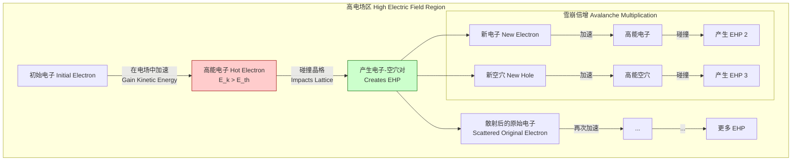

## 碰撞电离

碰撞电离（Impact Ionization）是一种在高电场作用下，半导体或绝缘体中的载流子（电子或空穴）获得足够高的动能，通过碰撞将价带中的束缚电子激发到导带，从而产生新的电子-空穴对（EHP）的过程。这个过程是载流子倍增的基础，也是雪崩击穿（Avalanche Breakdown）现象的核心机制。

### 1. 核心概念与数学基础

当一个载流子在电场 $E$ 中运动时，它会不断加速并获得能量。同时，它也会通过与晶格原子（声子）的碰撞而损失能量。如果电场足够强，使得载流子在两次碰撞之间获得的能量大于其损失的能量，其平均动能就会增加。当一个载流子的动能超过某个**电离阈值能量** $E_{th}$ 时，它就有可能通过一次非弹性碰撞，将其部分能量传递给价带电子，使其跃迁到导带，从而产生一个新的电子和一个新的空穴。

这个新产生的电子-空穴对自身也可以在电场中被加速，并可能引发进一步的碰撞电离事件。这个链式反应导致载流子数量呈指数级增长，形成所谓的“雪崩效应”。

#### 电离系数 (Ionization Coefficient)

为了量化碰撞电离的效率，我们引入了电离系数的概念。电子电离系数 $\alpha_n$ 和空穴电离系数 $\beta_p$ 分别定义为单个电子或空穴在沿电场方向移动单位距离时，所产生的电子-空穴对的平均数量。它们的单位通常是 cm⁻¹。

电离系数强烈依赖于电场强度 $E$ 和材料特性。一个被广泛接受的经验模型是 Chynoweth 定律：

$$
\alpha_n(E) = A_n \cdot \exp\left(-\frac{B_n}{E}\right)
$$

$$
\beta_p(E) = A_p \cdot \exp\left(-\frac{B_p}{E}\right)
$$

其中：
*   $E$：电场强度 (V/cm)。
*   $\alpha_n, \beta_p$：分别为电子和空穴的电离系数 (cm⁻¹)。
*   $A_n, A_p$：材料相关的饱和电离系数常数 (cm⁻¹)，与载流子的平均自由程和碰撞截面有关。
*   $B_n, B_p$：材料相关的临界电场常数 (V/cm)，与电离阈值能量 $E_{th}$ 和平均自由程有关，大致上 $B \propto E_{th}$。

这个公式的物理意义是，指数项 $\exp(-B/E)$ 代表了一个载流子在两次散射之间能够获得足以引发电离的阈值能量的概率。电场 $E$ 越大，这个概率就越高。

#### 电离阈值能量 ($E_{th}$)

电离阈值能量是启动碰撞电离所需的最小动能。一个简单的估算是 $E_{th} \approx 1.5 E_g$，其中 $E_g$ 是半导体的禁带宽度。这个估算基于能量和动量守恒定律，但实际值会更复杂，并依赖于能带结构。

下图描述了碰撞电离和雪崩倍增的基本过程。

### 2. 关键技术规格

不同半导体材料的碰撞电离特性差异很大，这直接影响了基于这些材料的器件的性能和击穿电压。下表列出了一些常见半导体在 300 K 时的关键参数。

| 参数 | 符号 | 硅 (Si) | 锗 (Ge) | 砷化镓 (GaAs) | 氮化镓 (GaN) | 碳化硅 (4H-SiC) | 单位 |
| :--- | :--- | :--- | :--- | :--- | :--- | :--- | :--- |
| 禁带宽度 | $E_g$ | 1.12 | 0.66 | 1.42 | 3.4 | 3.26 | eV |
| 电子电离阈值能量 | $E_{th,n}$ | ~3.6 | ~1.5 | ~2.0 | ~5.8 | ~5.0 | eV |
| 空穴电离阈值能量 | $E_{th,p}$ | ~5.0 | ~1.5 | ~2.0 | ~6.1 | ~5.1 | eV |
| 电子Chynoweth常数A | $A_n$ | 7.03 × 10⁵ | 1.55 × 10⁷ | 2.96 × 10⁵ | 2.7 × 10⁶ | 1.66 × 10⁷ | cm⁻¹ |
| 电子Chynoweth常数B | $B_n$ | 1.23 × 10⁶ | 1.56 × 10⁶ | 6.85 × 10⁵ | 3.4 × 10⁷ | 2.08 × 10⁷ | V/cm |
| 空穴Chynoweth常数A | $A_p$ | 6.71 × 10⁵ | 1.0 × 10⁷ | 2.21 × 10⁵ | 2.7 × 10⁶ | 3.26 × 10⁶ | cm⁻¹ |
| 空穴Chynoweth常数B | $B_p$ | 2.04 × 10⁶ | 1.28 × 10⁶ | 6.57 × 10⁵ | 3.4 × 10⁷ | 1.69 × 10⁷ | V/cm |
| 临界击穿场强 | $E_{crit}$ | ~3 × 10⁵ | ~1 × 10⁵ | ~4 × 10⁵ | ~3.3 × 10⁶ | ~2.5 × 10⁶ | V/cm |

*注意：这些数值是典型值，会因晶体取向、温度和掺杂浓度的不同而略有变化。*

### 3. 常见用例与性能指标

碰撞电离既可以被利用于器件设计中，也可能是导致器件失效的有害因素。

*   **雪崩光电二极管 (Avalanche Photodiodes, APDs)**
    *   **用途**：用于微弱光信号检测的高速、高灵敏度光电探测器，广泛应用于光纤通信、激光雷达（LIDAR）和量子密码学。
    *   **原理**：利用碰撞电离实现内部电流增益。单个入射光子产生一个电子-空穴对，这些初始载流子在 APD 的高场区（倍增区）被加速，通过链式碰撞电离产生大量次级载流子，从而将微弱的光电流放大。
    *   **性能指标**：
        *   **增益 (Gain, M)**：输出光电流与初始光电流之比。典型值范围为 10 到 1000。增益可以通过 Miller 积分公式计算：
            $$ M = \frac{1}{1 - \int_{0}^{W} \alpha_n(x) \exp\left[-\int_{0}^{x} (\alpha_n(x') - \beta_p(x')) dx'\right] dx} $$
            其中 $W$ 是倍增区的宽度。在一个仅由电子引发电离的理想情况下 ($\beta_p=0$)，公式简化为：
            $$ M_n = \frac{1}{1 - \int_{0}^{W} \alpha_n(x) dx} $$
        *   **增益-带宽积 (Gain-Bandwidth Product, GBP)**：通常为几百 GHz。

*   **碰撞电离雪崩渡越时间二极管 (IMPATT Diodes)**
    *   **用途**：产生微波和毫米波信号的固态功率源。
    *   **原理**：通过设计，使得雪崩倍增产生的电流峰值相对于射频电压峰值有大约 90° 的延迟，同时载流子渡越倍增区和漂移区又引入了额外的 90° 延迟。总共约 180° 的相移产生了负阻效应，从而可以将直流功率转换为射频功率。
    *   **性能指标**：
        *   **输出功率**：在 GHz 频段可达数瓦。
        *   **效率**：典型值为 10% - 30%。

*   **晶体管中的击穿与退化**
    *   **影响**：在 MOSFETs 和 BJTs 等晶体管中，碰撞电离通常是一种有害效应。在高漏极电压下，沟道中的高电场会引发碰撞电离。
    *   **现象**：
        *   **雪崩击穿**：导致漏极电流急剧增加，可能永久性损坏器件。
        *   **衬底电流 ($I_{sub}$)**：产生的空穴（在 n-MOSFET 中）被收集到衬底，形成衬底电流，这会增加功耗并可能触发寄生的闩锁效应。
        *   **热载流子注入 (Hot-Carrier Injection, HCI)**：高能载流子可能注入到栅氧化层中，产生界面态或陷阱电荷，导致器件阈值电压漂移、跨导下降等性能退化问题。

### 4. 实现考量与算法分析

在半导体器件仿真（TCAD）中，精确地对碰撞电离建模至关重要。

*   **漂移-扩散模型中的实现**
    碰撞电离被作为一个载流子生成项 $G_{ii}$ 添加到电子和空穴的连续性方程中：
    $$ \frac{\partial n}{\partial t} = \frac{1}{q} \nabla \cdot \vec{J}_n + (G-R) + G_{ii} $$
    $$ \frac{\partial p}{\partial t} = -\frac{1}{q} \nabla \cdot \vec{J}_p + (G-R) + G_{ii} $$
    其中，碰撞电离生成率 $G_{ii}$ 由下式给出：
    $$ G_{ii} = \alpha_n \frac{|\vec{J}_n|}{q} + \beta_p \frac{|\vec{J}_p|}{q} $$
    *   $n, p$：电子和空穴浓度。
    *   $\vec{J}_n, \vec{J}_p$：电子和空穴电流密度。
    *   $q$：基本电荷。
    *   $(G-R)$：其他生成-复合项（如 SRH 复合、光生等）。

*   **算法复杂度分析**
    *   **局部场模型**：像 Chynoweth 定律这样的模型是“局部”的，即电离系数仅取决于该点的局部电场强度。求解包含此模型的非线性偏微分方程组通常采用有限元或有限体积法进行离散化，然后通过牛顿迭代法等数值方法求解。其计算复杂度通常为 $O(N^k)$，其中 $N$ 是网格节点数，$k$ 通常在 1.5 到 2 之间，计算成本高昂。
    *   **非局部场模型**：在尺寸缩小的现代器件中，载流子可能在飞越一个高场区时还来不及获得足够的能量（即存在“死区”，dead space）。局部场模型会高估电离率。因此，需要更复杂的非局部模型，这些模型考虑了载流子的能量输运历史。这通常需要求解额外的能量平衡方程，进一步增加了计算的复杂性。

### 5. 性能特征与统计度量

*   **温度依赖性**
    *   碰撞电离系数随着温度的升高而**减小**。
    *   **原因**：温度升高导致晶格振动（声子散射）加剧。载流子与声子的碰撞更加频繁，使得它们在两次碰撞之间从电场中积累能量变得更加困难。因此，需要更高的电场才能达到电离阈值能量。
    *   **宏观表现**：雪崩击穿电压 $V_{BR}$ 具有**正温度系数**。即温度越高，击穿电压越高。这使得雪崩击穿器件相对稳定，不易发生热失控。

*   **过剩噪声因子 (Excess Noise Factor, F)**
    *   雪崩倍增是一个随机（泊松）过程，因此它会引入额外的噪声，这被称为过剩噪声。
    *   **度量**：过剩噪声因子 $F$ 量化了这种额外噪声。根据 McIntyre 的理论，对于由一种载流子注入的倍增过程，$F$ 可以表示为：
        $$ F(M) = k_{eff} M + \left(1 - k_{eff}\right) \left(2 - \frac{1}{M}\right) $$
    *   **参数定义**:
        *   $M$：增益。
        *   $k_{eff}$：电子和空穴电离系数之比，即 $k_{eff} = \beta_p / \alpha_n$（对于电子注入）或 $k_{eff} = \alpha_n / \beta_p$（对于空穴注入）。$k_{eff}$ 的取值范围是 0 到 1。
    *   **物理意义**：当 $k_{eff}$ 接近 0 时（即一种载流子的电离能力远大于另一种），倍增过程更有序，噪声更低。此时 $F(M) \approx 2$。当 $k_{eff}$ 接近 1 时（两种载流子电离能力相当），反馈回路更强，倍增过程的随机性更大，导致噪声急剧增加，此时 $F(M) \approx M$。
    *   **材料影响**：硅（Si）的 $k_{eff}$ 很小（约 0.02-0.1），因此硅 APD 具有优异的低噪声特性。而锗（Ge）和许多 III-V 族材料的 $k_{eff}$ 接近 1，导致其 APD 噪声较大。

### 6. 相关技术与比较模型

碰撞电离导致的雪崩击穿需要与另一种重要的击穿机制——齐纳击穿进行比较。

```mermaid
graph TD
    subgraph "半导体击穿机制 Semiconductor Breakdown Mechanisms"
        direction LR
        Avalanche["雪崩击穿 Avalanche Breakdown"];
        Zener["齐纳击穿 Zener Breakdown"];
    end

    subgraph "雪崩特性"
        A_Mechanism["机制: 碰撞电离<br>Mechanism: Impact Ionization"];
        A_Condition["条件: 中/低掺杂, 宽耗尽区<br>Condition: Light/Med Doping, Wide Depletion Region"];
        A_Field["电场: 相对较低 ~10^5 V/cm<br>Field: Lower ~10^5 V/cm"];
        A_Temp["温度系数: 正<br>Temp. Coeff.: Positive V_BR ↑ as T ↑"];
        A_Model["模型: Chynoweth 定律<br>Model: α ~ exp-B/E"];
    end

    subgraph "齐纳特性"
        Z_Mechanism["机制: 带间隧穿<br>Mechanism: Band-to-Band Tunneling"];
        Z_Condition["条件: 重掺杂, 极窄耗尽区<br>Condition: Heavy Doping, Narrow Depletion Region"];
        Z_Field["电场: 极高 >10^6 V/cm<br>Field: Higher >10^6 V/cm"];
        Z_Temp["温度系数: 负<br>Temp. Coeff.: Negative V_BR ↓ as T ↑"];
        Z_Model["模型: Kane 模型<br>Model: G_BTBT ~ E^2 * exp-B/E"];
    end

    Avalanche -- "核心物理过程" --> A_Mechanism;
    Avalanche -- "发生条件" --> A_Condition;
    Avalanche -- "所需场强" --> A_Field;
    Avalanche -- "温度效应" --> A_Temp;
    Avalanche -- "数学描述" --> A_Model;

    Zener -- "核心物理过程" --> Z_Mechanism;
    Zener -- "发生条件" --> Z_Condition;
    Zener -- "所需场强" --> Z_Field;
    Zener -- "温度效应" --> Z_Temp;
    Zener -- "数学描述" --> Z_Model;

    style Avalanche fill:#cceeff,stroke:#003366
    style Zener fill:#ffccdd,stroke:#660033
```

#### 雪崩击穿 vs. 齐纳击穿

*   **物理机制**:
    *   **雪崩击穿**: 高能载流子碰撞产生电子-空穴对，引发链式反应。
    *   **齐纳击穿**: 在极高的电场下，价带电子通过量子隧穿效应直接穿过禁带到达导带。

*   **发生条件**:
    *   **雪崩击穿**: 主要发生在掺杂浓度较低、耗尽区较宽的 PN 结中。击穿电压通常较高（> 6V for Si）。
    *   **齐纳击穿**: 主要发生在重掺杂、耗尽区极窄（< 10 nm）的 PN 结中。击穿电压通常较低（< 4V for Si）。
    *   在 4V 到 6V 之间，两种机制可能同时存在。

*   **温度系数**:
    *   **雪崩击穿**: 正温度系数。温度升高，声子散射增强，载流子更难获得能量，击穿电压升高。
    *   **齐纳击穿**: 负温度系数。温度升高，禁带宽度 $E_g$ 减小，隧穿势垒降低，隧穿更容易发生，击穿电压降低。

*   **数学模型**:
    *   **雪崩击穿**: 由电离系数 $\alpha(E)$ 和 $\beta(E)$ 描述。
    *   **齐纳击穿**: 由带间隧穿生成率 $G_{BTBT}$ 描述，其典型模型（如 Kane 模型）为：
        $$ G_{BTBT} = A_{K} E^2 \exp\left(-\frac{B_{K}}{E}\right) $$
        注意其与 Chynoweth 定律在电场依赖性上的差异。

### 7. 参考文献

1.  Chynoweth, A. G. (1958). "Ionization Rates for Electrons and Holes in Silicon". *Physical Review*, 109(5), 1537–1540. DOI: [10.1103/PhysRev.109.1537](https://doi.org/10.1103/PhysRev.109.1537)
2.  McIntyre, R. J. (1966). "Multiplication Noise in Uniform Avalanche Diodes". *IEEE Transactions on Electron Devices*, 13(1), 164–168. DOI: [10.1109/T-ED.1966.15651](https://doi.org/10.1109/T-ED.1966.15651)
3.  Sze, S. M., & Ng, K. K. (2007). *Physics of Semiconductor Devices* (3rd ed.). John Wiley & Sons. (This is a foundational textbook covering the topic in detail).
4.  Kane, E. O. (1959). "Theory of Tunneling". *Journal of Applied Physics*, 32(1), 83-91. DOI: [10.1063/1.1735965](https://doi.org/10.1063/1.1735965)