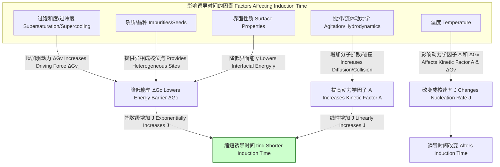

## 诱导时间

诱导时间（Induction Time），在科学和工程领域中，指的是一个物理或化学过程从初始状态到其变化可被明确检测到之间所经过的延迟时间。它不是一个瞬时事件，而是一个表征系统从亚稳态（metastable state）向更稳定的状态转变所需准备时间的宏观参数。诱导时间广泛存在于结晶、聚合、燃烧、腐蚀和生物过程等众多现象中。

### 1. 核心概念与数学基础

诱导时间的核心是系统需要克服一个或多个能垒才能启动宏观转变。这个延迟的根源在于新相的形成（如晶核）、关键中间产物的积累或分子构象的重排等微观事件。

#### 1.1 亚稳态与成核
一个系统可以长时间处于亚稳态，尽管存在一个能量上更有利的稳定状态。例如，在低于熔点的温度下，纯净的液态水（过冷水）就是一个亚稳态，而固态冰是其稳定态。从液态到固态的转变需要形成足够大小的稳定晶核（critical nucleus）。诱导时间在很大程度上就是形成这些稳定晶核所需的时间。

#### 1.2 经典成核理论 (Classical Nucleation Theory, CNT)
经典成核理论为理解诱导时间提供了数学框架。该理论认为，新相（如晶核）的形成涉及两个相互竞争的能量项：体积自由能的降低和界面能的增加。

一个半径为 $r$ 的球形晶核形成时的吉布斯自由能变化 $\Delta G(r)$ 为：
$$ \Delta G(r) = -\frac{4}{3}\pi r^3 \Delta G_v + 4\pi r^2 \gamma $$
其中：
*   $r$ 是晶核的半径 (m)。
*   $\Delta G_v$ 是单位体积的相变驱动力（吉布斯自由能变化），单位为 J/m³。对于结晶过程，它与过饱和度或过冷度成正比。
*   $\gamma$ 是新相与母相之间的界面能（表面张力），单位为 J/m²。

此函数存在一个最大值，即成核能垒 $\Delta G_c$，对应的晶核半径为临界半径 $r_c$。
$$ r_c = \frac{2\gamma}{\Delta G_v} $$
$$ \Delta G_c = \frac{16\pi\gamma^3}{3(\Delta G_v)^2} $$

只有当晶核的半径大于 $r_c$ 时，它才能稳定存在并继续生长。系统需要通过热涨落等随机过程克服 $\Delta G_c$ 这个能垒。

#### 1.3 成核速率与诱导时间
单位时间、单位体积内形成稳定晶核的速率 $J$（成核速率）可以表示为阿伦尼乌斯型方程：
$$ J = A \exp\left(-\frac{\Delta G_c}{k_B T}\right) $$
其中：
*   $J$ 是成核速率 (m⁻³s⁻¹)。
*   $A$ 是指前因子，与分子扩散、碰撞频率等动力学因素有关。
*   $k_B$ 是玻尔兹曼常数 (1.38 × 10⁻²³ J/K)。
*   $T$ 是绝对温度 (K)。

诱导时间 $t_{ind}$ 通常被认为与成核速率 $J$ 和系统体积 $V$ 成反比，因为需要一定时间才能在体积 $V$ 内形成一个或多个可探测的晶核。一个简单的关系式为：
$$ t_{ind} \propto \frac{1}{JV} $$
这个关系表明，任何降低成核能垒 $\Delta G_c$ 或增加指前因子 $A$ 的因素（如增加过饱和度、引入晶种、搅拌等）都会显著缩短诱导时间。



### 2. 关键技术指标

诱导时间的值对具体系统和条件高度敏感。下表列出了一些典型过程中的诱导时间及其测量条件。

| 过程/系统 (Process/System) | 条件 (Conditions) | 诱导时间 ($t_{ind}$) | 测量技术 (Measurement Technique) |
| :--- | :--- | :--- | :--- |
| 碳酸钙 (CaCO₃) 沉淀 | 25°C, 过饱和度 S=10 | 5 - 20 min | 浊度法 (Turbidimetry) |
| 聚醚醚酮 (PEEK) 结晶 | 从 380°C 冷却至 300°C | ~ 150 s | 差示扫描量热法 (DSC) |
| 甲烷-空气混合物点燃 | 1000 K, 1 atm | 1 - 10 ms | 激波管 (Shock Tube) / 激光诱导荧光 (LIF) |
| 蛋白质 (溶菌酶) 结晶 | 20 mg/mL, pH 4.5, 4% NaCl | 几小时到几天 | 动态光散射 (DLS) / 显微镜 |
| 水合物形成 (CH₄-H₂O) | 277 K, 7 MPa, 搅拌 | 30 min - 10 h | 压力-温度监测 (P-T Monitoring) |

### 3. 常见用例与性能指标

控制诱导时间在工业生产和科学研究中至关重要。

*   **制药工业**:
    *   **应用**: 控制活性药物成分 (API) 的结晶过程，以获得特定的晶型（polymorph）和粒径分布 (CSD)。
    *   **性能指标**: 晶型纯度 > 99.9%；粒径分布的相对标准偏差 (RSD) < 20%。较短的 $t_{ind}$ 通常导致大量小晶体，而较长的 $t_{ind}$ 有利于生长出少量大晶体。

*   **材料科学**:
    *   **应用**: 在聚合物加工中，控制结晶速率以调节材料的机械性能（如强度、韧性）。
    *   **性能指标**: 结晶度 (degree of crystallinity) 达到目标值 (例如 30-40%)；拉伸强度 > 90 MPa。

*   **化学工程**:
    *   **应用**: 防止换热器和管道中的结垢（scaling）。目标是最大化诱导时间，以延长设备运行周期。
    *   **性能指标**: 结垢速率 < 0.1 mm/年；设备在线时间 > 98%。

*   **燃烧科学**:
    *   **应用**: 在内燃机和燃气轮机中，点火延迟时间（一种诱导时间）是关键参数。
    *   **性能指标**: 优化点火延迟以提高燃烧效率并降低NOx等污染物的生成。例如，在HCCI发动机中，点火正时控制在压缩冲程顶部死点后 5-10 个曲轴转角内。

### 4. 实现考量与算法分析

"实现"在此处指诱导时间的实验测量和计算模拟。

#### 4.1 实验测量方法
测量诱导时间通常涉及监测一个与新相形成相关的物理量随时间的变化。
*   **光学方法**: 如浊度法、动态光散射 (DLS)，通过检测体系中颗粒散射强度的突然增加来确定 $t_{ind}$。
*   **热学方法**: 如差示扫描量热法 (DSC)，通过检测相变释放的潜热（放热峰）来确定 $t_{ind}$。
*   **光谱方法**: 如拉曼光谱、红外光谱，通过监测特定化学键或晶格振动模式的出现来确定 $t_{ind}$。
*   **直接观测**: 使用光学显微镜或电子显微镜直接观察到第一个稳定晶核的出现。

#### 4.2 计算模拟方法
模拟成核等随机过程对于从分子层面理解诱导时间至关重要。
*   **分子动力学 (Molecular Dynamics, MD)**:
    *   **方法**: 直接模拟原子和分子的运动轨迹，可以“看到”成核的发生。但由于时间尺度限制，通常只能用于高过饱和度下的快速成核。
    *   **算法复杂度**: 对于N个粒子系统，使用截断半径的复杂度为 $O(N^2)$，使用粒子网格Ewald (PME) 等远场算法后可优化至 $O(N \log N)$。
*   **蒙特卡洛 (Monte Carlo, MC) 方法**:
    *   **方法**: 通过随机抽样探索系统的相空间。为了克服能垒，常与高级采样技术（如伞形采样、元动力学）结合使用，以计算 $\Delta G_c$。
    *   **算法复杂度**: 复杂度与模拟步数和系统大小成正比，但计算 $\Delta G_c$ 的效率远高于直接MD模拟。
*   **动力学蒙特卡洛 (Kinetic Monte Carlo, KMC)**:
    *   **方法**: 一种事件驱动的模拟方法，不计算具体轨迹，而是根据预先计算的速率（如原子附着、脱离速率）随机选择并执行事件。非常适合模拟长时间尺度下的成核和生长。
    *   **算法复杂度**: 复杂度与事件数量和更新算法有关，通常比MD快几个数量级。

### 5. 性能特征与统计度量

由于成核是一个随机事件，诱导时间本身是一个随机变量，单次测量值意义有限。必须通过多次重复实验来进行统计分析。

*   **统计分布**:
    *   测得的诱导时间数据集通常遵循特定的概率分布。对于单个随机成核事件，其发生概率可以用泊松过程描述，诱导时间的分布接近指数分布。
    *   在更一般的情况下，**威布尔分布 (Weibull Distribution)** 是一个拟合诱导时间数据的常用模型。其累积分布函数 (CDF) 为：
        $$ F(t) = 1 - \exp\left[-\left(\frac{t}{\eta}\right)^\beta\right] $$
        其中 $t$ 是时间，$F(t)$ 是在时间 $t$ 之前发生相变的概率，$\eta$ 是尺度参数（特征诱导时间），$\beta$ 是形状参数（威布尔模量），反映了成核机制的类型。

*   **统计指标**:
    *   **平均诱导时间 ($\langle t_{ind} \rangle$)**: 多次测量的算术平均值。
    *   **标准差 ($\sigma_{t_{ind}}$)**: 衡量数据离散程度。
    *   **置信区间 (Confidence Interval)**: 例如，95% 置信区间表示有95%的把握认为真实的平均诱导时间落在此区间内。
    *   **变异系数 (Coefficient of Variation, CV)**: $CV = \sigma_{t_{ind}} / \langle t_{ind} \rangle$，一个无量纲的相对离散度指标，用于比较不同条件下实验的重现性。

```mermaid
graph TD
    subgraph "诱导时间测量与分析流程 Workflow for Induction Time Measurement & Analysis"
        A[样品制备: 控制温度、浓度等] --> B实验测量;
        B -- "光学法 Optical" --> C1[记录浊度/光散射信号];
        B -- "热学法 Thermal" --> C2[记录热流信号 DSC];
        B -- "光谱法 Spectroscopic" --> C3[记录光谱信号];
        
        subgraph "数据处理 Data Processing"
            C1 --> D[确定信号突增点];
            C2 --> D[确定放热峰起始点];
            C3 --> D[确定特征峰出现点];
        end

        D --> E["获得单次诱导时间 tind,i"];
        E --> F["重复实验 N 次 N > 30[";
        F -- "是 Yes" --> G[收集数据集 tind,1, tind,2, ... tind,N];
        F -- "否 No" --> E;

        subgraph "统计分析 Statistical Analysis"
            G --> H[计算平均值 <tind> 和标准差 σ];
            G --> I[拟合概率分布 如威布尔分布];
            H --> J[报告结果: <tind> ± σ 或置信区间];
            I --> K[分析形状参数 β 以推断机理];
        end
    end
```

### 6. 相关技术与数学模型比较

诱导时间常与其它表征过程速率的时间尺度参数相混淆。

| 参数 (Parameter) | 定义 (Definition) | 数学模型 (示例) | 比较与区别 (Comparison & Distinction) |
| :--- | :--- | :--- | :--- |
| **诱导时间 ($t_{ind}$)** | 从亚稳态到可探测相变开始的延迟时间 | $t_{ind} \propto \exp\left(\frac{\Delta G_c}{k_B T}\right)$ | 描述过程的**启动延迟**。通常与能垒克服和随机成核事件相关。 |
| **反应半衰期 ($t_{1/2}$)** | 反应物浓度降至初始值一半所需的时间 | 一级反应: $t_{1/2} = \frac{\ln(2)}{k}$ | 描述连续反应的**进程速率**。它衡量的是转化50%所需的时间，而非启动延迟。 |
| **弛豫时间 ($\tau$)** | 受扰动的系统恢复到距平衡点 $1/e$ 处所需的时间 | $X(t) = X_0 \exp(-t/\tau)$ | 描述系统向**稳定平衡态**的回归过程。诱导时间则描述从**亚稳态**的偏离。 |
| **延迟期 (Lag Phase)** | 微生物接种到新环境中，在开始指数生长前的适应期 | Gompertz 模型的一部分 | 在生物学中与诱导时间概念最相似。代表了细胞为快速增殖做准备的时期（如合成酶）。 |

### 7. 参考文献

*   Kashchiev, D. (2000). *Nucleation: Basic Theory with Applications*. Butterworth-Heinemann. (ISBN: 978-0750646826)
*   Vekilov, P. G. (2010). Nucleation. *Crystal Growth & Design*, 10(12), 5007-5019. DOI: `10.1021/cg1011633`
*   Jiang, S., & ter Horst, J. H. (2011). Crystal Nucleation Rates from Induction Times. *Crystal Growth & Design*, 11(1), 256-261. DOI: `10.1021/cg101157s`
*   Söhnel, O., & Mullin, J. W. (1982). A method for the determination of precipitation induction periods. *Journal of Crystal Growth*, 60(2), 239-250. DOI: `10.1016/0022-0248(82)90352-7`