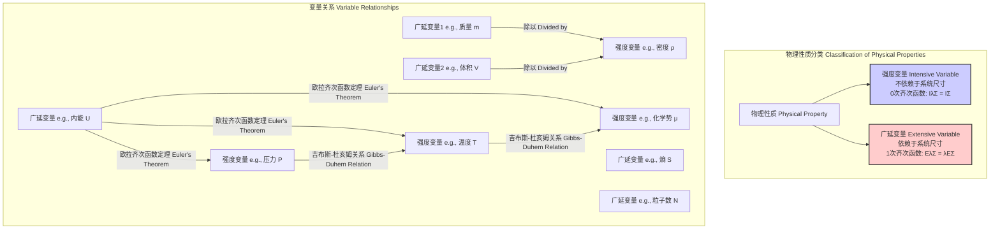

## 强度变量

强度变量（Intensive Variable），又称内含变量或强度性质，是热力学和物理化学中的一个核心概念。它描述的是一个物理系统的宏观性质，其数值不依赖于系统的大小或系统中的物质量。换言之，如果将一个处于平衡态的系统分割成任意多个子系统，每个子系统的该性质数值都与原系统相同。强度变量与广延变量（Extensive Variable）相对，后者的大小与系统尺度成正比。

### 核心概念与数学基础

从数学角度看，强度变量的定义根植于齐次函数的概念。一个函数 $f(x_1, x_2, ..., x_n)$ 如果满足以下条件，则被称为 $k$ 次齐次函数：
$$ f(\lambda x_1, \lambda x_2, ..., \lambda x_n) = \lambda^k f(x_1, x_2, ..., x_n) $$
其中 $\lambda$ 是一个任意的缩放因子。

- **广延变量** 是1次齐次函数 ($k=1$)。例如，体积 $V$ 和物质的量 $N$。如果系统的尺度加倍（$\lambda=2$），其体积和物质的量也加倍。$V(\lambda \Sigma) = \lambda V(\Sigma)$。
- **强度变量** 是0次齐次函数 ($k=0$)。例如，温度 $T$ 和压力 $P$。如果系统的尺度加倍，其温度和压力保持不变。$T(\lambda \Sigma) = \lambda^0 T(\Sigma) = T(\Sigma)$。

一个重要的特性是，**任意两个广延变量之比是一个强度变量**。
设 $E_1$ 和 $E_2$ 是两个广延变量，它们都是系统尺度参数（如总粒子数 $N$）的1次齐次函数。
$$ E_1(\lambda N) = \lambda E_1(N) $$
$$ E_2(\lambda N) = \lambda E_2(N) $$
它们的比值 $I$ 为：
$$ I(\lambda N) = \frac{E_1(\lambda N)}{E_2(\lambda N)} = \frac{\lambda E_1(N)}{\lambda E_2(N)} = \frac{E_1(N)}{E_2(N)} = I(N) $$
这表明 $I$ 是一个0次齐次函数，因此它是一个强度变量。例如，密度 $\rho$ (强度) 是质量 $m$ (广延) 与体积 $V$ (广延) 的比值。

### 关键技术规格

下表列出了一些在科学和工程领域中常见的强度变量及其技术规格。

| 变量名称 (英文) | 符号 | 定义 | SI单位 | 在标准状况下水的典型值 |
| :--- | :--- | :--- | :--- | :--- |
| 温度 (Temperature) | $T$ | 衡量物体冷热程度的物理量 | 开尔文 (K) | 273.15 K (0 °C) |
| 压力 (Pressure) | $P$ | 垂直作用于单位面积上的力 | 帕斯卡 (Pa) | 101325 Pa (1 atm) |
| 密度 (Density) | $\rho$ | 单位体积的质量, $\rho = m/V$ | 千克/立方米 (kg/m³) | ≈ 999.8 kg/m³ (在 4 °C) |
| 摩尔浓度 (Molar Concentration) | $c$ | 单位体积内溶质的物质的量, $c = n/V$ | 摩尔/立方米 (mol/m³) | 纯水: ≈ 55.5 kmol/m³ |
| 比热容 (Specific Heat Capacity) | $c_p$ | 单位质量物质温度升高1K所需的能量 | 焦耳/(千克·开尔文) (J/(kg·K)) | ≈ 4186 J/(kg·K) |
| 化学势 (Chemical Potential) | $\mu$ | 恒温恒压下，向体系中加入1mol某物质引起的吉布斯自由能变化 | 焦耳/摩尔 (J/mol) | 取决于参考态 |
| 粘度 (Viscosity) | $\eta$ | 流体内部抵抗流动的性质 | 帕斯卡·秒 (Pa·s) | ≈ 1.002 × 10⁻³ Pa·s (在 20 °C) |
| 折射率 (Refractive Index) | $n$ | 光在真空中的速度与在介质中速度之比, $n = c/v$ | 无量纲 | ≈ 1.333 (可见光) |

### 常见用例与定量性能指标

1.  **热力学状态描述**:
    根据热力学的**状态公设**，一个简单的可压缩系统（如均质流体）的平衡状态可以由两个独立的强度变量完全确定。这构成了相图的基础。
    *   **用例**: 水的P-T相图。通过指定压力 $P$ 和温度 $T$，可以唯一确定水的相态（固态、液态、气态）。例如，在 $P = 1$ atm 和 $T = 100$ °C (373.15 K) 时，水处于液-气共存的沸点。

2.  **化学反应动力学**:
    化学反应的速率由强度变量（主要是温度和反应物浓度）控制。
    *   **用例**: 阿伦尼乌斯方程描述了速率常数 $k$ 与温度 $T$ 的关系。
        $$ k = A e^{-E_a / (RT)} $$
        其中：
        *   $k$: 反应速率常数 (单位取决于反应级数)
        *   $A$: 指前因子 (与碰撞频率和方向相关)
        *   $E_a$: 活化能 (J/mol)
        *   $R$: 理想气体常数 (≈ 8.314 J/(mol·K))
        *   $T$: 绝对温度 (K)
    *   **性能指标**: 对于一个典型的化学反应，温度每升高10 K，反应速率大约增加2-3倍。

3.  **流体力学**:
    流体的行为由纳维-斯托克斯方程描述，其中的关键参数如密度 $\rho$、压力 $P$ 和粘度 $\eta$ 都是强度变量。
    *   **用例**: 不可压缩牛顿流体的纳维-斯托克斯方程：
        $$ \rho \left( \frac{\partial \mathbf{v}}{\partial t} + (\mathbf{v} \cdot \nabla) \mathbf{v} \right) = -\nabla P + \eta \nabla^2 \mathbf{v} + \mathbf{f} $$
        其中 $\mathbf{v}$ 是流速场，$\mathbf{f}$ 是体积力。这些强度变量决定了从天气预报到飞机设计的各种流体现象。

### 实现考量与算法复杂度分析

在计算物理和化学模拟中，“实现”一个强度变量通常指其计算或测量方法。

1.  **分子动力学 (MD) 模拟**:
    在MD模拟中，强度变量通常作为系综平均值（ensemble average）计算得出。
    *   **温度 (T)**: 根据能量均分定理，温度与系统内所有粒子的平均动能相关。
        $$ T = \frac{2 \langle E_k \rangle}{3 N k_B} = \frac{1}{3 N k_B} \sum_{i=1}^{N} m_i v_i^2 $$
        其中 $\langle E_k \rangle$ 是平均总动能, $N$ 是粒子数, $k_B$ 是玻尔兹曼常数, $m_i$ 和 $v_i$ 是粒子 $i$ 的质量和速度。
    *   **压力 (P)**: 通过维里定理计算。
        $$ P = \frac{N k_B T}{V} + \frac{1}{3V} \left\langle \sum_{i<j} \mathbf{r}_{ij} \cdot \mathbf{F}_{ij} \right\rangle $$
        其中 $V$ 是体积, $\mathbf{r}_{ij}$ 是粒子 $i$ 和 $j$ 之间的距离向量, $\mathbf{F}_{ij}$ 是它们之间的相互作用力。

2.  **算法复杂度**:
    计算这些强度变量的复杂度取决于模拟的细节。
    *   **温度计算**: 需要遍历所有 $N$ 个粒子来计算总动能。因此，其计算复杂度为 $O(N)$。
    *   **压力计算**: 维里项需要计算所有粒子对之间的相互作用力。对于一个朴素的实现，这需要 $O(N^2)$ 的计算量。使用如细胞列表或Verlet列表等邻近列表方法可以将其优化到 $O(N)$。对于长程力（如静电力），使用粒子-网格-Ewald (PME) 等方法，复杂度约为 $O(N \log N)$。

### 性能特征与统计度量

在有限大小的系统或非平衡态下，强度变量会表现出统计涨落。

1.  **统计涨落**:
    根据统计力学，宏观的强度变量是微观状态的平均值。其涨落大小与系统尺寸有关。对于一个包含 $N$ 个粒子的系统，强度变量 $I$ 的标准差 $\sigma_I$ 通常与 $N$ 的关系如下：
    $$ \sigma_I \propto \frac{1}{\sqrt{N}} $$
    这意味着随着系统尺寸增大 ($N \to \infty$)，相对涨落 $\sigma_I / \langle I \rangle$ 趋于零，强度变量的值变得非常确定。

2.  **统计度量**:
    在正则系综中（恒定 N, V, T），系统能量 $E$ 的涨落（方差）与恒容热容 $C_V$ 相关：
    $$ \sigma_E^2 = \langle (E - \langle E \rangle)^2 \rangle = k_B T^2 C_V $$
    由于 $C_V$ 是一个广延量 ($C_V \propto N$)，能量的方差 $\sigma_E^2 \propto N$。因此，能量的相对涨落为：
    $$ \frac{\sigma_E}{\langle E \rangle} \propto \frac{\sqrt{N}}{N} = \frac{1}{\sqrt{N}} $$
    这为温度这个强度变量的稳定性提供了理论基础。

3.  **置信区间**:
    在实验测量或模拟中，一个强度变量的测量值通常表示为平均值加上一个置信区间。例如，经过 $n$ 次独立测量，其均值的95%置信区间可表示为：
    $$ I_{measured} = \bar{I} \pm 1.96 \frac{\sigma}{\sqrt{n}} $$
    其中 $\bar{I}$ 是样本均值，$\sigma$ 是单次测量的标准差。

### 相关技术与比较数学模型

强度变量最重要的相关概念是广延变量。它们之间的关系是热力学理论的基石。

#### 欧拉齐次函数定理 (Euler's Homogeneous Function Theorem)

该定理将广延变量和强度变量优雅地联系在一起。对于一个以熵 $S$、体积 $V$ 和粒子数 $N_i$ 为自变量的内能函数 $U(S, V, N_i)$，由于 $U$ 是1次齐次函数（广延量），我们有：
$$ U = \left(\frac{\partial U}{\partial S}\right)_{V, N_i} S + \left(\frac{\partial U}{\partial V}\right)_{S, N_i} V + \sum_i \left(\frac{\partial U}{\partial N_i}\right)_{S, V, N_j} N_i $$
根据热力学定义，这些偏导数本身就是强度变量：
- 温度: $T = \left(\frac{\partial U}{\partial S}\right)_{V, N_i}$
- 压力: $P = -\left(\frac{\partial U}{\partial V}\right)_{S, N_i}$
- 化学势: $\mu_i = \left(\frac{\partial U}{\partial N_i}\right)_{S, V, N_j}$

代入后得到热力学的基本方程之一，欧拉方程：
$$ U = TS - PV + \sum_i \mu_i N_i $$

#### 吉布斯-杜亥姆关系 (Gibbs-Duhem Relation)

对欧拉方程进行全微分，并利用内能的基本微分形式 $dU = TdS - PdV + \sum_i \mu_i dN_i$，可以推导出吉布斯-杜亥姆关系。它表明系统的强度变量不是完全独立的：
$$ S dT - V dP + \sum_i N_i d\mu_i = 0 $$
在恒温恒压下 ($dT=0, dP=0$)，该关系简化为 $\sum_i N_i d\mu_i = 0$。这在多组分系统的相平衡研究中至关重要。

### References

1.  Callen, H. B. (1985). *Thermodynamics and an Introduction to Thermostatistics* (2nd ed.). John Wiley & Sons. (This textbook provides a rigorous axiomatic foundation for thermodynamics, where the distinction between intensive and extensive variables is fundamental).
2.  Hill, T. L. (1962). Thermodynamics of Small Systems. *The Journal of Chemical Physics*, 36(12), 3182-3197. doi:10.1063/1.1732447. (This seminal paper extends classical thermodynamics to small systems where fluctuations of intensive properties become significant).
3.  Frenkel, D., & Smit, B. (2002). *Understanding Molecular Simulation: From Algorithms to Applications* (2nd ed.). Academic Press. (This book details the computational algorithms for calculating intensive variables like pressure and temperature in molecular simulations).