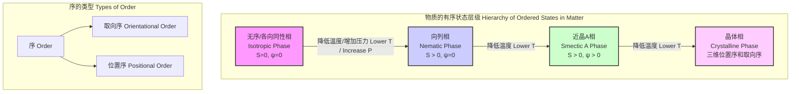
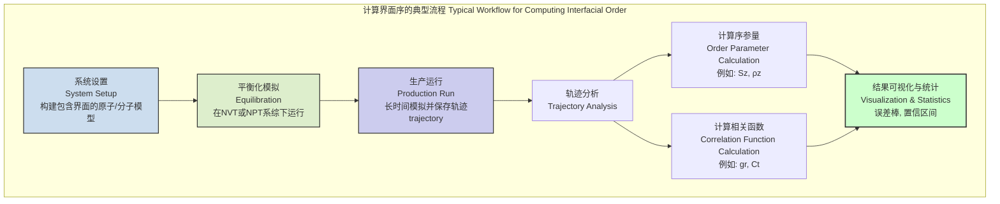
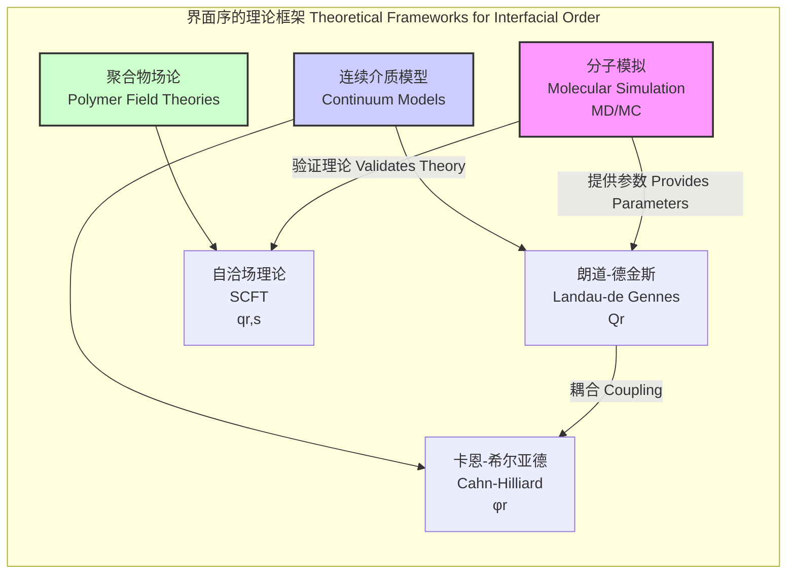

## 界面序 (interfacial order)

界面序是指在两个不同相或不同材料的交界区域（即界面）内，分子或原子在排列和取向上表现出的有序结构。这种有序性不同于体相（bulk phases）中的均匀结构，是由于界面处对称性破缺、能量最小化以及分子间相互作用的各向异性所导致的。界面序在材料科学、软物质物理、化学生物学和半导体技术等领域中扮演着至关重要的角色，它直接影响着界面的物理化学性质，如界面张力、润湿性、粘附力、电学和光学响应。

### 核心概念与数学基础

界面序的量化描述依赖于序参量（Order Parameter），它是一个用于区分有序相和无序相的物理量。根据对称性的不同，序可以分为取向序和位置序。

#### 1. 取向序 (Orientational Order)

取向序描述了非球形粒子（如棒状液晶分子、聚合物链段）在空间中取向的一致性。最常见的取向序是向列相（Nematic）序。

**向列序参量张量 (Nematic Order Parameter Tensor)**

对于由无头矢量（即 $\mathbf{u}$ 和 $-\mathbf{u}$ 等价）描述的轴对称分子，其取向序可以用一个二阶无迹张量 $\mathbf{Q}$ 来描述：

$$
\mathbf{Q} = \langle \mathbf{u} \otimes \mathbf{u} - \frac{1}{3}\mathbf{I} \rangle
$$

其中：
*   $\mathbf{u}$ 是一个单位矢量，代表分子的长轴方向。
*   $\langle \cdot \rangle$ 表示系综平均或时间平均。
*   $\otimes$ 表示张量积。
*   $\mathbf{I}$ 是三维单位矩阵。

在笛卡尔坐标系中，该张量的分量为：
$$
Q_{\alpha\beta} = \langle u_\alpha u_\beta - \frac{1}{3}\delta_{\alpha\beta} \rangle
$$
其中 $\alpha, \beta \in \{x, y, z\}$，$\delta_{\alpha\beta}$ 是克罗内克（Kronecker）δ函数。

如果系统是单轴的，即所有分子倾向于沿着一个特定的方向（称为指向矢，director, $\mathbf{n}$）排列，则张量 $\mathbf{Q}$ 可以简化为：

$$
Q_{\alpha\beta} = S \left( n_\alpha n_\beta - \frac{1}{3}\delta_{\alpha\beta} \right)
$$

这里的标量序参量 $S$ 定义为：
$$
S = \frac{1}{2} \langle 3(\mathbf{u} \cdot \mathbf{n})^2 - 1 \rangle = \langle P_2(\cos\theta) \rangle
$$
其中：
*   $S$ 是标量向列序参量，其取值范围为：
    *   $S=1$：完全平行于 $\mathbf{n}$ 排列。
    *   $S=0$：各向同性，无序排列。
    *   $S=-1/2$：完全垂直于 $\mathbf{n}$ 排列。
*   $\theta$ 是分子长轴 $\mathbf{u}$ 与指向矢 $\mathbf{n}$ 之间的夹角。
*   $P_2(x) = \frac{1}{2}(3x^2 - 1)$ 是二阶勒让德多项式。

#### 2. 位置序 (Positional Order)

位置序描述了粒子质心在空间中排列的规律性。

**近晶序参量 (Smectic Order Parameter)**

在近晶相（Smectic phases）中，分子不仅有取向序，还在一个方向上（通常是沿着指向矢 $\mathbf{n}$ 的方向）形成周期性的层状结构。这种一维的位置序可以用一个复数序参量 $\Psi$ 来描述：

$$
\Psi(\mathbf{r}) = \langle \rho(\mathbf{r}) e^{-i q_0 z} \rangle = \psi e^{i\phi}
$$

其中：
*   $\rho(\mathbf{r})$ 是在位置 $\mathbf{r}$ 的粒子数密度。
*   $q_0 = 2\pi/d$ 是与层间距 $d$ 对应的波矢。
*   $z$ 是沿着层法线方向（通常与 $\mathbf{n}$ 平行）的坐标。
*   $\psi = |\Psi|$ 是序的幅度，表示分层的好坏。
*   $\phi$ 是相位，表示层的位置。

#### 3. 界面自由能 (Interfacial Free Energy)

界面的形成和序的建立可以通过热力学自由能来描述。对于具有取向序的界面，常用的理论是**朗道-德金斯（Landau-de Gennes）理论**。其自由能密度 $f$ 包含体相项和弹性项：

$$
F = \int_V \left( f_{bulk} + f_{elastic} \right) dV
$$

$$
f_{bulk} = a(T-T_{NI}^*) \text{Tr}(\mathbf{Q}^2) - b \text{Tr}(\mathbf{Q}^3) + c (\text{Tr}(\mathbf{Q}^2))^2
$$

$$
f_{elastic} = \frac{1}{2} L_1 (\partial_\gamma Q_{\alpha\beta})^2 + \frac{1}{2} L_2 (\partial_\beta Q_{\alpha\beta})^2
$$

其中：
*   $F$ 是体系的总自由能。
*   $a, b, c$ 是朗道系数，是材料的唯象参数。
*   $T$ 是温度，$T_{NI}^*$ 是向列-各向同性相变温度。
*   $L_1, L_2$ 是弹性常数，与序参量的空间变化（形变）引起的能量代价相关。
*   $\partial_\gamma Q_{\alpha\beta} = \frac{\partial Q_{\alpha\beta}}{\partial r_\gamma}$ 是序参量张量的空间梯度。

在界面处，$Q_{\alpha\beta}$ 从一个相的值平滑地过渡到另一个相的值，这个过渡区的结构由总自由能最小化决定。

### 关键技术规格

下表列出了一些典型系统中界面序的关键参数。这些值具有代表性，但会随具体材料、温度和界面条件而变化。

| 参数 (Parameter) | 符号 (Symbol) | 典型值 (Typical Value) | 单位 (Unit) | 适用体系 (Applicable System) |
| :--- | :---: | :--- | :---: | :--- |
| 标量向列序参量（体相） | $S_{bulk}$ | 0.3 – 0.8 | 无量纲 | 液晶 (Liquid Crystals), 聚合物 (Polymers) |
| 界面宽度 | $w$ | 1 – 100 | nm | 液晶/空气界面, 聚合物共混物 |
| 界面锚定能 | $W_{anchor}$ | $10^{-6}$ – $10^{-3}$ | J/m² | 液晶/基底界面 |
| 朗道系数 | $a$ | $0.02 \times 10^6$ – $0.2 \times 10^6$ | J/(m³·K) | 5CB 液晶 |
| 弹性常数 | $L_1$ | $10^{-12}$ – $10^{-11}$ | N | 液晶, 生物膜 |
| 近晶层间距 | $d$ | 2 – 5 | nm | 8CB 液晶, 脂质双层膜 |

### 常见用例与性能指标

| 用例 (Use Case) | 关键界面序 (Key Interfacial Order) | 性能指标 (Performance Metric) | 定量值示例 (Example Quantitative Value) |
| :--- | :--- | :--- | :--- |
| **液晶显示器 (LCD)** | 液晶分子在基底表面的取向序（锚定） | 对比度、响应时间、视角 | 对比度 > 1000:1, 响应时间 < 5 ms |
| **聚合物共混物/复合材料** | 两相聚合物界面处的链段取向和互穿 | 界面粘附力、材料韧性 | 界面剪切强度: 5 – 50 MPa |
| **生物膜** | 脂质分子在水/膜界面的取向和有序堆积 | 膜的刚度、通透性、蛋白质嵌入稳定性 | 弯曲刚度 $\kappa \approx 20-30$ $k_B T$ |
| **有机半导体器件 (OLED, OPV)** | 有机分子在电极/有机层界面的取向 | 电荷注入效率、器件效率 | 外部量子效率 (EQE) > 25% |
| **胶体自组装** | 粒子在液-气或液-液界面的二维晶体序 | 缺陷密度、晶格常数 | 缺陷密度 < 1 per 1000 particles |

### 实现考量与算法分析

研究界面序主要依赖于实验技术（如X射线反射、椭圆偏振光谱）和计算模拟。计算模拟是理解其微观机制的关键。

#### 1. 分子动力学 (Molecular Dynamics, MD)

MD模拟通过求解牛顿运动方程来追踪系统中每个原子的轨迹，从而直接观察和计算序参量。

*   **算法流程**:
    1.  **系统构建**: 建立包含两个相和界面的初始构型。
    2.  **力场选择**: 选择合适的原子间相互作用势函数（如CHARMM, AMBER, OPLS）。
    3.  **平衡化**: 在目标温度和压力下运行模拟，使系统达到热力学平衡。
    4.  **生产运行**: 继续运行模拟并保存原子轨迹用于分析。
    5.  **后处理**: 从轨迹中计算序参量张量 $Q_{\alpha\beta}$ 或密度分布 $\rho(z)$ 作为位置的函数。
*   **算法复杂度**:
    *   对于包含 $N$ 个粒子的系统，计算粒子间相互作用是主要瓶颈。
    *   使用全对势计算：$O(N^2)$。
    *   使用截断半径和邻居列表：$O(N)$ 到 $O(N \log N)$。
    *   使用粒子-网格-Ewald (PME) 等方法计算长程静电作用：$O(N \log N)$。

#### 2. 蒙特卡洛 (Monte Carlo, MC)

MC模拟使用随机抽样来探索系统的相空间，特别适用于研究相变和平衡性质。

*   **算法流程**:
    1.  **系统构建**: 与MD类似。
    2.  **能量函数**: 定义系统的哈密顿量 $H$。
    3.  **Metropolis算法**:
        a. 随机选择一个粒子并尝试一个随机移动（如平移或旋转）。
        b. 计算能量变化 $\Delta E$。
        c. 如果 $\Delta E < 0$，接受移动。
        d. 如果 $\Delta E > 0$，以概率 $p = \exp(-\Delta E / k_B T)$ 接受移动。
    4.  重复步骤3，直到系统达到平衡并收集足够多的样本进行统计平均。
*   **算法复杂度**:
    *   每个MC步的复杂度取决于能量计算的复杂度，通常为 $O(N)$（如果只重新计算受影响粒子的能量）。
    *   达到平衡所需的总步数可能非常大，尤其是在相变点附近（临界慢化）。

### 性能特征与统计度量

界面序的表征需要精确的测量和统计分析。

*   **序参量剖面 (Order Parameter Profile)**:
    界面序通常不是一个单一值，而是一个随空间位置（特别是垂直于界面的坐标 $z$）变化的函数，即 $S(z)$ 或 $\psi(z)$。这个剖面通常可以用一个函数来拟合，例如：
    $$
    S(z) = S_{bulk} + (S_{int} - S_{bulk}) \exp\left(-\frac{|z-z_0|}{w}\right)
    $$
    或更常用的双曲正切函数：
    $$
    S(z) = \frac{S_1 + S_2}{2} + \frac{S_1 - S_2}{2} \tanh\left(\frac{z-z_0}{w}\right)
    $$
    其中：
    *   $S_1, S_2$ 是两个体相的序参量值。
    *   $z_0$ 是界面的中心位置。
    *   $w$ 是界面宽度，表征了过渡区域的弥散程度。

*   **空间相关函数 (Spatial Correlation Function)**:
    它描述了空间中两个点之间序的关联性。例如，取向相关函数 $G_2(r)$：
    $$
    G_2(r) = \langle P_2(\mathbf{u}(\mathbf{r}_i) \cdot \mathbf{u}(\mathbf{r}_j)) \rangle_{|\mathbf{r}_i-\mathbf{r}_j|=r}
    $$
    $G_2(r)$ 的衰减行为揭示了序的关联长度 $\xi$。在界面处，关联长度可能是各向异性的。

*   **统计不确定性**:
    无论是实验测量还是计算机模拟，得到的结果都包含统计误差。
    *   **标准误差 (Standard Error)**: 对于通过模拟计算的平均值 $\langle A \rangle$，其标准误差 $\sigma_{\langle A \rangle}$ 可以通过分块平均法（block averaging）来估计，以消除数据点之间的时间关联性。
    *   **置信区间 (Confidence Interval)**: 通常报告95%置信区间，即 $\langle A \rangle \pm 1.96 \sigma_{\langle A \rangle}$，表示真实值有95%的概率落在这个区间内。

### 相关技术与数学模型比较

描述界面序存在多种理论框架，它们在适用范围和物理图像上有所不同。

| 模型 (Model) | 核心数学方程 | 物理描述 | 优点 | 缺点 |
| :--- | :--- | :--- | :--- | :--- |
| **朗道-德金斯理论 (Landau-de Gennes)** | $F[\mathbf{Q}(\mathbf{r})]$ | 基于连续介质理论，通过序参量张量的空间变化来描述自由能。 | 能够描述拓扑缺陷；计算上比分子模拟更高效。 | 唯象模型，参数需实验确定；不包含分子细节。 |
| **卡恩-希尔亚德理论 (Cahn-Hilliard)** | $\frac{\partial \phi}{\partial t} = M \nabla^2 \left( \frac{\partial f}{\partial \phi} - \kappa \nabla^2 \phi \right)$ | 描述两组分混合物相分离的动力学，$\phi$是浓度场。 | 很好地描述了旋节线分解和界面演化。 | 主要用于标量场（浓度），不直接描述取向序。 |
| **自洽场理论 (Self-Consistent Field Theory, SCFT)** | $q(\mathbf{r}, s) = \frac{1}{Z} \int d\mathbf{r}' G(\mathbf{r}, \mathbf{r}'; s) e^{-w(\mathbf{r}')/k_B T}$ | 在平均场近似下，计算聚合物链在外部场中的构象分布，场由所有链共同产生。 | 包含分子结构信息（如链长、结构）；能预测复杂的相图。 | 平均场近似，忽略了涨落；计算量大。 |
| **密度泛函理论 (Density Functional Theory, DFT)** | $F[\rho(\mathbf{r})] = F_{id}[\rho(\mathbf{r})] + F_{ex}[\rho(\mathbf{r})] + \int \rho(\mathbf{r}) V_{ext}(\mathbf{r}) d\mathbf{r}$ | 系统的自由能是粒子密度分布 $\rho(\mathbf{r})$ 的唯一泛函。 | 基于第一性原理，可用于液体和固体；能精确处理硬球等模型。 | 精确的交换关联泛函 $F_{ex}$ 未知，需要近似。 |

## 参考文献 (References)

1.  de Gennes, P. G., & Prost, J. (1993). *The Physics of Liquid Crystals*. Oxford University Press. (A foundational text on liquid crystal physics, including detailed discussions of order parameters and free energy).
2.  Cahn, J. W., & Hilliard, J. E. (1958). Free Energy of a Nonuniform System. I. Interfacial Free Energy. *The Journal of Chemical Physics*, 28(2), 258–267. DOI: [10.1063/1.1744102](https://doi.org/10.1063/1.1744102)
3.  Fredrickson, G. H. (2006). *The Equilibrium Theory of Inhomogeneous Polymers*. Oxford University Press. (A comprehensive guide to Self-Consistent Field Theory for polymer systems).
4.  Allen, M. P., & Tildesley, D. J. (2017). *Computer Simulation of Liquids* (2nd ed.). Oxford University Press. (The standard reference for molecular dynamics and Monte Carlo simulation techniques).
5.  Bechinger, C., Di Leonardo, R., Löwen, H., Reichhardt, C., Volpe, G., & Volpe, G. (2016). Active particles in complex and crowded environments. *Reviews of Modern Physics*, 88(4), 045006. DOI: [10.1103/RevModPhys.88.045006](https://doi.org/10.1103/RevModPhys.88.045006) (Discusses order in systems of active particles, often studied at interfaces).