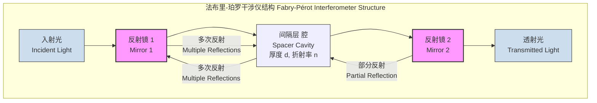
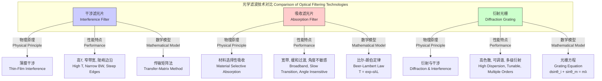

## 干涉滤光片 (Interference Filter)

干涉滤光片是一种光学元件，它利用薄膜干涉原理选择性地透射或反射特定波长的光。与依赖材料吸收的吸收型滤光片不同，干涉滤光片通过在基板上精确沉积多层具有不同折射率的介电材料来实现其光谱特性。这种结构导致入射光在各层界面之间发生多次反射和透射，通过相长干涉和相消干涉，最终在透射光谱中形成窄带通、宽带通、边通或陷波等特定形状。

### 核心概念与数学基础 (Core Concepts and Mathematical Foundations)

干涉滤光片最基本的模型是法布里-珀罗标准具（Fabry-Pérot Etalon）。它由两个平行的部分反射镜面组成，中间由一个透明的间隔层（或称“腔”）隔开。



#### 1. 相位差与干涉条件 (Phase Difference and Interference Condition)

当光线在间隔层中来回反射时，相邻透射光束之间的相位差 $\delta$ 决定了干涉的结果。对于垂直入射（$\theta=0$）的情况，相位差由光程差决定：

$$
\delta = \frac{2\pi}{\lambda} (2nd)
$$

其中：
*   $\lambda$ 是真空中的波长 (wavelength in vacuum)。
*   $n$ 是间隔层介质的折射率 (refractive index of the spacer medium)。
*   $d$ 是间隔层的物理厚度 (physical thickness of the spacer)。

对于斜入射情况，角度为 $\theta_i$，根据斯涅尔定律，在间隔层内的角度为 $\theta_t$，相位差公式变为：

$$
\delta(\lambda, \theta_t) = \frac{2\pi}{\lambda} (2nd \cos\theta_t)
$$

当相位差为 $2\pi$ 的整数倍时，发生相长干涉，透射率达到最大值。这定义了滤光片的通带中心波长：

$$
m\lambda_m = 2nd \cos\theta_t
$$

其中 $m$ 是干涉级次 (order of interference)，为一个正整数。

#### 2. 透射率与艾里函数 (Transmittance and the Airy Function)

通过对所有透射光束的电场分量进行叠加（这是一个几何级数求和），可以推导出法布里-珀罗标准具的透射率函数 $T_{FP}$，即艾里函数 (Airy function)：

$$
T_{FP}(\delta) = \frac{T^2}{(1-R)^2 + 4R\sin^2(\frac{\delta}{2})} = \frac{1}{1 + \left(\frac{2\sqrt{R}}{1-R}\right)^2 \sin^2(\frac{\delta}{2})}
$$

为了简化，我们引入“精细度系数” (Coefficient of Finesse) $F$:

$$
F = \frac{4R}{(1-R)^2}
$$

于是艾里函数可以写为：

$$
T_{FP}(\delta) = \frac{1}{1 + F \sin^2(\frac{\delta}{2})}
$$

其中：
*   $R$ 是单个反射镜的反射率 (reflectivity of the mirrors)。
*   $T$ 是单个反射镜的透射率 (transmittivity of the mirrors)。这里假设无吸收，即 $T = 1 - R$。
*   $F$ 是精细度系数，它衡量了透射峰的锐利程度。$R$ 越高，$F$ 越大，透射峰越窄。

#### 3. 传输矩阵法 (Transfer-Matrix Method)

对于由多层不同材料构成的现代干涉滤光片，艾里函数过于简化。传输矩阵法 (TMM) 是分析和设计这种复杂多层膜系的标准化数学工具。该方法将每一层薄膜用一个2x2的特征矩阵 $M_j$ 表示，该矩阵关联了层两界面的电场 ($E$) 和磁场 ($H$) 的切向分量。

对于第 $j$ 层，其特征矩阵为：

$$
M_j = \begin{pmatrix} \cos(\delta_j) & \frac{i}{\eta_j}\sin(\delta_j) \\ i\eta_j\sin(\delta_j) & \cos(\delta_j) \end{pmatrix}
$$

其中：
*   $\delta_j = \frac{2\pi}{\lambda} n_j d_j \cos\theta_j$ 是第 $j$ 层的相位厚度 (phase thickness)。
*   $\eta_j$ 是第 $j$ 层的光学导纳 (optical admittance)。对于s-偏振光，$\eta_j = n_j \cos\theta_j$；对于p-偏振光，$\eta_j = n_j / \cos\theta_j$。在垂直入射时，$\eta_j = n_j$。
*   $n_j$ 和 $d_j$ 分别是第 $j$ 层的折射率和物理厚度。

一个由 $N$ 层薄膜组成的膜系的总矩阵 $M_{total}$ 是各层矩阵的乘积：

$$
M_{total} = M_1 M_2 \cdots M_N = \begin{pmatrix} m_{11} & m_{12} \\ m_{21} & m_{22} \end{pmatrix}
$$

整个膜系的反射系数 $r$ 和透射系数 $t$ 可以通过总矩阵的元素和入射介质($\eta_0$)、基底介质($\eta_s$)的光学导纳计算得出：

$$
r = \frac{(m_{11} + m_{12}\eta_s)\eta_0 - (m_{21} + m_{22}\eta_s)}{(m_{11} + m_{12}\eta_s)\eta_0 + (m_{21} + m_{22}\eta_s)}
$$
$$
t = \frac{2\eta_0}{(m_{11} + m_{12}\eta_s)\eta_0 + (m_{21} + m_{22}\eta_s)}
$$

最终，能量反射率 $R$ 和透射率 $T$ 分别为：

$$
R = |r|^2
$$
$$
T = \frac{\text{Re}(\eta_s)}{\text{Re}(\eta_0)} |t|^2
$$

### 关键技术指标 (Key Technical Specifications)

干涉滤光片的性能由一系列精确定义的参数来描述。

| 参数 (Parameter) | 符号 (Symbol) | 定义 (Definition) | 典型值 (Typical Value) | 单位 (Unit) |
| :--- | :--- | :--- | :--- | :--- |
| 中心波长 (Center Wavelength) | CWL 或 $\lambda_c$ | 透射率达到峰值的波长。 | 488, 532, 633, 1550 | nm |
| 半峰全宽 (Full Width at Half Maximum) | FWHM 或 $\Delta\lambda_{0.5}$ | 透射率等于峰值一半处的两个波长之差。 | 1 - 20 | nm |
| 峰值透射率 (Peak Transmittance) | $T_{peak}$ | 在CWL处的最大透射率。 | > 90 (带通), > 95 (边通) | % |
| 光密度 (Optical Density) | OD | 衡量滤光片在阻带区对光的阻挡能力。$OD = -\log_{10}(T)$。 | 4.0 - 6.0 | 无 |
| 截止范围 (Blocking Range) | - | 滤光片维持其指定光密度（OD值）的波长范围。 | 200 - 1200 | nm |
| 入射角 (Angle of Incidence) | AOI | 设计时所依据的光线入射角度。 | 0 或 45 | 度 (°) |
| 表面质量 (Surface Quality) | S-D | 根据MIL-PRF-13830B标准的划痕和麻点代码。 | 40-20 | - |

### 常见应用场景 (Common Use Cases)

干涉滤光片因其卓越的光谱选择性，在众多科学和技术领域中至关重要。

*   **荧光显微镜 (Fluorescence Microscopy)**:
    *   **用途**: 使用二向色镜、激发滤光片和发射滤光片分离激发光和发射荧光。
    *   **性能指标**: 发射滤光片的OD值在激发波长处需 > 6.0，以确保信噪比 (SNR) > 100:1。峰值透射率 > 90% 以最大化收集到的荧光信号。

*   **拉曼光谱 (Raman Spectroscopy)**:
    *   **用途**: 使用超窄带陷波滤光片（Notch Filter）滤除强烈的瑞利散射光（激光波长），仅让微弱的拉曼散射信号通过。
    *   **性能指标**: FWHM < 1 nm，在激光波长处的OD > 6.0，边沿陡峭度（从10% T到80% T的波长间隔）< 0.5% CWL。

*   **激光雷达 (LIDAR)**:
    *   **用途**: 在接收端使用窄带滤光片，只允许特定波长的激光回波信号通过，滤除太阳光等背景噪声。
    *   **性能指标**: FWHM通常为0.3-1.0 nm，以匹配激光线宽。高透射率（>90%）和宽截止范围（OD > 4.0 @ 400-1100 nm）以提高白天工作的信噪比。

*   **光纤通信 (Optical Communications)**:
    *   **用途**: 在波分复用（WDM）系统中使用，用于合波（Mux）和分波（DeMux）不同波长的信道。
    *   **性能指标**: 信道间隔为100 GHz（~0.8 nm）或50 GHz（~0.4 nm），要求极低的串扰（< -30 dB），平坦的通带顶部（0.5 dB带宽 > 0.3 nm）。

### 实现与设计考量 (Implementation and Design Considerations)

干涉滤光片的设计是一个复杂的优化问题，其目标是在满足光谱性能要求的同时，考虑制造的可行性。

```mermaid
graph TD
    A[需求分析<br>Requirement Analysis<br>CWL, FWHM, T_peak, OD] --> B初始设计<br>Initial Design;
    B -- "法布里-珀罗模型<br>Fabry-Pérot Model" --> C[基础膜系<br>Basic Stack];
    B -- "经验膜系<br>Empirical Stack" --> C;
    C --> D[建模与仿真<br>Modeling & Simulation<br>传输矩阵法 TMM];
    D --> E性能评估<br>Performance Evaluation;
    E -- "不满足<br>Not Met" --> F[优化循环<br>Optimization Loop];
    F -- "修改膜系参数<br>Modify Layer Parameters" --> D;
    E -- "满足<br>Met" --> G[最终设计<br>Final Design<br>材料和厚度列表];
    G --> H[制造<br>Fabrication<br>PVD, IAD, IBS];
    H --> I[计量与测试<br>Metrology & Testing<br>分光光度计];
    I --> J[成品<br>Final Product];

    subgraph "优化算法 Optimization Algorithms"
        direction LR
        F1[针式优化法<br>Needle Optimization]
        F2[遗传算法<br>Genetic Algorithms]
        F3[模拟退火<br>Simulated Annealing]
    end
    
    F --> F1;
    F --> F2;
    F --> F3;
    
    style F fill:#fce,stroke:#333
```

#### 算法复杂度分析 (Algorithmic Complexity Analysis)

滤光片设计的核心是光谱计算。对于一个包含 $N$ 层薄膜的膜系，在单个波长点计算其透射率和反射率：
*   **计算方法**: 传输矩阵法 (TMM)。
*   **复杂度**: 该方法需要进行 $N$ 次 2x2 矩阵乘法。由于矩阵大小是固定的，每次乘法的时间复杂度是 $O(1)$。因此，计算整个膜系在单个波长点的光谱性能的总时间复杂度为 $O(N)$。
*   **设计优化**: 设计过程通常需要在很宽的光谱范围（例如 $W$ 个波长点）内进行迭代优化。如果优化算法需要 $K$ 次迭代，则总计算复杂度为 $O(K \cdot W \cdot N)$。这表明计算成本与膜层数、光谱分辨率和优化算法的收敛速度成正比。

### 性能特征与统计分析 (Performance Characteristics and Statistical Analysis)

由于制造过程（如物理气相沉积 PVD）中存在微小的随机误差，实际生产的滤光片性能会呈现统计分布。

*   **中心波长 (CWL) 漂移**: 制造批次中的CWL通常服从正态分布 $N(\mu_{CWL}, \sigma_{CWL}^2)$。
    *   **均值 ($\mu_{CWL}$)**: 目标中心波长。
    *   **标准差 ($\sigma_{CWL}$)**: 通常为目标值的 0.1% 到 0.5%，取决于制造工艺的精度。例如，一个1000 nm的滤光片，其 $\sigma_{CWL}$ 可能在 1 nm 左右。
*   **FWHM 变化**: FWHM也存在统计波动，其分布通常与CWL的变化相关。
*   **置信区间 (Confidence Interval)**: 对于关键参数，制造商会提供一个置信区间。例如，一个滤光片的CWL规格可能表示为 $532 \pm 0.5$ nm (95% C.I.)，意味着该批次中95%的产品的CWL会落在 $531.5$ nm到 $532.5$ nm的范围内。
*   **均匀性 (Uniformity)**: 在滤光片的不同空间位置，其光谱特性也可能存在差异。通常用CWL在整个有效孔径上的最大差异值来衡量，例如 $< 0.1$ nm/cm。

### 相关技术对比 (Comparison with Related Technologies)

干涉滤光片是多种光学滤波技术中的一种，各自有其独特的物理原理和适用范围。



#### 数学模型对比 (Comparative Mathematical Models)

*   **干涉滤光片 (Interference Filter)**:
    *   模型: 传输矩阵法 (如上所述)。
    *   特点: 精确描述了相干叠加效应，能够预测复杂的透射光谱形状。

*   **吸收滤光片 (Absorption Filter)**:
    *   模型: 比尔-朗伯定律 (Beer-Lambert Law)。
    *   公式: $$ T(\lambda) = e^{-\alpha(\lambda)L} $$
    *   参数: $\alpha(\lambda)$ 是材料的波长依赖性吸收系数， $L$ 是滤光片厚度。
    *   特点: 模型简单，描述了非相干的能量衰减过程，无法产生干涉滤光片那样的锐利光谱特征。

*   **衍射光栅 (Diffraction Grating)**:
    *   模型: 光栅方程 (Grating Equation)。
    *   公式: $$ d(\sin\theta_i + \sin\theta_m) = m\lambda $$
    *   参数: $d$ 是光栅周期，$\theta_i$ 是入射角，$\theta_m$ 是第 $m$ 级衍射角。
    *   特点: 是一种色散元件，而非直接的滤光片。它根据波长将光在空间上分离开，通常需要配合狭缝等其他元件才能实现滤波功能。

### 参考文献 (References)

1.  Macleod, H. A. (2010). *Thin-Film Optical Filters* (4th ed.). CRC Press. (ISBN: 978-1420073027)
2.  Born, M., & Wolf, E. (1999). *Principles of Optics: Electromagnetic Theory of Propagation, Interference and Diffraction of Light* (7th ed.). Cambridge University Press. (ISBN: 978-0521642224)
3.  Piegari, A., & Flory, F. (Eds.). (2013). *Optical Thin Films and Coatings: From Materials to Applications*. Woodhead Publishing. (DOI: 10.1533/9780857097436)
4.  Thelen, A. (1989). *Design of Optical Interference Coatings*. McGraw-Hill. (ISBN: 978-0070637863)