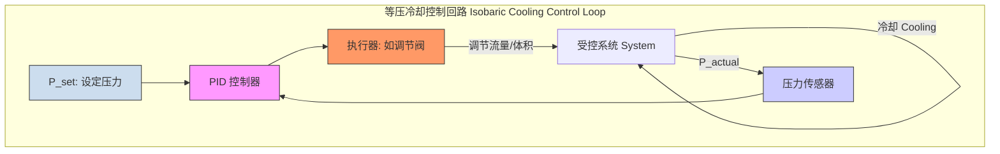
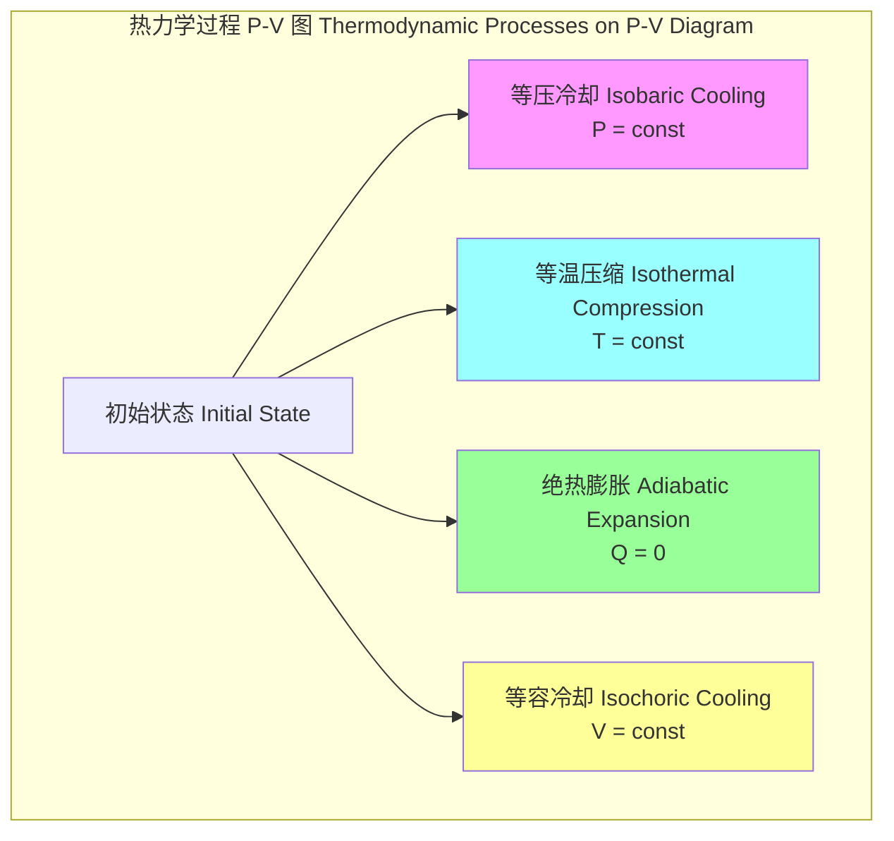

## 等压冷却

等压冷却（Isobaric Cooling）是一个热力学过程，指在系统压力保持恒定的条件下，通过向外界释放热量，使其温度降低的过程。这个过程在自然界和工业应用中都极为常见，其热力学特性由物质的定压热容和热膨胀系数等关键参数决定。

### 核心概念与数学基础

等压过程的核心特征是压力不变，即 $dP = 0$。根据热力学第一定律，系统的内能变化 ($dU$) 等于吸收的热量 ($dQ$) 减去系统对外界做的功 ($dW$)：
$$ dU = dQ - dW $$
在准静态过程中，系统对外界做的功为 $dW = P dV$。因此，第一定律可写为：
$$ dU = dQ - P dV $$
为了更方便地描述等压过程，我们引入一个重要的热力学态函数——焓（Enthalpy），其定义为：
$$ H = U + PV $$
其中：
*   $H$ 是焓 (J)
*   $U$ 是内能 (J)
*   $P$ 是压力 (Pa)
*   $V$ 是体积 (m³)

对焓进行全微分，可得：
$$ dH = dU + P dV + V dP $$
在等压过程中，$dP = 0$，上式简化为：
$$ dH = dU + P dV $$
将此式与热力学第一定律的表达式 $dU = dQ - P dV$ 联立，可得一个关键结论：
$$ dH = dQ $$
这个关系表明，在等压过程中，系统吸收或放出的热量完全等于其焓的变化量。对于一个从初始状态1（温度 $T_1$）到最终状态2（温度 $T_2$）的宏观等压冷却过程，总的放热量 $Q$ 为：
$$ Q = \Delta H = H_2 - H_1 $$
热量交换也可以通过定压热容 $C_p$ 来计算。定压热容定义为在恒定压力下，系统温度每升高单位量所需吸收的热量。
$$ C_p = \left( \frac{\partial H}{\partial T} \right)_P $$
因此，在等压冷却过程中释放的总热量为：
$$ Q = \Delta H = \int_{T_1}^{T_2} n C_{p,m}(T) dT $$
其中：
*   $n$ 是物质的量 (mol)
*   $C_{p,m}(T)$ 是摩尔定压热容 (J/(mol·K))，它可能是温度 $T$ 的函数。对于小范围的温度变化，可近似为常数。

对于理想气体，我们有理想气体状态方程 $PV = nRT$。在等压过程中，$P, n, R$ 均为常数，因此体积与温度成正比，这即是查理定律（Charles's Law）：
$$ \frac{V}{T} = \text{constant} \quad \text{or} \quad \frac{V_1}{T_1} = \frac{V_2}{T_2} $$
随着温度降低（$T_2 < T_1$），理想气体的体积会成比例地减小（$V_2 < V_1$）。

过程中的熵变 ($\Delta S$) 计算如下：
$$ \Delta S = \int_{1}^{2} \frac{dQ_{rev}}{T} = \int_{T_1}^{T_2} \frac{n C_{p,m}(T)}{T} dT $$
若 $C_{p,m}$ 在该温度区间内可视为常数，则：
$$ \Delta S = n C_{p,m} \ln\left(\frac{T_2}{T_1}\right) $$
由于是冷却过程（$T_2 < T_1$），$\ln(T_2/T_1)$ 为负值，因此 $\Delta S < 0$。这符合物理直觉，因为温度降低导致系统微观状态的无序度减小。

### 关键技术参数

下表列出了描述等压冷却过程的关键技术参数。

| 参数 (Parameter) | 符号 (Symbol) | 定义 (Definition) | 单位 (Units) | 重要性 (Significance) |
| :--- | :---: | :--- | :---: | :--- |
| 恒定压力 (Constant Pressure) | $P$ | 过程进行时系统所处的压力 | Pa, bar, atm | 决定物质的相态和热力学性质 |
| 初始温度 (Initial Temperature) | $T_1$ | 冷却过程开始时的温度 | K, °C | 定义了过程的起点和总热量 |
| 最终温度 (Final Temperature) | $T_2$ | 冷却过程结束时的温度 | K, °C | 定义了过程的终点和总热量 |
| 定压比热容 (Specific Heat Capacity at Constant Pressure) | $c_p$ | 单位质量物质在恒压下温度改变1K所吸收或释放的热量 | J/(kg·K) | 决定了冷却相同温差所需的移热量 |
| 传热速率 (Heat Transfer Rate) | $\dot{Q}$ | 单位时间内从系统移走的热量 | W, kW | 决定了冷却过程的速度，是工程设计核心 |
| 等压热膨胀系数 (Isobaric Coeff. of Thermal Expansion) | $\alpha_V$ | $\frac{1}{V} \left(\frac{\partial V}{\partial T}\right)_P$ | K⁻¹ | 描述了物质体积随温度变化的程度 |

### 常见应用场景

等压冷却在多个科学和工程领域有广泛应用，其性能指标直接影响产品质量和工艺效率。

*   **冶金与材料科学**：
    *   **退火 (Annealing)**：将金属缓慢冷却以消除内应力、细化晶粒。例如，钢的完全退火通常在大气压下以 20-30 °C/h 的速率冷却。
    *   **淬火 (Quenching)**：将工件快速冷却以获得高硬度的马氏体相。例如，碳钢在水中淬火，冷却速率可超过 200 °C/s，以抑制珠光体和贝氏体的形成。
*   **食品工业**：
    *   **速冻 (Flash Freezing)**：在常压下使用液氮或冷风快速冷却食品。冷却速率可达 10-100 °C/min，能形成微小的冰晶，最大限度地保持食品的质地和营养。
*   **低温工程**：
    *   **气体液化**：在林德-汉普逊循环（Linde-Hampson cycle）中，高压气体通过节流阀绝热膨胀后，在低压侧的换热器中进行等压冷却，为下一轮循环的气体降温，最终实现液化。
*   **大气科学**：
    *   **气团冷却**：在某一恒定气压高度上，气团因辐射或与冷表面接触而等压冷却。当温度降至露点以下时，水蒸气会凝结成云或雾。

### 实现考量

实现精确的等压冷却过程需要精密的控制和系统设计。

#### 过程控制
维持压力恒定是首要任务。
*   **开放系统**：在大气中进行的冷却过程（如自然风冷）可近似为等压过程，压力为当地大气压。
*   **封闭系统**：需要主动控制。通常采用带有恒定负载的活塞，或更常用的，通过压力传感器和PID（比例-积分-微分）控制器调节出口阀门或泵的速率，以维持设定压力。



#### 数值模拟与复杂度分析
使用计算流体动力学（CFD）模拟等压冷却过程时，需要求解耦合的纳维-斯托克斯方程（动量守恒）和能量方程。
*   **控制方程**：
    *   连续性方程: $\nabla \cdot (\rho \mathbf{u}) = 0$
    *   动量方程: $\frac{\partial (\rho \mathbf{u})}{\partial t} + \nabla \cdot (\rho \mathbf{u} \mathbf{u}) = -\nabla P + \nabla \cdot (\mu \nabla \mathbf{u}) + \mathbf{F}$
    *   能量方程: $\rho c_p \left( \frac{\partial T}{\partial t} + \mathbf{u} \cdot \nabla T \right) = \nabla \cdot (k \nabla T) + S_h$
*   **边界条件**：出口边界通常设置为恒定的压力出口（Constant Pressure Outlet）。
*   **算法复杂度**：对于采用有限体积法（FVM）的瞬态模拟，将计算域离散为 $N$ 个网格单元。
    *   **每时间步复杂度**：求解离散化的线性方程组是主要计算开销。对于迭代求解器（如GMRES），其复杂度约为 $O(N)$ 到 $O(N \log N)$。
    *   **总复杂度**：若总模拟时间为 $T_{sim}$，时间步长为 $\Delta t$，则总步数为 $N_{steps} = T_{sim} / \Delta t$。总计算复杂度约为 $O(N \cdot N_{steps})$。网格密度和时间步长的选择直接影响计算成本和精度。

### 性能特征

*   **冷却效率 ($\eta$)**：定义为实际移走的热量与理论最大可移走热量之比。受隔热性能和换热器效率影响。
*   **温度均匀性**：在冷却过程中的任一时刻，物体内部的温度分布并非完全均匀。通常用温度场的标准差 $\sigma_T$ 来衡量。在材料处理中，高均匀性（低 $\sigma_T$）对于防止热应力和开裂至关重要。
*   **过程可重复性**：对于工业生产，多次冷却过程的最终状态（如 $T_2$）应高度一致。统计过程控制（SPC）图可用于监控。例如，某批次产品的最终温度可能要求控制在 $T_2 = 300.0 \pm 0.5$ K (置信区间为99.7%)。
*   **相变行为**：等压冷却是研究和利用相变最直接的方式。在P-T相图上，等压冷却表现为一条垂直向下的路径。

```mermaid
graph TD
    subgraph "P-T 相图上的等压冷却路径"
        direction LR
        A[气体 Gas] -- "等压冷却 Isobaric Cooling" --> B[液体 Liquid];
        B -- "等压冷却 Isobaric Cooling" --> C[固体 Solid];
    end
    
    subgraph "相图 Phase Diagram"
        TriplePoint三相点 Triple Point
        CriticalPoint临界点 Critical Point
        VaporizationCurve汽化曲线
        FusionCurve熔化曲线
        SublimationCurve升华曲线
        
        TriplePoint -- "Fusion" --> FusionCurve;
        TriplePoint -- "Vaporization" --> VaporizationCurve;
        TriplePoint -- "Sublimation" --> SublimationCurve;
        VaporizationCurve -- "Ends at" --> CriticalPoint;

        GasPhase[气体区域]
        LiquidPhase[液体区域]
        SolidPhase[固体区域]

        PathStartP, T1 -- "P=const, T↓" --> PathEndP, T2
    end

    A --> GasPhase;
    B --> LiquidPhase;
    C --> SolidPhase;
    
    style PathStart fill:#f00,stroke:#f00
    style PathEnd fill:#00f,stroke:#00f
```

### 相关技术对比

等压冷却只是四种基本热力学过程之一。与其他过程的对比有助于更深刻地理解其特性。

| 特性 (Property) | 等压冷却 (Isobaric Cooling) | 等容冷却 (Isochoric Cooling) | 等温压缩 (Isothermal Compression) | 绝热膨胀 (Adiabatic Expansion) |
| :--- | :--- | :--- | :--- | :--- |
| **条件** | $P = \text{const}$ | $V = \text{const}$ | $T = \text{const}$ | $Q = 0$ |
| **第一定律** | $dU = dQ - P dV$ | $dU = dQ$ | $dQ = dW$ | $dU = -dW$ |
| **热量 $Q$** | $\Delta H = \int n C_p dT < 0$ | $\Delta U = \int n C_v dT < 0$ | $nRT \ln(V_1/V_2) < 0$ | $0$ |
| **功 $W$** | $\int P dV = P\Delta V < 0$ | $0$ | $nRT \ln(V_1/V_2) < 0$ | $-\Delta U > 0$ |
| **内能 $\Delta U$** | $\int n C_v dT < 0$ | $\int n C_v dT < 0$ | $0$ (理想气体) | $\int n C_v dT < 0$ |
| **熵 $\Delta S$** | $\int \frac{n C_p}{T} dT < 0$ | $\int \frac{n C_v}{T} dT < 0$ | $nR \ln(V_2/V_1) < 0$ | $0$ (可逆过程) |
| **理想气体关系** | $V/T = \text{const}$ | $P/T = \text{const}$ | $PV = \text{const}$ | $PV^\gamma = \text{const}$ |



### 参考文献

1.  Çengel, Y. A., & Boles, M. A. (2019). *Thermodynamics: An Engineering Approach* (9th ed.). McGraw-Hill Education. (A foundational textbook covering all basic thermodynamic processes).
2.  Totten, G. E., & MacKenzie, D. S. (2003). *Handbook of Quenching and Quenchants*. CRC Press. (Provides detailed quantitative data on isobaric cooling in metallurgy).
3.  Sun, D. W. (Ed.). (2016). *Handbook of Frozen Food Processing and Packaging*. CRC press. DOI: [10.1201/b19490](https://doi.org/10.1201/b19490). (Discusses the application of isobaric and near-isobaric cooling in the food industry).
4.  Barron, R. F. (1985). *Cryogenic Systems*. Oxford University Press. (Details the role of isobaric cooling in heat exchangers for gas liquefaction cycles).