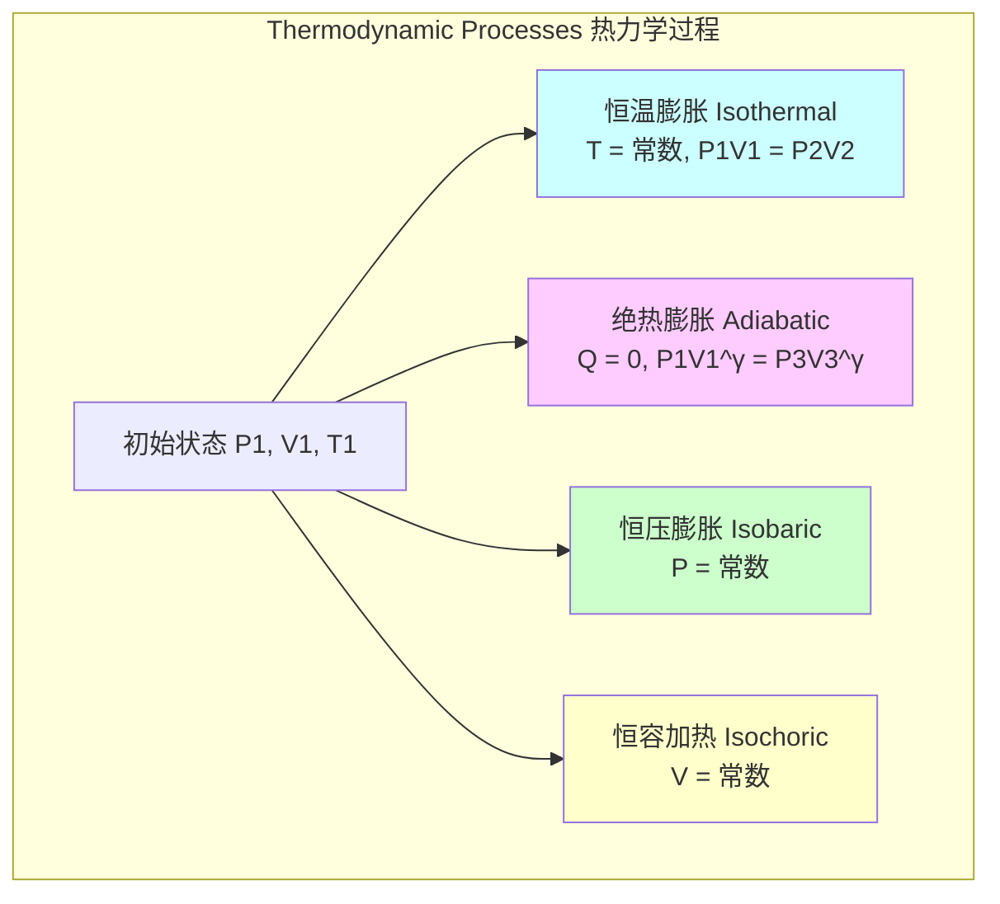
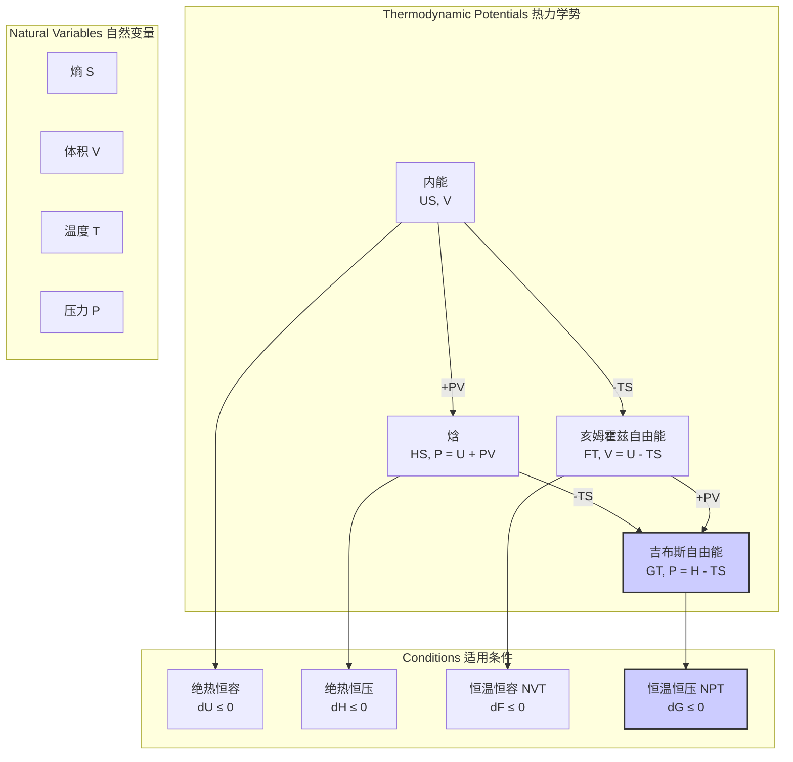

## 恒压恒温条件

恒压恒温（Isobaric-Isothermal）条件指的是一个热力学系统或过程，其压力（P）和温度（T）在整个过程中都保持恒定。这种条件在自然界和工程应用中，尤其是在相变过程和某些化学反应中，非常普遍。在这些条件下，系统的状态由吉布斯自由能（Gibbs Free Energy）决定，它是判断过程自发性和平衡的关键热力学势。

### 核心概念与数学基础

#### 1. 热力学第一定律
热力学第一定律指出，系统内能的变化（$dU$）等于系统吸收的热量（$\delta Q$）减去系统对外做的功（$\delta W$）。

$$ dU = \delta Q - \delta W $$

其中：
*   $dU$ 是系统内能的无穷小变化。
*   $\delta Q$ 是系统吸收的无穷小热量。
*   $\delta W$ 是系统对外做的无穷小功。

#### 2. 恒压过程 (Isobaric Process)
在恒压过程中，$dP = 0$。如果系统体积从 $V_1$ 变为 $V_2$，系统对外做的功为：

$$ W = \int_{V_1}^{V_2} P dV = P(V_2 - V_1) = P\Delta V $$

在恒压条件下，引入一个非常有用的热力学函数——焓（Enthalpy, $H$）。

$$ H = U + PV $$

其微分形式为 $dH = dU + P dV + V dP$。在恒压（$dP=0$）条件下，这简化为：

$$ dH = dU + P dV $$

将热力学第一定律 $dU = \delta Q_p - P dV$（下标 $p$ 表示恒压）代入，我们得到：

$$ dH = (\delta Q_p - P dV) + P dV = \delta Q_p $$

这表明，在恒压过程中，系统焓的变化量等于其吸收的热量。

#### 3. 恒温过程 (Isothermal Process)
在恒温过程中，$dT = 0$。对于理想气体，其内能仅是温度的函数，因此在恒温过程中，理想气体的内能不变（$dU = 0$）。

根据理想气体状态方程：

$$ PV = nRT $$

在恒温恒量（n为常数）条件下，$PV$ 的乘积为常数。

#### 4. 恒压恒温条件 (Isobaric-Isothermal Conditions)
当 $dP=0$ 和 $dT=0$ 同时满足时，系统处于恒压恒温状态。对于一个组分固定的封闭系统，根据理想气体状态方程 $V = (nRT)/P$，如果 $n, R, T, P$ 均为常数，则体积 $V$ 也必须是常数。这意味着对于此类系统，恒压恒温过程必然也是恒容过程，系统状态没有任何变化。

然而，恒压恒温条件在以下两种情况中具有重要意义：
*   **相变过程**：当物质发生相变（如熔化、沸腾、升华）时，它可以在恒定的温度和压力下吸收或释放大量的热量（潜热），同时其体积会发生显著变化。
*   **开放系统或化学反应**：在流动系统或发生化学反应的系统中，物质的量（$n$）可以改变，即使 $P$ 和 $T$ 保持不变，系统的其他宏观性质（如体积、内能）也可以发生变化。

#### 5. 吉布斯自由能 (Gibbs Free Energy)
对于恒压恒温过程，最关键的热力学势是吉布斯自由能 ($G$)。

$$ G = H - TS = U + PV - TS $$

其全微分形式为：

$$ dG = dU + P dV + V dP - T dS - S dT $$

根据热力学第二定律，$TdS \ge \delta Q$。结合第一定律 $\delta Q = dU + \delta W$，对于只做体积功的系统 $\delta W = P dV$，我们有 $TdS \ge dU + P dV$。
因此，$dU - TdS + P dV \le 0$。

将此不等式代入 $dG$ 的表达式，并在恒压（$dP=0$）和恒温（$dT=0$）条件下，我们得到：

$$ dG_{T,P} \le 0 $$

这个重要的关系表明：
*   $dG_{T,P} < 0$：过程是自发的。
*   $dG_{T,P} = 0$：系统处于平衡状态。
*   $dG_{T,P} > 0$：过程是非自发的，其逆过程是自发的。

在相变过程中，两相共存时系统处于平衡状态，因此 $\Delta G_{phase\_change} = 0$。

### 关键技术规格

以下表格展示了在标准大气压下，1摩尔水发生沸腾（液态变为气态）这一典型恒压恒温过程中的热力学参数。

| 参数 (符号) | 定义 | 数值 | 单位 |
| :--- | :--- | :--- | :--- |
| 压力 ($P$) | 系统压力 | 101325 | Pa |
| 温度 ($T$) | 系统温度 (沸点) | 373.15 | K |
| 摩尔汽化焓 ($\Delta H_{vap}$) | 1摩尔液体汽化吸收的热量 | +40.66 | kJ/mol |
| 吸收的热量 ($Q$) | 系统吸收的热量 | +40.66 | kJ/mol |
| 体积变化 ($\Delta V_{vap}$) | $V_{gas} - V_{liquid}$ | ≈ 30.1 | L/mol |
| 对外做的功 ($W$) | $P \Delta V_{vap}$ | +3.10 | kJ/mol |
| 内能变化 ($\Delta U_{vap}$) | $\Delta H_{vap} - P\Delta V_{vap}$ | +37.56 | kJ/mol |
| 吉布斯自由能变化 ($\Delta G_{vap}$) | $\Delta H_{vap} - T\Delta S_{vap}$ | 0 | kJ/mol |

**计算说明:**
*   $V_{gas}$ 使用理想气体方程计算: $V_{gas} = nRT/P = (1 \times 8.314 \times 373.15) / 101325 \approx 0.0306 \text{ m}^3/\text{mol}$。
*   $V_{liquid}$ 可忽略不计或用密度计算: $V_{liquid} = M/\rho \approx 18 \text{ g/mol} / 958 \text{ kg/m}^3 \approx 1.88 \times 10^{-5} \text{ m}^3/\text{mol}$。
*   $W = P \Delta V \approx 101325 \text{ Pa} \times 0.0306 \text{ m}^3/\text{mol} \approx 3101 \text{ J/mol}$。
*   $\Delta G_{vap} = 0$ 因为沸腾是在平衡状态下发生的。

### 常见用例与性能指标

*   **相变热交换器 (锅炉、冷凝器)**
    *   **描述**: 在锅炉中，水在恒定压力下被加热至沸点，吸收大量汽化热变为蒸汽。在冷凝器中，蒸汽在恒定压力下冷凝，释放汽化热。
    *   **性能指标**:
        *   **传热效率 ($\eta$)**: 实际传热量与理论最大传热量之比，通常 > 90%。
        *   **潜热 (Latent Heat)**: 如水的汽化潜热为 2260 kJ/kg，这是衡量其能量携带能力的关键指标。

*   **化学反应器**
    *   **描述**: 许多工业化学反应，特别是在液相中，被控制在恒定的温度和压力下进行，以优化产率和选择性。例如，在连续搅拌釜反应器（CSTR）中。
    *   **性能指标**:
        *   **产率 (Yield)**: 目标产物的实际产量与理论产量的百分比。
        *   **转化率 (Conversion)**: 反应物转化为产物的百分比。
        *   **选择性 (Selectivity)**: 目标产物产量与总产物产量之比。

*   **材料科学中的退火处理**
    *   **描述**: 将金属或合金加热到特定温度，保持一段时间（恒温），然后缓慢冷却。这个过程在恒定的大气压下进行。
    *   **性能指标**:
        *   **晶粒尺寸**: 退火后材料的平均晶粒直径，影响材料的机械性能。
        *   **硬度 (Hardness)**: 如维氏硬度（HV）或洛氏硬度（HRC）的测量值。

### 实现考量与算法分析

在计算模拟领域，特别是分子动力学（MD）中，模拟恒压恒温条件需要特殊的算法，即使用 **NPT系综**（粒子数N，压力P，温度T恒定）。

*   **算法实现**:
    *   **温度控制 (Thermostat)**:
        *   **Nosé-Hoover 恒温器**: 引入一个额外的自由度（热浴）与系统耦合，通过动态调整该自由度来控制系统动能（温度）。它能生成正确的正则系综分布。
        *   **Berendsen 恒温器**: 以指数方式将系统温度耦合到外部热浴，算法简单但不能严格保证正确的系综分布，常用于系统弛豫。
    *   **压力控制 (Barostat)**:
        *   **Parrinello-Rahman 变压器**: 允许模拟盒子的形状和大小动态变化，以将内部压力耦合到外部目标压力。适用于各向同性和各向异性压力控制。
        *   **Berendsen 变压器**: 类似于温度控制，通过缩放盒子体积将压力耦合到目标值。

*   **算法复杂度**:
    *   这些恒温器和变压器算法的计算开销通常很小。对于一个包含 $N$ 个粒子的系统，其计算复杂度通常是 $O(N)$ 或 $O(1)$，远小于力场计算的复杂度（对于短程力是 $O(N)$，对于长程力是 $O(N \log N)$）。因此，在MD模拟中加入NPT控制对总计算时间影响不大。

### 性能特征与统计度量

在受控或模拟的恒压恒温系统中，温度和压力并非绝对静止，而是在设定值附近波动。这些波动的统计特征由系统的热力学性质决定。

*   **温度波动**:
    *   在正则系综（NVT）或NPT系综中，温度的均方根涨落与系统的热容 $C_V$ 相关。
    *   $$ \langle (\delta T)^2 \rangle = \frac{k_B T^2}{C_V} $$
    *   其中 $k_B$ 是玻尔兹曼常数。热容越大的系统，温度波动越小。

*   **体积/压力波动**:
    *   在NPT系综中，体积会波动以维持恒定的平均压力。体积的涨落与等温压缩系数 $\kappa_T$ 相关。
    *   $$ \langle (\delta V)^2 \rangle = k_B T V \kappa_T $$
    *   其中 $\kappa_T = -\frac{1}{V}(\frac{\partial V}{\partial P})_T$。压缩系数越小的物质（越难被压缩），其体积波动越小。

*   **控制性能**:
    *   在工程控制系统中，性能由设定点（Setpoint）与过程变量（Process Variable）之间的偏差来衡量。
    *   **统计度量**:
        *   **平均偏差**: 应接近于零。
        *   **标准差 ($\sigma$)**: 衡量波动的幅度。例如，一个精密的恒温槽可能要求温度标准差 $\sigma_T < 0.01$ K。
        *   **置信区间**: 例如，系统温度有95%的概率落在 $[T_{setpoint} - 1.96\sigma_T, T_{setpoint} + 1.96\sigma_T]$ 区间内。

### 相关技术与比较数学模型

恒压恒温过程是四种基本热力学过程之一。下图展示了它们在理想气体P-V图上的关系。

#### 热力学势的比较

不同的热力学条件对应不同的特征热力学势。它们通过勒让德变换（Legendre Transformation）相互关联。

*   **吉布斯自由能 ($G$) vs. 亥姆霍兹自由能 ($F$)**:
    *   $G(T, P)$ 是在恒温恒压（NPT）条件下决定平衡和自发性的关键函数。它代表了系统在恒温恒压下可以做的最大非体积功。
    *   $F(T, V)$ 是在恒温恒容（NVT）条件下决定平衡和自发性的关键函数。它代表了系统在恒温下可以转化为功的总能量。

### 参考文献

1.  Atkins, P., de Paula, J. (2014). *Atkins' Physical Chemistry*. 10th Edition. Oxford University Press.
2.  Hoover, W. G. (1985). Canonical dynamics: Equilibrium phase-space distributions. *Physical Review A*, 31(3), 1695–1697. DOI: [10.1103/PhysRevA.31.1695](https://doi.org/10.1103/PhysRevA.31.1695)
3.  Parrinello, M., & Rahman, A. (1981). Polymorphic transitions in single crystals: A new molecular dynamics method. *Journal of Applied Physics*, 52(12), 7182–7190. DOI: [10.1063/1.328693](https://doi.org/10.1063/1.328693)
4.  Callen, H. B. (1985). *Thermodynamics and an Introduction to Thermostatistics*. 2nd Edition. John Wiley & Sons.