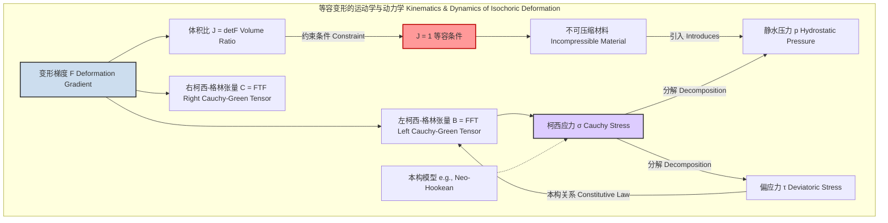
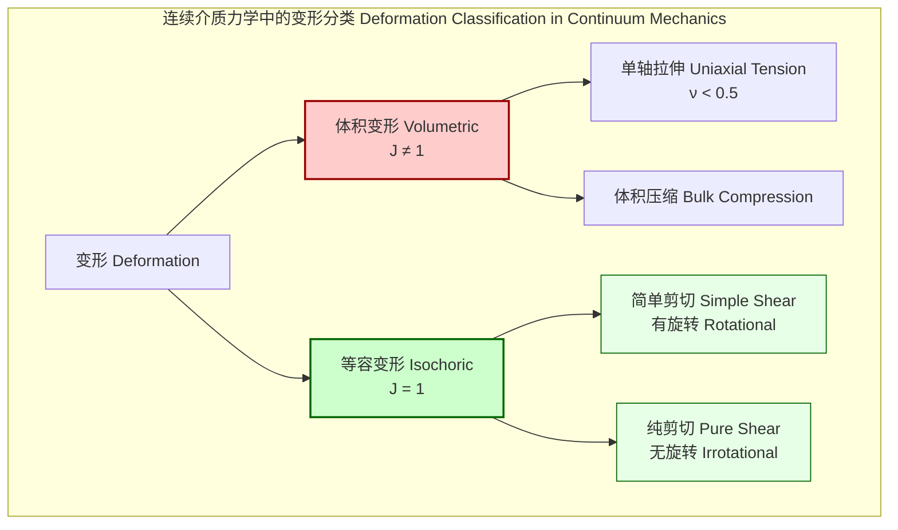

## 等容剪切 (Isochoric Shearing)

等容剪切是一种变形过程，其中材料经受剪切变形，但其总体积保持不变。这个概念在连续介质力学、材料科学、流体动力学和地球物理学等领域至关重要，特别是在处理橡胶、弹性体、流体和塑性金属等不可压缩或近乎不可压缩的材料时。

### 1. 核心概念与数学基础

等容剪切的数学描述基于连续介质力学中的运动学。其核心在于变形梯度张量及其行列式。

#### 1.1 变形梯度张量 (Deformation Gradient Tensor)

一个物体的变形可以用变形梯度张量 $\mathbf{F}$ 来描述。它将参考构型（未变形状态）中的一个微元线段 $d\mathbf{X}$ 映射到当前构型（变形后状态）中的对应线段 $d\mathbf{x}$。

$$ d\mathbf{x} = \mathbf{F} d\mathbf{X} $$

其中：
*   $\mathbf{F}$ 是一个二阶张量，其分量为 $F_{ij} = \frac{\partial x_i}{\partial X_j}$。
*   $\mathbf{x}$ 是当前构型中的位置向量。
*   $\mathbf{X}$ 是参考构型中的位置向量。

#### 1.2 体积变化与等容条件

变形前后微元体积的变化由 $\mathbf{F}$ 的行列式 $J$ 给出，也称为体积比。

$$ J = \det(\mathbf{F}) $$

一个过程是**等容的 (isochoric)**，当且仅当其体积在整个变形过程中保持不变。这在数学上表示为：

$$ J = \det(\mathbf{F}) = 1 $$

这个条件是等容剪切的根本约束。对于几乎不可压缩的材料（如金属的塑性变形），通常假设 $J \approx 1$。对于理想的不可压缩材料（如橡胶或理想流体），严格要求 $J=1$。

#### 1.3 变形梯度的乘法分解

任何变形梯度 $\mathbf{F}$ 都可以乘法分解为一个体积部分和一个等容（或偏）部分：

$$ \mathbf{F} = J^{1/3} \bar{\mathbf{F}} $$

其中：
*   $J^{1/3}\mathbf{I}$ 代表一个纯粹的、各向同性的体积膨胀或收缩。
*   $\bar{\mathbf{F}}$ 是变形的**等容部分**，它描述了形状的改变而不改变体积。根据定义，$\det(\bar{\mathbf{F}}) = 1$。

等容剪切是一种变形，其运动学完全由 $\bar{\mathbf{F}}$ 描述。

#### 1.4 简单剪切：一个典型的等容变形

简单剪切是等容剪切最经典的例子。考虑一个物体，其变形由以下映射给出：
$x_1 = X_1 + \gamma X_2$
$x_2 = X_2$
$x_3 = X_3$

其中 $\gamma$ 是剪切应变量。其变形梯度张量 $\mathbf{F}$ 为：

$$
\mathbf{F} = \begin{pmatrix} 1 & \gamma & 0 \\ 0 & 1 & 0 \\ 0 & 0 & 1 \end{pmatrix}
$$

计算其行列式：$J = \det(\mathbf{F}) = 1 \cdot (1 \cdot 1 - 0 \cdot 0) - \gamma \cdot (0 \cdot 1 - 0 \cdot 0) + 0 = 1$。
由于 $J=1$，简单剪切是一种纯粹的等容变形。

#### 1.5 应力与本构关系

在等容变形下，柯西应力张量 $\boldsymbol{\sigma}$ 通常被分解为一个静水压力部分和一个偏应力部分：

$$ \boldsymbol{\sigma} = -p\mathbf{I} + \boldsymbol{\tau} $$

其中：
*   $p$ 是静水压力。对于理想的不可压缩材料，压力 $p$ 是一个拉格朗日乘子，用于强制执行 $J=1$ 的约束，它不能由变形本身唯一确定。
*   $\boldsymbol{\tau}$ 是偏应力张量，它与材料的形状改变（即等容变形）相关。
*   $\mathbf{I}$ 是单位张量。

本构模型（Constitutive Model）描述了应力如何依赖于变形。对于超弹性不可压缩材料，应变能密度函数 $W$ 仅是等容变形的函数。例如，对于新胡克（Neo-Hookean）模型：

$$ W(\bar{\mathbf{B}}) = \frac{\mu}{2} (\text{tr}(\bar{\mathbf{B}}) - 3) $$

其中 $\mu$ 是剪切模量，$\bar{\mathbf{B}} = \bar{\mathbf{F}}\bar{\mathbf{F}}^T$ 是等容左柯西-格林变形张量。相应的柯西应力为：

$$ \boldsymbol{\sigma} = -p\mathbf{I} + \mu \bar{\mathbf{B}} $$

#### 1.6 连续介质力学中的概念关系

### 2. 关键技术规格

下表总结了描述等容剪切及其相关材料行为的关键参数。

| 参数 (Parameter) | 符号 (Symbol) | 定义 (Definition) | 典型值/单位 (Typical Value/Unit) |
| :--- | :--- | :--- | :--- |
| **体积比 (Volume Ratio)** | $J$ | 变形后体积与初始体积之比 | $J=1$ (无量纲) |
| **泊松比 (Poisson's Ratio)** | $\nu$ | 横向应变与轴向应变之比的负值 | $\nu=0.5$ (对于各向同性不可压缩材料) |
| **剪切应变 (Shear Strain)** | $\gamma$ | 衡量剪切变形程度的工程量 | 无量纲；范围从 $10^{-6}$ 到 > 10 |
| **剪切率 (Shear Rate)** | $\dot{\gamma}$ | 剪切应变随时间的变化率 | $s^{-1}$; 流体中可达 $10^6 s^{-1}$ |
| **剪切模量 (Shear Modulus)** | $G$ 或 $\mu$ | 剪切应力与剪切应变在线性弹性范围内的比值 | Pa (帕斯卡); 橡胶: 0.5-10 MPa; 钢: ~80 GPa |
| **动力粘度 (Dynamic Viscosity)** | $\eta$ | 牛顿流体中剪切应力与剪切率的比值 | Pa·s; 水: $10^{-3}$ Pa·s; 蜂蜜: ~10 Pa·s |
| **静水压力 (Hydrostatic Pressure)** | $p$ | 各向同性的压力分量 | Pa; 取决于边界条件和约束 |

### 3. 常见用例

等容剪切模型广泛应用于科学和工程领域，以分析和预测材料行为。

| 应用领域 (Use Case) | 关键性能指标 (Key Performance Metric) | 量化性能示例 (Quantitative Example) |
| :--- | :--- | :--- |
| **弹性体和橡胶表征** | 剪切模量 $G$ 的非线性 | 通过双轴或纯剪切实验测量，应变范围 0-200% |
| **金属塑性成形** | 等效塑性应变率 $\dot{\bar{\varepsilon}}^p$ | 高速锻造中 $\dot{\bar{\varepsilon}}^p > 10^3 s^{-1}$ |
| **不可压缩流体动力学 (CFD)** | 雷诺数 $Re$ | 管道流中 $Re > 4000$ 表示湍流，其流动模型基于等容假设 |
| **生物力学 (软组织)** | 应变能函数 $W$ | 模拟动脉壁在血压下的变形，剪切应变可达 50% |
| **地球物理学** | 地幔对流速度 | 模拟地幔岩石的蠕变流动，剪切率极低，约为 $10^{-14} s^{-1}$ |

### 4. 实现考量

在数值模拟（尤其是有限元法，FEM）中实现等容约束是一个重大的挑战。

*   **数值锁定 (Numerical Locking):**
    当使用标准的位移元来模拟不可压缩材料时，会发生体积锁定现象。单元变得过于刚硬，无法准确表示等容变形，导致结果严重失真。

*   **混合公式 (Mixed Formulations):**
    为了解决锁定问题，最常用的方法是混合U-P公式。该方法将位移场 $\mathbf{u}$ 和压力场 $p$ 作为独立的未知变量。通过求解一个更大的耦合方程组来同时满足力平衡和不可压缩约束。

*   **罚函数法 (Penalty Method):**
    另一种方法是在系统的总势能中加入一个罚函数项，以近似实现不可压缩性：
    $$ \Pi(\mathbf{u}) = \Pi_{dev}(\mathbf{u}) + \frac{\kappa}{2} \int_{\Omega_0} (J-1)^2 dV_0 $$
    其中 $\kappa$ 是一个大的正数（罚参数）。当 $J \to 1$ 时，罚函数项趋于零。这种方法实现简单，但 $\kappa$ 的选择非常关键，过大会导致病态问题，过小则无法有效约束体积。

*   **算法复杂度分析:**
    对于一个包含 $N$ 个自由度的有限元模型：
    *   使用**直接求解器**（如LU分解）求解线性化的方程组，其计算复杂度通常在 $O(N^2)$ 到 $O(N^3)$ 之间。
    *   使用**迭代求解器**（如共轭梯度法），其复杂度通常更优，约为 $O(N^k)$，其中 $1 < k < 2$，具体取决于问题的条件数和预处理器的效率。混合公式会增加总自由度，但通常能改善收敛性。

### 5. 性能特征

材料在等容剪切下的响应揭示了其内在的力学性能。

*   **应力-应变响应:**
    *   **超弹性材料 (Hyperelastic):** 如橡胶，在大的等容剪切下表现出显著的非线性应力-应变关系，通常伴随着应变硬化。
    *   **金属 (Metals):** 在塑性范围内，金属通常遵循等容流动法则。其剪切应力-应变曲线表现出屈服、加工硬化，最终可能发生剪切断裂。

*   **能量耗散:**
    *   **粘弹性材料 (Viscoelastic):** 如聚合物和生物组织，在循环等容剪切下会表现出滞后现象。一部分机械能被储存（与储能模量 $G'$ 相关），另一部分则被耗散为热量（与损耗模量 $G''$ 相关）。

*   **统计度量:**
    在实验表征中，力学性能参数通常存在分散性。报告结果时应包含统计度量以确保严谨性。例如，从10个样本中测得的剪切模量可以报告为：
    $G = 1.52 \pm 0.08$ MPa (均值 ± 标准差)，置信区间为 [1.47, 1.57] MPa (95% CI)。

### 6. 相关技术

等容剪切是广义变形理论中的一个特定类别。与其他变形模式的比较有助于更深入的理解。

#### 6.1 等容变形 vs. 体积变形

*   **等容剪切 (Isochoric Shearing):** 如前所述，$J=1$。对于各向同性材料，这对应于泊松比 $\nu = 0.5$。
*   **单轴拉伸 (Uniaxial Tension):** 这是典型的体积变形。若在一个方向上施加拉伸 $\lambda$，则在横向上的收缩由泊松比 $\nu$ 决定。变形梯度为 $\mathbf{F} = \text{diag}(\lambda, \lambda^{-\nu}, \lambda^{-\nu})$（对于可压缩材料）。体积比为 $J = \lambda^{1-2\nu}$。只有当 $\nu=0.5$ 时，$J$ 才等于 1。

#### 6.2 简单剪切 vs. 纯剪切

这两种都是等容变形，但它们的运动学特性不同。

*   **简单剪切 (Simple Shear):**
    变形梯度为 $\mathbf{F}_{simple} = \begin{pmatrix} 1 & \gamma & 0 \\ 0 & 1 & 0 \\ 0 & 0 & 1 \end{pmatrix}$。
    这种变形包含刚体旋转。

*   **纯剪切 (Pure Shear):**
    纯剪切是在一个方向上拉伸，在垂直方向上以相同比例压缩，同时保持体积不变。
    变形梯度为 $\mathbf{F}_{pure} = \begin{pmatrix} \lambda & 0 & 0 \\ 0 & 1/\lambda & 0 \\ 0 & 0 & 1 \end{pmatrix}$。
    这种变形是无旋转的（irrotational）。

尽管两者在小应变下近似相等，但在大变形下，它们的应力响应和稳定性行为有显著差异。

### 7. 参考文献

1.  Ogden, R. W. (1997). *Non-linear elastic deformations*. Dover Publications. (A foundational text on large deformation elasticity).
2.  Holzapfel, G. A. (2000). *Nonlinear solid mechanics: A continuum approach for engineering*. John Wiley & Sons. DOI: [10.1002/0470870196](https://doi.org/10.1002/0470870196)
3.  Simo, J. C., & Taylor, R. L. (1985). Consistent tangent operators for finite element analysis. *Computer Methods in Applied Mechanics and Engineering*, 48(1), 101-118. DOI: [10.1016/0045-7825(85)90070-2](https://doi.org/10.1016/0045-7825(85)90070-2)
4.  Zienkiewicz, O. C., Taylor, R. L., & Fox, D. (2014). *The finite element method for solid and structural mechanics*. Butterworth-Heinemann. (Discusses mixed formulations for incompressibility).