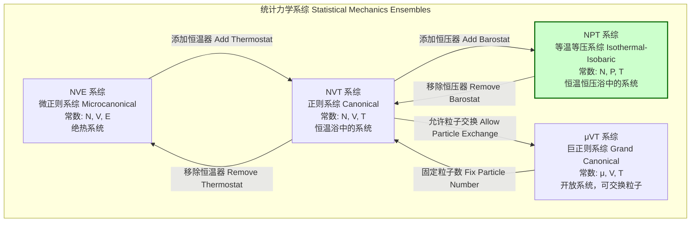

## 等温等压模拟

等温等压（Isothermal-Isobaric）模拟，通常称为NPT模拟，是一种分子动力学（MD）或蒙特卡洛（MC）模拟技术，用于在恒定粒子数（N）、恒定压强（P）和恒定温度（T）下研究分子系统。该系综在统计力学中被称为等温等压系综，它非常适合模拟在标准实验室条件下进行的实验，因为实验通常在恒定的温度和大气压下进行。

### 核心概念与数学基础

NPT系综的根本在于其统计力学定义。一个处于平衡状态的NPT系统，其微观状态（由粒子坐标 $\mathbf{r}^N$，动量 $\mathbf{p}^N$ 和系统体积 $V$ 定义）的概率分布由以下吉布斯分布给出：

$$
\rho(\mathbf{r}^N, \mathbf{p}^N, V) = \frac{1}{\Delta(N, P, T)} \exp\left(-\frac{H(\mathbf{r}^N, \mathbf{p}^N) + PV}{k_B T}\right)
$$

其中：
*   $\mathbf{r}^N = \{\mathbf{r}_1, \dots, \mathbf{r}_N\}$ 是 $N$ 个粒子的位置向量。
*   $\mathbf{p}^N = \{\mathbf{p}_1, \dots, \mathbf{p}_N\}$ 是 $N$ 个粒子的动量向量。
*   $V$ 是系统的体积。
*   $H(\mathbf{r}^N, \mathbf{p}^N) = K(\mathbf{p}^N) + U(\mathbf{r}^N)$ 是系统的哈密顿量，即动能 $K$ 和势能 $U$ 之和。
*   $P$ 是外部施加的压强。
*   $T$ 是系统的温度。
*   $k_B$ 是玻尔兹曼常数。
*   $\Delta(N, P, T)$ 是NPT系综的配分函数，作为归一化因子：
    $$
    \Delta(N, P, T) = \frac{1}{N!h^{3N}} \int dV \int d\mathbf{r}^N \int d\mathbf{p}^N \exp\left(-\frac{H(\mathbf{r}^N, \mathbf{p}^N) + PV}{k_B T}\right)
    $$
    其中 $h$ 是普朗克常数。

为了在分子动力学中实现NPT系综，需要引入控制温度和压强的机制，即恒温器（thermostat）和恒压器（barostat）。这通常通过扩展拉格朗日方法实现，将温度和压强的控制变量作为额外的自由度引入系统。

#### 恒温器（Thermostat）

恒温器的作用是与系统交换能量，使其动能的平均值维持在与目标温度 $T$ 相对应的值。

**Nosé-Hoover 恒温器**
Nosé-Hoover方法是最严格的恒温器之一，它能生成正确的正则系综（NVT）或等温等压系综（NPT）的相空间分布。它通过引入一个热浴自由度 $\xi$ 和其“质量” $Q_T$ 来实现。修改后的运动方程为：

$$
\begin{cases}
\dot{\mathbf{r}}_i = \frac{\mathbf{p}_i}{m_i} \\
\dot{\mathbf{p}}_i = \mathbf{F}_i - \xi \mathbf{p}_i \\
\dot{\xi} = \frac{1}{Q_T} \left( \sum_{i=1}^N \frac{\mathbf{p}_i^2}{m_i} - g k_B T \right)
\end{cases}
$$

其中：
*   $\mathbf{r}_i, \mathbf{p}_i, m_i, \mathbf{F}_i$ 分别是粒子 $i$ 的位置、动量、质量和受到的力。
*   $\xi$ 是热浴的摩擦系数（动态变量）。
*   $Q_T$ 是热浴的惯性参数或“质量”，它决定了温度耦合的强度。$Q_T$ 通常与弛豫时间 $\tau_T$ 相关，$Q_T = g k_B T \tau_T^2$。
*   $g$ 是系统的总自由度数。

#### 恒压器（Barostat）

恒压器的作用是动态调整系统的体积，以使系统内部的瞬时压强围绕目标压强 $P_{ref}$ 波动。

**Parrinello-Rahman 恒压器**
该方法允许模拟盒的形状和大小各向异性地变化，对于研究固态相变或非各向同性系统至关重要。模拟盒由一个 $3 \times 3$ 的矩阵 $\mathbf{h}$ 定义，粒子坐标是分数坐标 $\mathbf{s}_i$ 在此基下的表示：$\mathbf{r}_i = \mathbf{h} \mathbf{s}_i$。系统的体积为 $V = \det(\mathbf{h})$。
其运动方程（与Nosé-Hoover恒温器耦合）为：

$$
\begin{cases}
\ddot{\mathbf{s}}_i = -\frac{1}{m_i} \mathbf{h}^{-1} \frac{\partial U}{\partial \mathbf{s}_i} - (\mathbf{h}^{-1} \dot{\mathbf{h}}) \dot{\mathbf{s}}_i - \xi (\dot{\mathbf{s}}_i + (\mathbf{h}^{-1} \dot{\mathbf{h}}) \mathbf{s}_i) \\
W \ddot{\mathbf{h}} = ( \mathbf{\Pi} - P_{ref} \mathbf{I} ) V (\mathbf{h}^{-1})^T - \xi W \dot{\mathbf{h}}
\end{cases}
$$

其中：
*   $W$ 是恒压器的惯性参数或“质量”，决定了压强耦合的强度，与弛豫时间 $\tau_P$ 相关。
*   $\mathbf{\Pi}$ 是瞬时压强张量，通过维里定理计算：
    $$
    \mathbf{\Pi} = \frac{1}{V} \left( \sum_{i=1}^N m_i (\dot{\mathbf{r}}_i \otimes \dot{\mathbf{r}}_i) + \sum_{i<j} \mathbf{r}_{ij} \otimes \mathbf{F}_{ij} \right)
    $$
    其中 $\otimes$ 表示外积。
*   $P_{ref}$ 是参考压强。
*   $\mathbf{I}$ 是单位矩阵。

对于各向同性的压强耦合（例如Berendsen恒压器或Nosé-Hoover的简化形式），盒子矩阵 $\mathbf{h}$ 被简化为一个标量体积 $V$。

---

### 关键技术规格

在设置NPT模拟时，必须精确指定以下参数。这些参数的选择对模拟的稳定性、准确性和效率至关重要。

| 参数 (Parameter) | 符号 (Symbol) | 典型值 (Typical Value) | 单位 (Unit) | 描述 (Description) |
| :--- | :---: | :---: | :---: | :--- |
| 参考温度 (Reference Temperature) | $T_{ref}$ | 273.15 - 310.15 | K | 系统的目标温度，例如水的冰点或体温。 |
| 参考压强 (Reference Pressure) | $P_{ref}$ | 1.0 | bar, atm | 系统的目标压强，通常是标准大气压。 |
| 恒温器耦合时间常数 (Thermostat Coupling Time Constant) | $\tau_T$ | 0.1 - 2.0 | ps | 温度耦合的强度。值越小，耦合越强，但可能导致振荡。 |
| 恒压器耦合时间常数 (Barostat Coupling Time Constant) | $\tau_P$ | 0.5 - 5.0 | ps | 压强耦合的强度。通常比 $\tau_T$ 大，以避免体积剧烈波动。 |
| 等温压缩系数 (Isothermal Compressibility) | $\kappa_T$ | 4.5e-5 (for water) | bar⁻¹ | 描述系统体积对压强变化的响应。用于某些恒压器算法。 |
| 积分时间步长 (Integration Time Step) | $\Delta t$ | 1 - 2 | fs | 数值积分的时间步长。必须足够小以精确描述最快的振动模式。 |

---

### 常见用例与量化性能指标

NPT模拟在计算化学、物理和材料科学中有广泛应用。

*   **平衡性质的计算**:
    *   **用例**: 确定液体在给定温度和压强下的平衡密度、比热容、热膨胀系数等。
    *   **性能指标**: 对于TIP3P水模型，在300 K和1 bar下进行NPT模拟，通常可在1-5纳秒（ns）内达到平衡密度，其值为 997 ± 3 kg/m³，与实验值非常接近。

*   **相变研究**:
    *   **用例**: 通过在不同温度下进行一系列NPT模拟，研究物质的熔化、沸腾或固-固相变。
    *   **性能指标**: 在模拟中，相变点可以通过监测势能或体积的突变来识别。例如，通过缓慢加热固体氩的NPT模拟，可以确定其熔点，误差在5%以内。

*   **生物分子模拟**:
    *   **用例**: 研究蛋白质、DNA或膜在接近生理条件（恒温恒压）下的构象动力学、柔性以及与配体的结合。
    *   **性能指标**: 在NPT系综中对蛋白质-配体复合物进行长时间（>100 ns）模拟，可以采样用于计算结合自由能（如MM/PBSA方法）的构象。计算得到的结合能通常具有 ± 2-3 kcal/mol的统计不确定性。

*   **材料设计**:
    *   **用例**: 预测新材料在特定工况下的晶体结构、体积模量和热稳定性。
    *   **性能指标**: 使用Parrinello-Rahman恒压器，可以成功预测高压下硅的相变路径，其相变压强与金刚石砧压腔实验结果的符合度在10-15% GPa范围内。

---

### 实现考量与算法复杂度

#### 算法流程
一个典型的NPT分子动力学模拟步骤如下：

```mermaid
graph TD
    A[开始一个时间步 Start a time step] --> B["计算所有粒子上的力 F_i[";
    B --> C["使用恒温器算法积分运动方程<br>更新粒子位置 r_it+Δt/2 和速度 p_it+Δt/2[";
    C --> D["计算瞬时压强张量 Π[";
    D --> E["使用恒压器算法更新盒子矩阵 h 和体积 V[";
    E --> F["缩放粒子坐标以适应新的盒子<br>r_i_new = h_new * s_i[";
    F --> G["更新粒子速度的后半步<br>p_it+Δt[";
    G --> H[结束时间步 End time step];
    H --> A;

    subgraph "恒温器更新 Thermostat Update"
        C
    end
    subgraph "恒压器更新 Barostat Update"
        D
        E
        F
    end

    style C fill:#ccf,stroke:#333
    style E fill:#cfc,stroke:#333
```

#### 算法复杂度分析
NPT模拟的计算成本主要由力计算决定，恒温器和恒压器的开销相对较小。

*   **力计算**:
    *   对于一个包含 $N$ 个粒子的系统，如果考虑所有粒子对之间的相互作用，计算复杂度为 $O(N^2)$。
    *   通过使用截断半径（cutoff）和邻居列表（neighbor list）技术，对于短程相互作用，复杂度可以降低到 $O(N)$。
    *   对于长程静电相互作用，使用粒子网格埃瓦尔德（PME）等方法，其复杂度为 $O(N \log N)$。

*   **恒温器/恒压器开销**:
    *   Nosé-Hoover恒温器和Parrinello-Rahman恒压器的更新计算复杂度为 $O(1)$（对于全局耦合）或 $O(N)$（对于粒子坐标缩放）。
    *   与 $O(N \log N)$ 的力计算相比，这部分开销可以忽略不计。

因此，整个NPT模拟步的**总复杂度与力计算的复杂度相同**，通常为 $O(N \log N)$。

---

### 性能特征与统计度量

评估NPT模拟的质量需要对关键物理量进行严格的统计分析。

*   **收敛性监测**: 必须监测以下宏观量随时间的变化，以确保系统达到平衡：
    *   温度 (Temperature)
    *   压强 (Pressure)
    *   体积 (Volume) / 密度 (Density)
    *   势能 (Potential Energy)
    *   总能量 (Total Energy) - 在NPT系综中，焓（Enthalpy, $H=E+PV$）是平均守恒的量。

*   **统计涨落**: 在平衡状态下，这些量应围绕其平均值波动。涨落的幅度本身包含重要的物理信息。例如，体积的涨落与等温压缩系数 $\kappa_T$ 相关：
    $$
    \kappa_T = -\frac{1}{V} \left( \frac{\partial V}{\partial P} \right)_T = \frac{\langle V^2 \rangle - \langle V \rangle^2}{k_B T \langle V \rangle}
    $$
    其中 $\langle \cdot \rangle$ 表示系综平均。计算得到的 $\kappa_T$ 是否与实验值或输入值一致，是验证恒压器性能的重要指标。

*   **统计误差分析**:
    *   **自相关时间 ($\tau_X$)**: 用于衡量一个可观测量 $X$ 的时间序列中，数据点之间的关联性。
    *   **统计不等价性 ($s$)**: $s = 1 + 2\tau_X / \Delta t_{save}$，其中 $\Delta t_{save}$ 是数据保存的时间间隔。它表示需要多少个连续的数据点才能算作一个独立的样本。
    *   **均值标准误差 (SEM)**: 估算平均值不确定性的关键指标，计算公式为 $\sigma_{\langle X \rangle} = \frac{\sigma_X}{\sqrt{N_{eff}}} = \frac{\sigma_X}{\sqrt{N_{total}/s}}$，其中 $N_{total}$ 是总数据点数，$N_{eff}$ 是有效独立样本数。一个可靠的模拟需要足够长的运行时间以获得较小的SEM。

---

### 相关技术与比较

NPT系综是分子模拟中常用的几种统计系综之一。



*   **NVE (微正则) 系综**:
    *   **数学模型**: 模拟一个孤立系统，总能量 $E$、体积 $V$ 和粒子数 $N$ 守恒。运动方程是标准的牛顿/哈密顿方程：$\dot{\mathbf{r}}_i = \mathbf{p}_i/m_i$, $\dot{\mathbf{p}}_i = \mathbf{F}_i$。
    *   **比较**: NVE是理论上最简单的系综，是检验能量守恒算法的黄金标准。然而，它与大多数实验条件不符，因为真实系统会与环境交换能量。

*   **NVT (正则) 系综**:
    *   **数学模型**: 系统与一个大的热浴接触，保持恒定的温度 $T$、体积 $V$ 和粒子数 $N$。通过恒温器（如Nosé-Hoover）实现。
    *   **比较**: NVT适用于体积固定的系统，如受限在纳米孔道中的流体或在晶胞参数固定的情况下研究晶体。与NPT相比，它不能用于确定平衡密度或模拟压强驱动的相变。

*   **$\mu$VT (巨正则) 系综**:
    *   **数学模型**: 系统与一个大的粒子和能量水库接触，保持恒定的化学势 $\mu$、体积 $V$ 和温度 $T$。通常通过蒙特卡洛方法实现，包括粒子的插入和删除尝试。
    *   **比较**: $\mu$VT系综允许粒子数变化，是研究相平衡、吸附和开放系统的理想选择。NPT模拟固定了系统的物质总量，更适合研究单一相态的性质。

---

### 参考文献

1.  Nosé, S. (1984). A molecular dynamics method for simulations in the canonical ensemble. *Molecular Physics*, 52(2), 255-268. DOI: [10.1080/00268978400101201](https://doi.org/10.1080/00268978400101201)
2.  Hoover, W. G. (1985). Canonical dynamics: Equilibrium phase-space distributions. *Physical Review A*, 31(3), 1695-1697. DOI: [10.1103/PhysRevA.31.1695](https://doi.org/10.1103/PhysRevA.31.1695)
3.  Parrinello, M., & Rahman, A. (1981). Polymorphic transitions in single crystals: A new molecular dynamics method. *Journal of Applied Physics*, 52(12), 7182-7190. DOI: [10.1063/1.328693](https://doi.org/10.1063/1.328693)
4.  Berendsen, H. J. C., Postma, J. P. M., van Gunsteren, W. F., DiNola, A., & Haak, J. R. (1984). Molecular dynamics with coupling to an external bath. *The Journal of Chemical Physics*, 81(8), 3684-3690. DOI: [10.1063/1.448118](https://doi.org/10.1063/1.448118)