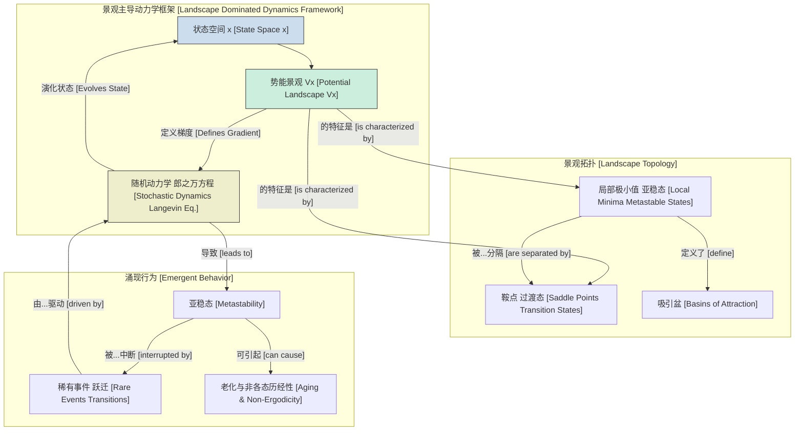
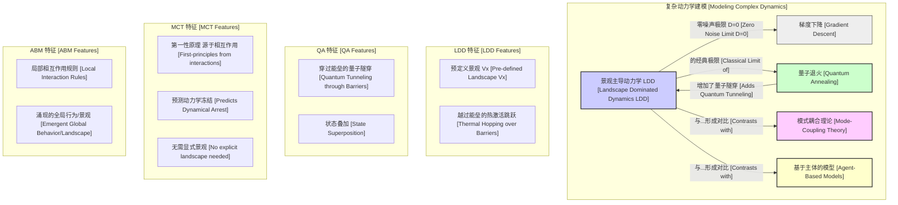

## 景观主导动力学

### 核心概念

**定义：** 景观主导动力学（Landscape Dominated Dynamics, LDD）是一个用于分析复杂系统的理论框架。在该框架中，系统状态的时间演化主要由一个潜在的高维标量场的拓扑特征决定，这个标量场被称为“景观”。该景观，记为 $V(\mathbf{x})$，将系统的每一个可能状态 $\mathbf{x}$ 映射到一个标量值（例如，势能、适应度、成本或似然度）。其动力学特征表现为系统在景观的局部极小值中长时间被捕获，并通过越过能垒在这些极小值之间进行罕见的、随机的跃迁。

**数学基础：**

系统状态向量 $\mathbf{x}(t) \in \mathbb{R}^n$ 在景观 $V(\mathbf{x})$ 上的动力学可以通过过阻尼郎之万方程（overdamped Langevin equation）来建模：

$$
\frac{d\mathbf{x}(t)}{dt} = -\mathbf{M}^{-1} \nabla V(\mathbf{x}(t)) + \boldsymbol{\xi}(t)
$$

其中：
*   $\mathbf{x}(t)$: 系统在时间 $t$ 的状态向量。它是 $n$ 维状态空间中的一个点。
*   $V(\mathbf{x})$: 势能景观函数，一个定义每个状态的“能量”或“成本”的标量场。
*   $\nabla V(\mathbf{x})$: 势能景观的梯度。该项代表确定性力，将系统推向势能较低的状态（即“下山”）。
*   $\mathbf{M}$: 摩擦或迁移率张量。对于各向同性系统，这简化为一个标量摩擦系数 $\gamma$，方程变为 $\frac{d\mathbf{x}}{dt} = -\frac{1}{\gamma}\nabla V + \boldsymbol{\xi}'(t)$。为简单起见，我们通常将其吸收到时间或势能的定义中，得到：
    $$ \frac{d\mathbf{x}(t)}{dt} = -\nabla V(\mathbf{x}(t)) + \sqrt{2D} \boldsymbol{\eta}(t) $$
*   $\sqrt{2D} \boldsymbol{\eta}(t)$: 随机项。
    *   $D$: 扩散系数，代表随机涨落或“噪声”的强度。在物理系统中，它通过爱因斯坦关系与温度相关，$D = k_B T / \gamma$。
    *   $\boldsymbol{\eta}(t)$: 一个高斯白噪声向量，其均值为零 $\langle \eta_i(t) \rangle = 0$，并具有 delta 相关性 $\langle \eta_i(t) \eta_j(t') \rangle = \delta_{ij}\delta(t-t')$。该项模拟了来自环境的随机扰动（例如，热涨落）。

**景观拓扑：** 动力学被景观的结构所“主导”：
*   **局部极小值 (Local Minima):** $\nabla V = 0$ 且海森矩阵为正定的点。这些点对应于亚稳态，系统可以在其中被长时间捕获。
*   **全局最小值 (Global Minimum):** 具有最低势能值的局部极小值，代表系统最稳定的状态或基态。
*   **鞍点 (Saddle Points):** $\nabla V = 0$ 但海森矩阵非正定（至少有一个负特征值）的点。它们代表过渡态，即系统在不同吸引盆之间移动时必须越过的“山口”。鞍点的能量定义了能垒的高度。
*   **吸引盆 (Basins of Attraction):** 所有点的集合，从这些点出发的确定性动力学（$D=0$）将流向同一个局部极小值。

沿梯度的确定性漂移与来自噪声的随机冲击之间的相互作用，决定了系统探索景观并在亚稳态之间跃迁的能力。

### 关键技术规格

| 参数 | 符号 | 描述 | 典型单位 | 示例值范围 |
| :--- | :--- | :--- | :--- | :--- |
| 状态空间维度 | $n$ | 系统的自由度数量。 | 无量纲 | $3$ 到 $10^6+$ |
| 景观粗糙度 | $\rho$ | 衡量局部极小值密度和崎岖程度的指标。可通过海森矩阵的谱特性定义。 | 无量纲 | $0.1$ (平滑) - $10$ (崎岖) |
| 平均能垒高度 | $\langle \Delta V \rangle$ | 局部极小值与其连接到另一吸引盆的最低鞍点之间的平均能量差。 | 能量 ($k_B T$, kJ/mol, eV) | $1 - 50 \, k_B T$ |
| 噪声强度 | $D$ | 随机涨落的强度。在物理系统中与温度成正比。 | 能量 ($k_B T$) 或 [长度]²/时间 | $0.01 - 10 \, k_B T$ |
| 系统时间尺度 | $\tau_0$ | 吸引盆内部运动的内在时间尺度，通常与极小值处的局部曲率相关, $\tau_0 \sim \nu^{-1}$。 | 秒 (s) | $10^{-12}$ s (分子) - $10^6$ s (生态) |
| 观测时间尺度 | $\tau_{obs}$ | 系统被观测或模拟的持续时间。 | 秒 (s) | $10^{-9}$ s - $10^9$ s |

### 常见用例

| 应用领域 | 景观释义 | 状态向量 ($\mathbf{x}$) | 关键性能指标 | 典型量化值 |
| :--- | :--- | :--- | :--- | :--- |
| **蛋白质折叠** | 吉布斯自由能 | 原子坐标或二面角 | 到达天然态的平均首达时间 (MFPT) | $10^{-6}$ s - $1$ s |
| **材料科学 (玻璃)** | 势能 | 原子位置 | $\alpha$-弛豫时间 ($\tau_{\alpha}$) | $10^{-12}$ s 至 $>10^3$ s |
| **机器学习** | 损失函数 | 模型权重和偏置 | 收敛到损失 < $\epsilon$ 的时间 | $10^2 - 10^6$ 轮 (epochs) |
| **演化生物学** | 适应度景观 | 基因型或表型序列 | 突变的固定概率 | $10^{-4}$ - $0.5$ |
| **化学反应** | 反应自由能面 | 反应坐标 | 反应速率常数 ($k$) | $10^{-5}$ s$^{-1}$ - $10^{12}$ s$^{-1}$ |

### 实现考量

**模拟算法：**
*   **欧拉-丸山积分 (Euler-Maruyama Integration):** 一种求解郎之万方程的一阶数值方法。对于时间步长 $\Delta t$，更新规则为：
    $$ \mathbf{x}(t + \Delta t) = \mathbf{x}(t) - \nabla V(\mathbf{x}(t)) \Delta t + \sqrt{2D \Delta t} \mathbf{W} $$
    其中 $\mathbf{W}$ 是从标准正态分布 $N(0,1)$ 中抽取的独立随机数向量。
    *   **算法复杂度:** $O(N_{steps} \cdot C(\nabla V))$，其中 $N_{steps}$ 是步数，$C(\nabla V)$ 是计算梯度的成本，这通常是 $O(n)$ 或 $O(n^2)$，取决于势能函数。

*   **过渡态理论 (TST) / 克莱默斯理论 (Kramers' Theory):** 用于估算两个极小值 A 和 B 之间的跃迁速率，而无需进行完整模拟。克莱默斯速率为：
    $$ k_{A \to B} = \frac{\omega_A}{2\pi} \frac{\prod_{i=1}^n \lambda_i^{(A)}}{\prod_{i=1}^{n-1} \lambda_i^{(TS)}} \exp\left(-\frac{V(x_{TS}) - V(x_A)}{D}\right) $$
    其中 $\omega_A$ 与极小值 A 处的振动频率有关，$\lambda_i$ 是海森矩阵在极小值点 (A) 和过渡态 (TS) 的特征值。一个更简单的形式是阿伦尼乌斯速率：$k = \nu \exp(-\Delta V/D)$。
    *   **算法复杂度:** 需要找到极小值和鞍点，这是一个困难的非凸优化问题。一旦找到，计算本身很快。

*   **动力学蒙特卡洛 (KMC) / 主方程 (Master Equation):** 对于动力学表现为一系列稀有事件的系统，可以将其建模为在状态（极小值）网络上的连续时间马尔可夫跳跃过程。其演化由主方程控制：
    $$ \frac{dP_i(t)}{dt} = \sum_{j \neq i} [k_{j \to i} P_j(t) - k_{i \to j} P_i(t)] $$
    *   **算法复杂度:** 取决于状态数 ($N_{min}$) 和跃迁数。使用 Gillespie 算法进行仿真是高效的，每步的复杂度约为 $O(\log N_{min})$。构建速率矩阵需要来自 TST 的先验知识。

### 性能特征

动力学的特征是时间尺度的分离：在吸引盆内的快速振动和盆之间的缓慢、稀有跃迁。

| 特性 | 描述 | 统计度量 | 典型行为 |
| :--- | :--- | :--- | :--- |
| **亚稳态** | 系统在一个非基态停留的时间远长于其内在振动周期 $\tau_0$。 | 停留时间分布 $P(\tau_{res})$ | 通常为指数分布, $P(\tau_{res}) \propto \exp(-\tau_{res}/\langle\tau\rangle)$。 |
| **阿伦尼乌斯标度** | 平均跃迁时间 $\langle\tau\rangle$ 与能垒高度-噪声强度比呈指数关系。 | 平均首达时间 (MFPT) vs. $1/D$ | $\log(\text{MFPT}) \propto \Delta V / D$。在半对数图上为一条直线。 |
| **非各态历经性** | 在有限时间尺度上（$\tau_{obs} \ll \tau_{trans}$），系统不会根据玻尔兹曼分布采样整个状态空间。 | 时间平均 vs. 系综平均可观测量 | $\overline{O(t)} \neq \langle O \rangle_{ensemble}$。 |
| **老化 (Aging)** | 双时相关函数不仅依赖于时间差，还依赖于系统的等待时间（年龄）。 | 自相关函数 $C(t_w, t_w+t)$ | $C$ 显式地依赖于等待时间 $t_w$。 |

**概率密度演化：**
在时间 $t$、状态 $\mathbf{x}$ 处找到系统的概率密度 $P(\mathbf{x}, t)$ 的演化由福克-普朗克方程描述，该方程在数学上等价于郎之万方程：
$$
\frac{\partial P(\mathbf{x},t)}{\partial t} = \nabla \cdot [\mathbf{M}^{-1} (\nabla V(\mathbf{x})) P(\mathbf{x},t)] + \nabla \cdot [\mathbf{D} \nabla P(\mathbf{x},t)]
$$
在更简单的各向同性情况下，方程变为：
$$
\frac{\partial P(\mathbf{x},t)}{\partial t} = \nabla \cdot [(\nabla V(\mathbf{x})) P(\mathbf{x},t)] + D \nabla^2 P(\mathbf{x},t)
$$
其稳态解（$\partial P / \partial t = 0$）是玻尔兹曼分布：
$$
P_{eq}(\mathbf{x}) \propto \exp\left(-\frac{V(\mathbf{x})}{D}\right)
$$

### 相关技术与比较模型

LDD 提供了一个强大、直观的框架，但它是模拟复杂动力学的几种方法之一。

*   **梯度下降 (Gradient Descent):** 这是 LDD 的确定性（$D=0$）极限。它保证会陷入其遇到的第一个局部极小值而无法逃逸。LDD 的随机项对于全局探索至关重要。
*   **量子退火 (Quantum Annealing):** 用量子隧穿替代热涨落作为越过能垒的机制。其动力学由含时薛定谔方程控制。对于高而薄的能垒，隧穿效应更有效；而对于低而宽的能垒，热激活（LDD）更优。
*   **模式耦合理论 (Mode-Coupling Theory, MCT):** 一种主要用于过冷液体的微观理论。它不预设一个静态的能量景观，而是从第一性原理计算粒子间的相关性和“笼蔽效应”如何导致在临界温度下发生急剧的动力学冻结（玻璃化转变）。它描述了景观主导行为的*起源*。
*   **基于主体的模型 (Agent-Based Models, ABM):** 一种自下而上的方法，宏观行为从大量主体遵循的简单局部规则中涌现。一个有效的“景观”可能从相互作用中涌现，但它不像在 LDD 中那样是模型的输入。

### 参考文献
1.  Frauenfelder, H., Sligar, S. G., & Wolynes, P. G. (1991). The energy landscapes and motions of proteins. *Science*, 254(5038), 1598-1603. DOI: `10.1126/science.1749933`
2.  Wales, D. J. (2003). *Energy landscapes: Applications to clusters, biomolecules and glasses*. Cambridge University Press.
3.  Hänggi, P., Talkner, P., & Borkovec, M. (1990). Reaction-rate theory: fifty years after Kramers. *Reviews of modern physics*, 62(2), 251. DOI: `10.1103/RevModPhys.62.251`
4.  Onuchic, J. N., & Wolynes, P. G. (2004). Theory of protein folding. *Current Opinion in Structural Biology*, 14(1), 70-75. DOI: `10.1016/j.sbi.2004.01.009`