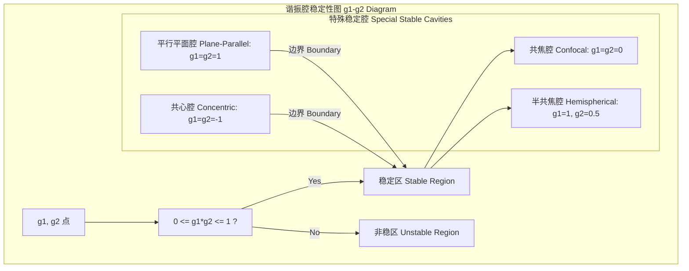
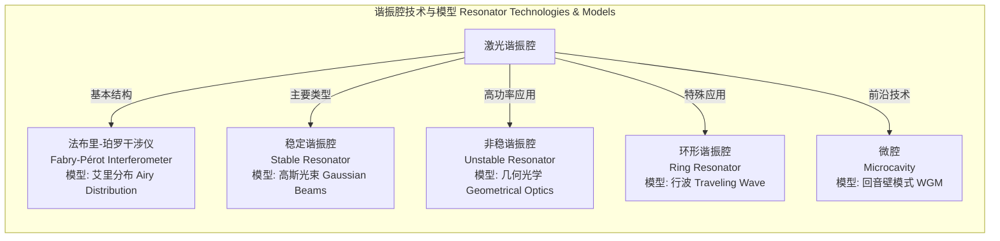

## 激光谐振腔

激光谐振腔，也称为光学谐振腔或光学谐振器，是激光器的核心组成部分。它通常由两面或多面反射镜构成，用于为光波提供正反馈，从而形成激光振荡。谐振腔的主要功能是限制和选择光子的振荡模式（包括纵模和横模），并提高腔内光场的能量密度。

### 1. 核心概念与数学基础

#### 1.1 纵模与共振条件

为了在谐振腔内形成稳定的驻波，光波在腔内往返一周的总光程必须是波长的整数倍。这决定了谐振腔所允许的振荡频率，即纵模。

对于一个由两面反射镜构成的简单线性腔（法布里-珀罗腔），其共振条件为：
$$
2nL = q\lambda_q
$$
其中：
*   $L$ 是谐振腔的物理长度。
*   $n$ 是腔内介质的折射率。
*   $q$ 是一个正整数，称为纵模序数。
*   $\lambda_q$ 是模式 $q$ 对应的共振波长。

由此可以推导出共振频率 $\nu_q$：
$$
\nu_q = \frac{c}{\lambda_q} = q \frac{c}{2nL}
$$
其中 $c$ 是真空中的光速。

相邻两个纵模之间的频率间隔被称为**自由光谱范围 (Free Spectral Range, FSR)**，它是一个表征谐振腔频谱特性的重要参数：
$$
\Delta\nu_{FSR} = \nu_{q+1} - \nu_q = \frac{c}{2nL}
$$

#### 1.2 横模与谐振腔稳定性

横模（Transverse Electromagnetic Mode, TEM）描述了垂直于光传播方向的电磁场分布。横模的形态和损耗由谐振腔的几何结构（镜面曲率、间距）决定。只有在**稳定谐振腔**中，光线才能被约束在腔内，形成低损耗的横模。

谐振腔的稳定性可以通过**射线传输矩阵（ABCD矩阵）**方法进行分析。对于一个包含两面反射镜的谐振腔，其单次往返的ABCD矩阵 $M$ 为：
$$
M = \begin{pmatrix} A & B \\ C & D \end{pmatrix}
$$
谐振腔的稳定性判据为：
$$
0 \le g_1 g_2 \le 1
$$
其中，$g_1$ 和 $g_2$ 是谐振腔的g参数，定义为：
$$
g_1 = 1 - \frac{L}{R_1}, \quad g_2 = 1 - \frac{L}{R_2}
$$
*   $L$ 是腔长。
*   $R_1, R_2$ 是两面反射镜的曲率半径（对于凹面镜，$R>0$；对于凸面镜，$R<0$）。

#### 1.3 高斯光束

稳定谐振腔的基模（TEM₀₀）具有高斯强度分布。其电场分布可以由以下公式描述：
$$
E(r, z) = E_0 \frac{w_0}{w(z)} \exp\left(-\frac{r^2}{w(z)^2}\right) \exp\left(-ikz - ik\frac{r^2}{2R(z)} + i\zeta(z)\right)
$$
其中：
*   $E_0$ 是光束中心的振幅。
*   $r$ 是与光轴的径向距离。
*   $z$ 是沿光轴的传播距离（$z=0$ 处为光腰位置）。
*   $k = 2\pi n/\lambda$ 是波数。
*   $w_0$ 是**光束腰半径**，即光束最窄处的半径。
*   $w(z)$ 是在 $z$ 处的光斑半径：$w(z) = w_0 \sqrt{1 + (z/z_R)^2}$。
*   $z_R$ 是**瑞利范围 (Rayleigh Range)**：$z_R = \frac{\pi n w_0^2}{\lambda}$。它表示光束从腰部扩展到面积加倍的距离。
*   $R(z)$ 是波前的曲率半径：$R(z) = z \left[1 + (z_R/z)^2\right]$。
*   $\zeta(z)$ 是**古依相移 (Gouy Phase Shift)**：$\zeta(z) = \arctan(z/z_R)$。

#### 1.4 谐振腔品质因数

谐振腔的性能可以通过精细度 ($\mathcal{F}$) 和品质因子 ($Q$) 来量化。

*   **精细度 (Finesse, $\mathcal{F}$)**：描述了谐振峰的锐利程度，定义为自由光谱范围与谐振峰半高全宽（FWHM）$\delta\nu$ 的比值。对于一个由两面反射率分别为 $R_1$ 和 $R_2$ 的反射镜组成的腔，精细度为：
    $$
    \mathcal{F} = \frac{\Delta\nu_{FSR}}{\delta\nu} \approx \frac{\pi \sqrt[4]{R_1 R_2}}{1 - \sqrt{R_1 R_2}}
    $$
    高精细度意味着光子在腔内往返的次数更多，腔内能量储存能力更强。

*   **品质因子 (Quality Factor, Q)**：描述了谐振腔储存能量的能力，定义为谐振频率 $\nu_q$ 与谐振峰半高全宽 $\delta\nu$ 的比值。它也与光子在腔内的平均寿命 $\tau_c$ 相关：
    $$
    Q = \frac{\nu_q}{\delta\nu} = 2\pi\nu_q\tau_c
    $$
    其中光子寿命 $\tau_c = \frac{2nL}{c(1 - R_1 R_2)}$。高Q值对应着极窄的线宽和长的储能时间。

### 2. 关键技术规格

不同类型的激光器对其谐振腔有不同的设计要求。下表列出了一些典型激光谐振腔的关键技术规格。

| 参数 | 符号 | HeNe激光器 (气体) | Nd:YAG激光器 (固体) | VCSEL (半导体) | 单位 |
| :--- | :--- | :--- | :--- | :--- | :--- |
| 腔长 | $L$ | 0.2 - 1.0 | 0.1 - 0.5 | $10^{-6}$ - $10^{-5}$ | m |
| 镜面曲率半径 | $R_1, R_2$ | 0.3 - 2.0 | 0.2 - $\infty$ | DBR结构 | m |
| 镜面反射率 | $R$ | 99.0% - 99.9% | 90% - 99.9% | > 99.5% | - |
| g参数乘积 | $g_1 g_2$ | 0.5 - 0.95 | 0.2 - 0.9 | N/A | - |
| 自由光谱范围 | $\Delta\nu_{FSR}$ | 150 - 750 | 300 - 1500 | $10^{13}$ - $10^{14}$ | MHz |
| 精细度 | $\mathcal{F}$ | 100 - 500 | 30 - 300 | ~1000 | - |
| 品质因子 | $Q$ | $10^7$ - $10^8$ | $10^6$ - $10^7$ | $10^3$ - $10^4$ | - |
| 光子寿命 | $\tau_c$ | 10 - 100 | 1 - 10 | $10^{-12}$ - $10^{-11}$ | ns |
| 基模光腰半径 | $w_0$ | 0.3 - 0.6 | 0.1 - 1.0 | 1 - 5 | mm |

### 3. 常见用例与性能指标

*   **气体激光器 (如 HeNe)**：通常采用近共焦或半球形稳定腔，以获得优良的基模输出和高相干性。
    *   **性能指标**: 极长的相干长度，通常 > 10 m。

*   **高功率固体激光器 (如 Nd:YAG)**：为有效提取大体积增益介质的能量，常采用稳定腔或非稳腔设计。
    *   **性能指标**: 高输出功率（工业级可达 kW 量级），优良的光束质量（$M^2 < 1.2$）。

*   **垂直腔面发射激光器 (VCSEL)**：利用半导体工艺制造的微米级谐振腔，由两个分布式布拉格反射镜 (DBR) 构成。
    *   **性能指标**: 极高的调制带宽（> 25 GHz），适用于光通信和高速传感。

*   **精密测量与计量 (如 LIGO)**：使用超高精细度的法布里-珀罗腔来检测微小的长度变化。
    *   **性能指标**: 极高的精细度 ($\mathcal{F} > 10^5$) 和品质因子 ($Q > 10^{12}$)，实现极高的测量灵敏度。

### 4. 实现考量

#### 4.1 准直灵敏度

谐振腔对镜片的角度失准非常敏感。微小的倾斜会引入额外的衍射损耗，改变横模结构，甚至导致激光停振。
*   **分析方法**: 可通过在ABCD矩阵中引入倾斜矩阵来建模。靠近稳定区边界（如共焦腔或平行平面腔）的谐振腔对准直误差更为敏感。这种分析不是算法复杂性问题，而是参数空间中的灵敏度分析。

#### 4.2 热透镜效应

高功率激光器中，泵浦能量在增益介质中产生的热量会引起折射率变化，形成一个等效的**热透镜**。
*   **数学模型**: 热透镜的焦距 $f_{th}$ 可以近似表示为：
    $$
    f_{th} \propto \frac{K_c A}{P_{abs} (dn/dT)}
    $$
    其中 $K_c$ 是热导率，$A$ 是光束面积，$P_{abs}$ 是吸收的泵浦功率，$dn/dT$ 是热光系数。热透镜会改变腔的有效g参数，从而影响其稳定性和模式体积。

#### 4.3 模式匹配

为了将外部光束高效地耦合进一个谐振腔，入射光束的参数（光腰大小、位置、波前曲率）必须与谐振腔的本征模式相匹配。
*   **耦合效率 ($\eta$)**: 可以通过入射光场 $E_{in}$ 和腔模场 $E_{cavity}$ 的交叠积分来计算：
    $$
    \eta = \frac{\left| \iint_{-\infty}^{\infty} E_{in}(x,y) E_{cavity}^*(x,y) \,dx\,dy \right|^2}{\iint_{-\infty}^{\infty} |E_{in}|^2 \,dx\,dy \iint_{-\infty}^{\infty} |E_{cavity}|^2 \,dx\,dy}
    $$
    实现高耦合效率是一个关键的光学设计和对准挑战。

### 5. 性能特征与统计度量

*   **功率稳定性**: 通常用**相对强度噪声 (Relative Intensity Noise, RIN)** 来衡量。RIN是功率波动的功率谱密度与平均功率平方的比值。
    $$
    RIN(f) = \frac{S_P(f)}{P_{avg}^2} \quad [\text{单位: dB/Hz}]
    $$
    高性能稳频激光器的RIN可低至 -140 至 -160 dB/Hz。

*   **频率稳定性**: 使用**阿伦方差 (Allan Deviation, $\sigma_y(\tau)$)** 来表征。它衡量了在平均时间 $\tau$ 内的频率分数起伏。
    $$
    \sigma_y(\tau) = \sqrt{\frac{1}{2(M-1)} \sum_{i=1}^{M-1} (\bar{y}_{i+1} - \bar{y}_i)^2}
    $$
    其中 $\bar{y}_i$ 是第 $i$ 次测量的平均归一化频率。对于精密锁定的激光器，阿伦方差可达 $10^{-15}$ 或更优。

*   **光束质量因子 ($M^2$)**: 衡量实际光束与理想高斯光束的接近程度。
    $$
    M^2 = \frac{\pi \theta w_0}{\lambda}
    $$
    其中 $\theta$ 是光束的远场发散角，$w_0$ 是光腰半径。理想高斯光束的 $M^2=1$。实际激光器的 $M^2$ 值通常表示为 $M^2 = 1.05 \pm 0.02$（95%置信区间）。

### 6. 相关技术与比较

#### 6.1 法布里-珀罗干涉仪 (Fabry-Pérot Interferometer)
这是激光谐振腔的基本物理模型，但它本身作为一种被动光学元件，用于光谱分析。其透射率由**艾里(Airy)分布**给出：
$$
T_E(\delta) = \frac{(1-R)^2}{(1-R)^2 + 4R \sin^2(\delta/2)}
$$
其中 $R$ 是镜面反射率，$\delta = (2\pi/\lambda) 2nL\cos\theta$ 是往返一周的相位差。

#### 6.2 非稳谐振腔 (Unstable Resonator)
当 $g_1 g_2 < 0$ 或 $g_1 g_2 > 1$ 时，谐振腔为非稳腔。光线在腔内会发散，从镜面边缘“走出”腔体，形成输出。
*   **比较模型**: 采用几何光学分析。其关键参数是单程放大率 $M$。腔内往返一周的损耗 $\Gamma$ 很大但均匀，$\Gamma = 1 - 1/M^2$。适用于大模式体积、高增益的激光器。

#### 6.3 环形谐振腔 (Ring Resonator)
光在由三面或四面反射镜构成的闭合环路中单向传播。
*   **比较模型**: 共振条件变为 $L = q\lambda$，其中 $L$ 是环路的光程长度。由于光是行波而非驻波，它避免了**空间烧孔效应 (Spatial Hole Burning)**，更容易实现单纵模运转。

#### 6.4 光学微腔 (Optical Microcavity)
例如微球腔或微环腔，利用全内反射将光限制在微米尺度的结构中。
*   **比较模型**: 模式被称为**回音壁模式 (Whispering Gallery Mode, WGM)**。共振条件为 $2\pi R n = q\lambda$，其中 $R$ 是微腔半径。这类腔具有极高的Q值（可达 $10^8$ 以上）和极小的模式体积，在非线性光学和量子光学中有重要应用。

### 7. 参考文献

*   Kogelnik, H., & Li, T. (1966). Laser Beams and Resonators. *Applied Optics*, 5(10), 1550-1567. DOI: `10.1364/AO.5.001550`. (奠定了激光谐振腔内高斯光束理论的基础性论文).
*   Siegman, A. E. (1986). *Lasers*. University Science Books. (激光领域的权威经典教科书).
*   Drever, R. W. P., Hall, J. L., Kowalski, F. V., Hough, J., Ford, G. M., Munley, A. J., & Ward, H. (1983). Laser phase and frequency stabilization using an optical resonator. *Applied Physics B*, 31(2), 97-105. DOI: `10.1007/BF00702605`. (描述了Pound-Drever-Hall (PDH) 锁频技术的开创性工作).