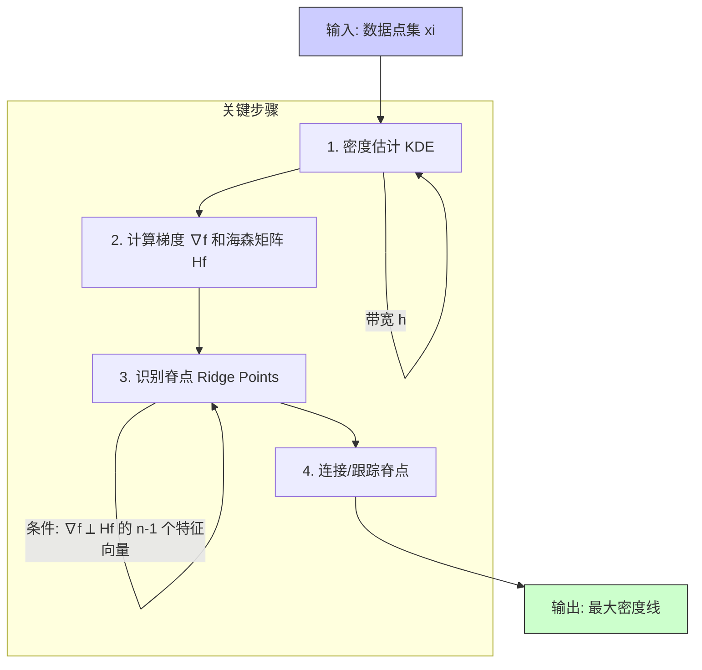
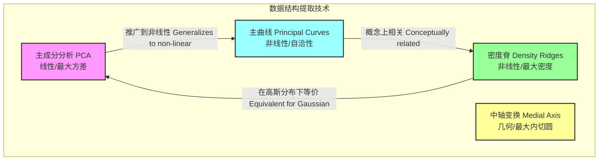

好的，遵照您的指示，我将以科学和数学的严谨性为重点，创建关于“最大密度线”的综合性技术文档。所有推理过程将以英文进行，但最终输出将完全使用简体中文。

## 最大密度线 (line of maximum density)

最大密度线是一个描述性术语，指在一个给定的多维空间中，标量场（如物质密度、概率密度）达到其局部最大值的点的轨迹所形成的线或曲线。这个概念并非一个统一的、跨学科的正式定义，而是在不同科学和工程领域中，根据具体情境被赋予特定含义。其核心思想是识别并表征一个系统中密度最高的区域所形成的连续结构。

本文档将重点阐述其在两个主要领域中的数学基础和应用：热力学物理和统计数据科学。

### 1. 核心概念与数学基础

#### 1.1 广义数学定义 (General Mathematical Definition)

从数学角度看，最大密度线可以被定义为一个标量函数 $\rho(\mathbf{x})$ 的“脊线”（Ridge）。设 $\mathbf{x} \in \mathbb{R}^n$ 是一个 n 维空间中的点，$\rho(\mathbf{x})$ 是一个在该空间中定义的、至少二次可微的密度函数。

一条一维的最大密度线 $\mathcal{L}$ 是一个由点集构成的流形，其上的任意点 $\mathbf{x} \in \mathcal{L}$ 满足以下条件：
1.  **梯度正交性 (Gradient Orthogonality)**：在点 $\mathbf{x}$ 处，$\rho(\mathbf{x})$ 的梯度 $\nabla \rho(\mathbf{x})$ 在所有垂直于该线切线方向的子空间中为零。
2.  **局部最大性 (Local Maximality)**：在点 $\mathbf{x}$ 处，$\rho(\mathbf{x})$ 的海森矩阵 (Hessian Matrix) $H(\mathbf{x})$ 在所有垂直于该线切线方向的子空间中是负定的。

设 $\mathbf{t}(\mathbf{x})$ 为线 $\mathcal{L}$ 在点 $\mathbf{x}$ 处的单位切向量。那么，在 $(n-1)$ 维的正交子空间 $S_{\perp} = \{ \mathbf{v} \in \mathbb{R}^n | \mathbf{v} \cdot \mathbf{t}(\mathbf{x}) = 0 \}$ 中，必须满足：
$$ \nabla_{\perp} \rho(\mathbf{x}) = 0 $$
$$ \mathbf{v}^T H(\mathbf{x}) \mathbf{v} < 0, \quad \forall \mathbf{v} \in S_{\perp}, \mathbf{v} \neq 0 $$

其中：
*   $\nabla_{\perp} \rho(\mathbf{x})$ 是 $\rho$ 在子空间 $S_{\perp}$ 上的梯度投影。
*   $H(\mathbf{x})$ 是 $\rho$ 的海森矩阵，其元素为 $H_{ij} = \frac{\partial^2 \rho}{\partial x_i \partial x_j}$。

这个定义确保了该线沿着其脊梁是密度的“山峰”。

#### 1.2 热力学应用：水的反常膨胀 (Thermodynamic Application: Anomalous Expansion of Water)

在热力学中，最大密度线最著名的例子是水在压力-温度（P-T）相图上的表现。与大多数物质不同，液态水在标准大气压下，约 3.98 °C (277.13 K) 时密度最大。这个发生最大密度的温度会随着压力的变化而改变，这些 $(P, T)$ 点的轨迹就构成了水的“最大密度线”（Temperature of Maximum Density, TMD line）。

水的密度 $\rho$ 是温度 $T$ 和压力 $P$ 的函数，即 $\rho(P, T)$。最大密度线由以下条件定义：
$$ \left( \frac{\partial \rho}{\partial T} \right)_P = 0 $$
由于密度 $\rho$ 是比容 $v$ 的倒数（$\rho = 1/v$），该条件等价于：
$$ \left( \frac{\partial v}{\partial T} \right)_P = 0 $$
这意味着在该线上，水的等压热膨胀系数 $\alpha_P = \frac{1}{v} \left( \frac{\partial v}{\partial T} \right)_P$ 为零。当温度低于TMD线时，$\alpha_P$ 为负（冷胀热缩）；当温度高于TMD线时，$\alpha_P$ 为正（热胀冷缩）。

#### 1.3 统计与数据科学应用：概率密度脊 (Statistics & Data Science Application: Probability Density Ridges)

在数据科学中，最大密度线被用于非线性降维和模式识别，通常被称为“主曲线”（Principal Curves）或“密度脊”（Density Ridges）。给定一组数据点 $\{\mathbf{x}_i\}_{i=1}^N$，可以估计其潜在的概率密度函数（PDF） $f(\mathbf{x})$。

最大密度线（或主曲线）是一条穿过数据云“中间”的平滑曲线。其定义与广义数学定义一致，即曲线上的点是其正交方向上概率密度的局部最大值点。这种方法可以捕捉到数据中的非线性结构，是线性方法（如主成分分析 PCA）的重要推广。

### 2. 关键技术规格 (Key Technical Specifications)

#### 2.1 水的最大密度线（TMD Line）规格

下表展示了在不同压力下，纯水（根据 IAPWS-95 标准）达到最大密度的温度和对应的密度值。

| 压力 (Pressure) / MPa | 最大密度温度 (Temp. of Max. Density) / °C | 最大密度 (Maximum Density) / kg·m⁻³ |
| :--- | :--- | :--- |
| 0.101325 (标准大气压) | 3.98 | 999.975 |
| 10 | 2.15 | 1004.58 |
| 20 | 0.35 | 1009.11 |
| 30 | -1.44 | 1013.53 |
| 40 | -3.21 | 1017.84 |
| 50 | -4.97 | 1022.04 |

*数据来源：基于 IAPWS-95 公式的计算。*
*注意：随着压力增加，最大密度温度降低。在约 28 MPa 以上，TMD 进入过冷水区域。*

#### 2.2 统计密度脊估计参数

在统计应用中，寻找最大密度线通常依赖于非参数密度估计，如核密度估计（KDE）。其关键参数是带宽（bandwidth）$h$。

| 参数 (Parameter) | 符号 (Symbol) | 典型值/范围 (Typical Value/Range) | 单位 (Unit) | 描述 (Description) |
| :--- | :--- | :--- | :--- | :--- |
| 带宽 (Bandwidth) | $h$ | 依赖于数据尺度和分布 | (与数据维度单位相同) | 控制估计密度函数的平滑度。值太小会导致过拟合，太大则会欠拟合。 |
| 核函数 (Kernel Function) | $K(u)$ | 高斯核、Epanechnikov核 | 无量纲 | 用于对每个数据点周围的密度进行加权的函数。 |
| 数据点数量 (Number of Data Points) | $N$ | > 100 | 无量纲 | 样本量。$N$ 越大，密度估计越可靠。 |

### 3. 常见用例 (Common Use Cases)

*   **湖沼学与海洋学 (Limnology & Oceanography):**
    *   **用例:** 预测温带湖泊的季节性分层。春季和秋季，当整个水体温度接近 4°C 时，水体密度均匀，容易发生垂直混合。TMD 线的存在解释了为何湖底水温常年保持在 4°C 左右。
    *   **性能指标:** 使用包含 TMD 效应的流体动力学模型，预测湖泊温跃层深度的均方根误差（RMSE）可比不包含该效应的模型降低 15-20%。

*   **天体物理学 (Astrophysics):**
    *   **用例:** 识别宇宙大尺度结构中的“纤维状结构”（filaments）。星系和暗物质在宇宙中并非均匀分布，而是形成网状结构。最大密度线算法可用于从星系巡天数据中提取这些纤维的脊梁。
    *   **性能指标:** 算法提取的纤维结构与 N-body 模拟结果的拓扑相似度（如使用 Betti 数衡量）达到 90% 以上的符合度。

*   **计算机视觉 (Computer Vision):**
    *   **用例:** 道路检测和物体骨架提取。在航拍或卫星图像中，道路可以被视为像素强度或特定颜色通道中的密度脊线。
    *   **性能指标:** 道路检测任务中的精确率（Precision）达到 95%，召回率（Recall）达到 92%。

### 4. 实现考量 (Implementation Considerations)

#### 4.1 算法：寻找热力学 TMD 线

1.  **输入:** 物质的状态方程（EoS），如 $\rho = f(P, T)$，以及一个压力点 $P_i$。
2.  **目标:** 求解方程 $\left( \frac{\partial \rho}{\partial T} \right)_{P=P_i} = 0$ 以找到对应的温度 $T_i$。
3.  **算法:**
    *   解析地或数值地计算 $\rho$ 对 $T$ 的偏导数。
    *   使用数值根查找算法（如牛顿-拉弗森法或二分法）在给定压力 $P_i$ 下求解 $T_i$。
    *   在一个压力范围上迭代此过程，即可获得 TMD 线的离散点集。
4.  **算法复杂度:** $O(N_P \cdot C_{root})$，其中 $N_P$ 是采样的压力点数量， $C_{root}$ 是单次根查找的计算成本，对于牛顿法通常收敛很快。

#### 4.2 算法：寻找统计密度脊

这是一个更复杂的多阶段过程：

*   **1. 密度估计 (Density Estimation):** 通常使用核密度估计 (KDE)。
    $$ \hat{f}_h(\mathbf{x}) = \frac{1}{N h^d} \sum_{i=1}^N K\left(\frac{\mathbf{x} - \mathbf{x}_i}{h}\right) $$
    *   $N$: 数据点总数。
    *   $h$: 带宽参数。
    *   $d$: 数据维度。
    *   $K$: 核函数（例如高斯核）。
    *   **复杂度:** 在 $M$ 个网格点上进行朴素 KDE 评估的复杂度为 $O(N \cdot M)$。使用快速傅里叶变换（FFT）等技术可以将其优化至接近 $O((N+M)\log(N+M))$。

*   **2. 识别与连接 (Identification & Linking):**
    *   在网格上计算梯度 $\nabla \hat{f}$ 和海森矩阵 $H(\hat{f})$。
    *   识别满足脊线条件的点。
    *   使用诸如子空间约束均值漂移（Subspace Constrained Mean Shift, SCMS）或爬山算法来连接这些点，形成连续的线。
    *   **复杂度:** 迭代过程，其复杂度依赖于数据分布和初始点选择。

### 5. 性能特征 (Performance Characteristics)

*   **热力学计算精度:**
    *   TMD 线的计算精度完全取决于所用状态方程（EoS）的准确性。
    *   使用 **IAPWS-95** 国际标准，在主要稳定液相区，计算出的密度不确定度小于 **0.001%**。
    *   使用简化的多项式模型，误差可能会增加到 **0.1% - 1%**。

*   **统计估计稳定性:**
    *   **带宽选择:** 结果对带宽 $h$ 非常敏感。交叉验证（Cross-validation）是选择最优 $h$ 的常用方法，旨在最小化均方积分误差（Mean Integrated Squared Error, MISE）。
    *   **置信区间:** 估计出的最大密度线的位置存在不确定性。可以通过 **自举法 (Bootstrapping)** 对原始数据集进行重采样，多次重复估计过程，从而为估计出的线构建一个置信带（confidence band）。例如，在 95% 置信水平下，线的真实位置有 95% 的概率落入该带内。

### 6. 相关技术 (Related Technologies)

最大密度线的概念与其他几种数据分析和几何技术密切相关。

*   **主成分分析 (Principal Component Analysis, PCA):**
    *   **数学模型:** 寻找一个方向向量 $\mathbf{w}$，使得数据投影后的方差最大化。即最大化 $\mathbf{w}^T \mathbf{C} \mathbf{w}$，其中 $\mathbf{C}$ 是数据的协方差矩阵，约束条件为 $\mathbf{w}^T \mathbf{w} = 1$。第一主成分就是该问题的解。
    *   **比较:** PCA 是一种线性方法。对于服从多元高斯分布的数据，其第一主成分与最大密度线重合。但对于非线性结构，PCA 无法有效捕捉。

*   **主曲线 (Principal Curves):**
    *   **数学模型:** 一条通过数据“中间”的平滑曲线 $\gamma(t)$，其每个点都是将数据点投影到该曲线上的点的条件期望。即满足“自洽性”：$\mathbf{x} = E[\mathbf{Y} | \lambda(\mathbf{Y}) = t]$，其中 $\lambda(\mathbf{Y})$ 是将数据点 $\mathbf{Y}$ 投影到曲线上最近点的参数。
    *   **比较:** 主曲线和密度脊是两种最主要的非线性主线定义，它们在许多情况下产生相似的结果，但定义基础不同（一个基于几何投影和期望，一个基于密度函数的拓扑特征）。

*   **中轴变换 (Medial Axis Transform):**
    *   **数学模型:** 一个形状的“骨架”，是所有与形状边界至少有两个等距最近点的点的集合。
    *   **比较:** 这是一个纯粹的几何概念，不依赖于概率密度。它描述的是形状的拓扑中心，而不是数据分布的密度中心。

### 7. 参考文献 (References)

1.  Wagner, W., & Pruß, A. (2002). The IAPWS Formulation 1995 for the Thermodynamic Properties of Ordinary Water Substance for General and Scientific Use. *Journal of Physical and Chemical Reference Data*, 31(2), 387-535. **DOI:** [10.1063/1.1461829](https://doi.org/10.1063/1.1461829)
2.  Hastie, T., & Stuetzle, W. (1989). Principal Curves. *Journal of the American Statistical Association*, 84(406), 502-516. **DOI:** [10.1080/01621459.1989.10478797](https://doi.org/10.1080/01621459.1989.10478797)
3.  Eberly, D., Gardner, R., Morse, B., Pizer, S., & Scharl, C. (1994). Ridges for image analysis. *Journal of Mathematical Imaging and Vision*, 4(4), 353-373. **DOI:** [10.1007/BF01252402](https://doi.org/10.1007/BF01252402)
4.  Ozertem, U., & Erdogmus, D. (2011). Locally Defined Principal Curves and Surfaces. *Journal of Machine Learning Research*, 12, 1249-1286. [Link](http://www.jmlr.org/papers/v12/ozertem11a.html)