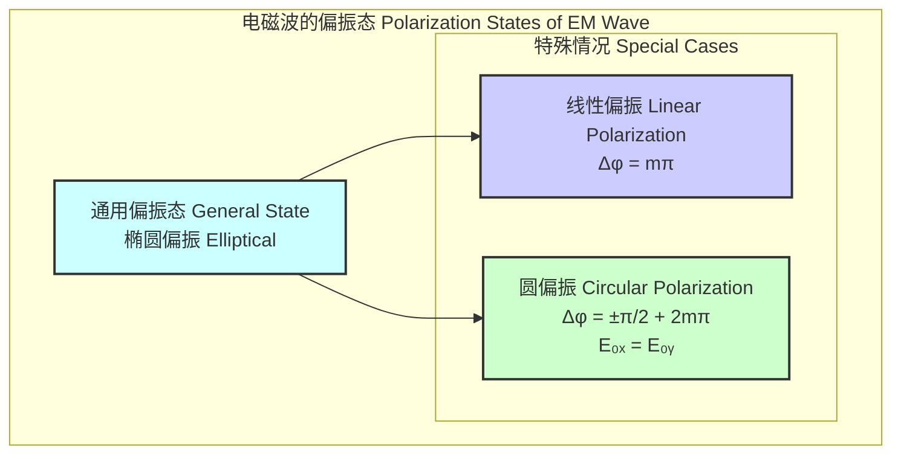
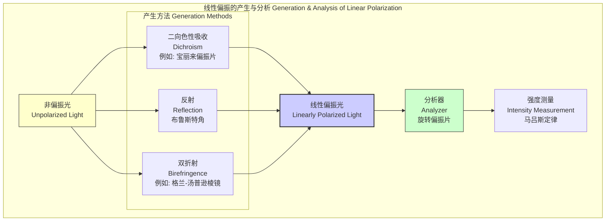

## 线性偏振

线性偏振是电磁波（如光波）的一种偏振状态。在理想的线性偏振波中，电场矢量或磁场矢量的振荡方向在垂直于波传播方向的平面内始终保持在一条固定的直线上。这种振荡的方向定义了该线性偏振波的偏振方向。

### 核心概念与数学基础

电磁波是横波，意味着其电场 $\vec{E}$ 和磁场 $\vec{B}$ 的振荡方向均垂直于波的传播方向。偏振态由电场矢量 $\vec{E}$ 在该垂直平面内的轨迹来描述。

考虑一个沿 $z$ 轴正方向传播的单色平面电磁波，其电场可以表示为复数形式：

$$
\vec{E}(z, t) = \vec{E}_0 e^{i(kz - \omega t)}
$$

其中：
*   $\vec{E}(z, t)$ 是在位置 $z$ 和时间 $t$ 的电场矢量。
*   $\vec{E}_0$ 是复振幅矢量，它决定了波的振幅和偏振状态。
*   $k = 2\pi/\lambda$ 是波数，其中 $\lambda$ 是波长。
*   $\omega = 2\pi f$ 是角频率，其中 $f$ 是频率。
*   $i$ 是虚数单位。

为了描述偏振，我们将复振幅矢量 $\vec{E}_0$ 分解到垂直于传播方向的两个正交基上（例如，x轴和y轴）：

$$
\vec{E}_0 = E_{0x} e^{i\phi_x} \hat{x} + E_{0y} e^{i\phi_y} \hat{y}
$$

其中：
*   $E_{0x}$ 和 $E_{0y}$ 是电场在x和y方向上的实数振幅。
*   $\phi_x$ 和 $\phi_y$ 是它们各自的初始相位。
*   $\hat{x}$ 和 $\hat{y}$ 是x和y方向的单位矢量。

波的瞬时电场（物理上可观测的量）是复数表达式的实部：

$$
\vec{E}(z, t) = \text{Re}[\vec{E}(z, t)] = \hat{x} E_{0x} \cos(kz - \omega t + \phi_x) + \hat{y} E_{0y} \cos(kz - \omega t + \phi_y)
$$

**线性偏振的条件**是两个正交分量之间的相位差 $\Delta\phi = \phi_y - \phi_x$ 为整数 $\pi$ 的倍数：

$$
\Delta\phi = m\pi, \quad m \in \{0, \pm 1, \pm 2, \dots\}
$$

*   当 $m$ 为偶数时（$\Delta\phi = 0, \pm 2\pi, \dots$），两个分量同相。电场矢量 $\vec{E}$ 的尖端沿一条斜率为 $E_{0y}/E_{0x}$ 的直线振荡。
*   当 $m$ 为奇数时（$\Delta\phi = \pm \pi, \pm 3\pi, \dots$），两个分量反相。电场矢量 $\vec{E}$ 的尖端沿一条斜率为 $-E_{0y}/E_{0x}$ 的直线振荡。

在任一情况下，电场矢量的振荡轨迹都是一条直线，因此被称为线性偏振。偏振角 $\theta$ 定义为该直线与参考轴（通常是x轴）的夹角，由下式给出：

$$
\theta = \arctan\left(\frac{E_{0y}}{E_{0x}}\right)
$$

---

### 关键技术指标

线性偏振器件和系统的性能由多个关键指标来量化。

| 参数 (Parameter) | 符号 (Symbol) | 定义 (Definition) | 典型值 (Typical Values) | 单位 (Unit) |
| :--- | :--- | :--- | :--- | :--- |
| **消光比 (Extinction Ratio)** | ER | 偏振器件在透射所需偏振方向的光功率 ($P_{max}$) 与其正交偏振方向的光功率 ($P_{min}$) 之比。 | > 1000:1 (30 dB) (标准)   > 100,000:1 (50 dB) (高性能) | 无量纲比值 或 dB |
| **偏振相关损耗 (Polarization Dependent Loss)** | PDL | 当输入光的偏振态在所有可能状态上变化时，光学器件插入损耗的最大变化量。 | < 0.1 dB (电信级)   < 0.05 dB (高质量) | dB |
| **线性偏振度 (Degree of Linear Polarization)** | DoLP | 衡量光波偏振的线性程度。定义为 $(I_{max} - I_{min}) / (I_{max} + I_{min})$。 | 0 (非偏振) 到 1 (完全线性偏振) | 无量纲 |
| **偏振角/方向 (Polarization Angle/Orientation)** | $\theta$ | 电场振荡平面相对于参考坐标轴的角度。 | 0° 到 180° | 度 (Degrees) 或 弧度 (Radians) |
| **透射率 (Transmittance)** | $T_p$ | 偏振器件对所需偏振态的光功率的透射效率。 | > 90% (可见光宽带偏振片)   > 99% (激光晶体偏振器) | % |

**消光比的数学定义** (以分贝为单位):
$$
ER_{dB} = 10 \log_{10}\left(\frac{P_{max}}{P_{min}}\right)
$$

---

### 常见应用

线性偏振在科学和技术领域有广泛的应用，其性能直接影响应用效果。

*   **液晶显示器 (LCDs):**
    *   **原理:** 利用液晶在电场下旋转光线偏振方向的能力。通过前后两个正交的线性偏振片，控制像素的亮暗。
    *   **性能指标:** 对比度 > 1000:1，响应时间 < 5 ms。

*   **偏振太阳镜和摄影滤镜:**
    *   **原理:** 阻挡从水平表面（如水面、路面）反射的水平偏振眩光。在摄影中，偏振滤光镜（CPL）可以消除反光、增强天空色彩。
    *   **性能指标:** 眩光阻挡率 > 99% (对特定偏振)，光通量减少约 1.5-2 f-stops。

*   **光通信 (偏振复用, PDM):**
    *   **原理:** 在一根光纤中，使用两个正交的线性偏振态（例如，水平和垂直）作为独立信道来传输数据，使信道容量加倍。
    *   **性能指标:** 频谱效率 > 2 bit/s/Hz，偏振串扰 < -25 dB 以维持可接受的误码率 (BER < $10^{-12}$)。

*   **椭偏仪 (Ellipsometry):**
    *   **原理:** 通过测量一束线性偏振光经样品表面反射后偏振态的变化（通常变为椭圆偏振），来精确表征薄膜的厚度和光学常数。
    *   **性能指标:** 厚度分辨率可达埃米级 (< 0.1 nm)，精度优于 0.1%。

*   **雷达系统:**
    *   **原理:** 使用特定线性偏振（如水平或垂直偏振）的雷达波，可以更好地区分不同类型的降水（如雨、雪、冰雹）或目标。
    *   **性能指标:** 交叉偏振鉴别率 (XPD) > 30 dB。

---

### 实现方法

产生和分析线性偏振光主要有以下几种物理机制。

1.  **二向色性 (Dichroism):**
    某些材料（如宝丽来偏振片或某些晶体）对一个偏振方向的光吸收远大于对其正交方向的吸收。当非偏振光通过时，一个分量被强烈吸收，透射光则近似为线性偏振光。

2.  **布鲁斯特角反射 (Reflection at Brewster's Angle):**
    当非偏振光以特定角度（布鲁斯特角 $\theta_B$）入射到两种不同折射率介质的界面时，反射光是完全线性偏振的，其偏振方向垂直于入射面（s-偏振）。
    $$
    \theta_B = \arctan\left(\frac{n_2}{n_1}\right)
    $$
    其中 $n_1$ 和 $n_2$ 分别是入射介质和折射介质的折射率。

3.  **双折射 (Birefringence):**
    各向异性晶体（如方解石、石英）会将入射光分解为两条路径不同、偏振方向正交的光束：寻常光（o-ray）和非常光（e-ray）。通过设计（如格兰-汤普逊棱镜），可以将其中一束分离出去，从而获得高度纯净的线性偏振光。

#### 实现的算法考量 (马吕斯定律)

分析一束光的线性偏振特性，通常使用一个偏振片（称为检偏器）和一个光功率计。当一束强度为 $I_0$ 的线性偏振光通过一个理想的检偏器，且检偏器的透振轴与光的偏振方向夹角为 $\theta$ 时，透射光的强度 $I$ 遵循 **马吕斯定律 (Malus's Law)**：

$$
I(\theta) = I_0 \cos^2(\theta)
$$

**测量算法复杂度分析:**
要确定一束光的偏振角和线性偏振度(DoLP)，可以执行以下算法：
1.  将检偏器置于光路中。
2.  以步长 $\Delta\theta$ 从 0° 旋转到 180°。
3.  在每个角度 $\theta_i$ 记录光强度 $I(\theta_i)$。
4.  从记录的数据中找到最大强度 $I_{max}$ 和最小强度 $I_{min}$。
5.  偏振角即为出现 $I_{max}$ 时的角度。
6.  计算 DoLP = $(I_{max} - I_{min}) / (I_{max} + I_{min})$。

该算法的计算复杂度为 $O(N)$，其中 $N = 180 / \Delta\theta$ 是测量点的数量。复杂度与角度分辨率成线性关系。

---

### 性能特征

线性偏振系统或组件的性能受多种因素影响，并常用统计量来描述。

| 性能特征 (Characteristic) | 描述 (Description) | 统计度量 (Statistical Measure) | 典型影响 (Typical Impact) |
| :--- | :--- | :--- | :--- |
| **偏振纯度 (Polarization Purity)** | 实际产生的偏振光与理想线性偏振的接近程度。 | 消光比 (ER) 的均值与标准差；线性偏振度 (DoLP) 接近1的程度。 | 低纯度会在通信系统中引入串扰，在成像中降低对比度。 |
| **偏振稳定性 (Polarization Stability)** | 在环境变化（如温度、应力）下，维持偏振态（角度和DoLP）的能力。 | 偏振角度随时间的标准差 $\sigma_\theta(t)$；DoLP随时间的变化。 | 在光纤传感和干涉测量中，不稳定性会导致测量误差和信号衰落。 |
| **波长依赖性 (Wavelength Dependence)** | 偏振器件的性能（如ER, PDL）随光波长的变化。 | ER或PDL在指定带宽内的变化范围 (e.g., $\pm 0.5$ dB over C-band)。 | 限制了宽带应用的工作范围。 |
| **角度依赖性 (Angular Dependence)** | 器件性能对入射光角度的敏感性。 | 在特定视场角 (FOV) 内的ER或对比度下降。 | 影响广角显示器和光学系统的性能。 |

---

### 相关技术对比

线性偏振是广义椭圆偏振的一个特例。

| 偏振类型 (Polarization Type) | 数学条件 (Mathematical Condition) | 电场分量关系 (E-field Components) | 电场矢量轨迹 (E-field Vector Trajectory) |
| :--- | :--- | :--- | :--- |
| **线性偏振 (Linear)** | $\Delta\phi = \phi_y - \phi_x = m\pi$ | 振幅 $E_{0x}, E_{0y}$ 可任意；相位同相或反相。 | 一条直线 (A straight line) |
| **圆偏振 (Circular)** | $\Delta\phi = \pm \frac{\pi}{2} + 2m\pi$ 且 $E_{0x} = E_{0y}$ | 振幅相等；相位差为 $\pm 90^\circ$。 | 一个圆 (A circle) |
| **椭圆偏振 (Elliptical)** | 其他所有情况 (All other cases) | 振幅和相位差为任意值。 | 一个椭圆 (An ellipse) |

**数学模型对比:**
*   **线性偏振 (Linear Polarization, $\Delta\phi=0$):**
    $$ \vec{E}(z, t) = \left( \hat{x} E_{0x} + \hat{y} E_{0y} \right) \cos(kz - \omega t) $$

*   **圆偏振 (Circular Polarization, RHCP, $\Delta\phi=-\pi/2$):**
    $$ \vec{E}(z, t) = E_0 \left[ \hat{x} \cos(kz - \omega t) + \hat{y} \sin(kz - \omega t) \right] $$

*   **椭圆偏振 (Elliptical Polarization, General Case):**
    $$ \vec{E}(z, t) = \hat{x} E_{0x} \cos(kz - \omega t + \phi_x) + \hat{y} E_{0y} \cos(kz - \omega t + \phi_y) $$

线性偏振和圆偏振可以看作是构建任意椭圆偏振态的一组基。例如，任何偏振态都可以由两个具有适当振幅和相位的正交线性偏振态合成。

---

### ## References

1.  Hecht, E. (2017). *Optics* (5th ed.). Pearson Education. (A foundational textbook covering all aspects of polarization.)
2.  Goldstein, D. (2017). *Polarized Light* (3rd ed.). CRC Press. DOI: 10.1201/9781420011281. (A comprehensive monograph dedicated to the subject of polarized light.)
3.  Essiambre, R. J., Kramer, G., Winzer, P. J., Tkach, R. W., & Foschini, G. J. (2010). Capacity limits of optical fiber networks. *Journal of Lightwave Technology*, 28(4), 662-701. DOI: 10.1109/JLT.2009.2037595. (This paper discusses advanced modulation formats, including Polarization Division Multiplexing (PDM), in detail.)
4.  Bass, M. (Ed.). (2009). *Handbook of optics, Volume I: Geometrical and physical optics, polarized light, components and instruments* (3rd ed.). McGraw-Hill. (An essential handbook providing extensive data and descriptions of polarizers and related components.)