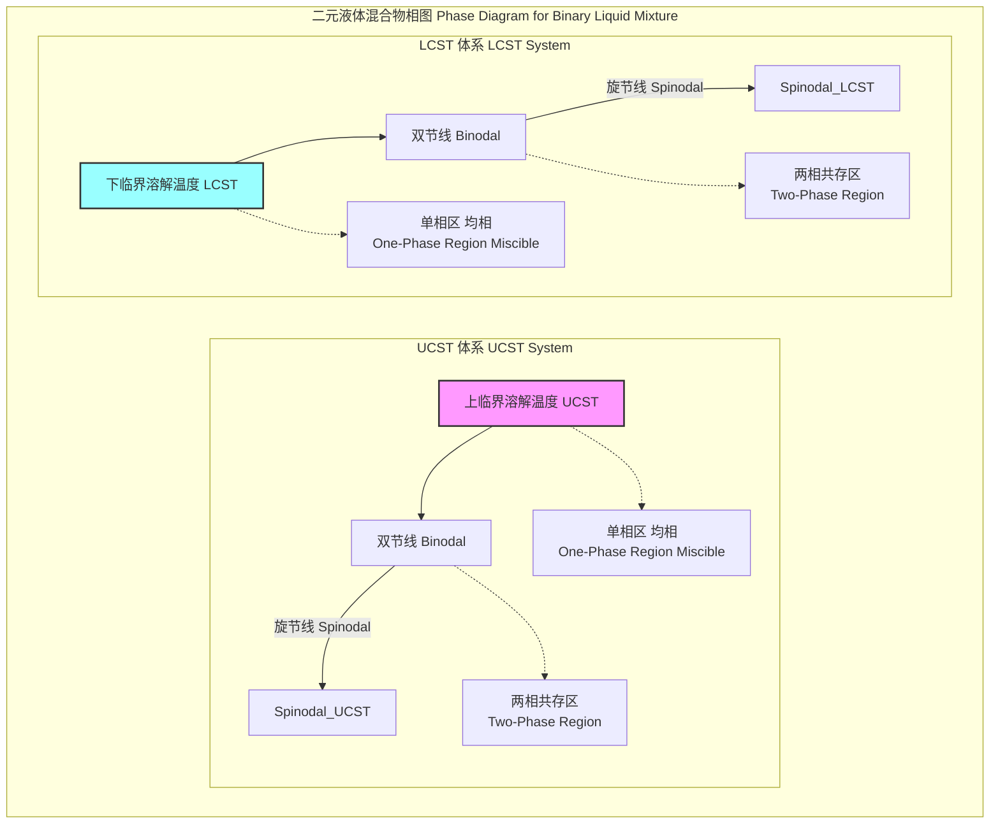
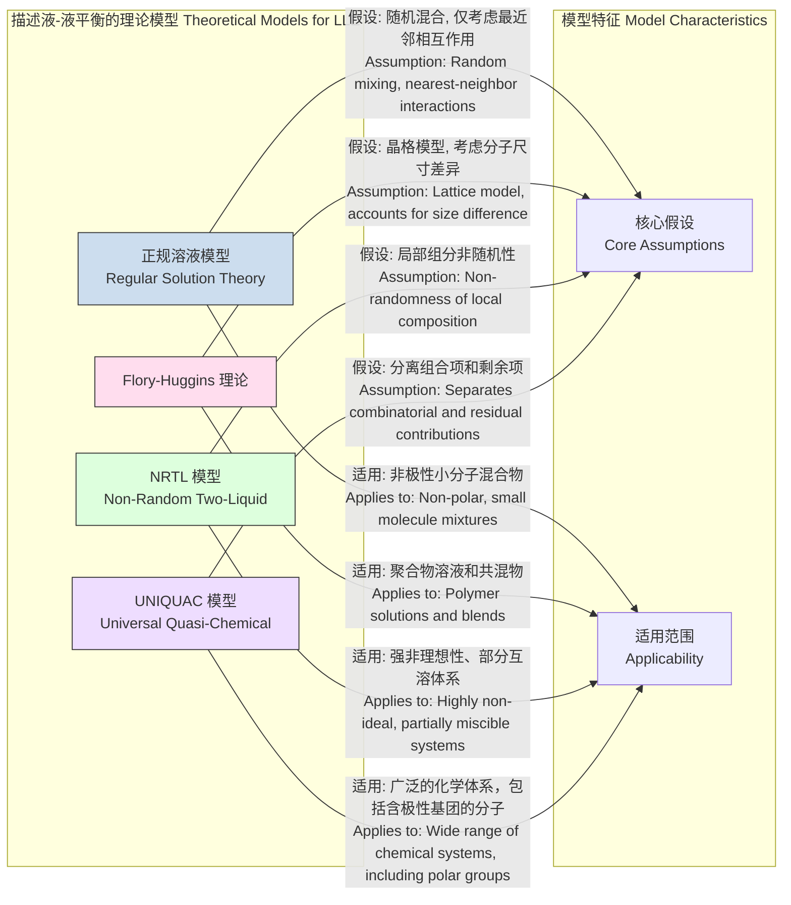

## 液-液共存温度

液-液共存温度（Liquid-Liquid Coexistence Temperature）是热力学中的一个核心概念，描述了在特定压力下，两种部分互溶或不互溶的液体能够以分离的液相形式稳定共存的温度范围。这一现象是液-液相分离（Liquid-Liquid Phase Separation, LLPS）的基础，在化学工程、材料科学、物理化学和生物物理学等领域具有至关重要的意义。

### 1. 核心概念与数学基础

#### 1.1 热力学判据
两种液体混合物的相行为由其混合吉布斯自由能（Gibbs Free Energy of Mixing, $\Delta G_{mix}$）决定。在恒定的温度（$T$）和压力（$P$）下，系统会自发地趋向于使吉布斯自由能最小化的状态。

对于一个由组分A和组分B组成的二元体系，当它们在所有组分下混合后都能形成单一、均匀的液相时，我们称之为完全互溶。然而，如果 $\Delta G_{mix}$ 与组分（通常用摩尔分数 $x$ 表示）的关系曲线上出现凹区（$\frac{\partial^2 \Delta G_{mix}}{\partial x^2} < 0$），系统则会自发分离成两个不同的液相（$\alpha$相和$\beta$相），以达到更低的总自由能。

液-液平衡的严格热力学条件是，在平衡状态下，每个组分在两个液相中的化学势（$\mu$）必须相等：
$$
\mu_A^{\alpha}(T, P, x_A^{\alpha}) = \mu_A^{\beta}(T, P, x_A^{\beta})
$$
$$
\mu_B^{\alpha}(T, P, x_B^{\alpha}) = \mu_B^{\beta}(T, P, x_B^{\beta})
$$
其中：
- $\mu_i^{\alpha}$ 和 $\mu_i^{\beta}$ 分别是组分 $i$（A或B）在 $\alpha$ 相和 $\beta$ 相中的化学势。
- $x_i^{\alpha}$ 和 $x_i^{\beta}$ 是组分 $i$ 在相应相中的摩尔分数。

#### 1.2 相图与临界溶解温度
液-液共存的温度和组分关系通常通过相图来表示。相图中的**双节线（Binodal Curve）**或**共存曲线（Coexistence Curve）**定义了在给定温度下，两个共存液相的平衡组分。双节线包围的区域即为两相共存区。

**亚稳区（Metastable Region）**位于双节线和**旋节线（Spinodal Curve）**之间。旋节线定义了相分离机制的边界，其数学定义为：
$$
\left( \frac{\partial^2 \Delta G_{mix}}{\partial x^2} \right)_{T,P} = 0
$$
在旋节线内部，混合物是绝对不稳定的，会通过旋节分解（Spinodal Decomposition）自发相分离。

相图的顶点被称为**临界溶解温度（Critical Solution Temperature, CST）**。在此温度下，两个共存相的组分变得完全相同，相界消失。临界点的数学条件是：
$$
\left( \frac{\partial^2 \Delta G_{mix}}{\partial x^2} \right)_{T,P} = 0 \quad \text{and} \quad \left( \frac{\partial^3 \Delta G_{mix}}{\partial x^3} \right)_{T,P} = 0
$$

存在两种主要的临界溶解温度：
- **上临界溶解温度（Upper Critical Solution Temperature, UCST）**：高于此温度，两液体在所有比例下均可互溶。
- **下临界溶解温度（Lower Critical Solution Temperature, LCST）**：低于此温度，两液体在所有比例下均可互溶。某些体系（如水-尼古丁）甚至可能同时具有UCST和LCST，形成一个封闭的相环。



#### 1.3 正规溶液模型
为了定量描述，我们可以使用**正规溶液模型（Regular Solution Model）**。该模型假设混合熵是理想的，但混合焓不为零。其混合吉布斯自由能为：
$$
\Delta G_{mix} = \Delta H_{mix} - T \Delta S_{mix} = \Omega x_A x_B + RT(x_A \ln x_A + x_B \ln x_B)
$$
其中：
- $\Delta H_{mix}$ 是混合焓。
- $\Delta S_{mix}$ 是混合熵。
- $R$ 是理想气体常数 (8.314 J·mol⁻¹·K⁻¹)。
- $T$ 是绝对温度 (K)。
- $x_A, x_B$ 是组分A和B的摩尔分数。
- $\Omega$ 是相互作用参数，与A-A、B-B和A-B分子间的相互作用能有关。$\Omega > 0$ 表示异类分子间排斥，可能导致相分离。

从此模型可以推导出临界温度 $T_c$：
$$
T_c = \frac{\Omega}{2R}
$$
当 $\Omega > 0$ 时，这是一个UCST。此模型无法解释LCST现象，后者通常与氢键等特定的、有方向性的相互作用有关。

---

### 2. 关键技术规格

下表列出了一些典型二元体系的液-液共存临界温度。

| 体系 (System) | 临界温度类型 (Critical Temp. Type) | 临界温度 (Critical Temperature) | 临界组分 (Critical Composition) | 压力 (Pressure) |
| :--- | :--- | :--- | :--- | :--- |
| 水 - 苯酚 (Water - Phenol) | UCST | 66.8 °C (339.95 K) | 34% (w/w) 苯酚 | 1 atm |
| 水 - 三乙胺 (Water - Triethylamine) | LCST | 18.5 °C (291.65 K) | 30% (w/w) 三乙胺 | 1 atm |
| 水 - 尼古丁 (Water - Nicotine) | UCST & LCST | UCST: 208 °C, LCST: 61 °C | 34% (w/w) 尼古丁 | 1 atm |
| 环己烷 - 甲醇 (Cyclohexane - Methanol) | UCST | 45.5 °C (318.65 K) | 29.2% (mol) 甲醇 | 1 atm |
| 聚(N-异丙基丙烯酰胺) - 水 (PNIPAM - Water) | LCST | ~32 °C (305.15 K) | 浓度依赖性 | 1 atm |

---

### 3. 常见用例

液-液共存温度的精确控制在多个领域具有重要应用。

- **液-液萃取 (Liquid-Liquid Extraction)**
  - **描述**: 一种利用溶质在两种不互溶或部分互溶的液体中溶解度差异来分离化合物的单元操作。操作温度必须设定在两相共存区内，以确保有效的相分离。
  - **量化指标**:
    - **分配系数 (Distribution Coefficient, $K_D$)**: $K_D = C_{org} / C_{aq}$，其中 $C_{org}$ 和 $C_{aq}$ 分别是溶质在有机相和水相中的浓度。典型的 $K_D$ 值范围为 0.1 到 100。
    - **分离因子 (Separation Factor, $\alpha$)**: $\alpha_{AB} = K_{D,A} / K_{D,B}$，用于衡量分离两种溶质A和B的能力。要求 $\alpha > 1$，通常工业应用中需要 $\alpha > 5$。

- **温敏聚合物与药物递送 (Temperature-Responsive Polymers & Drug Delivery)**
  - **描述**: 具有LCST特性的聚合物（如PNIPAM）在水溶液中，当温度升至LCST以上时，会从亲水性线圈状转变为疏水性球状，导致聚合物沉淀或水凝胶收缩，从而释放包裹的药物。
  - **量化指标**:
    - **相变温度精度**: LCST的测定精度可达 ±0.1 °C。
    - **药物释放速率**: 在 $T > \text{LCST}$ 时，药物释放速率显著增加，例如，在最初1小时内可释放总载药量的 60-80%。

- **生物分子凝聚体 (Biomolecular Condensates)**
  - **描述**: 在细胞生物学中，蛋白质和核酸通过液-液相分离形成无膜细胞器。这一过程对温度、浓度和离子强度高度敏感。共存温度（或更广义的相边界）决定了这些凝聚体的形成和解散条件。
  - **量化指标**:
    - **饱和浓度 ($c_{sat}$)**: 发生相分离的最低大分子浓度。$c_{sat}$ 是温度的函数，其变化曲线定义了相图的共存边界。

---

### 4. 实现考量

确定液-液共存温度涉及实验测量和计算模拟。

#### 4.1 实验方法
- **浊点法 (Cloud Point Titration)**: 通过改变温度或组分，用肉眼或浊度计观察到溶液变浑浊的瞬间，即浊点。此方法简单，但可能存在过冷或过热导致的滞后现象。
- **光散射法 (Light Scattering)**: 动态光散射（DLS）或静态光散射（SLS）可以精确测量。当体系接近临界点时，浓度涨落尺度增大，导致散射光强度急剧增加，可精确确定相变温度（精度可达 < ±0.01 K）。
- **差示扫描量热法 (DSC)**: 测量相变过程中的热流变化（焓变），可用于确定UCST或LCST。

#### 4.2 计算模拟方法
- **分子动力学 (MD) 模拟**:
  - **算法**: 采用直接共存法，将两个预平衡的液相（$\alpha$和$\beta$）置于同一模拟盒子中，模拟它们在NPT或NVT系综下的演化，最终达到平衡界面。通过分析界面两侧的密度/组分分布来确定共存点。
  - **算法复杂度**: 对于N个粒子，使用截断半径的复杂度为 $O(N^2)$，使用粒子网格Ewald（PME）等长程静电作用算法时，复杂度为 $O(N \log N)$。需要较长的模拟时间（纳秒到微秒）才能达到平衡。

- **蒙特卡罗 (MC) 模拟**:
  - **算法**: **吉布斯系综蒙特卡罗 (Gibbs Ensemble Monte Carlo, GEMC)** 是计算相平衡的强大工具。它使用两个独立的模拟盒子，分别代表$\alpha$相和$\beta$相。模拟中包含三种类型的MC移动：粒子在盒子内的位移、盒子间的体积交换（维持总压力恒定）、盒子间的粒子交换（维持化学势相等）。
  - **算法复杂度**: 复杂度与尝试移动的次数成正比，对于相平衡计算通常比MD更高效。

```mermaid
graph TD
    subgraph "吉布斯系综蒙特卡罗 GEMC 模拟流程"
        A[开始: 初始化两个模拟盒子<br>Start: Initialize two simulation boxes Phase α, Phase β] --> B选择一种MC移动<br>Select MC Move;
        B -- "粒子位移<br>Particle Displacement" --> C[在单个盒子内随机移动一个粒子<br>Randomly move a particle within one box];
        B -- "体积交换<br>Volume Exchange" --> D[改变两个盒子的体积<br>Change volumes of both boxes P_total=const];
        B -- "粒子交换<br>Particle Exchange" --> E[将一个粒子从一个盒子移动到另一个<br>Move a particle from one box to the other];
        C --> F接受/拒绝移动<br>Accept/Reject Move?;
        D --> F;
        E --> F;
        F -- "Metropolis准则<br>Metropolis Criterion" --> G达到平衡?<br>Equilibrium Reached?;
        G -- "否 No" --> B;
        G -- "是 Yes" --> H[结束: 分析两个盒子的性质<br>End: Analyze properties of both boxes composition, density];
    end

    style A fill:#ccf,stroke:#333
    style H fill:#cfc,stroke:#333
    style B fill:#ffc,stroke:#333
```

---

### 5. 性能特征

共存温度的测量和预测具有以下性能特征：

- **精度与不确定性**:
  - 实验方法的精度差异很大。浊点法的典型不确定度为 ±0.2 K 到 ±0.5 K。而精密的光散射法则可以将临界点附近的不确定度降低到 ±0.01 K 以下。
  - 统计上，报告值应包含多次独立测量的标准差和95%置信区间。例如：$T_c = (339.95 \pm 0.05)$ K。

- **滞后效应 (Hysteresis)**:
  - 在通过升温和降温循环测量共存曲线时，由于成核能垒的存在，观测到的相分离温度（浊点）和相溶解温度（澄清点）可能不一致。这个温度差被称为滞后环的宽度，是系统动力学特性的一个指标。

- **杂质敏感性**:
  - 共存温度对杂质非常敏感。即使是微量（< 1%）的第三方组分也可能显著改变UCST或LCST的值，或改变共存区的形状。这种效应在某些情况下可以被利用（例如，盐析效应）。

- **压力依赖性**:
  - 液-液共存温度通常对压力有一定依赖性，尽管其影响通常小于对气-液平衡的影响。这种依赖性由克劳修斯-克拉佩龙方程的类似形式描述：
    $$ \frac{dT}{dP} = \frac{T \Delta V_{mix}}{\Delta H_{mix}} $$
    其中 $\Delta V_{mix}$ 和 $\Delta H_{mix}$ 分别是混合时的体积变化和焓变。

---

### 6. 相关技术与模型比较

描述液-液平衡的理论模型在复杂性和适用性上各不相同。



#### 6.1 Flory-Huggins 理论
专为聚合物溶液设计，考虑了溶剂分子和聚合物链在尺寸上的巨大差异。其混合吉布斯自由能由下式给出：
$$
\frac{\Delta G_{mix}}{RT} = \frac{\phi_1}{N_1} \ln \phi_1 + \frac{\phi_2}{N_2} \ln \phi_2 + \chi_{12} \phi_1 \phi_2
$$
其中：
- $\phi_i$ 是组分 $i$ 的体积分数。
- $N_i$ 是组分 $i$ 的聚合度（对于小分子溶剂，$N=1$）。
- $\chi_{12}$ 是 Flory-Huggins 相互作用参数，表征溶剂和聚合物链段之间的相互作用。$\chi_{12} > 0.5$ 是相分离的条件。

#### 6.2 NRTL (Non-Random Two-Liquid) 模型
这是一个在化学工程中广泛使用的活度系数模型，它考虑了分子周围局部组分的非随机性。组分 $i$ 的活度系数 $\gamma_i$ 的表达式非常复杂，例如对于二元体系：
$$
\ln \gamma_1 = x_2^2 \left[ \tau_{21} \left( \frac{G_{21}}{x_1 + x_2 G_{21}} \right)^2 + \frac{\tau_{12} G_{12}}{(x_2 + x_1 G_{12})^2} \right]
$$
其中：
- $G_{ij} = \exp(-\alpha_{ij} \tau_{ij})$
- $\tau_{ij} = \frac{g_{ij} - g_{jj}}{RT}$
- $g_{ij}$ 是与分子间相互作用能相关的参数。
- $\alpha_{ij}$ 是非随机性参数，通常 $\alpha_{ij} = \alpha_{ji}$。
该模型有三个可调参数（$\tau_{12}, \tau_{21}, \alpha_{12}$），能够非常准确地拟合实验数据。

---

### 7. 参考文献

- Prausnitz, J. M., Lichtenthaler, R. N., & de Azevedo, E. G. (1999). *Molecular Thermodynamics of Fluid-Phase Equilibria* (3rd ed.). Prentice Hall. (A foundational textbook on phase equilibria).
- Flory, P. J. (1942). Thermodynamics of High Polymer Solutions. *The Journal of Chemical Physics*, 10(1), 51–61. DOI: [10.1063/1.1723621](https://doi.org/10.1063/1.1723621)
- Renon, H., & Prausnitz, J. M. (1968). Local compositions in thermodynamic excess functions for liquid mixtures. *AIChE Journal*, 14(1), 135–144. DOI: [10.1002/aic.690140124](https://doi.org/10.1002/aic.690140124)
- Brangwynne, C. P., Eckmann, C. R., Hyman, A. A., et al. (2009). Germline P Granules Are Liquid Droplets That Localize by Controlled Dissolution/Condensation. *Science*, 324(5935), 1729–1732. DOI: [10.1126/science.1172046](https://doi.org/10.1126/science.1172046)