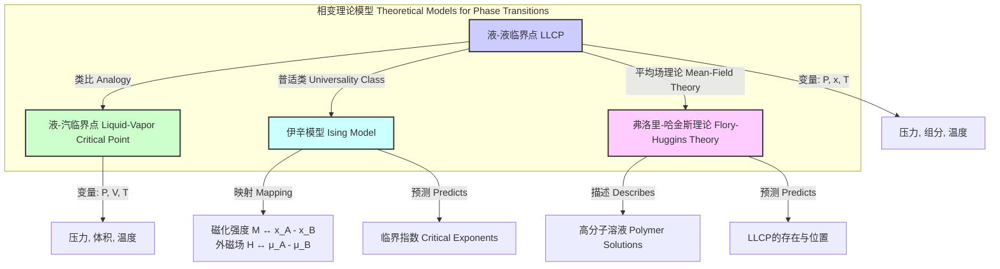

## 液-液临界点

液-液临界点（Liquid-Liquid Critical Point, LLCP）是热力学相图中的一个特殊点，标志着两相共存的液-液平衡曲线的终点。在此点，原本不互溶的两个液相（例如，油和水）的物理化学性质变得完全相同，最终合并成一个均一的液相。该点由临界温度（$T_c$）、临界压力（$P_c$）和临界组分（$x_c$）唯一确定。

从宏观上看，当体系接近液-液临界点时，会出现“临界乳光”（Critical Opalescence）现象。这是由于体系内部组分浓度的涨落尺度变得与可见光波长相当，导致对光的强烈散射，使原本透明的液体呈现出乳白色的浑浊外观。

### 核心概念与数学基础

液-液临界点的热力学基础可以通过吉布斯自由能（Gibbs Free Energy, $G$）来描述。对于一个二元混合物体系，其吉布斯自由能是温度（$T$）、压力（$P$）和摩尔分数（$x$）的函数。

#### 相分离条件

当混合物的吉布斯自由能曲线 $G(x)$ 出现凹陷时，体系会自发分离成两个具有不同组分（$x_\alpha$ 和 $x_\beta$）的液相，以使总自由能最低。在热力学平衡时，两个共存相中各组分的化学势必须相等。这定义了**双节线（Binodal Curve）**：

$$ \mu_A^\alpha(T, P, x_\alpha) = \mu_A^\beta(T, P, x_\beta) $$
$$ \mu_B^\alpha(T, P, x_\alpha) = \mu_B^\beta(T, P, x_\beta) $$

其中：
*   $\mu_i^\alpha$ 是组分 $i$ 在 $\alpha$ 相中的化学势。
*   $\mu_i^\beta$ 是组分 $i$ 在 $\beta$ 相中的化学势。

#### 亚稳态极限

体系稳定性的热力学判据是吉布斯自由能对组分的二阶偏导数大于零。当此导数等于零时，体系达到亚稳态的极限，任何微小的扰动都会导致相分离。这定义了**旋节线（Spinodal Curve）**：

$$ \left( \frac{\partial^2 G_m}{\partial x^2} \right)_{T,P} = 0 $$

其中：
*   $G_m$ 是摩尔吉布斯自由能。
*   $x$ 是其中一个组分的摩尔分数。

#### 临界点条件

液-液临界点是双节线和旋节线的汇合点。在该点，两共存相的组分差趋于零。数学上，这要求吉布斯自由能对组分的二阶和三阶偏导数同时为零：

$$ \left( \frac{\partial^2 G_m}{\partial x^2} \right)_{T,P} = 0 $$
$$ \left( \frac{\partial^3 G_m}{\partial x^3} \right)_{T,P} = 0 $$

这两条方程确定了临界温度 $T_c$ 和临界组分 $x_c$。

下图展示了典型的具有上临界溶解温度（UCST）的二元体系的相图。

```mermaid
graph TD
    subgraph "二元液体混合物 T-x 相图 Binary Liquid Mixture T-x Phase Diagram"
        direction LR
        A[温度 Temperature, T] -- "纵轴 Y-axis" --> P1T > T_c
        B[组分 Composition, x] -- "横轴 X-axis" --> P2x
        
        P1 -- "均相区 One-Phase Region" --> C1
        P3T < T_c -- "两相区 Two-Phase Region" --> C2
        
        C1均相区
        C2两相区
        
        LLCP["液-液临界点 LLCP<br>T_c, x_c"]
        Binodal["双节线 Binodal Curve<br>相平衡边界"]
        Spinodal["旋节线 Spinodal Curve<br>亚稳态极限"]

        C1 -- "降温 Cooling" --> Binodal
        Binodal -- "相分离 Phase Separation" --> C2
        C2 -- "升温 Heating" --> Binodal
        Binodal -- "混合 Mixing" --> C1
        
        Binodal -. "内部 Inside" .-> Spinodal
        Binodal -- "顶点 Apex" --> LLCP
        Spinodal -- "顶点 Apex" --> LLCP
    end

    style LLCP fill:#ffcccc,stroke:#990000,stroke-width:3px
    style C1 fill:#ccffcc,stroke:#006600
    style C2 fill:#cceeff,stroke:#003366
```

### 关键技术规格

下表列出了一些典型二元体系的液-液临界点参数。

| 体系 (System) | 临界点类型 (Critical Point Type) | 临界温度, $T_c$ | 临界组分, $x_c$ (质量分数) | 临界压力, $P_c$ |
| :--- | :--- | :--- | :--- | :--- |
| 水-苯酚 (Water-Phenol) | UCST | 338.7 K (65.6 °C) | 34% 苯酚 (Phenol) | 1 atm |
| 水-三乙胺 (Water-Triethylamine) | LCST | 291.5 K (18.4 °C) | 30% 三乙胺 (Triethylamine) | 1 atm |
| 水-尼古丁 (Water-Nicotine) | UCST & LCST | $T_{UCST}$ = 481 K (208 °C) <br> $T_{LCST}$ = 334 K (61 °C) | 34% 尼古丁 (Nicotine) | 1 atm |
| 聚(N-异丙基丙烯酰胺)-水 (PNIPAM-Water) | LCST | ~305 K (32 °C) | 依赖于聚合物分子量 | 1 atm |

*   **UCST (Upper Critical Solution Temperature):** 上临界溶解温度。高于此温度，组分完全互溶。
*   **LCST (Lower Critical Solution Temperature):** 下临界溶解温度。低于此温度，组分完全互溶。

### 常见用例

利用液-液临界点附近物理性质的急剧变化，可以实现多种技术应用。

*   **液-液萃取 (Liquid-Liquid Extraction):**
    *   **描述:** 通过微调温度，使体系在均相和两相之间切换，从而实现目标物质的高效分离。例如，在LCST体系中，可在低温下将溶质溶解，然后升温至$T>T_c$使其相分离，目标物质会富集在其中一相，从而易于分离。
    *   **性能指标:** 对于特定体系，通过小于5 K的温度变化，可实现目标产物萃取效率 > 99%。

*   **智能材料与药物递送 (Smart Materials & Drug Delivery):**
    *   **描述:** 具有LCST的聚合物（如PNIPAM）在水中，当温度低于$T_c$时，聚合物链伸展并溶解；当温度高于$T_c$（例如，体温），聚合物链会塌缩并析出，从而释放包裹的药物。
    *   **性能指标:** 在$T_c$附近，粒径可在100 nm到 >1000 nm之间急剧变化，实现触发式药物释放，释放速率可提高一个数量级以上。

*   **乳液和微乳液制备 (Formation of Emulsions):**
    *   **描述:** 临界点附近界面张力的急剧下降，有利于形成尺寸可控、稳定性高的乳液或微乳液。
    *   **性能指标:** 临界点附近界面张力可降至 $10^{-3}$ mN/m 以下，从而显著降低形成微乳液所需的能量。

### 实现考量

#### 实验测定

*   **浊点法 (Cloud Point Titration):**
    *   **描述:** 通过精确控制温度，观察混合物从澄清变为浑浊的瞬间（浊点），记录此时的温度和组分。通过测量一系列不同组分的浊点，可以绘制出双节线，其极值点即为LLCP。
    *   **算法复杂度:** 实验过程的复杂度主要与所需数据点的数量和温度控制精度有关，通常为线性复杂度。

*   **光散射法 (Light Scattering):**
    *   **描述:** 体系接近临界点时，浓度涨落导致散射光强度急剧增加。通过测量散射光强度或相关函数随温度的变化，可以极其精确地确定$T_c$。散射强度 $I(q)$ 遵循Ornstein-Zernike方程：
        $$ I(q) = \frac{I_0}{1 + q^2 \xi^2} $$
        其中 $q$ 是散射矢量大小，$\xi$ 是关联长度。在临界点 $\xi \to \infty$。
    *   **算法复杂度:** 数据分析通常涉及非线性拟合，其复杂度取决于拟合算法（如Levenberg-Marquardt）。

#### 计算模拟

*   **分子动力学 (Molecular Dynamics, MD):**
    *   **描述:** 通过模拟大量分子的运动轨迹，直接观察相分离过程，从而构建相图。
    *   **算法复杂度:** 计算成本高昂。对于 $N$ 个粒子，标准MD算法的复杂度为 $O(N^2)$，使用粒子网格Ewald（PME）等远距离力优化后可降至 $O(N \log N)$。

*   **蒙特卡洛 (Monte Carlo, MC):**
    *   **描述:** 使用巨正则系综蒙特卡洛（Grand Canonical Monte Carlo, GCMC）等方法，通过计算不同状态的概率来确定相平衡条件和自由能，从而定位临界点。
    *   **算法复杂度:** 复杂度与模拟步数和体系大小成正比，通常需要精巧的采样技术（如直方图重整法）来提高效率。

### 性能特征

临界点附近的物理量表现出普适的标度律（scaling law）行为，可以用一组临界指数来描述。

$$
\begin{align*}
|x_\alpha - x_\beta| &\sim |\tau|^\beta \quad &(\text{共存曲线形状}) \\
\chi_T &\sim |\tau|^{-\gamma} \quad &(\text{等温渗透率发散}) \\
\xi &\sim |\tau|^{-\nu} \quad &(\text{关联长度发散})
\end{align*}
$$

其中：
*   $\tau = (T - T_c) / T_c$ 是约化温度（reduced temperature）。
*   $x_\alpha, x_\beta$ 是共存两相的摩尔分数。
*   $\chi_T$ 是等温渗透率，与浓度涨落直接相关。
*   $\xi$ 是浓度涨落的空间关联长度。
*   $\beta, \gamma, \nu$ 是临界指数。

#### 统计度量

对于大多数液-液临界点，其行为属于**三维伊辛模型（3D Ising Model）**的普适类。

| 临界指数 (Critical Exponent) | 理论值 (3D Ising) | 典型实验值 (e.g., isobutyric acid-water) |
| :--- | :--- | :--- |
| $\beta$ | $\approx 0.3265$ | $0.325 \pm 0.002$ |
| $\gamma$ | $\approx 1.2372$ | $1.24 \pm 0.01$ |
| $\nu$ | $\approx 0.6301$ | $0.630 \pm 0.003$ |

实验上测定临界点时，通常通过对数据进行标度律拟合，并给出带有置信区间的数值，例如 $T_c = 315.75 \pm 0.05$ K。

### 相关技术与比较模型



#### 液-汽临界点 (Liquid-Vapor Critical Point)

这是最经典的临界点，标志着液体和气体之间的区别消失。其热力学描述与LLCP高度相似，只是变量不同。在液-汽临界点，序参量是密度差 $(\rho_L - \rho_V)$，而在LLCP，序参量是组分差 $(x_\alpha - x_\beta)$。两者通常属于相同的普适类（3D Ising）。

#### 弗洛里-哈金斯理论 (Flory-Huggins Theory)

这是一个用于描述高分子溶液热力学的平均场理论模型。其混合吉布斯自由能方程为：

$$ \frac{\Delta G_m}{RT} = \frac{\phi_1}{N_1} \ln \phi_1 + \frac{\phi_2}{N_2} \ln \phi_2 + \chi_{12} \phi_1 \phi_2 $$

其中：
*   $\Delta G_m$ 是混合吉布斯自由能。
*   $R$ 是理想气体常数。
*   $T$ 是绝对温度。
*   $\phi_1, \phi_2$ 是溶剂和聚合物的体积分数 ($\phi_1 + \phi_2 = 1$)。
*   $N_1, N_2$ 分别是溶剂和聚合物的聚合度（对于小分子溶剂，$N_1=1$）。
*   $\chi_{12}$ 是弗洛里-哈金斯相互作用参数，描述溶剂和溶质之间的相互作用能。

通过对该方程应用临界点条件（二阶和三阶导数为零），可以推导出临界点的组分 $\phi_{2,c}$ 和相互作用参数 $\chi_{12,c}$：

$$ \phi_{2,c} = \frac{1}{1 + \sqrt{N_2}} $$
$$ \chi_{12,c} = \frac{1}{2} \left( 1 + \frac{1}{\sqrt{N_2}} \right)^2 $$

由于 $\chi_{12}$ 通常与温度有关（例如，$\chi_{12} = A + B/T$），第二个方程可以用来求解临界温度 $T_c$。尽管是平均场理论，但它成功地预测了高分子溶液中LLCP的存在。

### 参考文献

1.  Anisimov, M. A. (2002). Fifty years of breakthrough discoveries in fluid criticality. *International Journal of Thermophysics*, 23(3), 637-679. DOI: `10.1023/A:1015429712337`
2.  Debenedetti, P. G. (2003). Supercooled and glassy water. *Journal of Physics: Condensed Matter*, 15(45), R1669. DOI: `10.1088/0953-8984/15/45/R01`
3.  Flory, P. J. (1942). Thermodynamics of high polymer solutions. *The Journal of Chemical Physics*, 10(1), 51-61. DOI: `10.1063/1.1723621`
4.  Pelissetto, A., & Vicari, E. (2002). Critical phenomena and renormalization-group theory. *Physics Reports*, 368(6), 549-727. DOI: `10.1016/S0370-1573(02)00219-3`