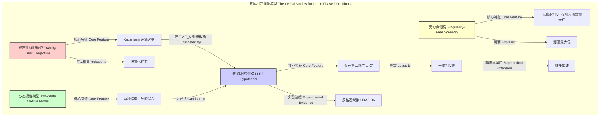

## 液-液相变 (liquid liquid phase transition)

液-液相变 (Liquid-Liquid Phase Transition, LLPT) 是一种在单一组分物质中，于不同热力学条件下（通常是低温和高压），在两种密度和结构不同的液体相之间发生的一阶相变。这两种液体相通常被称为低密度液体 (Low-Density Liquid, LDL) 和高密度液体 (High-Density Liquid, HDL)。与更为人熟知的气-液或液-固相变不同，LLPT 发生在液态区域内部，揭示了液体状态下复杂的结构和热力学行为。

### 核心概念与数学基础 (Core Concepts and Mathematical Foundations)

LLPT 的核心在于吉布斯自由能 ($G$) 的势能面存在多个局部最小值。在特定的温度 ($T$) 和压力 ($P$) 下，系统会处于全局最低的吉布斯自由能状态。

#### 热力学描述 (Thermodynamic Description)

系统的热力学稳定性由吉布斯自由能 $G$ 决定：
$$ G(T, P) = H - TS = U + PV - TS $$
其中：
*   $G$ 是吉布斯自由能 (Gibbs Free Energy)
*   $H$ 是焓 (Enthalpy)
*   $T$ 是绝对温度 (Absolute Temperature)
*   $S$ 是熵 (Entropy)
*   $U$ 是内能 (Internal Energy)
*   $P$ 是压力 (Pressure)
*   $V$ 是体积 (Volume)

在 $P-T$ 相图中，两种液相 (LDL 和 HDL) 的共存线由它们的吉布斯自由能相等来定义：
$$ G_{LDL}(T, P) = G_{HDL}(T, P) $$
这条共存线是一条一阶相变线，意味着在跨越该线时，系统的焓和体积会发生不连续的变化（即存在相变潜热 $\Delta H$ 和体积变化 $\Delta V$）。

该共存线的斜率由克劳修斯-克拉佩龙方程 (Clausius-Clapeyron equation) 描述：
$$ \frac{dP}{dT} = \frac{\Delta H_{trans}}{T \Delta V_{trans}} = \frac{L_{trans}}{T(V_{HDL} - V_{LDL})} $$
其中：
*   $\frac{dP}{dT}$ 是共存线在 $P-T$ 图上的斜率
*   $\Delta H_{trans} = L_{trans}$ 是相变潜热 (Latent Heat of Transition)
*   $\Delta V_{trans} = V_{HDL} - V_{LDL}$ 是两相之间的摩尔体积差。由于 $V_{LDL} > V_{HDL}$，$\Delta V_{trans}$ 为负值。

#### 第二临界点 (The Second Critical Point)
LLPT 的一阶相变线并不会无限延伸，而是终止于一个临界点，被称为“第二临界点” (Second Critical Point)，记为 $C'$。其坐标为 $(T_{c'}, P_{c'})$。
*   当温度 $T > T_{c'}$ 时，LDL 和 HDL 之间的转变是连续的，不再是一阶相变。
*   在临界点 $C'$，两相之间的物理性质差异消失，$\Delta H_{trans} = 0$ 且 $\Delta V_{trans} = 0$。
*   临界点的数学条件由状态方程定义：
$$ \left( \frac{\partial P}{\partial V} \right)_{T=T_{c'}} = 0 \quad \text{and} \quad \left( \frac{\partial^2 P}{\partial V^2} \right)_{T=T_{c'}} = 0 $$

#### 维多姆线 (The Widom Line)
在超临界区域 ($T > T_{c'}$)，尽管没有真正的相变，但系统的热力学响应函数（如比热容、压缩系数、热膨胀系数）在某条轨迹上会达到最大值。这条轨迹被称为维多姆线 (Widom Line)，它是亚临界区域一阶相变线的超临界延伸。维多姆线标志着从 HDL-like 流体到 LDL-like 流体的平滑过渡区域。

```mermaid
graph TD
    subgraph "水 P-T 相图 Water P-T Phase Diagram"
        direction LR
        
        Ice[冰 Ice]
        Liquid[常规液体 Normal Liquid]
        Gas[气体 Gas]
        
        subgraph "“无人区” No Man's Land"
            style "“无人区” No Man's Land" fill:#f9f9f9,stroke:#ccc,stroke-dasharray: 5 5
            
            LDL[低密度液体 LDL]
            HDL[高密度液体 HDL]
            CP2[第二临界点 C' Second Critical Point]
            
            LDL -- "一阶相变 First-Order Transition" --> HDL;
        end
        
        WidomLine["维多姆线 Widom Line"]

        Liquid -- "过冷 Supercooling" --> LDL
        Liquid -- "加压 Pressurization" --> HDL
        HDL -- "跨越维多姆线 Crosses Widom Line" --> Liquid
        
        CP1[临界点 C Critical Point]

        Ice -- "熔化/凝固 Melting/Freezing" --> Liquid
        Liquid -- "沸腾/冷凝 Boiling/Condensation" --> Gas
        Ice -- "升华/凝华 Sublimation/Deposition" --> Gas
        Liquid -- "玻璃化转变 Vitrification" --> HDA[高密度非晶冰 HDA]
        LDL -- "玻璃化转变 Vitrification" --> LDA[低密度非晶冰 LDA]
        
        Gas -- "终止于 C Ends at C" --> CP1
        LDL -- "终止于 C' Ends at C'" --> CP2
        CP2 -- "超临界延伸 Supercritical Extension" --> WidomLine
        WidomLine -- "进入常规液体区 Enters Normal Liquid Region" --> Liquid
    end

    style LDL fill:#cceeff,stroke:#006699
    style HDL fill:#6699cc,stroke:#003366
    style CP2 fill:#ff6666,stroke:#990000,stroke-width:3px
```

### 关键技术参数 (Key Technical Specifications)

LLPT 的研究主要集中在少数几种物质上，其中过冷水是研究最广泛但也最具挑战性的体系。由于在 LLPT 发生的温压区间（被称为“无人区”，No Man's Land），水会快速结晶，实验测量极其困难。下表列出了基于理论计算和间接实验推断的过冷水 LLPT 的关键参数。

| 参数 (Parameter) | 符号 (Symbol) | 典型值 (Typical Value) | 单位 (Unit) | 描述 (Description) |
| :--- | :---: | :---: | :---: | :--- |
| 第二临界点温度 | $T_{c'}$ | ~ 225 ± 10 | K | 相变线终止的临界温度 |
| 第二临界点压力 | $P_{c'}$ | ~ 50 ± 30 | MPa | 相变线终止的临界压力 |
| 低密度液体密度 (0.1 MPa, 228 K) | $\rho_{LDL}$ | ~ 0.92 | g/cm³ | LDL 相的典型密度 |
| 高密度液体密度 (200 MPa, 228 K) | $\rho_{HDL}$ | ~ 1.15 | g/cm³ | HDL 相的典型密度 |
| 相变压力 (T=227 K) | $P_{trans}$ | ~ 70 | MPa | 在给定温度下发生 LLPT 的压力 |
| 维多姆线起始点 | - | ($T_{c'}$, $P_{c'}$) | (K, MPa) | 维多姆线从第二临界点延伸 |
| 密度差异 (在 $T_{c'}$ 附近) | $\Delta \rho$ | ~ 0.20 | g/cm³ | LDL 和 HDL 之间的密度差 |

*注意：这些数值存在很大的不确定性，不同水模型（如 ST2, TIP4P/2005）的分子动力学模拟结果和不同实验方法的推断值有所差异。*

### 常见用例与性能指标 (Common Use Cases and Performance Metrics)

LLPT 作为一个基础科学概念，其“用例”主要体现在解释自然现象和指导技术应用上。

*   **生物分子低温保存 (Cryopreservation of Biomolecules)**
    *   **描述**: 蛋白质和细胞在冷冻过程中可能会因冰晶形成而失活。通过快速降温或添加低温保护剂，可以使水进入非晶态。水的 LDL 和 HDL 结构特性被认为深刻影响蛋白质在低温下的水合层结构和稳定性。理解 LLPT 有助于优化冷冻保存方案。
    *   **性能指标**:
        *   蛋白质活性恢复率: > 95%
        *   细胞存活率 (经过冻融循环): > 90%
        *   冰晶形成抑制率: < 1% (体积比)

*   **地球物理学与行星科学 (Geophysics and Planetary Science)**
    *   **描述**: 在木星、土星等巨行星的冰卫星（如欧罗巴）内部，水可能在极高的压力和低温下以液态存在。LLPT 理论有助于建立更精确的行星内部结构模型，解释其海洋、磁场和地质活动。
    *   **性能指标**:
        *   行星模型预测的地震波速度与观测数据偏差: < 3%
        *   模型预测的海洋层厚度置信区间: 95% CI

*   **材料科学 (Materials Science)**
    *   **描述**: LLPT 是多晶态 (Polyamorphism) 现象的一个例子，即同一种物质可以存在多种非晶固态。LLPT 理论被用于解释金属玻璃、硅、磷等材料中不同非晶相的形成机制。
    *   **性能指标**:
        *   玻璃转变温度 ($T_g$) 预测精度: ± 5 K
        *   材料脆性指数 (Fragility Index, m) 的理论计算与实验符合度。

### 实现考量与算法复杂度 (Implementation Considerations and Algorithmic Complexity)

研究 LLPT 主要依赖超快实验技术和大规模分子动力学 (MD) 模拟。

#### 实验实现 (Experimental Implementation)
*   **挑战**: 避免在“无人区”内发生结晶。水的均相成核时间在这一区域短至微秒甚至纳秒。
*   **技术**:
    *   **超快激光加热/冷却**: 使用激光脉冲快速加热非晶冰 (HDA 或 LDA) 或快速冷却液滴，使其在结晶前进入目标温压区进行探测。
    *   **X射线自由电子激光 (XFEL)**: 利用其超短（飞秒级）和超强的 X 射线脉冲，可以在样品结晶前获得其结构信息，如结构因子 $S(q)$。
    *   **高压技术**: 使用金刚石对顶砧 (Diamond Anvil Cell) 产生研究 LLPT 所需的高压环境。

#### 计算实现 (Computational Implementation)
*   **方法**: 分子动力学 (MD) 模拟是研究 LLPT 的核心工具。
*   **力场**: 选择能够准确复现水异常性质的力场至关重要，例如 ST2、TIP4P/2005、TIP5P 等。
*   **模拟系综**: 通常使用 NPT (恒定粒子数、压力、温度) 系综来构建相图。
*   **算法复杂度**:
    *   MD 模拟的主要计算开销在于计算粒子间的相互作用力。对于包含 $N$ 个粒子的系统：
    *   **截断法 (Cutoff Method)**: 对于短程力，计算复杂度为 $O(N)$。
    *   **长程静电作用**: 使用 Ewald 求和或其快速变体——粒子网格 Ewald (Particle Mesh Ewald, PME) 方法。PME 的复杂度为 $O(N \log N)$，是现代大规模模拟的标准。
    *   因此，一次典型的 MD 模拟步的整体复杂度为 $O(N \log N)$。

### 性能特征与统计测量 (Performance Characteristics and Statistical Measures)

LLPT 及其临界现象表现出独特的统计物理特征。

*   **动力学 (Kinetics)**: LLPT 是一阶相变，通过成核和生长机制进行。在过冷/过压条件下，新相的核会自发形成，然后长大直到整个系统完成转变。
*   **涨落 (Fluctuations)**: 在接近第二临界点 $C'$ 时，系统序参量（如密度）的涨落会急剧增大。
    *   **关联长度 ($\xi$)**: 描述了涨落的空间关联范围。在临界点附近，关联长度呈幂律发散：
      $$ \xi \sim |(T - T_{c'})/T_{c'}|^{-\nu} $$
      其中 $\nu$ 是临界指数，对于三维伊辛 (3D Ising) 普适类，$\nu \approx 0.63$。
    *   **等温压缩系数 ($\kappa_T$)**: 衡量系统体积对压力的响应，它与密度涨落直接相关，在临界点附近也发散：
      $$ \kappa_T = -\frac{1}{V} \left( \frac{\partial V}{\partial P} \right)_T \sim |(T - T_{c'})/T_{c'}|^{-\gamma} $$
      其中 $\gamma$ 是另一个临界指数，对于三维伊辛普适类，$\gamma \approx 1.24$。
*   **结构因子 (Structure Factor)**
    *   结构因子 $S(q)$ 可通过 X 射线或中子散射实验测量，是揭示液体结构的关键。其定义为：
      $$ S(\mathbf{q}) = \frac{1}{N} \left\langle \sum_{j,k=1}^{N} e^{-i\mathbf{q} \cdot (\mathbf{r}_j - \mathbf{r}_k)} \right\rangle $$
      其中 $\mathbf{q}$ 是散射矢量，$\mathbf{r}_j$ 是粒子 $j$ 的位置，$N$ 是粒子总数。
    *   LDL 和 HDL 的 $S(q)$ 曲线有显著差异，尤其是在第一尖峰的位置和高度上，反映了它们不同的近邻和中程有序结构。

### 相关技术与比较数学模型 (Related Technologies and Comparative Mathematical Models)

LLPT 理论是理解液体复杂性的框架之一，可以与其他模型进行比较。



*   **双态混合模型 (Two-State Mixture Model)**:
    *   该模型将液体视为两种不同局部结构（例如，低密度、高熵的 S-态和高密度、低熵的 H-态）的非理想混合物。
    *   系统的吉布斯自由能可以写为：
      $$ G_{mix}(T, P, x) = (1-x)G_H(T, P) + xG_S(T, P) + RT[x\ln x + (1-x)\ln(1-x)] + G^{E}(x) $$
      其中 $x$ 是 S-态的摩尔分数，$G_H$ 和 $G_S$ 分别是纯 H-态和纯 S-态的自由能，$G^E$ 是超额混合自由能，描述了两态间的相互作用。通过最小化 $G_{mix}$，可以推导出相分离（即 LLPT）的条件。

*   **稳定性极限假说 (Stability Limit Conjecture)**:
    *   该假说认为，过冷液体最终会达到一个热力学稳定性极限，即自旋线 (spinodal line)。LLPT 被视为避免了这种不稳定的方式。它将 LLPT 与 Kauzmann 悖论（即在有限温度下液体熵变得比晶体熵还低的悖论）联系起来。

*   **无奇点假说 (Singularity-Free Scenario)**:
    *   该替代理论认为，在过冷水中并不存在真正的热力学奇点（如临界点）。观测到的热力学响应函数最大值（维多姆线）并非源于下方的临界点，而是一种没有相变的平滑过渡。

这些模型之间的争论仍在继续，需要更精确的实验和计算证据来最终确定哪种理论最能描述水的行为。

### 参考文献 (References)

1.  Mishima, O., & Stanley, H. E. (1998). The relationship between liquid, supercooled and glassy water. *Nature*, 396(6709), 329-335. DOI: [10.1038/24540](https://doi.org/10.1038/24540)
2.  Gallo, P., Amann-Winkel, K., Angell, C. A., Anisimov, M. A., Caupin, F., Chakravarty, C., ... & Stanley, H. E. (2016). Water: A tale of two liquids. *Chemical Reviews*, 116(13), 7463-7500. DOI: [10.1021/acs.chemrev.5b00750](https://doi.org/10.1021/acs.chemrev.5b00750)
3.  Debenedetti, P. G. (2003). Supercooled and glassy water. *Journal of Physics: Condensed Matter*, 15(45), R1669. DOI: [10.1088/0953-8984/15/45/R01](https://doi.org/10.1088/0953-8984/15/45/R01)
4.  Kim, K. H., Späh, A., Pathak, H., Perakis, F., Mariedahl, D., Amann-Winkel, K., ... & Nilsson, A. (2017). Maxima in the thermodynamic response and correlation functions of deeply supercooled water. *Science*, 358(6370), 1589-1593. DOI: [10.1126/science.aap8269](https://doi.org/10.1126/science.aap8269)