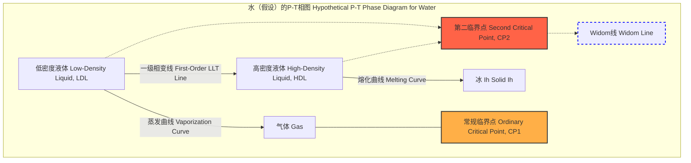

## 液-液相变 (liquid liquid transition)

液-液相变（Liquid-Liquid Transition, LLT）是一种在单一组分物质中，从一种液相转变为另一种密度和结构不同的液相的一级相变。这两种液相，通常被称为低密度液体（Low-Density Liquid, LDL）和高密度液体（High-Density Liquid, HDL），尽管它们在化学成分上完全相同，但在物理性质（如密度、黏度、扩散系数）上表现出显著差异。这种现象在一些具有复杂相互作用或强方向性键合的系统中被提出或观察到，例如水、硅、磷和一些金属玻璃。

LLT的存在通常与一个假设的“第二临界点”（Second Critical Point, CP2）相关联。在一级相变线（两种液相共存的P-T线）的末端，存在一个临界点，超过该点，两种液相之间的转变变为连续的。这个临界点通常位于深过冷区，即在常规熔点以下，这使得实验直接观测变得极具挑战性，因为系统很容易发生结晶。

### 核心概念与数学基础

#### 吉布斯自由能 (Gibbs Free Energy)

在恒定温度（$T$）和压力（$P$）下，系统的热力学稳定性由吉布斯自由能（$G$）决定。系统会趋向于占据具有最低吉布斯自由能的状态。
$$ G = U + PV - TS $$
其中：
*   $U$ 是系统的内能 (Internal Energy)。
*   $P$ 是压力 (Pressure)。
*   $V$ 是体积 (Volume)。
*   $T$ 是绝对温度 (Absolute Temperature)。
*   $S$ 是熵 (Entropy)。

对于一个可能存在两种液相（HDL 和 LDL）的系统，其吉布斯自由能可以被描绘为一个关于某个序参量（例如密度 $\rho$）的函数 $G(\rho)$。在特定 P-T条件下，如果 $G(\rho)$ 出现两个局部最小值，分别对应于 $G_{HDL}$ 和 $G_{LDL}$，则系统可能发生液-液相变。

*   当 $G_{HDL} < G_{LDL}$ 时，高密度液相是稳定相。
*   当 $G_{LDL} < G_{HDL}$ 时，低密度液相是稳定相。
*   当 $G_{LDL} = G_{HDL}$ 时，两相可以共存，这定义了一级相变线。

#### 相图与第二临界点

液-液相变通常在物质的P-T相图中表示。

相变线（两种液相共存线）的斜率由克劳修斯-克拉佩龙方程（Clausius-Clapeyron Equation）描述：
$$ \frac{dP}{dT} = \frac{\Delta H_{LL}}{T \Delta V_{LL}} = \frac{L_{LL}}{T(V_{LDL} - V_{HDL})} $$
其中：
*   $\frac{dP}{dT}$ 是相变线上压力随温度的变化率。
*   $\Delta H_{LL}$ 是相变潜热（Latent Heat），即从HDL转变为LDL吸收的热量。
*   $\Delta V_{LL}$ 是相变过程中的体积变化 ($V_{LDL} - V_{HDL}$)。由于 $V_{LDL} > V_{HDL}$，$\Delta V_{LL}$ 为正。
*   $L_{LL}$ 是相变潜热的另一种表示。

对于大多数已知系统（如水），$\Delta H_{LL}$ 为正，因此相变线具有正斜率。

#### 朗道理论 (Landau Theory)

在第二临界点 ($T_c, P_c$) 附近，两种液相之间的区别消失，相变是连续的（二阶）。可以使用朗道理论来描述这种行为。定义一个序参量 $\eta$（例如，$\eta = \rho - \rho_c$，其中 $\rho_c$ 是临界密度），吉布斯自由能可以展开为 $\eta$ 的幂级数：
$$ G(\eta, T, P) = G_0(T, P) + A(T, P)\eta^2 + B(T, P)\eta^4 + C(T, P)\eta^6 + \dots $$
为了简化，我们通常假设 $B > 0$ 且 $C \approx 0$。系数 $A$ 在临界点附近是温度和压力的线性函数：
$$ A(T, P) \approx a(T - T_c) + a'(P - P_c) $$
其中 $a$ 和 $a'$ 是正常数。
*   当 $A > 0$ (例如，$T > T_c$) 时，$G$ 在 $\eta=0$ 处有唯一的最小值，系统处于单一液相。
*   当 $A < 0$ (例如，$T < T_c$) 时，$G$ 在 $\eta = \pm \sqrt{-A/2B}$ 处有两个对称的最小值，对应于LDL和HDL两相。

---

## 关键技术参数

以下表格列出了一些典型系统（主要是水模型）中预测的液-液临界点参数。需要强调的是，这些值大多来自计算机模拟，实验验证仍然是一个活跃的研究领域。

| 物质/模型 (Substance/Model) | 临界温度 $T_c$ (K) | 临界压力 $P_c$ (MPa) | 临界密度 $\rho_c$ (g/cm³) | 数据来源 (Source) |
| :--- | :--- | :--- | :--- | :--- |
| ST2 水模型 (ST2 Water Model) | ~245 K | ~180 MPa | ~1.01 g/cm³ | 模拟 (Simulation) |
| TIP4P/2005 水模型 (TIP4P/2005) | ~193 K | ~135 MPa | ~0.965 g/cm³ | 模拟 (Simulation) |
| 实验估计 (水) (Exp. Estimate, Water) | ~228 K | ~10-100 MPa | ~0.98 g/cm³ | 间接实验 (Indirect Exp.) |
| 硅 (Silicon) | ~1070 K | ~-400 MPa (负压) | ~2.53 g/cm³ | 模拟 (Simulation) |
| 磷 (Phosphorus) | ~1290 K | ~1.1 GPa | ~2.2 g/cm³ | 实验/模拟 (Exp./Sim.) |

---

## 常见用例

液-液相变的概念为理解和调控多种物理和生物过程提供了理论框架。

*   **材料科学 (Materials Science)**
    *   **金属玻璃形成**: 快速冷却熔融金属以避免结晶时，可能会经过一个液-液相变区域。理解LLT有助于优化冷却速率和成分，以获得具有特定性能（如高强度、高弹性）的非晶态材料。
    *   **性能指标**: 玻璃形成能力（Glass-Forming Ability, GFA），通常用临界冷却速率 $R_c$ (K/s) 来衡量。一个更低的 $R_c$ （例如 < $10^3$ K/s）意味着更好的GFA。

*   **地球物理学 (Geophysics)**
    *   **地幔中的硅酸盐熔体**: 地球深处高压环境下的岩浆和熔体可能存在不同密度的液相，影响岩浆的分异和火山活动。
    *   **性能指标**: 密度差 $\Delta \rho$ (kg/m³)，黏度比 $\eta_{HDL}/\eta_{LDL}$。这些参数决定了相分离的动力学。

*   **生物物理学与冷冻保护 (Biophysics & Cryopreservation)**
    *   **蛋白质水化层**: 蛋白质周围的水分子结构与体相水不同，其行为可能与过冷水的LLT假说有关，影响蛋白质的折叠和稳定性。
    *   **细胞冷冻**: 在冷冻生物样本时，细胞内水的结晶是导致损伤的主要原因。通过快速降温或添加冷冻保护剂，使水进入玻璃态而非结晶态，是提高存活率的关键。LLT理论有助于解释玻璃化转变的路径。
    *   **性能指标**: 细胞存活率（Cell Viability, %），冰晶形成抑制率（Ice Crystal Formation Inhibition, %）。

---

## 实现考量 (Implementation Considerations)

研究LLT的主要工具是分子动力学（Molecular Dynamics, MD）模拟，因为它能提供原子级别的系统演化信息。

*   **力场选择 (Force Field Selection)**: 力场的准确性至关重要。对于水，常用的力场包括TIP3P, TIP4P/2005, ST2等。这些力场对氢键的描述直接影响是否能复现LLT。
*   **系综选择 (Ensemble Selection)**:
    *   **NPT系综 (Isothermal-Isobaric Ensemble)**: 在恒定粒子数（N）、压力（P）和温度（T）下进行模拟，最适合研究相图和相变。
    *   **NVT系综 (Canonical Ensemble)**: 在恒定粒子数（N）、体积（V）和温度（T）下进行模拟，可用于计算状态方程。
*   **模拟时长与系统尺寸 (Simulation Time and System Size)**:
    *   相变是慢过程，需要足够长的模拟时间（通常为纳秒到微秒级别）来达到平衡。
    *   需要足够大的系统尺寸（数千至数万个原子）以减少有限尺寸效应，尤其是在临界点附近，相关长度会发散。
*   **算法复杂度分析 (Algorithmic Complexity Analysis)**:
    *   MD模拟的主要计算开销在于计算粒子间的相互作用力。
    *   对于短程力（如Lennard-Jones势），采用截断半径和邻居列表法，复杂度为 $O(N)$。
    *   对于长程静电力，通常使用粒子-网格-Ewald（Particle Mesh Ewald, PME）等算法，其复杂度为 $O(N \log N)$。
    *   总复杂度通常由长程力计算主导，即 $O(N \log N)$。

---

## 性能特征

实验上探测LLT极具挑战性，通常依赖于在“无人区”（No Man's Land, 约150 K至235 K，水会快速结晶的区域）内对热力学响应函数的测量。

*   **热力学响应函数异常**: 在接近第二临界点或穿过其在超临界区的延伸——Widom线时，一些热力学响应函数会表现出极大值。
    *   **等压热容 (Isobaric Heat Capacity)**: $C_P = T \left( \frac{\partial S}{\partial T} \right)_P$
    *   **等温压缩系数 (Isothermal Compressibility)**: $\kappa_T = -\frac{1}{V} \left( \frac{\partial V}{\partial P} \right)_T$
    *   **热膨胀系数 (Thermal Expansion Coefficient)**: $\alpha_P = \frac{1}{V} \left( \frac{\partial V}{\partial T} \right)_P$
*   **统计测量**:
    *   **相关长度 (Correlation Length, $\xi$)**: 在临界点附近，密度涨落的相关长度会发散，遵循幂律 $\xi \propto |T-T_c|^{-\nu}$，其中 $\nu$ 是临界指数。实验上，这可以通过小角X射线散射（SAXS）来探测。
    *   **结构因子 (Structure Factor, S(q))**: 在小波矢 $q \to 0$ 的极限下，结构因子与等温压缩系数成正比：$S(0) = \rho k_B T \kappa_T$。因此，$S(0)$ 的峰值也标志着Widom线的位置。
    *   **实验数据**: 对过冷水的X射线散射实验显示，在229 K附近，$\kappa_T$ 出现一个尖锐但有限的峰值，这被认为是Widom线的有力证据。例如，测量值可能为 $\kappa_T \approx 2 \times 10^{-4}$ bar$^{-1}$，而室温下水的 $\kappa_T \approx 4.6 \times 10^{-5}$ bar$^{-1}$。

---

## 相关技术与模型比较

#### 与液-气相变的比较

| 特征 (Feature) | 液-液相变 (Liquid-Liquid Transition) | 液-气相变 (Liquid-Gas Transition) |
| :--- | :--- | :--- |
| **涉及相 (Phases Involved)** | 低密度液体 (LDL) vs. 高密度液体 (HDL) | 液体 (Liquid) vs. 气体 (Gas) |
| **相变类型 (Transition Type)** | 一级（远离临界点），二级（在临界点） | 一级（远离临界点），二级（在临界点） |
| **临界点 (Critical Point)** | 第二临界点 ($T_{c2}, P_{c2}$)，通常在过冷区 | 常规临界点 ($T_{c1}, P_{c1}$)，通常在高温高压区 |
| **序参量 (Order Parameter)** | 密度差 $\Delta \rho = \rho_{HDL} - \rho_{LDL}$ | 密度差 $\Delta \rho = \rho_{liquid} - \rho_{gas}$ |
| **驱动力 (Driving Force)** | 竞争性的相互作用（如氢键的方向性与范德华力） | 动能 vs. 分子间吸引力 |

#### 理论模型比较

*   **双态模型 (Two-State Models)**
    *   **核心思想**: 假设液体是两种不同局部结构（例如，低密度、高熵的A态和高密度、低熵的B态）的混合物。
    *   **数学模型**: 系统的吉布斯自由能是两种纯态的贡献、混合熵和相互作用能的总和。
        $$ G_{mix}(x, T, P) = (1-x)G_A(T,P) + xG_B(T,P) + k_B T [x \ln x + (1-x) \ln(1-x)] - \Omega x(1-x) $$
        其中：
        *   $x$ 是B态的摩尔分数。
        *   $G_A, G_B$ 是纯A态和纯B态的自由能。
        *   $k_B T [\dots]$ 是理想混合熵项。
        *   $\Omega$ 是相互作用参数，描述了A、B两种结构之间的非理想相互作用。当 $\Omega$ 足够大时，系统会发生相分离，形成两个以A或B为主的液相。
    *   **优点**: 直观，能定性解释许多异常现象。
    *   **缺点**: 过于简化，A和B态的定义不够明确。

*   **核心软化势模型 (Core-Softened Potential Models)**
    *   **核心思想**: 粒子间的相互作用势能函数具有两个特征长度尺度，例如一个排斥肩（repulsive shoulder）。这种势函数可以自然地产生两种不同密度的液体结构。
    *   **数学模型**: 势能函数 $U(r)$ 在短距离处强排斥，但在一个中间距离 $r_1$ 处有一个较软的排斥或吸引，然后在更长距离 $r_2$ 处有另一个特征尺度。
        $$ U(r) = \left( \frac{\sigma}{r} \right)^n + \epsilon \exp \left[ -\frac{1}{2} \left( \frac{r-r_0}{w} \right)^2 \right] $$
        这是一个简化的例子，结合了Lennard-Jones排斥和一个高斯形式的“肩”。
    *   **优点**: 从第一性原理出发，不预设两种状态，LLT是自发出现的。
    *   **缺点**: 势函数的物理真实性可能存疑。

---

## 参考文献

1.  Poole, P. H., Sciortino, F., Essmann, U., & Stanley, H. E. (1992). Phase behaviour of metastable water. *Nature*, 360(6402), 324–328. DOI: [10.1038/360324a0](https://doi.org/10.1038/360324a0)
2.  Mishima, O., & Stanley, H. E. (1998). The relationship between liquid, supercooled and glassy water. *Nature*, 396(6709), 329–335. DOI: [10.1038/24540](https://doi.org/10.1038/24540)
3.  Gallo, P., Amann-Winkel, K., Angell, C. A., Anisimov, M. A., Caupin, F., Chakravarty, C., ... & Stanley, H. E. (2016). Water: A tale of two liquids. *Chemical Reviews*, 116(13), 7463–7500. DOI: [10.1021/acs.chemrev.5b00750](https://doi.org/10.1021/acs.chemrev.5b00750)
4.  Kim, K. H., Späh, A., Pathak, H., Perakis, F., Mariedahl, D., Amann-Winkel, K., ... & Nilsson, A. (2017). Maxima in the thermodynamic response and correlation functions of deeply supercooled water. *Science*, 358(6370), 1589–1593. DOI: [10.1126/science.aap8269](https://doi.org/10.1126/science.aap8269)
5.  Debenedetti, P. G. (2020). The liquid-liquid transition of water. *Journal of Physics: Condensed Matter*, 32(37), 373001. DOI: [10.1088/1361-648X/ab84e3](https://doi.org/10.1088/1361-648X/ab84e3)