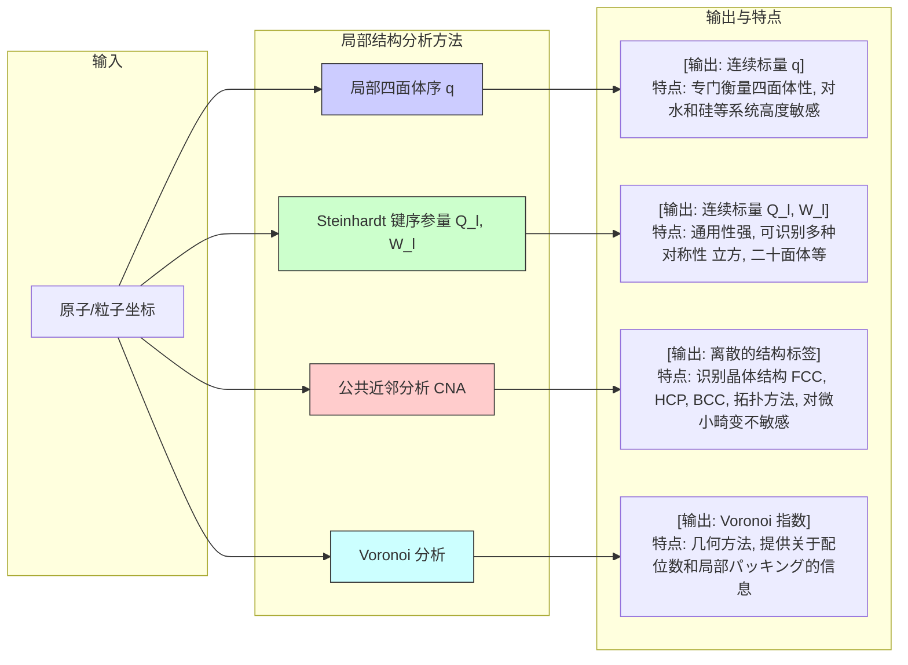

## 局部四面体序

局部四面体序是一种定量描述中心粒子及其最近邻粒子排列方式与理想正四面体几何结构相似程度的标度。该参数在凝聚态物理、材料科学、化学和生物物理学中至关重要，特别用于研究液体（如水）、玻璃态物质、非晶固体和胶体系统的微观结构。

### 核心概念与数学基础

局部四面体序的核心是通过一个序参量（order parameter）$q$来量化。这个参数专门衡量一个中心粒子与其四个最近邻粒子所构成的键角偏离理想四面体键角的程度。

一个理想的正四面体结构中，中心粒子与任意两个顶点粒子所形成的夹角均为 $\theta_{\text{ideal}} = \arccos(-1/3) \approx 109.47^\circ$。局部四面体序参量 $q$ 的设计旨在当局部结构为完美正四面体时取值为1，而当结构完全无序（例如，邻居位置随机分布）时取值接近于0。

最广泛使用的定义由 Errington 和 Debenedetti 提出，其数学表达式如下：

$$
q = 1 - \frac{3}{8} \sum_{j=1}^{3} \sum_{k=j+1}^{4} \left( \cos \theta_{jk} + \frac{1}{3} \right)^2
$$

其中：
*   $q$ 是局部四面体序参量，一个无量纲的标量。
*   $\theta_{jk}$ 是中心粒子与它的两个最近邻粒子 $j$ 和 $k$ 形成的夹角。对于一个中心粒子和它的四个最近邻，总共有 $C_4^2 = 6$ 个这样的夹角。
*   求和遍历这6个唯一的键角对。
*   $\cos(\theta_{\text{ideal}}) = -1/3$。因此，对于一个完美的正四面体，所有的 $\theta_{jk}$ 都等于 $109.47^\circ$，括号内的项 $\left( \cos \theta_{jk} + \frac{1}{3} \right)$ 均为零，导致 $q=1$。
*   $\frac{3}{8}$ 是归一化因子，确保当四个邻居在空间中随机分布时，$q$ 的平均值趋近于0。

### 关键技术指标

下表总结了与局部四面体序相关的关键参数和典型值。

| 参数 | 符号 | 值 | 单位 | 描述 |
| :--- | :--- | :--- | :--- | :--- |
| 理想四面体键角 | $\theta_{\text{ideal}}$ | $\arccos(-1/3) \approx 109.47$ | 度 (°) | 完美正四面体中，顶点-中心-顶点的夹角。 |
| 完美四面体序 | $q_{\text{perfect}}$ | 1 | 无量纲 | 对应于完美正四面体结构的序参量值。 |
| 随机结构序 | $q_{\text{random}}$ | $\approx 0$ | 无量纲 | 对应于邻居位置完全随机分布的序参量期望值。 |
| 面心立方(FCC)晶格序 | $q_{\text{FCC}}$ | $\approx -0.81$ | 无量纲 | 对于一个FCC晶格中的粒子及其最近邻（考虑前4个），其结构与四面体差异显著。 |
| 体心立方(BCC)晶格序 | $q_{\text{BCC}}$ | $\approx -2.93$ | 无量纲 | 对于一个BCC晶格中的粒子及其最近邻（考虑前4个），其结构与四面体差异极大。 |
| 液态水(STP)平均序 | $\langle q_{\text{water}} \rangle$ | $0.5 - 0.65$ | 无量纲 | 在标准温压下，液态水中氢键网络呈现的典型平均四面体序。 |

### 典型应用场景

局部四面体序被广泛应用于分析原子和分子尺度上的系统结构。

*   **液态水和水溶液**:
    *   **应用**: 用于研究液态水复杂的氢键网络结构及其反常物理性质（如密度反常）。$q$ 的分布通常呈双峰形态，表明存在两种不同类型的局部环境：一种是高度有序的、类似冰的结构（高 $q$ 值），另一种是结构被破坏的、密度较高的结构（低 $q$ 值）。
    *   **量化指标**: 在标准状况下，水分子的平均四面体序 $\langle q \rangle \approx 0.6$。随着温度升高，$\langle q \rangle$ 逐渐降低，表明氢键网络的热破坏。

*   **非晶硅 (a-Si) 和玻璃**:
    *   **应用**: 用于表征共价键合的非晶材料（如a-Si, a-Ge）的短程有序性。这些材料倾向于形成四配位结构，但存在键角和键长的畸变。$q$ 可以量化这种畸变的程度。
    *   **量化指标**: a-Si 中的平均四面体序通常高于液态硅，但远低于晶态硅，反映了其长程无序、短程有序的特征。

*   **胶体自组装和颗粒物质**:
    *   **应用**: 在胶体悬浮液或颗粒物质的模拟和实验中，用于识别和跟踪局部有序团簇的形成，这对于理解成核、玻璃化转变和剪切稠化等现象至关重要。
    *   **量化指标**: 在致密的颗粒堆积中，可以观察到 $q$ 值接近1的局部区域，这些区域构成了系统的“结构骨架”。

*   **玻璃化转变**:
    *   **应用**: 作为一种结构序参量，用于研究过冷液体在接近玻璃化转变点时的结构演化。$q$ 的空间关联函数 $g_q(r)$ 可以揭示结构有序性的关联长度，该长度在接近玻璃化转变时会显著增长。

### 实现考量与算法分析

计算系统中所有粒子的局部四面体序通常遵循以下步骤：

1.  **识别最近邻**: 对于系统中的每一个中心粒子 $i$，必须确定其最近邻。这是计算中最关键且耗时的一步。
    *   **截断半径法**: 定义一个固定的截断半径 $r_c$，所有与中心粒子距离小于 $r_c$ 的粒子都被视为邻居。这种方法简单快速，但结果对 $r_c$ 的选择非常敏感。
    *   **固定邻居数法**: 直接选取距离最近的 $N_n$ 个粒子作为邻居。对于四面体序，通常取 $N_n=4$。
    *   **Voronoi 泰森多边形法**: 对系统进行 Voronoi 分割，与中心粒子共享一个 Voronoi 面的粒子被视为拓扑邻居。这种方法在几何上最稳健，但计算成本较高。

2.  **计算键角**: 对于每个中心粒子及其四个已确定的最近邻 $j, k, l, m$，计算所有六个键角 $\theta_{jk}, \theta_{jl}, \theta_{jm}, \theta_{kl}, \theta_{km}, \theta_{lm}$。

3.  **计算序参量**: 将这六个键角的余弦值代入 $q$ 的公式中进行计算。

**算法复杂度分析**:
假设系统中有 $N$ 个粒子。
*   **邻居搜索**:
    *   暴力搜索法：对每个粒子遍历所有其他粒子，复杂度为 $O(N^2)$。
    *   空间划分法（如元胞列表或k-d树）：可以将复杂度降低到 $O(N \log N)$ 或对于均匀密度的系统降低到 $O(N)$。
*   **序参量计算**: 一旦邻居被确定，对单个粒子计算 $q$ 的复杂度是恒定的，因为它只涉及固定数量的邻居（4个）和键角（6个）。
*   **总复杂度**: 整个算法的复杂度由邻居搜索步骤主导，通常为 $O(N)$ 或 $O(N \log N)$。

```mermaid
graph TD
    A[输入: 粒子坐标 r_i] --> B["对每个粒子 i[";
    B --> C["邻居搜索 例如, k-最近邻, k=4"];
    C --> D["获取4个最近邻 j, k, l, m"];
    D --> E["计算6个键角 θ_jk, θ_jl, ..."];
    E --> F["应用公式: q_i = 1 - 3/8 * Σcosθ + 1/3^2"];
    F --> G所有粒子都已计算?;
    G -- 否 --> B;
    G -- 是 --> H[输出: q_i 集合];
    H --> I["统计分析 例如, 计算 Pq 分布"];

    subgraph "计算瓶颈"
        C
    end

    style C fill:#ffcccc,stroke:#990000
```

### 性能特征与统计度量

对 $q$ 的分析通常不局限于单个粒子的值，而是考察其在整个系统中的统计分布 $P(q)$。

*   **分布函数 $P(q)$**: 这是描述系统中随机选取的粒子其四面体序为 $q$ 的概率密度函数。
    *   在简单液体中，$P(q)$ 通常是单峰的高斯分布，中心位于一个较低的 $q$ 值。
    *   在具有强方向性相互作用的液体（如水）中，$P(q)$ 常常呈现**双峰分布**。一个峰位于高 $q$ 值（~0.8），代表结构化的、类似冰的局部环境；另一个峰位于低 $q$ 值（~0.4），代表无序的、密度较高的环境。这两个布居的相对权重随温度和压力而变化。

*   **统计矩**:
    *   **平均值 $\langle q \rangle$**: $\langle q \rangle = \int q P(q) dq$。它提供了系统整体结构有序性的宏观度量。例如，报告值为 $\langle q \rangle = 0.58 \pm 0.02$ (置信水平95%)。
    *   **标准差 $\sigma_q$**: $\sigma_q = \sqrt{\langle q^2 \rangle - \langle q \rangle^2}$。它量化了系统内结构异质性的程度。一个宽的分布（大 $\sigma_q$）意味着系统内存在多种显著不同的局部环境。

### 相关技术与模型比较

局部四面体序是多种结构分析工具中的一种。与其他方法相比，它有其独特的优势和适用范围。



**与 Steinhardt 键序参量的比较**:
Steinhardt 参数是一套更通用的序参量，基于球谐函数来描述粒子的邻居分布。其定义为：
$$
Q_l = \left( \frac{4\pi}{2l+1} \sum_{m=-l}^{l} |\bar{Q}_{lm}|^2 \right)^{1/2}
$$
其中，$\bar{Q}_{lm}$ 是对连接中心粒子的所有键的球谐函数 $Y_{lm}(\hat{r}_{ij})$ 的平均值。
*   $l$ 是一个整数，用于探测特定类型的旋转对称性。例如，$l=4$ 对立方对称性敏感，$l=6$ 对二十面体和晶体对称性敏感。
*   对于四面体对称性，最相关的参数是 $Q_3$。然而，$q$ 参数是专门为四面体几何设计的，其物理意义更直观，解释也更简单。$q$ 直接与键角相关，而 $Q_l$ 则是在一个更抽象的数学框架下运作。

### 参考文献

1.  Errington, J. R., & Debenedetti, P. G. (2001). Relationship between structural order and the anomalies of liquid water. *Nature*, 409(6818), 318–321. DOI: [10.1038/35053024](https://doi.org/10.1038/35053024)
2.  Chau, P. L., & Hardwick, A. J. (1998). A new order parameter for tetrahedral configurations. *Molecular Physics*, 93(3), 511–518. DOI: [10.1080/002689798169195](https://doi.org/10.1080/002689798169195)
3.  Steinhardt, P. J., Nelson, D. R., & Ronchetti, M. (1983). Bond-orientational order in liquids and glasses. *Physical Review B*, 28(2), 784–805. DOI: [10.1103/PhysRevB.28.784](https://doi.org/10.1103/PhysRevB.28.784)