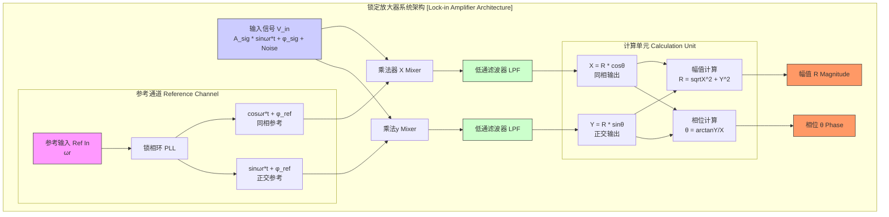
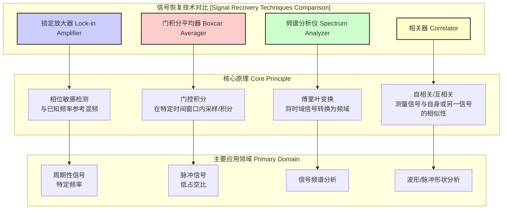

## 锁定放大器

锁定放大器（Lock-in Amplifier）是一种能够从噪声极大的环境中提取特定载波频率的微弱交流信号的精密测量仪器。其核心技术是相位敏感检测（Phase-Sensitive Detection, PSD），通过将输入信号与一个同频的参考信号进行混频，并对结果进行低通滤波，从而有效地将感兴趣的信号与不相关的噪声分离开。这种技术使得锁定放大器能够测量信噪比（SNR）极低的信号，甚至在噪声幅度比信号大几个数量级的情况下也能精确测量。

### 核心概念与数学基础

锁定放大器的基本原理是将输入信号与一个频率和相位都已知的参考信号相乘（混频），然后对乘积进行积分或低通滤波。

假设待测的输入信号为 $V_{sig}(t)$，它包含一个频率为 $\omega_r$ 的微弱信号以及宽带噪声 $V_{noise}(t)$：
$$ V_{sig}(t) = A_{sig} \sin(\omega_r t + \phi_{sig}) + V_{noise}(t) $$
其中：
*   $A_{sig}$ 是信号的振幅。
*   $\omega_r$ 是信号的角频率。
*   $\phi_{sig}$ 是信号的初始相位。
*   $V_{noise}(t)$ 是噪声项。

锁定放大器内部产生或从外部接收一个纯净的参考信号 $V_{ref}(t)$，其频率与待测信号完全相同：
$$ V_{ref}(t) = A_{ref} \sin(\omega_r t + \phi_{ref}) $$
其中：
*   $A_{ref}$ 是参考信号的振幅。
*   $\omega_r$ 是参考角频率，与信号频率严格一致。
*   $\phi_{ref}$ 是参考信号的相位，可由用户调节。

**1. 混频（相乘）**

输入信号与参考信号在混频器（一个模拟或数字乘法器）中相乘，得到 $V_{mix}(t)$：
$$ V_{mix}(t) = V_{sig}(t) \times V_{ref}(t) = [A_{sig} \sin(\omega_r t + \phi_{sig}) + V_{noise}(t)] \times A_{ref} \sin(\omega_r t + \phi_{ref}) $$
展开信号部分，利用三角恒等式 $\sin(A)\sin(B) = \frac{1}{2}[\cos(A-B) - \cos(A+B)]$：
$$ V_{mix,signal}(t) = \frac{1}{2} A_{sig} A_{ref} [\cos((\omega_r t + \phi_{sig}) - (\omega_r t + \phi_{ref})) - \cos((\omega_r t + \phi_{sig}) + (\omega_r t + \phi_{ref}))] $$
$$ V_{mix,signal}(t) = \frac{1}{2} A_{sig} A_{ref} [\underbrace{\cos(\phi_{sig} - \phi_{ref})}_{\text{直流分量}} - \underbrace{\cos(2\omega_r t + \phi_{sig} + \phi_{ref})}_{\text{倍频分量}}] $$

**2. 低通滤波**

混频后的信号 $V_{mix}(t)$ 通过一个窄带宽的低通滤波器（Low-Pass Filter, LPF）。该滤波器的截止频率 $f_c$ 设置得远低于 $2\omega_r$，但足以通过直流（DC）或近直流分量。
*   **倍频分量**：$\cos(2\omega_r t + ...)$ 项是一个高频交流信号，其频率是参考频率的两倍。低通滤波器会将其完全滤除。
*   **噪声分量**：$V_{noise}(t) \times V_{ref}(t)$ 项。假设噪声是宽带随机噪声，其频谱分布在很宽的频率范围内。与正弦参考信号相乘后，噪声频谱会平移到以 $\omega_r$ 为中心的位置。由于原始噪声的相位是随机的，在低通滤波（本质上是长时间平均）后，其积分结果趋近于零。
*   **直流分量**：$\frac{1}{2} A_{sig} A_{ref} \cos(\phi_{sig} - \phi_{ref})$ 项是一个直流（DC）值，它正比于信号振幅 $A_{sig}$ 和信号与参考信号之间的相位差的余弦。这个直流分量能够顺利通过低通滤波器。

经过低通滤波后，输出的直流电压 $V_{out}$ 为：
$$ V_{out} = \text{LPF}[V_{mix}(t)] \approx \frac{1}{2} A_{sig} A_{ref} \cos(\Delta\phi) $$
其中 $\Delta\phi = \phi_{sig} - \phi_{ref}$ 是相位差。

**3. 双相锁定放大器 (Dual-Phase Lock-in Amplifier)**

为了同时测量信号的振幅 $A_{sig}$ 和相位 $\phi_{sig}$，现代锁定放大器通常采用双相检测技术。它使用两个相互正交（相位相差 $90^\circ$）的参考信号。
*   同相参考信号 (In-phase): $V_{ref,I}(t) = A_{ref} \cos(\omega_r t + \phi_{ref})$
*   正交参考信号 (Quadrature): $V_{ref,Q}(t) = A_{ref} \sin(\omega_r t + \phi_{ref})$

输入信号分别与这两个参考信号混频，并各自通过一个独立的低通滤波器，得到两个直流输出：
*   **同相分量 (X)**:
    $$ X = \text{LPF}[V_{sig}(t) \times V_{ref,I}(t)] = \frac{1}{2} A_{sig} A_{ref} \cos(\phi_{sig} - \phi_{ref}) $$
*   **正交分量 (Y)**:
    $$ Y = \text{LPF}[V_{sig}(t) \times V_{ref,Q}(t)] = \frac{1}{2} A_{sig} A_{ref} \sin(\phi_{sig} - \phi_{ref}) $$

通过这两个分量，可以计算出原始信号的振幅 $R$ (Magnitude) 和相对于参考信号的相位 $\theta$ (Phase)：
*   **幅值 (R)**:
    $$ R = \sqrt{X^2 + Y^2} = \sqrt{(\frac{1}{2} A_{sig} A_{ref})^2 (\cos^2(\Delta\phi) + \sin^2(\Delta\phi))} = \frac{1}{2} A_{sig} A_{ref} $$
    由于 $A_{ref}$ 是已知的，因此可以直接计算出 $A_{sig}$。
*   **相位 ($\theta$)**:
    $$ \theta = \arctan2(Y, X) = \phi_{sig} - \phi_{ref} $$
    使用 `arctan2` 函数可以无歧义地确定 $(-\pi, \pi]$ 范围内的相位。

下面的Mermaid图展示了双相锁定放大器的系统架构。

### 关键技术规格

锁定放大器的性能由一系列关键参数决定，这些参数直接影响其测量精度和适用范围。

| 参数 (Parameter) | 典型值 (Typical Value) | 单位 (Unit) | 描述 (Description) |
| :--- | :--- | :--- | :--- |
| **频率范围 (Frequency Range)** | 1 mHz – 250 MHz | Hz | 仪器可以锁定和测量的参考信号频率范围。 |
| **输入电压噪声 (Input Voltage Noise)** | 2.5 nV/√Hz @ 1 kHz | nV/√Hz | 放大器前端产生的等效输入噪声谱密度，决定了可检测的最小信号。 |
| **动态储备 (Dynamic Reserve)** | > 120 | dB | 仪器在不饱和的情况下能够容忍的最大噪声与满量程信号之比。 |
| **时间常数 (Time Constant)** | 1 µs – 30 ks | s | 低通滤波器的积分时间。时间常数越长，噪声抑制越好，但测量速度越慢。 |
| **滤波器滚降 (Filter Rolloff)** | 6, 12, 18, 24 | dB/oct | 低通滤波器的陡峭程度。滚降越大，对高频噪声的抑制能力越强。 |
| **相位分辨率 (Phase Resolution)** | 0.001 | 度 (degrees) | 仪器能够分辨的最小相位变化。 |
| **灵敏度 (Sensitivity)** | 1 nV – 1 V | V | 对应于满量程输出的输入信号电压。 |
| **输入阻抗 (Input Impedance)** | 10 MΩ || 25 pF | Ω, F | 仪器输入端的等效电阻和电容，影响与信号源的阻抗匹配。 |

### 常见应用案例

锁定放大器在众多科学研究和工业应用中都扮演着至关重要的角色。

*   **扫描探针显微镜 (SPM)**:
    *   **应用**: 在扫描隧道显微镜 (STM) 和原子力显微镜 (AFM) 中，锁定放大器用于检测微弱的隧道电流或悬臂的微小振动。例如，在dI/dV谱学中，通过在直流偏压上叠加一个小的交流电压 $V_{ac}$，并用锁定放大器测量在 $V_{ac}$ 频率下的交流电流分量，可以直接得到微分电导 $dI/dV$。
    *   **性能指标**: 信噪比改善通常超过 60 dB，能够从 pA 级的直流背景中提取 nA 级的交流信号。

*   **光学测量**:
    *   **应用**: 在弱光探测中，例如荧光或拉曼光谱测量，通常使用光学斩波器（chopper）以特定频率 $f_r$ 调制光束。探测器接收到的信号包含被调制的信号光和恒定的背景光及噪声。锁定放大器以 $f_r$ 为参考频率，仅提取由斩波器调制的信号部分，有效抑制背景光和探测器噪声。
    *   **性能指标**: 背景抑制比可达 100 dB 以上，使得在强背景光下测量微弱信号成为可能。

*   **阻抗谱学 (Impedance Spectroscopy)**:
    *   **应用**: 通过向待测器件（DUT）施加一个交流电流 $I(t) = I_0 \sin(\omega t)$，并用锁定放大器测量其两端的电压 $V(t)$，可以精确得到电压的幅值 $V_0$ 和相对于电流的相位 $\phi$。复阻抗 $Z = R + jX_c$ 可以通过以下方式计算：$|Z| = V_0/I_0$，$R = |Z|\cos(\phi)$，$X_c = |Z|\sin(\phi)$。
    *   **性能指标**: 相位测量精度可达毫度（mdeg）级别，能够精确表征材料的电学特性。

*   **非线性光学**:
    *   **应用**: 在泵浦-探测实验中，泵浦光束被调制，锁定放大器用于探测由泵浦光引起的探测光束的微小变化（如吸收或反射率的改变）。
    *   **性能指标**: 能够测量出 $10^{-6}$ 到 $10^{-7}$ 级别的相对反射率或透射率变化 $\Delta R/R$。

### 实现方式考量

锁定放大器可以分为模拟和数字两种实现方式。

*   **模拟锁定放大器**:
    *   **结构**: 使用模拟元件，如模拟乘法器（吉尔伯特单元）和有源/无源RC滤波器。
    *   **优点**: 在极高频率下（> 1 GHz）仍具优势，设计相对简单。
    *   **缺点**: 易受温度漂移、元件老化、直流偏置和非线性度的影响。滤波器的阶数和时间常数选择有限。

*   **数字锁定放大器**:
    *   **结构**: 输入信号首先由高精度的模数转换器（ADC）采样，所有后续处理（混频、滤波、解调）均由数字信号处理器（DSP）或现场可编程门阵列（FPGA）以数字方式完成。
    *   **优点**: 极高的精度、稳定性和可重复性。无漂移和直流偏置问题。提供更高级的滤波选项（如高阶FIR或IIR滤波器），并易于集成多种功能（如FFT分析、数据记录）。
    *   **算法复杂度**: 数字锁定的核心是数字混频和滤波。对于每个采样点，需要进行两次乘法（X和Y通道）和两次滤波操作。若使用一个N阶FIR滤波器，其计算复杂度为 $O(N)$。因此，总的实时计算复杂度为 $O(f_s \times N)$，其中 $f_s$ 是采样率。这要求处理器具有足够的计算能力。

### 性能特征

*   **信噪比 (SNR) 增强**:
    锁定放大器的主要优势在于其显著提升信噪比的能力。噪声的功率谱密度在整个频带上分布，而信号功率集中在频率 $\omega_r$ 处。低通滤波器有效地限制了进入系统的噪声带宽。滤波器的有效噪声带宽 (Effective Noise Bandwidth, ENBW) 定义为：
    $$ ENBW = \int_0^\infty |H(f)|^2 df $$
    其中 $H(f)$ 是低通滤波器的传递函数。对于一个由时间常数 $\tau$ 定义的一阶RC低通滤波器，其ENBW为：
    $$ ENBW = \frac{1}{4\tau} $$
    假设输入噪声是白噪声，其功率谱密度为 $v_n$ (单位 V/√Hz)。输入端的总噪声功率为 $P_{noise,in} = v_n^2 \times BW_{in}$，其中 $BW_{in}$ 是前端带宽。经过锁定放大器后，输出端的噪声功率为 $P_{noise,out} = v_n^2 \times ENBW$。信噪比的提升因子为：
    $$ \text{SNR Gain} = \frac{SNR_{out}}{SNR_{in}} \propto \frac{BW_{in}}{ENBW} = 4\tau \cdot BW_{in} $$
    选择一个长的时间常数 $\tau$ 会极大地减小ENBW，从而显著提高信噪比。

*   **动态储备 (Dynamic Reserve)**:
    动态储备衡量的是锁定放大器在输入信号路径（ADC或模拟乘法器之前）不发生饱和的情况下，能够承受的最大噪声（或干扰信号）与待测信号满量程值之比。一个120 dB的动态储备意味着仪器可以承受比满量程信号大 $10^6$ 倍的噪声干扰，同时仍然能够精确测量该信号。

*   **输出稳定性与置信区间**:
    锁定放大器的输出是一个经过平均的统计量。对于总测量时间 $T_{meas}$，输出值的标准差 $\sigma_{out}$ 与输入噪声密度 $v_n$ 和ENBW有关。对于一个理想的积分器（对应于数字实现中的累加），标准差的减小与测量时间的平方根成反比：
    $$ \sigma_{out} \propto \frac{v_n}{\sqrt{T_{meas}}} $$
    因此，测量结果的置信区间会随着测量时间的增加而收窄。例如，一个 95% 的置信区间可以表示为 $\text{Mean} \pm 1.96 \sigma_{out}$。

### 相关技术比较

锁定放大器是信号恢复技术大家族中的一员。其他相关技术有其各自的适用领域。

*   **门积分平均器 (Boxcar Averager)**:
    *   **模型**: 对一个重复的脉冲信号，在相对于触发信号的特定延迟 $t_0$ 处打开一个极窄的时间门 $\Delta t$，并对门内的信号进行积分和平均。输出为 $S_{out} = \frac{1}{N} \sum_{i=1}^{N} \int_{t_0}^{t_0+\Delta t} V_{in}(t + iT_{rep}) dt$。
    *   **比较**: Boxcar适用于恢复低占空比的脉冲信号的波形，而锁定放大器最适用于连续的周期性正弦波信号。

*   **频谱分析仪 (Spectrum Analyzer)**:
    *   **模型**: 通过扫描一个窄带带通滤波器或计算信号的快速傅里叶变换（FFT），得到信号功率（或幅度）随频率的分布 $|P(f)|$。
    *   **比较**: 频谱分析仪提供整个频段的信息，但对于特定频率点的测量，其噪声抑制能力和相位测量能力远不如锁定放大器。

*   **自相关器 (Autocorrelator)**:
    *   **模型**: 计算信号 $s(t)$ 与其自身延迟版本 $s(t-\tau)$ 的乘积的积分：$G(\tau) = \int_{-\infty}^{\infty} s(t) s^*(t-\tau) dt$。
    *   **比较**: 主要用于测量超快光学脉冲的持续时间，通过分析相干特性来确定脉冲宽度，不依赖外部参考信号。

### 参考文献

1.  Scofield, J. H. (1994). "Frequency-domain description of a lock-in amplifier". *American Journal of Physics*, 62(2), 129-133. DOI: [10.1119/1.17629](https://doi.org/10.1119/1.17629)
2.  Meade, M. L. (1983). *Lock-in amplifiers: principles and applications*. Peter Peregrinus Ltd. ISBN: 978-0906048939.
3.  Gasper, A., et al. (2017). "A 20-bit, 1.25-MS/s, 2-channel digital lock-in amplifier for quantum-transport measurements". *Review of Scientific Instruments*, 88(8), 084703. DOI: [10.1063/1.4997078](https://doi.org/10.1063/1.4997078)