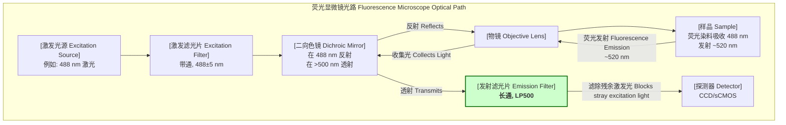
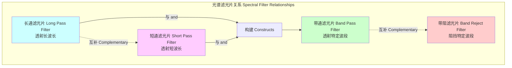

## long pass filter

长通滤光片（Long Pass Filter, LPF）是一种光学或电子滤波器，其设计目的是允许比特定截止波长（或截止频率）更长（或更低）的波（或频率）通过，同时衰减或阻挡较短的波长（或较高的频率）。在光学领域，它通常指透射长波长光并阻挡短波长光。在电子学中，等效的概念是低通滤波器，它允许低频信号通过而阻挡高频信号。本文档将主要关注光学长通滤光片，并辅以其在其他领域的数学等效模型。

### 核心概念与数学基础

长通滤光片的基本功能由其透射谱（Transmission Spectrum）定义，该谱描述了不同波长的光通过滤光片的透射率 $T$。

#### 理想与实际传递函数

一个理想的长通滤光片具有阶跃函数形式的传递函数 $H(\lambda)$ 或透射率 $T(\lambda)$。其截止波长为 $\lambda_c$。

$$
T_{ideal}(\lambda) =
\begin{cases}
1 & \text{if } \lambda \ge \lambda_c \\
0 & \text{if } \lambda < \lambda_c
\end{cases}
$$

其中：
*   $T(\lambda)$ 是在波长 $\lambda$ 处的透射率（无量纲，范围从0到1）。
*   $\lambda_c$ 是截止波长（单位：nm），即透射率从0变为1的临界点。

然而，在物理世界中，不存在理想的滤光片。实际的长通滤光片在通带（Passband）和阻带（Stopband）之间存在一个过渡带（Transition Band）。其性能可以用更平滑的函数来建模，例如使用S形函数（如逻辑函数）来描述过渡区域：

$$
T_{real}(\lambda) = T_{block} + \frac{T_{pass} - T_{block}}{1 + e^{-k(\lambda - \lambda_c)}}
$$

其中：
*   $T_{pass}$ 是通带内的最大或平均透射率。
*   $T_{block}$ 是阻带内的残余透射率。
*   $\lambda_c$ 是截止波长，通常定义为透射率达到 $(T_{pass} + T_{block})/2$ 的点。
*   $k$ 是一个斜率因子，决定了过渡带的陡峭程度。$k$ 值越大，过渡带越窄，滤光片性能越接近理想状态。

#### 光学密度

在需要高阻断性能的应用中，通常使用光学密度（Optical Density, OD）来表征阻带的衰减能力。

$$
OD(\lambda) = -\log_{10}(T(\lambda))
$$

例如，OD 4 表示透射率为 $10^{-4}$（0.01%），意味着99.99%的光在该波长被阻挡。

### 关键技术指标

长通滤光片的性能由一系列标准化的技术指标来定义。

| 技术指标 (Technical Specification) | 符号 (Symbol) | 典型值 (Typical Value) | 单位 (Unit) | 描述 (Description) |
| :--- | :--- | :--- | :--- | :--- |
| 截止波长 (Cutoff Wavelength) | $\lambda_c$ | 550 ± 2 | nm | 透射率达到最大值50%处的波长。 |
| 通带 (Passband) | - | $\lambda > 550$ nm | nm | 高透射率的波长范围。 |
| 阻带 (Stopband) | - | $\lambda < 530$ nm | nm | 高抑制率的波长范围。 |
| 过渡带宽度 (Transition Bandwidth) | $\Delta\lambda$ | 20 | nm | 从阻带抑制阈值到通带透射阈值的波长范围。 |
| 平均通带透射率 (Avg. Passband Transmittance) | $T_{avg}$ | > 95% | % | 在指定通带范围内的平均透射率。 |
| 峰值通带透射率 (Peak Passband Transmittance) | $T_{max}$ | > 98% | % | 在通带内的最大透射率。 |
| 阻带抑制 (Stopband Rejection) | OD | > 4.0 (在 350-530 nm) | OD | 阻带的光学密度，表示阻断能力。 |
| 入射角 (Angle of Incidence, AOI) | $\theta$ | 0 | 度 (deg) | 设计使用的光线入射角度，通常为法向入射。 |
| 表面质量 (Surface Quality) | - | 60-40 | Scratch-Dig | 根据MIL-PRF-13830B标准的表面瑕疵（划痕和麻点）等级。 |
| 激光损伤阈值 (Laser Damage Threshold, LDT) | - | > 5 | J/cm² @ 10 ns | 滤光片能够承受的最大激光能量密度而不发生损坏。 |

### 常见用例

长通滤光片因其光谱整形能力而在众多科学和技术领域中至关重要。

*   **荧光显微镜 (Fluorescence Microscopy)**
    *   **用途**: 在发射光路中，用作发射滤光片，以阻挡来自激发源的较短波长的激发光，并仅允许来自样品的较长波长的荧光发射光通过。
    *   **定量性能**: 显著提高信噪比（Signal-to-Noise Ratio, SNR）。一个典型的LP500（截止波长500 nm）滤光片可以将488 nm激发光的干扰抑制OD > 6，从而将发射信号的SNR提高超过30 dB。

*   **拉曼光谱 (Raman Spectroscopy)**
    *   **用途**: 用作“边缘滤光片”（Edge Filter），以极高的效率阻挡强大的瑞利散射激光线（例如，532 nm），同时透射波长稍长的斯托克斯拉曼散射信号（例如，> 535 nm）。
    *   **定量性能**: 激光线抑制必须非常高，通常要求在激光波长处 OD > 6.0 到 OD > 8.0，同时在距离激光线几纳米处实现陡峭的过渡，达到 >90% 的透射率。

*   **红外摄影 (Infrared Photography)**
    *   **用途**: 阻挡所有可见光（约400-700 nm），仅允许近红外（NIR）光（>720 nm）进入相机传感器。
    *   **定量性能**: 在可见光波段（400-650 nm）提供OD > 4的抑制，在近红外波段（750-1100 nm）提供 $T_{avg}$ > 90% 的透射率。

*   **波分复用 (Wavelength Division Multiplexing, WDM) 通信**
    *   **用途**: 用于分离不同波长的信道。例如，一个长通滤光片可以分离C波段（~1530-1565 nm）和L波段（~1565-1625 nm）的信号。
    *   **定量性能**: 通道隔离度（Channel Isolation）> 25 dB。

### 实现方式与考量

长通滤光片的物理实现主要有两种技术路径：吸收型和干涉型。

#### 1. 吸收型滤光片 (Absorptive Filters)
通过在基底材料（如玻璃或聚合物）中掺杂能吸收特定波长光的化学物质来工作。
*   **优点**: 成本低、对入射角不敏感、无偏振效应。
*   **缺点**: 过渡带通常较宽，可能因吸收光能而产生热效应或自发荧光。

#### 2. 干涉型/介质膜滤光片 (Interference/Dielectric Filters)
通过在光学基底上精确镀上多层具有不同折射率的介电材料薄膜来实现。通过薄膜层之间的相长和相消干涉来构造所需的透射光谱。
*   **优点**: 过渡带非常陡峭、阻带抑制深（OD值高）、通带透射率高、设计灵活。
*   **缺点**: 成本较高、性能对光的入射角敏感、制造工艺复杂。

#### 介质膜滤光片的数学模型：传输矩阵法 (Transfer-Matrix Method)

对于一个由 $N$ 个薄膜层组成的堆栈，其光学特性可以通过传输矩阵法（TMM）进行精确计算。整个膜系的特征矩阵 $M$ 是各单层矩阵 $M_j$ 的乘积。

$$
\begin{pmatrix} E_0^+ \\ E_0^- \end{pmatrix} = \left( \prod_{j=1}^{N} M_j \right) \begin{pmatrix} E_{N+1}^+ \\ E_{N+1}^- \end{pmatrix} = M \begin{pmatrix} E_{N+1}^+ \\ E_{N+1}^- \end{pmatrix}
$$

其中：
*   $E^+$ 和 $E^-$ 分别是电场的前向和后向传播分量。下标0代表入射介质，N+1代表出射介质。
*   $M_j$ 是第 $j$ 层的特征矩阵：
    $$
    M_j = \begin{pmatrix} \cos(\delta_j) & \frac{i}{\eta_j}\sin(\delta_j) \\ i\eta_j\sin(\delta_j) & \cos(\delta_j) \end{pmatrix}
    $$
*   $\delta_j$ 是第 $j$ 层的相位厚度：
    $$
    \delta_j = \frac{2\pi}{\lambda} n_j d_j \cos(\theta_j)
    $$
*   $\eta_j$ 是第 $j$ 层的光学导纳，它取决于光的偏振态（s-偏振或p-偏振）：
    *   s-偏振: $\eta_{j,s} = n_j \cos(\theta_j)$
    *   p-偏振: $\eta_{j,p} = n_j / \cos(\theta_j)$
*   $n_j$, $d_j$, $\theta_j$ 分别是第 $j$ 层的折射率、物理厚度和光在该层中的传播角度。
*   $i$ 是虚数单位。

通过求解上述矩阵系统，可以得到整个膜系的反射系数 $r$ 和透射系数 $t$，进而计算出反射率 $R = |r|^2$ 和透射率 $T = \frac{\eta_{N+1}}{\eta_0}|t|^2$。

#### 算法复杂度

对于一个包含 $N$ 层的膜系设计和模拟，传输矩阵法的计算复杂度是线性的，即 $O(N)$。这是因为计算总矩阵 $M$ 需要进行 $N-1$ 次 2x2 矩阵的乘法。

### 性能特征

#### 入射角依赖性 (Angle of Incidence, AOI, Dependence)

对于干涉型滤光片，其光谱特性对入射角非常敏感。当入射角 $\theta$ 增加时，光谱会向短波方向移动（蓝移）。这种移动可以用以下近似公式描述：

$$
\lambda(\theta) = \lambda_0 \sqrt{1 - \left(\frac{n_0 \sin\theta}{n_{eff}}\right)^2}
$$

其中：
*   $\lambda(\theta)$ 是在入射角 $\theta$ 时的截止波长。
*   $\lambda_0$ 是在法向入射（$\theta=0$）时的截止波长。
*   $n_0$ 是入射介质的折射率（通常为空气，$n_0 \approx 1$）。
*   $n_{eff}$ 是膜系的有效折射率，一个与膜层材料和设计相关的经验参数。

#### 统计测量

由于制造公差，实际产品的性能会在一定范围内波动。
*   **截止波长公差**: 制造商通常会提供一个置信区间，例如 $\lambda_c = 550 \pm 2$ nm (置信水平 95%)。这意味着95%的产品其截止波长会落在548 nm到552 nm之间。
*   **表面均匀性**: 滤光片有效区域内的透射率变化通常小于1-2%。

### 相关技术

长通滤光片是光谱滤波技术家族的一员。

#### 1. 短通滤光片 (Short Pass Filter, SPF)
与长通滤光片功能相反，它透射短于截止波长的光，阻挡长于截止波长的光。其理想传递函数为 $T_{SP}(\lambda) = 1 - T_{LP}(\lambda)$。

#### 2. 带通滤光片 (Band Pass Filter, BPF)
仅透射一个特定波段的光。它可以被概念化为长通和短通滤光片的组合：
$$
T_{BP}(\lambda) \approx T_{LP}(\lambda, \lambda_{c1}) \cdot T_{SP}(\lambda, \lambda_{c2}) \quad (\text{where } \lambda_{c2} > \lambda_{c1})
$$

#### 3. 电子低通滤波器 (Electronic Low-Pass Filter)
在频域中与光学长通滤光片等效。一个简单的一阶RC低通滤波器的传递函数为：
$$
H(j\omega) = \frac{V_{out}}{V_{in}} = \frac{1}{1 + j\omega RC}
$$
其截止频率为 $\omega_c = 1/(RC)$ 或 $f_c = 1/(2\pi RC)$。该滤波器允许频率低于 $f_c$ 的信号通过。由于周期 $P = 1/f$，这等效于允许周期长于 $P_c = 1/f_c$ 的信号通过，这正是“长通”的概念。

更高级的电子滤波器，如巴特沃斯（Butterworth）滤波器，提供了更平坦的通带和更陡峭的过渡带。其幅度响应为：
$$
|H(j\omega)| = \frac{1}{\sqrt{1 + (\omega/\omega_c)^{2n}}}
$$
其中 $n$ 是滤波器的阶数。

### 参考文献

1.  Macleod, H. A. (2010). *Thin-Film Optical Filters* (4th ed.). CRC Press. (这是光学薄膜领域的权威教科书，详细介绍了干涉滤光片的设计、制造和理论。)
2.  Tuschel, D. (2010). A New Generation of Raman Analyzers: The Advantages of A-TE Cooled, Deep-Depletion, Back-Thinned CCD Detectors and Volume Phase Holographic (VPH) Gratings and Filters. *Spectroscopy*, 25(11), 20-27. (讨论了高性能边缘滤光片在现代拉曼光谱仪中的应用。)
3.  Lichtman, J. W., & Conchello, J. A. (2005). Fluorescence microscopy. *Nature Methods*, 2(12), 910-919. DOI: [10.1038/nmeth817](https://doi.org/10.1038/nmeth817) (综述了荧光显微镜技术，其中发射滤光片是关键组件。)
4.  Horowitz, P., & Hill, W. (2015). *The Art of Electronics* (3rd ed.). Cambridge University Press. (电子学领域的经典著作，详细介绍了有源和无源电子滤波器，包括低通滤波器。)