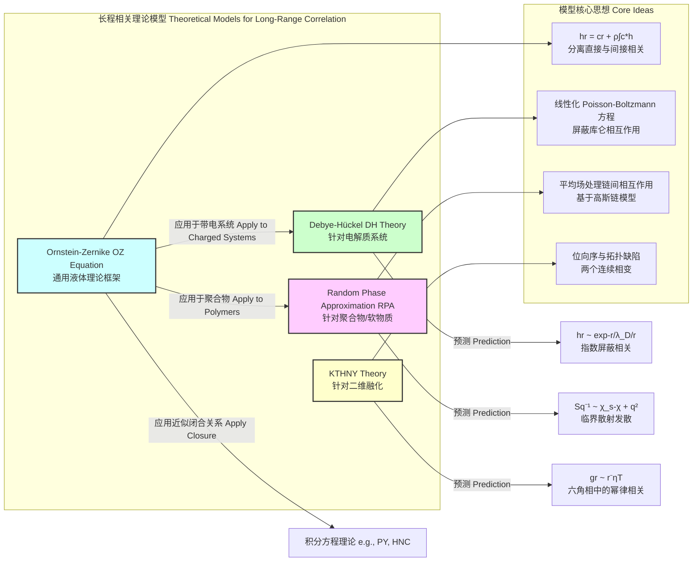

## 长程结构相关

长程结构相关（Long Range Structural Correlation）是凝聚态物理、材料科学和统计力学中的一个核心概念，用于描述系统中相距很远的粒子（如原子、分子、胶体颗粒）其位置或状态之间存在的非偶然性、持续性的统计关联。与仅限于几个原子间距的短程有序（如液体和玻璃）以及在整个材料中周期性重复的长程有序（如晶体）不同，长程相关描述的是一种关联强度随距离 $r$ 缓慢衰减（通常是幂律形式）的现象，即使在宏观尺度上系统仍然是无序的。

这种相关性是理解相变、临界现象、玻璃态物质、聚合物物理以及生物大分子系统结构与功能的关键。

### 核心概念与数学基础

长程结构相关的核心在于量化粒子位置的统计依赖性如何随距离延伸。主要的数学工具是**对关联函数**和**静态结构因子**。

#### 对关联函数 (Pair Correlation Function), $g(r)$

对关联函数 $g(\mathbf{r})$ 描述了在给定一个粒子位于原点的条件下，在距离 $\mathbf{r}$ 处找到另一个粒子的概率密度，并相对于均匀分布进行了归一化。对于一个各向同性的 $d$ 维系统，它只依赖于标量距离 $r$。

其数学定义为：
$$ g(r) = \frac{V}{N^2} \left\langle \sum_{i \neq j} \delta(\mathbf{r} - (\mathbf{r}_i - \mathbf{r}_j)) \right\rangle $$
对于各向同性系统，在距离 $r$ 的球壳内进行平均：
$$ g(r) = \frac{1}{4\pi r^2 \rho N} \left\langle \sum_{i \neq j} \delta(r - |\mathbf{r}_i - \mathbf{r}_j|) \right\rangle $$
其中：
*   $N$: 系统中的粒子总数
*   $V$: 系统体积
*   $\rho = N/V$: 粒子数密度
*   $\mathbf{r}_i, \mathbf{r}_j$: 粒子 $i$ 和 $j$ 的位置矢量
*   $\langle \cdot \rangle$: 系综平均（例如，在热力学平衡下的正则系综或微正则系综平均）
*   $\delta(\cdot)$: 狄拉克 $\delta$ 函数

**物理意义**:
*   当 $r \to \infty$ 时，粒子位置不再相关，$g(r) \to 1$。
*   当 $r \to 0$ 时，由于粒子体积排斥，$g(r) \to 0$。
*   在短程范围内，$g(r)$ 显示出振荡，对应于近邻配位壳层结构。
*   **长程相关**的特征在于 $g(r)-1$ 在 $r \to \infty$ 时衰减得非常缓慢，通常是幂律形式，而不是简单液体中的指数衰减。

#### 静态结构因子 (Static Structure Factor), $S(q)$

静态结构因子 $S(\mathbf{q})$ 是对关联函数的傅里叶对偶，可以通过X射线、中子或光散射实验直接测量。它描述了系统在波矢 $\mathbf{q}$ 下的密度涨落。

其定义为：
$$ S(\mathbf{q}) = \frac{1}{N} \left\langle \sum_{j,k} e^{-i\mathbf{q} \cdot (\mathbf{r}_j - \mathbf{r}_k)} \right\rangle = 1 + \frac{1}{N} \left\langle \sum_{j \neq k} e^{-i\mathbf{q} \cdot (\mathbf{r}_j - \mathbf{r}_k)} \right\rangle $$
它与 $g(r)$ 的关系通过傅里叶变换建立：
$$ S(q) = 1 + \rho \int_V [g(r) - 1] e^{-i\mathbf{q} \cdot \mathbf{r}} d\mathbf{r} $$
对于各向同性系统：
$$ S(q) = 1 + 4\pi\rho \int_0^\infty [g(r) - 1] \frac{\sin(qr)}{qr} r^2 dr $$
其中：
*   $\mathbf{q}$: 散射波矢，其大小 $q = \frac{4\pi}{\lambda} \sin(\theta/2)$，$\lambda$ 是入射波长，$\theta$ 是散射角。

**物理意义**:
*   $S(q)$ 在小 $q$ 区域（对应大尺度）的行为直接反映了长程相关性。
*   对于普通液体，$q \to 0$ 时 $S(q)$ 趋于一个与系统压缩性相关的有限值：$S(0) = \rho k_B T \kappa_T$，其中 $\kappa_T$ 是等温压缩系数。
*   在存在长程相关（如临界点）的系统中，$S(q)$ 在 $q \to 0$ 时会发散，表现为 $S(q) \sim q^{-\gamma/\nu}$ 或 $S(q) \sim q^{-2+\eta}$ 的形式。

#### Ornstein-Zernike (OZ) 方程

OZ方程是液体理论的基石，它将总相关函数 $h(r) = g(r) - 1$ 分解为两部分：直接相关和间接相关。
$$ h(\mathbf{r}_{12}) = c(\mathbf{r}_{12}) + \rho \int c(\mathbf{r}_{13}) h(\mathbf{r}_{32}) d\mathbf{r}_3 $$
其中：
*   $h(r) = g(r) - 1$: 总相关函数 (Total Correlation Function)
*   $c(r)$: 直接相关函数 (Direct Correlation Function)

$c(r)$ 描述了粒子1和2之间的“直接”相互作用，通常认为其作用范围与粒子间相互作用势的范围相当（短程）。而方程的积分项则描述了通过与系统中其他粒子（粒子3）的间接作用产生的相关性。正是这一项导致了长程相关的出现。

在傅里叶空间中，OZ方程变为一个简单的代数关系：
$$ \hat{h}(q) = \hat{c}(q) + \rho \hat{c}(q) \hat{h}(q) $$
解得：
$$ \hat{h}(q) = \frac{\hat{c}(q)}{1 - \rho \hat{c}(q)} $$
由于 $S(q) = 1 + \rho \hat{h}(q)$，我们得到：
$$ S(q) = \frac{1}{1 - \rho \hat{c}(q)} $$
这个关系式表明，当 $\rho \hat{c}(q) \to 1$ 时，$S(q)$ 会发散，这正是长程相关出现的标志。例如，在临界点附近，可以近似认为 $\rho \hat{c}(q) \approx \rho \hat{c}(0) - A q^2$，这导致了著名的 Ornstein-Zernike 散射形式 $S(q) \propto 1/(\xi^{-2} + q^2)$。

### 关键技术指标

下表总结了不同系统中长程相关的关键参数。

| 系统类型 (System Type) | 关联函数渐近形式 $h(r) = g(r)-1$ | 关联长度 (Correlation Length) $\xi$ | 衰减指数 (Decay Exponent) $\eta$ | 实验探针 (Experimental Probe) |
| :--- | :--- | :--- | :--- | :--- |
| **临界流体 (Critical Fluid)** (例如，液-气临界点) | $\frac{e^{-r/\xi}}{r^{(d-1)/2}}$ (远离临界点)<br>$\frac{1}{r^{d-2+\eta}}$ (在临界点) | $\xi \sim |T-T_c|^{-\nu}$，可达微米级 | $\eta \approx 0.036$ (3D Ising 模型) | 小角X射线/中子散射 (SAXS/SANS) |
| **聚合物熔体 (Polymer Melt)** (高斯链) | $\sim 1/r$ (在特定尺度范围内) | $R_g \sim N^{1/2} a$ (回转半径) | N/A (形式不同) | SANS, 光散射 (LS) |
| **电解质溶液 (Electrolyte Solution)** | $\frac{e^{-r/\lambda_D}}{r}$ (Debye-Hückel) | $\lambda_D = (\frac{\epsilon k_B T}{e^2 \sum_i \rho_i z_i^2})^{1/2}$ (德拜长度) | N/A (指数衰减) | SAXS, 电导率测量 |
| **超均匀无序系统 (Disordered Hyperuniform)** | $\int_0^r h(r') 4\pi r'^2 dr' \to 0$ as $r \to \infty$ | $\xi \to \infty$ | N/A (涨落抑制) | SAXS/SANS, 结构因子分析 |
| **二维融化 (2D Melting)** (KTHNY 理论) | $\sim r^{-\eta(T)}$ (六角相) | $\xi \to \infty$ (在相内) | $\eta(T)$ 是温度的函数, $1/4 \le \eta \le 1/3$ | 电子衍射, 胶体显微镜 |

### 典型应用案例

#### 临界现象 (Critical Phenomena)

在液-气临界点，物质的密度涨落发生在所有尺度上，导致关联长度 $\xi$ 发散。这使得 $g(r)-1$ 从指数衰减转变为幂律衰减。
*   **定量指标**: 临界乳光现象。散射强度 $I(q) \propto S(q)$。在临界点，$S(q) \sim q^{-2+\eta}$。对于水在临界点（$T_c = 647.096$ K, $P_c = 22.064$ MPa），通过SANS测量到的临界指数 $\eta \approx 0.03-0.04$，与理论预测高度一致。

#### 无定形固体与玻璃 (Amorphous Solids and Glasses)

传统上认为玻璃只有短程有序。然而，**超均匀性 (Hyperuniformity)** 概念揭示了一种新型的长程相关。这类系统在长波长（小 $q$）极限下，密度涨落被极度抑制，即 $S(q \to 0) = 0$。
*   **定量指标**: 结构因子在 $q \to 0$ 时的行为。对于典型的液体或玻璃，$S(0) > 0$。对于超均匀系统，$S(q) \sim q^\alpha$ 且 $\alpha > 0$。例如，鸟类视网膜中的光感受器细胞排列被发现是超均匀的，其 $S(q \to 0)$ 行为确保了高透明度和采样效率。

#### 聚合物体系 (Polymer Systems)

聚合物链的连通性自然地引入了长程相关。即使在无规线团模型中，任意两个链段间的关联也随其在链上的化学距离缓慢衰减。
*   **定量指标**: 使用随机相近似 (Random Phase Approximation, RPA) 理论，可以预测嵌段共聚物或聚合物共混物的 $S(q)$。对于A-B二元共混物，$S(q)^{-1} \propto (\chi_s - \chi)/N + (a^2/36)q^2$，其中 $\chi$ 是Flory-Huggins相互作用参数。当 $\chi \to \chi_s$（相分离点）时，在特定 $q^*$ 处的散射峰会发散，表明长程有序结构的出现。

### 实现考量与算法分析

从原子坐标计算长程相关函数需要高效的算法，尤其对于大规模分子动力学（MD）或蒙特卡洛（MC）模拟。

```mermaid
graph TD
    subgraph "计算流程 Calculation Workflow"
        A[输入: N个粒子坐标 r_i] --> B["计算 gr 或 Sq?[";
        B -- "gr" --> C[初始化直方图 Hk];
        C --> D遍历所有粒子对 i, j;
        D -- "距离 r_ij" --> E[计算 r_ij = |r_i - r_j|];
        E --> F["确定 r_ij 所在的箱 k = floorr_ij / Δr"];
        F --> G["更新计数: Hk = Hk + 2"];
        G --> D;
        D -- "完成" --> H[归一化 Hk 得到 gr];
        H --> I[输出: 对关联函数 gr];

        B -- "Sq" --> J[计算傅里叶分量 ρ_q];
        J --> K["Sq = 1/N * |ρ_q|^2"];
        K --> L[输出: 静态结构因子 Sq];
    end

    subgraph "算法复杂度 Algorithmic Complexity"
        D -- "朴素算法 Naive Algorithm" --> D_Naive["ON^2"];
        D -- "优化: 单元列表/邻居列表 Optimized: Cell/Verlet Lists" --> D_Opt["ON"];
        J -- "直接计算 Direct Summation" --> J_Direct["ON*M_q for M_q 个q点"];
        J -- "FFT 加速 FFT Acceleration" --> J_FFT["OM_grid * logM_grid"];
    end

    style D_Naive fill:#f9f,stroke:#333,stroke-width:2px
    style D_Opt fill:#9f9,stroke:#333,stroke-width:2px
    style J_FFT fill:#9f9,stroke:#333,stroke-width:2px
```

*   **计算 $g(r)$**:
    *   **朴素算法**: 遍历所有 $N(N-1)/2$ 个粒子对，计算距离并放入直方图。复杂度为 $O(N^2)$。
    *   **优化算法**: 使用单元列表（Cell Lists）或邻居列表（Verlet Lists）方法，只需考虑空间上邻近的粒子对。对于稀疏系统，复杂度可降至 $O(N)$。
*   **计算 $S(q)$**:
    *   **通过 $g(r)$ 变换**: 先计算 $g(r)$，然后进行数值傅里叶变换。需要注意截断误差和有限尺寸效应。
    *   **直接计算**: 直接使用 $S(q)$ 的定义式进行求和。对于 $M_q$ 个 $q$ 点，复杂度为 $O(N^2 M_q)$ 或 $O(N M_q)$（如果只考虑 $j \neq k$）。
    *   **FFT 加速**: 将粒子密度分布格点化，然后使用快速傅里叶变换（FFT）计算密度场的傅里叶变换 $\rho_{\mathbf{q}} = \sum_j e^{-i\mathbf{q} \cdot \mathbf{r}_j}$。$S(\mathbf{q}) = \frac{1}{N} |\rho_{\mathbf{q}}|^2$。如果格点数为 $M_{grid}$，复杂度为 $O(M_{grid} \log M_{grid})$。

### 性能特征与统计度量

由于长程相关涉及大尺度涨落，其计算对统计样本和系统尺寸非常敏感。

*   **统计误差与平均**:
    *   $g(r)$ 和 $S(q)$ 必须通过对大量独立构型（来自MD/MC模拟的不同时间步或独立运行）进行平均来获得。
    *   误差棒（Error bars）通常通过块平均（Block Averaging）方法估算，以处理时间序列中的关联。标准误差 $\sigma_{\bar{X}} = \sigma_X / \sqrt{N_{blocks}}$。
    *   置信区间（Confidence Interval）通常设定为95%，即 $\bar{X} \pm 1.96 \sigma_{\bar{X}}$。

*   **有限尺寸效应 (Finite-Size Effects)**:
    *   模拟盒子的有限尺寸 $L$ 会截断长程相关。关联长度 $\xi$ 不能超过 $L/2$。
    *   在周期性边界条件下，允许的波矢 $\mathbf{q}$ 是离散的，最小非零波矢为 $q_{min} = 2\pi/L$。这限制了对 $S(q \to 0)$ 行为的直接探测。
    *   需要进行有限尺寸标度分析（Finite-size scaling analysis），通过研究物理量如何随系统尺寸 $L$ 变化来外推出热力学极限（$L \to \infty$）的行为。

### 相关技术与模型比较

不同的物理系统需要不同的理论模型来描述其长程相关性。



*   **Ornstein-Zernike (OZ) 理论**: 作为最通用的框架，它本身不是一个封闭的理论，需要补充一个“闭合关系”（Closure relation），如 Percus-Yevick (PY) 或 Hypernetted-Chain (HNC) 近似，来关联 $h(r)$ 和 $c(r)$。
*   **Debye-Hückel (DH) 理论**: 可以看作是 OZ 理论在点电荷稀溶液极限下的一个解。它假设 $c(r) = -V_{coul}(r)/(k_B T)$，其中 $V_{coul}$ 是库仑势。结果是总相关函数 $h(r)$ 呈指数衰减，关联长度为德拜屏蔽长度 $\lambda_D$。
*   **随机相近似 (RPA)**: 由 de Gennes 发展用于聚合物物理。它将 OZ 方程应用于聚合物链段，其中直接相关函数 $c(q)$ 由单链结构因子和链段间的有效相互作用（如 Flory-Huggins $\chi$ 参数）决定。RPA 成功预测了聚合物共混物和嵌段共聚物在相分离点附近的散射行为。

### 参考文献

1.  Hansen, J. P., & McDonald, I. R. (2013). *Theory of Simple Liquids* (4th ed.). Academic Press. (A comprehensive textbook on the statistical mechanics of liquids, covering correlation functions and the OZ equation in detail).
2.  Ornstein, L. S., & Zernike, F. (1914). Accidental deviations of density and opalescence at the critical point of a single substance. *Proc. Akad. Sci. (Amsterdam)*, 17, 793-806. (The original paper proposing the theory of critical opalescence).
3.  Torquato, S., & Stillinger, F. H. (2003). Local density fluctuations, hyperuniformity, and order metrics. *Physical Review E*, 68(4), 041113. DOI: [10.1103/PhysRevE.68.041113](https://doi.org/10.1103/PhysRevE.68.041113) (A key paper on the concept of hyperuniformity).
4.  de Gennes, P. G. (1979). *Scaling Concepts in Polymer Physics*. Cornell University Press. (The classic text on applying scaling and correlation concepts to polymer systems, including RPA).
5.  Kosterlitz, J. M., & Thouless, D. J. (1973). Ordering, metastability and phase transitions in two-dimensional systems. *Journal of Physics C: Solid State Physics*, 6(7), 1181. DOI: [10.1088/0022-3719/6/7/010](https://doi.org/10.1088/0022-3719/6/7/010) (The seminal paper on the KTHNY theory of 2D melting).