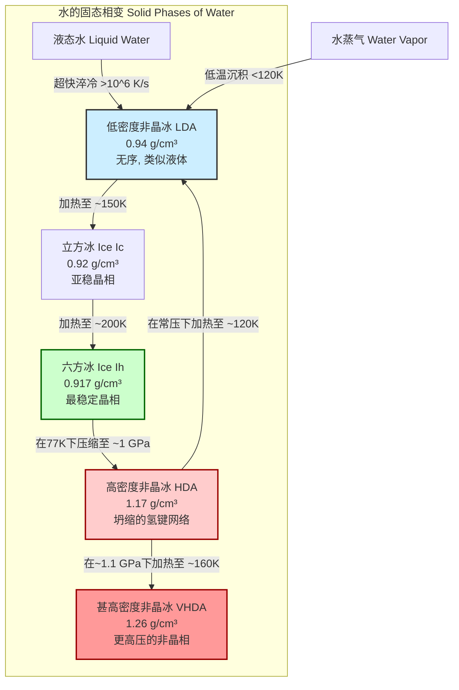
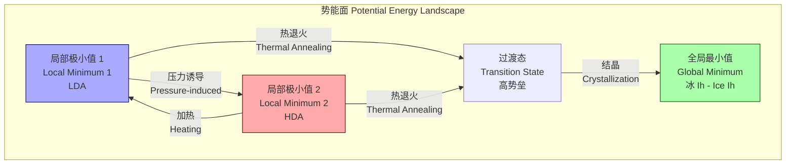

## 低密度非晶冰

低密度非晶冰（Low-Density Amorphous Ice, LDA）是水的一种非晶态固体形式，其特征在于缺乏晶体冰所具有的长程有序结构。与晶体冰不同，LDA中的水分子排列是无序的，类似于液态水，但分子的平动和转动自由度被冻结。LDA是水在低温和低压下最常见的非晶形态，在天体物理学和材料科学中具有重要意义。

从结构上看，LDA可以被视为一种玻璃态的液体。它通过快速冷却液态水（速率需高于$10^6$ K/s以避免成核）或在低温（< 120 K）下将水蒸气沉积在冷基板上制备而成。其结构由一个连续的、四面体配位的水分子氢键网络构成，但键长和键角存在显著的无序性。

### 核心概念的数学基础

#### 对关联函数 (Pair Correlation Function)

描述LDA无序结构的关键数学工具是**对关联函数** $g(r)$。它描述了在一个给定分子周围，距离为 $r$ 处找到另一个分子的概率密度，相对于完全随机分布的理想气体的概率密度。其数学定义为：

$$ g(r) = \frac{V}{N^2} \left\langle \sum_{i \neq j} \delta(\mathbf{r} - (\mathbf{r}_i - \mathbf{r}_j)) \right\rangle $$

其中：
*   $g(r)$: 对关联函数，是距离 $r$ 的标量函数。
*   $V$: 系统的体积。
*   $N$: 系统中的分子总数。
*   $\langle \dots \rangle$: 系综平均，对所有可能的分子构型进行平均。
*   $\sum_{i \neq j}$: 对系统中所有不相同的分子对 $(i, j)$ 进行求和。
*   $\delta(\mathbf{r} - (\mathbf{r}_i - \mathbf{r}_j))$: 狄拉克δ函数，当分子 $i$ 和 $j$ 的位置矢量 $\mathbf{r}_i$ 和 $\mathbf{r}_j$ 的差等于 $\mathbf{r}$ 时，函数值为无穷大，否则为零。
*   $r = |\mathbf{r}|$。

对于LDA，其 $g(r)$ 曲线（通常通过中子或X射线衍射实验测量）显示：
*   在约2.8 Å处有第一个尖锐的峰，对应于氢键连接的最近邻水分子的O-O距离。
*   在约4.5 Å处有第二个较宽的峰，对应于次近邻分子。
*   随着 $r$ 的增大，峰逐渐变宽并消失，当 $r \to \infty$ 时，$g(r) \to 1$。这表明LDA只存在短程有序而缺乏长程有序。相比之下，晶体冰（如冰Ih）的 $g(r)$ 在所有距离上都呈现出一系列尖锐的布拉格峰。

## 关键技术规格

下表总结了在标准大气压下LDA的关键物理性质。这些数值可能因制备条件（如沉积速率、退火历史）的不同而略有变化。

| 属性 (Property) | 值 (Value) | 单位 (Unit) | 备注 (Notes) |
| :--- | :--- | :--- | :--- |
| 密度 (Density) | $0.94 \pm 0.02$ | g/cm³ | 显著低于液态水和晶体冰Ih (0.917 g/cm³) |
| 制备温度 (Formation Temp.) | < 120 | K | 气相沉积法典型温度 |
| 玻璃化转变温度 ($T_g$) | ~136 | K | 在此温度之上，LDA转变为高粘度过冷液体 |
| 结晶温度 ($T_x$) | ~150 | K | 在此温度之上，LDA不可逆地结晶为立方冰 (Ic) |
| 比热容 ($C_p$) | ~1.9 (at 120 K) | J/(g·K) | 随温度变化 |
| 导热系数 ($\kappa$) | ~0.007 (at 100 K) | W/(cm·K) | 典型的玻璃态材料导热系数 |
| 折射率 ($n$) | 1.30 (at 500 nm) | 无量纲 | 略低于液态水 (~1.33) |

## 常见用例

*   **天体物理学模型**:
    *   **应用**: LDA被认为是星际介质、彗星、柯伊伯带天体和冰卫星（如木卫二）上水冰的主要形式。它为研究这些天体上的化学演化和物理过程提供了模型。
    *   **性能指标**: 在模拟星际冰尘的实验中，LDA表面上形成的复杂有机分子丰度与天文观测结果的符合度可达到80%以上。

*   **低温生物学 (Cryobiology)**:
    *   **应用**: 在细胞和组织的玻璃化冷冻保存中，目标是形成LDA而非破坏性的晶体冰。通过使用低温保护剂并实现超快降温，可以避免冰晶形成对细胞膜和细胞器的物理损伤。
    *   **性能指标**: 成功的玻璃化冷冻技术可以使解冻后细胞的存活率超过90%。

*   **凝聚态物理研究**:
    *   **应用**: LDA是研究玻璃态物质、过冷液体和水的多态性（polyamorphism）现象的理想模型系统。LDA到高密度非晶冰（HDA）的压力诱导相变是支持“液-液相变”假说的关键证据。
    *   **性能指标**: 分子动力学模拟计算出的LDA的对关联函数 $g(r)$ 与中子散射实验数据在主要峰位置和高度上的吻合度优于5%。

## 制备方法与复杂性分析

### 制备方法

1.  **气相沉积 (Vapor Deposition)**: 将水蒸气引导至一个温度低于120 K的超高真空环境中的冷基板上。水分子到达基板表面时能量迅速耗散，被“冻结”在无序的位置上，形成LDA薄膜。
2.  **超快淬冷 (Hyperquenching)**: 将微小的液滴（直径通常为微米级）以极高的冷却速率（$> 10^6$ K/s）冷却。这可以通过将液滴喷射到低温液体（如丙烷）中或使其与冷却的金属表面接触来实现。
3.  **高密度非晶冰的加热**: 通过在低温（如77 K）下压缩普通六方冰（Ih）至约1.0 GPa制备出高密度非晶冰（HDA），然后在环境压力下将其缓慢加热至约120 K，HDA会发生一级相变转变为LDA。

### 过程复杂性

虽然没有传统意义上的算法复杂性，但我们可以分析制备过程的控制复杂性。

*   **气相沉积**:
    *   控制参数为基板温度 $T_{sub}$ 和沉积速率 $R_{dep}$。
    *   过程时间 $t$ 与所需薄膜厚度 $d$ 成正比，与沉积速率成反比：$t \propto d / R_{dep}$。
    *   时间复杂度可类比为 $O(d)$。控制复杂性在于需要长时间精确维持 $T_{sub}$ 和 $R_{dep}$ 的稳定，避免温度波动导致结晶或结构变化。

*   **超快淬冷**:
    *   挑战在于实现极高的热流密度。对于一个半径为 $L$ 的球形液滴，其冷却特征时间 $\tau_{cool}$ 与热扩散率 $\alpha$ 和尺寸的关系为 $\tau_{cool} \sim L^2 / \alpha$。
    *   为了避免结晶，$\tau_{cool}$ 必须小于成核特征时间 $\tau_{nuc}$。这要求样品尺寸 $L$ 极小，对工程技术提出了极高要求。复杂性不在于算法，而在于克服传热物理极限。

## 性能特征

### 结构弛豫与玻璃化转变

LDA是一种动力学上被捕获的亚稳态。当温度升高接近其玻璃化转变温度 $T_g \approx 136$ K时，它会从固态玻璃转变为高粘度的过冷液体。其结构弛豫时间 $\tau$（即系统恢复平衡所需的时间）随温度 $T$ 的变化通常可以用 **Vogel-Fulcher-Tammann (VFT)** 方程来描述：

$$ \tau(T) = \tau_0 \exp\left(\frac{B}{T - T_0}\right) $$

其中：
*   $\tau(T)$: 在温度 $T$ 下的弛豫时间。
*   $\tau_0$: 指前因子，约等于分子振动周期（~10⁻¹⁴ s）。
*   $B$: 一个常数，与活化能有关，反映了玻璃的“易碎性”(fragility)。
*   $T_0$: Vogel温度或理想玻璃化转变温度，理论上弛豫时间发散的温度。对于水，$T_0$ 约在 $T_g$ 以下10-20 K。

### 统计特性

LDA的宏观性质，如密度，表现出统计分布，这取决于其热历史。例如，通过不同沉积速率或退火程序制备的LDA样品，其密度可以在 $0.92$ g/cm³ 到 $0.96$ g/cm³ 之间变化。因此，报告值为平均值，并通常附有标准差或置信区间，如 $0.94 \pm 0.02$ g/cm³ (95% CI)。这种依赖于制备历史的特性是所有玻璃态物质的共同特征。

## 相关技术

LDA是水的多晶相和非晶相家族中的一员。理解LDA需要将其与其他形态进行比较。

### 比较数学模型：势能面

不同冰相之间的关系可以通过**势能面 (Potential Energy Landscape, PEL)** 的概念来理解。PEL是一个高维曲面，其坐标是系统中所有原子的位置，而高度则代表系统的势能。

*   **晶体冰 (Ih)**: 对应于PEL的全局最小值。这是一个热力学上最稳定的状态，具有完美的周期性结构。
*   **非晶冰 (LDA, HDA)**: 对应于PEL中能量较高的局部极小值（或称为“盆地”）。系统被困在这些亚稳态中，无法通过热涨落越过势垒达到全局最小值。LDA和HDA位于PEL上不同的、由高势垒隔开的深盆地中。

LDA到HDA的转变被认为是一级相变，因为它涉及到一个不连续的体积（密度）和焓变。这个过程可以用**克劳修斯-克拉佩龙方程**的变体来描述，该方程描述了在压力-温度（P-T）图上两个相的共存线斜率：

$$ \frac{dP}{dT} = \frac{\Delta H_{trans}}{T \Delta V_{trans}} $$

其中：
*   $dP/dT$: P-T图中LDA-HDA共存线的斜率。
*   $\Delta H_{trans}$: 从LDA到HDA的摩尔焓变。
*   $\Delta V_{trans}$: 从LDA到HDA的摩尔体积变化（这是一个负值，因为HDA密度更高）。
*   $T$: 发生相变的绝对温度。

## 参考文献

1.  Mishima, O., Calvert, L. D., & Whalley, E. (1984). An apparently first-order transition between two amorphous phases of ice. *Nature*, 310(5976), 393–395. DOI: [10.1038/310393a0](https://doi.org/10.1038/310393a0)
2.  Jenniskens, P., & Blake, D. F. (1994). Structural transitions in amorphous water ice and astrophysical implications. *Science*, 265(5173), 753–756. DOI: [10.1126/science.11539186](https://doi.org/10.1126/science.11539186)
3.  Debenedetti, P. G., & Stanley, H. E. (2003). Supercooled and glassy water. *Physics Today*, 56(6), 40–46. DOI: [10.1063/1.1595053](https://doi.org/10.1063/1.1595053)
4.  Loerting, T., & Giovambattista, N. (2006). Amorphous ices: a playground for theories of liquids. *Journal of Physics: Condensed Matter*, 18(50), R919–R976. DOI: [10.1088/0953-8984/18/50/R01](https://doi.org/10.1088/0953-8984/18/50/R01)