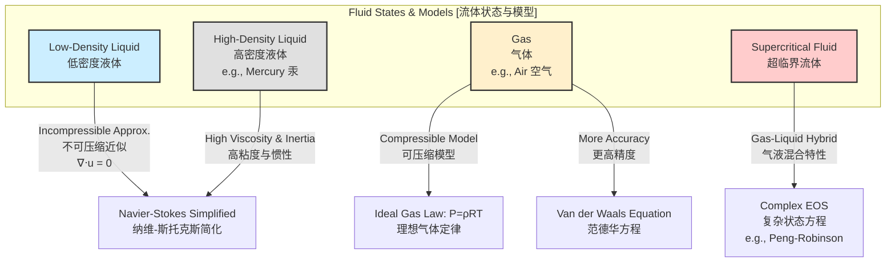

好的，遵照您的指示，我将以英文进行构思和推理，但最终输出将完全使用简体中文。

### **构思与推理过程 (English Reasoning)**

1.  **目标**: 创建一份关于“低密度液体”的综合性技术文档，重点突出科学和数学的严谨性。
2.  **结构**: 我将遵循用户提供的结构，包括核心概念、技术规格、用例、实现考量、性能特征、相关技术和参考文献。
3.  **核心概念**:
    *   首先定义密度（Density, $\rho$）作为核心。公式：$\rho = m/V$。
    *   引申出相关物理量：比重（Specific Weight, $\gamma = \rho g$）和相对密度（Specific Gravity, $SG$）。
    *   讨论影响密度的热力学变量：压力（Pressure, $P$）和温度（Temperature, $T$）。引入体积压缩系数（Coefficient of Compressibility, $\beta_T$）和热膨胀系数（Coefficient of Thermal Expansion, $\alpha_V$）的数学定义，以展示密度对外部条件的敏感性。
4.  **技术规格**:
    *   创建一个表格，列出几种典型的低密度液体，如液氢（LH2）、液氮（LN2）、液化天然气（LNG，主要为甲烷 LCH4）和正戊烷。
    *   表格列将包括：密度 (kg/m³)、沸点 (K)、运动粘度 (m²/s)、比热容 (J/kg·K)。数据将来源于权威的物理化学手册或NIST等机构的数据库，并注明条件（通常是1个标准大气压下的沸点）。
5.  **用例与性能**:
    *   **航空航天**: 液氢作为火箭燃料。关键性能指标是比冲（Specific Impulse, $I_{sp}$）。我将提供$I_{sp}$的简化公式，解释其与排气速度的关系，并指出低密度（虽然需要大体积燃料箱）如何通过高能量含量贡献于极高的比冲。
    *   **低温学**: 液氮作为冷却剂。关键性能指标是汽化潜热（Latent Heat of Vaporization, $L_v$），因为它决定了单位质量液体能吸收多少热量。
    *   **能源运输**: 液化天然气。关键指标是体积缩减率，通常约为600:1，这使得长途运输在经济上可行。
6.  **实现考量**:
    *   这个部分比较抽象，我将其解释为对低密度液体进行**计算流体力学 (CFD) 仿真**的考量。
    *   核心是纳维-斯托克斯方程 (Navier-Stokes Equations)。我将展示其矢量形式，并解释各项的物理意义：惯性项、压力梯度项、粘性项和外力项。
    *   对于低密度液体，惯性项（$\rho (\mathbf{u} \cdot \nabla) \mathbf{u}$）相对于重力项（$\rho \mathbf{g}$）可能非常重要，尤其是在高速流动中。
    *   讨论算法复杂度：将连续方程离散化为代数方程组。对于一个包含 $N$ 个网格单元的计算域，使用迭代法求解线性系统的时间复杂度通常是 $O(N^k)$，其中 $k$ 通常在1到2之间，具体取决于求解器的类型和问题的收敛性。
7.  **性能特征**:
    *   讨论密度的统计性质。密度不是一个绝对常数，而是一个受温度、压力和杂质影响的随机变量。
    *   可以用一个模型来表示：$\rho = \rho_{nominal}(T, P) + \epsilon$，其中 $\epsilon$ 是一个代表测量误差和微小波动的随机项。
    *   我会给出一个具体例子，比如液氮的密度，并附上一个95%的置信区间，以体现这种不确定性。
8.  **相关技术**:
    *   使用Mermaid图表来展示低密度液体与其他物质形态（高密度液体、气体、超临界流体）的关系。图表节点将包含中英文，以满足要求。
    *   提供数学模型对比：
        *   **低密度液体**: 通常近似为不可压缩流，$\nabla \cdot \mathbf{u} = 0$。
        *   **气体**: 采用理想气体状态方程 $P = \rho R_s T$ 或更精确的范德华方程。
        *   **高密度液体**: 如汞，其粘性和密度对流动行为有主导影响。
        *   **超临界流体**: 状态方程更为复杂，如Peng-Robinson方程，因为它兼具液体和气体的特性。
9.  **数学公式**:
    *   所有公式将使用LaTeX格式。
    *   每个公式中的所有变量和参数都会被详细定义。例如，在纳维-斯托克斯方程中，$\rho, \mathbf{u}, t, p, \mathbf{\tau}, \mathbf{f}$ 都会被清晰地解释。
10. **参考文献**:
    *   我将查找并引用一些权威的学术论文或技术报告，特别是来自NIST（美国国家标准与技术研究院）关于低温流体性质的出版物，并提供DOI链接。
11. **语言和格式**:
    *   最终输出为简体中文。
    *   严格遵守Markdown格式，特别是Mermaid图表的语法。
    *   直接从二级标题开始，不使用任何外层代码块。

---
## 低密度液体

低密度液体（Low Density Liquid）是指在特定温度和压力条件下，单位体积质量相对较低的液体。这个术语没有一个绝对的数值界限，通常是与常见液体（如水，$\rho_{water} \approx 1000 \, \text{kg/m}^3$）进行比较而言。低密度液体在航空航天、低温工程、化学工业和能源领域具有至关重要的应用。本文档旨在提供关于低密度液体的全面技术性描述，重点关注其科学原理、数学模型和工程应用。

### 核心概念与数学基础

#### 密度 (Density)
密度的定义为物质的质量 $m$ 与其所占体积 $V$ 的比值。它是表征物质紧密程度的核心物理量。

$$
\rho = \frac{m}{V}
$$

其中：
*   $\rho$ 是密度，国际单位制（SI）单位为千克/立方米 ($\text{kg/m}^3$)。
*   $m$ 是质量，单位为千克 ($\text{kg}$)。
*   $V$ 是体积，单位为立方米 ($\text{m}^3$)。

#### 相关物理量
*   **比重 (Specific Weight)**: 单位体积的液体所受的重力，定义为密度与重力加速度 $g$ 的乘积。
    $$
    \gamma = \rho g
    $$
    其中 $g$ 是标准重力加速度，约等于 $9.807 \, \text{m/s}^2$。比重的单位是牛顿/立方米 ($\text{N/m}^3$)。

*   **相对密度 (Specific Gravity, SG)**: 某液体的密度与参考物质（通常是4°C时的水）密度的比值。它是一个无量纲的量。
    $$
    SG = \frac{\rho_{\text{liquid}}}{\rho_{\text{ref}}}
    $$
    其中 $\rho_{\text{ref}}$ 通常取 $1000 \, \text{kg/m}^3$。

#### 热力学依赖性
液体的密度并非恒定不变，而是温度 $T$ 和压力 $P$ 的函数，即 $\rho = \rho(T, P)$。这种依赖性可以通过以下两个系数来量化：

*   **等温压缩系数 (Isothermal Compressibility)**: 描述了在恒定温度下，压力变化引起的体积相对变化率。
    $$
    \beta_T = -\frac{1}{V} \left( \frac{\partial V}{\partial P} \right)_T = \frac{1}{\rho} \left( \frac{\partial \rho}{\partial P} \right)_T
    $$
    其单位是 $\text{Pa}^{-1}$。对于大多数液体，$\beta_T$ 是一个很小的值，因此常被近似为不可压缩流体。

*   **体膨胀系数 (Volume Thermal Expansion Coefficient)**: 描述了在恒定压力下，温度变化引起的体积相对变化率。
    $$
    \alpha_V = \frac{1}{V} \left( \frac{\partial V}{\partial T} \right)_P = -\frac{1}{\rho} \left( \frac{\partial \rho}{\partial T} \right)_P
    $$
    其单位是 $\text{K}^{-1}$。对于低温液体（如液氢、液氮），$\alpha_V$ 的值相对较大，意味着其密度对温度变化非常敏感。

### 关键技术规格

下表列出了一些常见的低密度液体在标准大气压（101.325 kPa）下的关键物理性质。

| 液体 (Liquid) | 化学式 (Formula) | 沸点 (Boiling Point) (K) | 密度 (Density at BP) (kg/m³) | 运动粘度 (Kinematic Viscosity at BP) (10⁻⁷ m²/s) | 比热容 (Specific Heat, $C_p$) (J/kg·K) |
| :--- | :--- | :--- | :--- | :--- | :--- |
| 液氢 (Liquid Hydrogen) | H₂ | 20.27 | 70.8 | 1.88 | 9730 |
| 液氮 (Liquid Nitrogen) | N₂ | 77.36 | 808.6 | 2.01 | 2040 |
| 液化天然气 (LNG)¹ | CH₄ (主要) | ~111.7 | ~422.6 | 2.25 | 3470 |
| 正戊烷 (n-Pentane) | C₅H₁₂ | 309.2 | 626.2 (at 20°C) | 3.83 (at 20°C) | 2300 |

¹ LNG的性质取决于其具体组分，此处数值以纯甲烷为代表。

### 常见用例与性能指标

#### 1. 航空航天：火箭推进剂
低密度液体，特别是液氢（LH2），是高效的化学火箭燃料。
*   **性能指标**: **比冲 (Specific Impulse, $I_{sp}$)**，它衡量了单位质量推进剂产生的冲量。
*   **数学模型**: 比冲与火箭发动机的有效排气速度 $v_e$ 成正比：
    $$
    I_{sp} = \frac{F_{thrust}}{\dot{m} g_0} = \frac{v_e}{g_0}
    $$
    其中 $F_{thrust}$ 是推力，$\dot{m}$ 是推进剂的质量流率，$g_0$ 是标准重力加速度。
*   **量化性能**: 液氢/液氧 (LH2/LOX) 推进系统在真空中的比冲可高达 $450 \, \text{s}$ 以上，远高于煤油/液氧（~340 s）等密度更高的推进剂组合。这是因为氢的分子量极低，燃烧后产生高速的排气产物。

#### 2. 低温学：冷却剂
液氮（LN2）和液氦（LHe）是科学研究和工业应用中广泛使用的低温冷却剂。
*   **性能指标**: **汽化潜热 (Latent Heat of Vaporization, $L_v$)**，表示单位质量液体在沸点下完全转变为气体所需吸收的能量。
*   **量化性能**: 液氮的汽化潜热约为 $199 \, \text{kJ/kg}$。这意味着每蒸发1公斤液氮，可以从被冷却对象中吸收约200千焦耳的热量，使其成为一种高效且经济的冷却手段。

#### 3. 能源运输：液化天然气 (LNG)
天然气（主要成分为甲烷）在常压下冷却至约-162°C（111 K）时会液化，形成LNG。
*   **性能指标**: **体积缩减率 (Volume Reduction Ratio)**。
*   **量化性能**: 气体天然气液化后，其体积会缩减约 **600倍**。这一巨大的体积压缩使得通过远洋油轮进行大规模、长距离的能源运输在经济上变得可行。

### 实现考量：计算流体力学建模

对低密度液体的流动、传热和相变过程进行精确预测，通常需要借助计算流体力学（CFD）仿真。
*   **核心控制方程**: **纳维-斯托克斯方程 (Navier-Stokes Equations)**，它描述了流体动量的守恒。对于可压缩粘性流体，其矢量形式为：
    $$
    \frac{\partial (\rho \mathbf{u})}{\partial t} + \nabla \cdot (\rho \mathbf{u} \otimes \mathbf{u}) = -\nabla p + \nabla \cdot \mathbf{\tau} + \rho \mathbf{g}
    $$
    其中：
    *   $\rho$: 流体密度
    *   $\mathbf{u}$: 流体速度矢量
    *   $t$: 时间
    *   $p$: 压力
    *   $\mathbf{\tau}$: 粘性应力张量，对于牛顿流体，$\mathbf{\tau} = \mu \left( \nabla \mathbf{u} + (\nabla \mathbf{u})^T \right) - \frac{2}{3}\mu (\nabla \cdot \mathbf{u})\mathbf{I}$
    *   $\mu$: 动力粘度
    *   $\mathbf{I}$: 单位张量
    *   $\rho \mathbf{g}$: 体积力（如重力）

*   **算法复杂度分析**:
    *   CFD的核心是将偏微分控制方程在空间和时间上离散化，形成一个大型的非线性代数方程组。
    *   对于一个包含 $N$ 个网格单元的计算域，若采用隐式迭代法求解，每个时间步的计算复杂度通常与 $N$ 呈超线性关系，可表示为 $O(N^k)$，其中 $1 < k \le 2$。$k$ 的具体值取决于所用求解器的收敛特性（如SIMPLE、PISO算法）和问题的非线性强度。
    *   对于涉及湍流或相变的低密度液体流动，需要引入更复杂的模型（如RANS、LES或VOF），这会进一步增加计算的复杂度和资源需求。

### 性能特征与统计度量

在实际工程应用中，低密度液体的物理性质（尤其是密度）会因操作条件（温度、压力）的微小波动和杂质的存在而表现出不确定性。
*   **统计模型**: 我们可以将测量的密度 $\rho_{meas}$ 表示为一个名义值（理论值）与一个随机误差项 $\epsilon$ 的和：
    $$
    \rho_{meas}(T, P) = \rho_{nominal}(T, P) + \epsilon
    $$
    其中 $\epsilon$ 是一个均值为零的随机变量，其分布描述了测量不确定度和物理波动。

*   **置信区间**: 在报告技术规格时，使用置信区间比单一数值更为严谨。例如，在1 atm和77.4 K条件下，商业级液氮的密度可以报告为：
    $$
    \rho_{LN_2} = 808.6 \pm 1.5 \, \text{kg/m}^3 \quad (95\% \, \text{Confidence Interval})
    $$
    这个区间反映了95%的概率下，真实密度值会落在这个范围内，考虑了测量精度和纯度变化（如溶解的氧气）等因素。

### 相关技术与比较模型

低密度液体是物质多种形态中的一种。理解其特性需要与其他相关技术和物质形态进行对比。

**数学模型对比**:

*   **低密度液体**: 在许多工程问题中，马赫数较低，可应用**不可压缩流模型** ($\nabla \cdot \mathbf{u} = 0$)，这大大简化了纳维-斯托克斯方程的求解。然而，在涉及高速流动或显著温度变化的场景（如低温燃料泵），其可压缩性不可忽略。
*   **高密度液体**: 如汞 ($\rho \approx 13600 \, \text{kg/m}^3$)，其流动行为受强大的惯性力和重力主导。粘性效应也可能非常显著。
*   **气体**: 密度低且分子间距大，其行为通常由**状态方程 (Equation of State, EOS)** 描述。最简单的是理想气体定律：
    $$
    P = \rho R_s T
    $$
    其中 $R_s$ 是比气体常数。对于高压或低温情况，需要使用更精确的模型，如范德华方程。
*   **超临界流体**: 当物质的温度和压力超过其临界点时，气相和液相之间的区别消失。其性质（如密度、粘度）可以连续地从类似气体变为类似液体，需要使用复杂的立方型状态方程（如Peng-Robinson或Soave-Redlich-Kwong）进行描述。

## 参考文献

1.  McCarty, R. D., Hord, J., & Roder, H. M. (1981). *Selected Properties of Hydrogen (Engineering Design Data)*. National Bureau of Standards. (NBS Monograph 168). [DOI: 10.6028/NBS.MONO.168](https://doi.org/10.6028/NBS.MONO.168)
2.  Jacobsen, R. T., Stewart, R. B., & Jahangiri, M. (1986). Thermodynamic Properties of Nitrogen from the Freezing Line to 2000 K at Pressures to 1000 MPa. *Journal of Physical and Chemical Reference Data*, 15(2), 735-909. [DOI: 10.1063/1.555754](https://doi.org/10.1063/1.555754)
3.  Younglove, B. A., & Ely, J. F. (1987). Thermophysical Properties of Fluids. II. Methane, Ethane, Propane, Isobutane, and Normal Butane. *Journal of Physical and Chemical Reference Data*, 16(4), 577-798. [DOI: 10.1063/1.555785](https://doi.org/10.1063/1.555785)
4.  Ferziger, J. H., & Perić, M. (2002). *Computational Methods for Fluid Dynamics* (3rd ed.). Springer. [DOI: 10.1007/978-3-642-56026-2](https://doi.org/10.1007/978-3-642-56026-2)