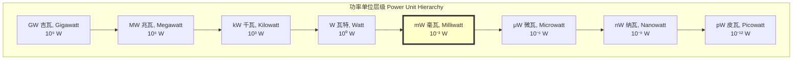
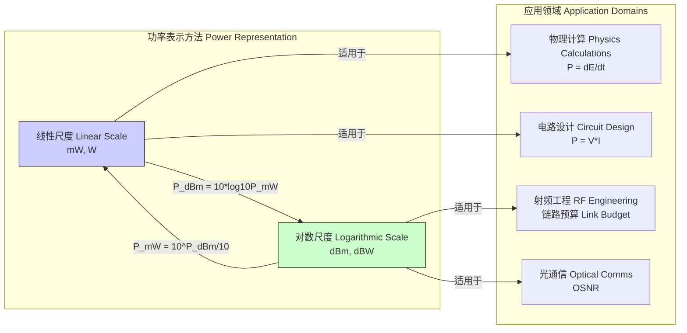

## mW (毫瓦)

毫瓦（Milliwatt, 符号 mW）是一个国际单位制（SI）中的功率单位，等于千分之一（$10^{-3}$）瓦特。它在物理学、工程学、尤其是电子学和通信领域中被广泛用于描述小功率系统或信号的能量转换或传输速率。

### 1. 核心概念与数学基础

功率（Power）在物理学中被定义为能量转换或传输的速率，即单位时间内所做的功或传递的能量。其基本数学表示为能量 $E$ 对时间 $t$ 的一阶导数。

$$
P = \frac{dE}{dt}
$$

其中：
*   $P$ 是功率，单位为瓦特（W）。
*   $E$ 是能量，单位为焦耳（J）。
*   $t$ 是时间，单位为秒（s）。

毫瓦作为瓦特的一个导出单位，其关系定义如下：

$$
1 \, \text{mW} = 10^{-3} \, \text{W} = 0.001 \, \text{W}
$$

在不同的物理领域，功率有其特定的表达形式：

#### 1.1 电功率 (Electrical Power)
在电路中，功率是电压和电流的乘积。对于直流（DC）电路：

$$
P = V \cdot I
$$

对于符合欧姆定律的电阻性负载，电功率也可以表示为：

$$
P = I^2 R = \frac{V^2}{R}
$$

其中：
*   $V$ 是电压，单位为伏特（V）。
*   $I$ 是电流，单位为安培（A）。
*   $R$ 是电阻，单位为欧姆（Ω）。

#### 1.2 电磁波与光功率 (Electromagnetic and Optical Power)
对于电磁波，功率通常指单位时间内通过某一特定面积的能量，即辐射通量（Radiant Flux, $\Phi_e$）。例如，激光器的输出功率通常以毫瓦为单位。其能量可以通过坡印亭矢量（Poynting Vector, $\vec{S}$）在空间和时间上积分得到，该矢量描述了电磁场的能量通量密度。

$$
\vec{S} = \frac{1}{\mu_0} (\vec{E} \times \vec{B})
$$

总辐射功率 $P$ 是坡印亭矢量通过一个闭合曲面 $A$ 的面积分：

$$
P = \oint_A \vec{S} \cdot d\vec{A}
$$

其中：
*   $\vec{E}$ 是电场强度矢量。
*   $\vec{B}$ 是磁场强度矢量。
*   $\mu_0$ 是真空磁导率。

下图展示了功率单位的层级关系，毫瓦（mW）在其中处于微观与宏观功率的连接点。

### 2. 关键技术规格

毫瓦作为一个标准单位，其定义是精确的。然而，在工程应用中，它经常与分贝毫瓦（dBm）进行转换，后者是一个对数单位，更便于表示大动态范围的功率值。

| 参数 (Parameter) | 值 (Value) | 单位 (Unit) | 描述 (Description) |
| :--- | :--- | :--- | :--- |
| 定义 (Definition) | $1 \times 10^{-3}$ | W | 在国际单位制（SI）中的基本定义 |
| 能量转换率 (Energy Rate) | $1 \times 10^{-3}$ | J/s | 每秒转换或传输的能量 |
| 相对dBm的基准 (Reference for dBm) | 0 | dBm | 1 mW 是 dBm 刻度的参考点 |
| 相对dBW的换算 (Conversion to dBW) | -30 | dBW | 1 mW 等于 -30 分贝瓦 |

#### 2.1 与 dBm 的转换模型

dBm（分贝毫瓦）是一个以 1 mW 为基准的对数功率单位。转换公式如下：

$$
P_{\text{dBm}} = 10 \log_{10} \left( \frac{P_{\text{mW}}}{1 \, \text{mW}} \right)
$$

反向转换公式为：

$$
P_{\text{mW}} = 10^{\frac{P_{\text{dBm}}}{10}}
$$

其中：
*   $P_{\text{dBm}}$ 是以 dBm 为单位的功率。
*   $P_{\text{mW}}$ 是以 mW 为单位的功率。

### 3. 常见用例与定量性能指标

毫瓦级别的功率广泛存在于各种低功耗技术中。

| 应用领域 (Application Domain) | 典型功率 (Typical Power) | 性能指标 (Performance Metric) |
| :--- | :--- | :--- |
| 无线通信 (Wireless Comms) | 1 - 100 mW (0 - 20 dBm) | Wi-Fi/蓝牙发射功率。指标：EIRP（等效全向辐射功率） |
| 光纤通信 (Fiber Optics) | 0.1 - 10 mW (-10 - 10 dBm) | 激光二极管输出功率。指标：光信噪比 (OSNR) |
| 消费级激光器 (Consumer Lasers) | < 5 mW | 激光笔、CD/DVD读取激光器。指标：光束质量 ($M^2$) |
| 医疗设备 (Medical Devices) | 0.01 - 1 mW | 助听器、心脏起搏器。指标：电池寿命、功耗 |
| 物联网设备 (IoT Devices) | 0.1 - 50 mW (待机/活动) | 传感器节点。指标：待机功耗、能量收集效率 |

例如，在自由空间无线传输中，接收功率 $P_r$ 可以通过**弗里斯传输方程 (Friis Transmission Equation)** 计算，这直接关系到链路预算中的毫瓦级功率计算。

$$
P_r = P_t G_t G_r \left( \frac{\lambda}{4\pi R} \right)^2 L
$$

其中：
*   $P_r$ 和 $P_t$ 分别是接收和发射功率（单位：W 或 mW）。
*   $G_t$ 和 $G_r$ 分别是发射和接收天线的增益（无量纲）。
*   $\lambda$ 是信号波长（单位：m）。
*   $R$ 是天线之间的距离（单位：m）。
*   $L$ 是与传播介质相关的损耗因子（无量纲, $L \le 1$）。

### 4. 实现考量与算法分析

在工程实践中，精确测量和控制毫瓦级功率至关重要。

#### 4.1 功率测量算法
数字功率计通常通过高速采样电压 $v(t)$ 和电流 $i(t)$ 波形来计算功率。

1.  **瞬时功率计算**: $p(t) = v(t) \cdot i(t)$
2.  **平均功率计算**: 在一个周期 $T$ 内（对于周期信号）或一个时间窗口内积分。
    $$
    P_{avg} = \frac{1}{T} \int_0^T p(t) dt = \frac{1}{N} \sum_{k=1}^{N} v[k] \cdot i[k]
    $$
    其中 $v[k]$ 和 $i[k]$ 是离散采样点，$N$ 是采样点总数。

**算法复杂度**:
对于 $N$ 个采样点，计算平均功率的复杂度为 $O(N)$。如果需要进行频谱分析以获得特定频率的功率（功率谱密度），则通常使用快速傅里叶变换（FFT），其复杂度为 $O(N \log N)$。

#### 4.2 发射功率控制 (Transmit Power Control, TPC)
在移动通信中，TPC 算法动态调整手机的发射功率（通常在毫瓦范围内），以在保证通信质量的同时最大限度地减少干扰和功耗。

*   **开环TPC**: 基于路径损耗估计来设置功率。
*   **闭环TPC**: 基站测量接收信号强度，并向手机发送上/下调整命令。

**算法复杂度**:
闭环TPC的更新步骤通常是常数时间复杂度 $O(1)$，因为它只涉及与目标阈值的比较和固定的步长调整。

### 5. 性能特征与统计度量

毫瓦级功率源的稳定性是评估其性能的关键。

*   **平均功率 ($\bar{P}$)**: 在特定时间段内的平均值。
*   **功率标准差 ($\sigma_P$)**: 描述功率随时间的波动。
    $$
    \sigma_P = \sqrt{\frac{1}{N-1} \sum_{i=1}^{N} (P_i - \bar{P})^2}
    $$
*   **相对强度噪声 (Relative Intensity Noise, RIN)**: 用于描述激光器输出功率的稳定性，特别是在光通信中。
    $$
    \text{RIN} = \frac{\langle (\delta P)^2 \rangle}{\bar{P}^2}
    $$
    其中 $\langle (\delta P)^2 \rangle$ 是功率波动的方差。RIN 通常以 dB/Hz 为单位。
*   **置信区间 (Confidence Interval)**: 对于功率测量，提供一个值范围，真值以一定的概率（如95%）落入该范围。例如，一个 95% 的置信区间可以表示为 $\bar{P} \pm 1.96 \frac{\sigma_P}{\sqrt{N}}$。

### 6. 相关技术与比较数学模型

将毫瓦与其他功率单位和尺度进行比较，有助于理解其在不同场景下的适用性。

#### 6.1 线性尺度 (mW) vs. 对数尺度 (dBm)
*   **线性尺度 (mW)**:
    *   优点：直观，易于进行加减运算（例如，两个 5 mW 的信号源总功率为 10 mW）。
    *   缺点：难以表示大动态范围。从 1 μW 到 10 W 的范围跨越了7个数量级。
*   **对数尺度 (dBm)**:
    *   优点：能有效压缩大动态范围。增益和损耗可以直接相加减。例如，一个 10 dBm 的信号通过一个 -3 dB 的衰减器后，输出为 7 dBm。
    *   缺点：不直观，功率的叠加不是简单的算术和。

下图展示了线性和对数尺度在不同应用中的关系。

#### 6.2 散粒噪声 (Shot Noise)
在测量极低光功率（接近或低于毫瓦）时，散粒噪声成为一个主要的限制因素。这是由光子的离散到达或电子的离散流动引起的量子现象。光电探测器中的散粒噪声电流方差为：

$$
\sigma_i^2 = 2qI_p B
$$

其中：
*   $\sigma_i^2$ 是噪声电流的方差 ($A^2$)。
*   $q$ 是基本电荷 ($1.602 \times 10^{-19}$ C)。
*   $I_p$ 是光电流 (A)，它与入射光功率成正比 ($I_p = \mathcal{R} \cdot P_{in}$)，其中 $\mathcal{R}$ 是探测器的响应度 (A/W)。
*   $B$ 是测量带宽 (Hz)。

这个模型表明，即使是理想的探测器，在测量毫瓦级功率时也存在固有的量子噪声下限。

### 7. 参考文献

1.  Pozar, D. M. (2011). *Microwave Engineering* (4th ed.). John Wiley & Sons. (Provides comprehensive coverage of power concepts in RF and microwave frequencies).
2.  Saleh, B. E. A., & Teich, M. C. (2019). *Fundamentals of Photonics* (3rd ed.). John Wiley & Sons. (Details optical power, noise, and laser characteristics).
3.  International Bureau of Weights and Measures. (2019). *The International System of Units (SI)* (9th ed.). [https://www.bipm.org/en/publications/si-brochure/](https://www.bipm.org/en/publications/si-brochure/)
4.  Goldsmith, A. (2005). *Wireless Communications*. Cambridge University Press. DOI: [10.1017/CBO9780511841224](https://doi.org/10.1017/CBO9780511841224). (Discusses power control algorithms and link budgets in detail).