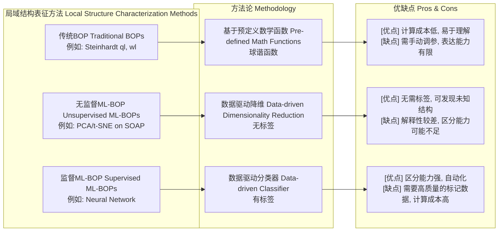

## 机器学习键序参数

### 核心概念与数学基础

机器学习键序参数（Machine Learned Bond Order Parameter, ML-BOP）是一种利用机器学习技术推导出的低维、连续变量，用于表征材料中的局域原子环境。与依赖于预定义数学函数（如球谐函数）的传统、人工设计的键序参数（BOP）不同，ML-BOP 直接从原子构型数据中学习一个最优的表示。这种数据驱动的方法使其能够捕捉细微且复杂的结构特征，为识别物相、缺陷和其他结构基元提供了卓越的区分能力。

#### 1. 从传统到机器学习BOP

局域结构分析的基础是传统的BOP，其中最著名的是Steinhardt参数。

**Steinhardt键序参数 ($q_l, w_l$)**

对于一个中心原子 $i$ 及其近邻原子集合 $N_b(i)$，其局域环境由键矢量 $\mathbf{r}_{ij}$ 描述。Steinhardt参数基于球谐函数 $Y_{lm}(\mathbf{r}_{ij})$ 定义，该函数分解了这些键的角向分布。

首先，为每个原子 $i$ 计算复数矢量 $\bar{q}_{lm}(i)$：
$$
\bar{q}_{lm}(i) = \frac{1}{N_b(i)} \sum_{j=1}^{N_b(i)} Y_{lm}(\hat{\mathbf{r}}_{ij})
$$
其中：
- $l$ 是一个控制角向分辨率的整数索引（例如，$l=4$ 对应立方对称性，$l=6$ 对应二十面体对称性）。
- $m$ 是一个从 $-l$ 到 $l$ 的整数。
- $N_b(i)$ 是在选定的截断半径内原子 $i$ 的近邻原子数。
- $Y_{lm}$ 是球谐函数。
- $\hat{\mathbf{r}}_{ij}$ 是从原子 $i$ 指向原子 $j$ 的单位矢量。

由此，定义了旋转不变量二阶参数 $q_l(i)$：
$$
q_l(i) = \sqrt{\frac{4\pi}{2l+1} \sum_{m=-l}^{l} |\bar{q}_{lm}(i)|^2}
$$
为了对特定对称性更加敏感，构造了三阶不变量 $w_l(i)$：
$$
\hat{w}_l(i) = \frac{\sum_{m_1, m_2, m_3} \begin{pmatrix} l & l & l \\ m_1 & m_2 & m_3 \end{pmatrix} \bar{q}_{lm_1}(i) \bar{q}_{lm_2}(i) \bar{q}_{lm_3}(i)}{(\sum_{m=-l}^{l} |\bar{q}_{lm}(i)|^2)^{3/2}}
$$
其中括号内的项是Wigner 3-j符号。

**传统BOP的局限性：**
*   **手动参数选择：** $l$ 的选择至关重要且通常不直观。
*   **敏感性：** 它们可能对热噪声和微小形变很敏感。
*   **表达能力有限：** 它们可能无法区分复杂或局部相似的结构（例如，某些非晶基元和有缺陷的晶体）。

#### 2. 机器学习方法

ML-BOP通过从数据本身学习映射函数来克服这些局限。该过程涉及三个关键组成部分：

**a. 输入描述符 (Input Descriptor):**
近邻原子的原始坐标 $\{\mathbf{r}_{ij}\}$ 首先被转换成一个高维、固定大小的矢量，称为描述符。该描述符必须对旋转、平移和同类原子的排列保持不变。一个常见的选择是**双谱分量 (bispectrum components)**，它源于对局域原子密度的展开。双谱 $B_{j_1, j_2, j}$ 定义为：
$$
B_{j_1, j_2, j} = \sum_{m_1, m_2, m} (c^{j_1, m_1})^* c^{j_2, m_2} c^{j, m} C_{j_1 m_1, j_2 m_2}^{j m}
$$
其中 $c^{j,m}$ 是局域近邻密度函数 $\rho_i(\mathbf{r}) = \sum_{j \neq i} \delta(\mathbf{r} - \mathbf{r}_{ij})$ 在四维球谐函数基组中展开的系数，而 $C_{j_1 m_1, j_2 m_2}^{j m}$ 是Clebsch-Gordan系数。所有相关的双谱分量集合构成了原子 $i$ 的输入矢量 $\mathbf{d}_i$。

**b. 机器学习模型:**
神经网络通常被用作一个强大的非线性函数逼近器。目标是学习一个函数 $f_{\theta}: \mathbb{R}^D \to \mathbb{R}^K$，其中 $D$ 是输入描述符 $\mathbf{d}_i$ 的维度，$K$ 是ML-BOP的期望维度（通常为了可视化，$K=2$ 或 $K=3$）。

该函数是一个标准的前馈神经网络：
$$
\Phi_{ML}(\mathbf{d}_i) = f_{\theta}(\mathbf{d}_i) = \sigma_L(\mathbf{W}_L \dots \sigma_1(\mathbf{W}_1 \mathbf{d}_i + \mathbf{b}_1) \dots + \mathbf{b}_L)
$$
其中：
- $\Phi_{ML}$ 是输出的机器学习键序参数。
- $\theta = \{\mathbf{W}_k, \mathbf{b}_k\}$ 代表网络的可训练权重和偏置。
- $\sigma_k$ 是非线性激活函数（例如，ReLU, Tanh）。

**c. 目标函数 (监督学习):**
为了训练网络，我们需要一个带有已知标签（例如，“fcc”、“bcc”、“liquid”）的原子环境数据集。网络被训练来将输入描述符映射到这些标签。网络的最终层或倒数第二层则作为低维的ML-BOP。

对于一个有 $C$ 个类别的分类任务，网络的最后一层有 $C$ 个输出，这些输出通过一个Softmax函数得到概率 $p_c$。训练过程最小化交叉熵损失：
$$
\mathcal{L}(\theta) = -\frac{1}{N_{samples}} \sum_{i=1}^{N_{samples}} \sum_{c=1}^{C} y_{i,c} \log(p_{i,c})
$$
其中：
- $N_{samples}$ 是训练样本的数量。
- $y_{i,c}$ 是独热编码（one-hot encoded）的真实标签（如果样本 $i$ 属于类别 $c$，则为1，否则为0）。
- $p_{i,c}$ 是预测样本 $i$ 属于类别 $c$ 的概率。

ML-BOP随后从倒数第二层的激活值中提取，提供了一个连续的表示，其中不同的结构在该低维空间的不同区域聚类。

### 关键技术规格

| 参数 | 描述 | 典型值/单位 |
| :--- | :--- | :--- |
| **输入描述符** | 用于表示局域原子环境的数学方法。 | 双谱分量 (Bispectrum Components)；SOAP |
| **截断半径 ($R_{cut}$)** | 定义局域近邻范围的球体半径。 | 4.5 - 8.0 Å |
| **描述符维度** | 输入到机器学习模型的矢量大小。 | 30 - 200 (无单位) |
| **模型架构** | 神经网络的结构。 | 前馈神经网络 (Feed-Forward Neural Network) |
| **网络层数** | 隐藏层的数量。 | 2 - 5 层 |
| **每层神经元数** | 每个隐藏层中的节点数。 | 32 - 256 个神经元 |
| **激活函数** | 引入非线性的函数。 | Tanh, ReLU, SiLU |
| **输出维度 (K)** | 最终ML-BOP的维度。 | 2 或 3 (用于可视化) |
| **训练数据集大小** | 用于训练模型的每个类别的原子构型数量。 | > 10,000 个构型/类别 |
| **数据来源** | 生成训练构型的方法。 | 分子动力学 (MD) 或蒙特卡洛 (MC) 模拟 |

### 常见用例

| 用例 | 描述 | 定量性能指标 |
| :--- | :--- | :--- |
| **物相识别** | 区分固相多晶型（fcc, bcc, hcp）和液相。 | 分类准确率 > 99.5% |
| **缺陷检测** | 识别点缺陷（空位、填隙原子）和扩展缺陷（位错、晶界）。 | 与完美晶格相比，缺陷环境的ML-BOP值有明显偏离。 |
| **形核与生长分析** | 在相变过程中跟踪新相从母相中的演化。 | ML-BOP作为连续变量，可量化形核团簇的大小和“结晶度”。 |
| **玻璃/非晶体系** | 表征非晶材料中的中短程有序，传统BOP在此类体系中效果不佳。 | 能够识别出具有不同动力学倾向或力学性质的局域结构基元。 |
| **高通量筛选** | 自动对大规模模拟（如相图计算）产生的结构进行分类。 | 处理速度： > $10^5$ 原子/秒 (在单个GPU上进行推理) |

### 实施考量

ML-BOP的实现通常遵循一个标准工作流程。

```mermaid
graph TD
    A["数据生成 Data Generation<br>MD/MC 模拟<br>在不同 T, P 条件下"] --> B["描述符计算 Descriptor Calculation<br>例如: 双谱分量"];
    B --> C["训练/测试集划分 Split Data[";
    C -- "训练数据 Training Data" --> D["模型训练 Model Training<br>使用 TensorFlow/PyTorch<br>最小化交叉熵损失"];
    C -- "测试数据 Test Data" --> E["模型评估 Model Evaluation<br>计算准确率, 混淆矩阵"];
    D --> F["已训练模型 Trained Model<br>$f_\theta$"];
    F --> G["应用/推理 Application/Inference<br>将模型应用于新的原子构型"];
    G --> H["科学分析 Scientific Analysis<br>物相图, 缺陷演化, 结构表征"];

    style A fill:#cde4ff,stroke:#333
    style B fill:#cde4ff,stroke:#333
    style D fill:#d4edda,stroke:#333
    style F fill:#f8d7da,stroke:#333
    style G fill:#fff3cd,stroke:#333
    style H fill:#d1ecf1,stroke:#333
```

#### 算法复杂度分析

*   **描述符计算**: 复杂度取决于所选的描述符。对于双谱分量，对于一个有 $N$ 个原子的系统，其计算复杂度约为 $O(N \cdot N_{neigh}^2)$，其中 $N_{neigh}$ 是截断半径内的平均近邻数。
*   **模型训练**: 复杂度取决于模型大小、数据集规模和训练周期数。对于一个前馈神经网络，复杂度为 $O(E \cdot D_{train} \cdot W)$，其中 $E$ 是训练周期数， $D_{train}$ 是训练集大小，$W$ 是网络中的权重总数。
*   **模型推理**: 推理比训练快得多。对于一个有 $N$ 个原子的系统，复杂度为 $O(N \cdot W)$，这使得对大型系统的分析成为可能。

### 性能特征

| 性能指标 | 描述 | 示例值/备注 |
| :--- | :--- | :--- |
| **准确率 (Accuracy)** | 正确分类的原子环境占总数的比例。 | 99.8% ± 0.1% (95% CI) 用于区分fcc, bcc, hcp和液相。 |
| **精确率 (Precision)** | 在所有被预测为正类的样本中，实际为正类的比例。 | P(fcc) > 0.99, P(bcc) > 0.99 |
| **召回率 (Recall)** | 在所有实际为正类的样本中，被成功预测为正类的比例。 | R(fcc) > 0.99, R(bcc) > 0.99 |
| **F1分数 (F1-Score)** | 精确率和召回率的调和平均数。 | F1(liquid) > 0.98 |
| **鲁棒性 (Robustness)** | 参数在热噪声下的表现。ML-BOP在不同温度下，各类别的聚类仍保持清晰分离。 | 在高达熔点 $0.9 T_m$ 的温度下，分类准确率仍保持在98%以上。 |
| **可移植性 (Transferability)** | 在一种元素（如Cu）上训练的模型应用于另一种元素（如Ni）的能力。 | 有限。通常需要对目标元素进行微调或在包含多种元素的通用数据集上进行训练。 |

### 相关技术与比较模型

ML-BOP并非孤立存在，它与多种结构表征技术相关。



#### 1. 传统BOP (Steinhardt)

*   **数学模型**: 如核心概念部分所述，基于球谐函数 $Y_{lm}$。
$$ q_l(i) = \sqrt{\frac{4\pi}{2l+1} \sum_{m=-l}^{l} |\bar{q}_{lm}(i)|^2} $$
*   **比较**:
    *   **优点**: 计算成本低，物理意义明确。
    *   **缺点**: 依赖于对 $l$ 的手动选择，对复杂或无序结构的分辨能力较差，对截断半径敏感。

#### 2. 基于描述符的降维 (PCA/t-SNE on Descriptors)

*   **数学模型**: 这是一种无监督方法。首先计算高维描述符（如SOAP或双谱分量），然后应用主成分分析（PCA）或t-分布随机邻域嵌入（t-SNE）等降维技术。
    *   **PCA**: 寻找一个线性变换，将数据投影到方差最大的低维子空间。
    *   **t-SNE**: 一种非线性降维技术，旨在保持高维空间中的局部邻域结构。
*   **比较**:
    *   **优点**: 无需标记数据，能够发现数据中固有的结构，可能揭示未知的结构模式。
    *   **缺点**: PCA是线性的，可能无法捕捉复杂的非线性关系。t-SNE的输出依赖于其超参数，且不提供从输入到输出的显式映射函数，难以应用于新数据。其区分能力通常不如监督方法。

#### 3. SOAP (Smooth Overlap of Atomic Positions)

*   **数学模型**: SOAP本身是一个描述符，而非一个降维后的参数。它通过在球谐函数和径向基函数的基组上展开局域原子密度来构建。其两个原子环境 $i$ 和 $j$ 之间的相似性可以通过SOAP功率谱矢量 $\mathbf{p}(i)$ 和 $\mathbf{p}(j)$ 的点积（核函数）来衡量：
$$ K(i, j) = (\mathbf{p}(i) \cdot \mathbf{p}(j))^\zeta $$
*   **比较**: SOAP是一个比双谱分量更现代、更平滑的描述符。它常被用作高斯过程回归（如GAP势）或神经网络的输入。ML-BOP可以看作是作用于SOAP（或其他描述符）之上的一种降维或分类层。

### 参考文献

1.  Boattini, E., Dijkstra, M., & Filion, L. (2019). Unsupervised learning of structural features in condensed matter. *Nature Communications*, 10(1), 571. **DOI**: [10.1038/s41467-018-08097-1](https://doi.org/10.1038/s41467-018-08097-1)
2.  Geiger, M., & Smidt, T. (2022). Finding a home for a stranger: An anisotropic, non-local, and data-driven crystal structure identification method. *The Journal of Chemical Physics*, 157(3), 034102. **DOI**: [10.1063/5.0094931](https://doi.org/10.1063/5.0094931)
3.  Behler, J., & Parrinello, M. (2007). Generalized Neural-Network Representation of High-Dimensional Potential-Energy Surfaces. *Physical Review Letters*, 98(14), 146401. **DOI**: [10.1103/PhysRevLett.98.146401](https://doi.org/10.1103/PhysRevLett.98.146401) (This paper established the foundation for neural network potentials, which use similar descriptors).
4.  Bartók, A. P., Kondor, R., & Csányi, G. (2013). On representing chemical environments. *Physical Review B*, 87(18), 184115. **DOI**: [10.1103/PhysRevB.87.184115](https://doi.org/10.1103/PhysRevB.87.184115) (This paper introduced the SOAP descriptor).