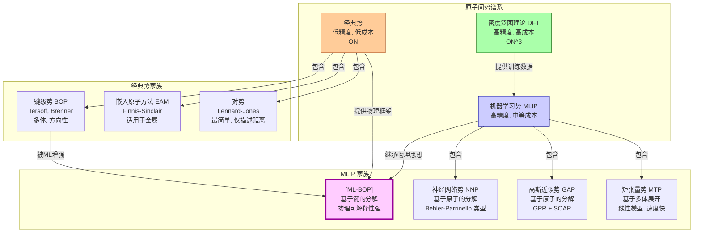

## 机器学习键级势 (Machine Learned Bond Order Potential)

机器学习键级势（ML-BOP）是一种先进的原子间势，它将传统键级势（BOP）的物理直观性与机器学习（ML）模型的高灵活性和准确性相结合。其核心目标是在保持计算效率的同时，达到接近第一性原理计算（如密度泛函理论，DFT）的精度，从而实现对大规模原子体系的精确、高效模拟。

### 核心概念与数学基础

#### 传统键级势 (BOP)

经典键级势的理论基础源于化学键理论和紧束缚近似。它假设体系的总能量 $E_{tot}$ 可以分解为所有原子对之间相互作用的总和。与简单的对势不同，BOP 明确地考虑了化学环境对键强度的影响。其能量表达式通常具有以下形式：

$$
E_{tot} = \frac{1}{2} \sum_{i \neq j} V_{ij} = \frac{1}{2} \sum_{i \neq j} f_c(r_{ij}) \left[ V_R(r_{ij}) - B_{ij} V_A(r_{ij}) \right]
$$

其中：
*   $i, j$ 是原子索引。
*   $r_{ij}$ 是原子 $i$ 和 $j$ 之间的距离。
*   $f_c(r_{ij})$ 是一个平滑的截断函数，用于确保相互作用在有限距离（$r_{cut}$）内变为零。
*   $V_R(r_{ij})$ 是一个表示短程泡利斥力的排斥项，通常是指数形式。
*   $V_A(r_{ij})$ 是一个表示成键电子吸引力的吸引项，也是指数形式。
*   $B_{ij}$ 是核心的**键级 (Bond Order)** 项。它是一个多体函数，描述了原子 $i$ 和 $j$ 之间的键由于周围其他原子 $k$ 的存在而被削弱或增强的程度。$B_{ij}$ 的值依赖于键角 $\theta_{ijk}$ 和键长 $r_{ik}$ 等局部几何环境。

在 Tersoff-Brenner 形式的势中，键级 $B_{ij}$ 被建模为：

$$
B_{ij} = \frac{1}{2} (b_{ij} + b_{ji})
$$

$$
b_{ij} = \left( 1 + \sum_{k \neq i,j} G(\theta_{ijk}) f_c(r_{ik}) \right)^{-\delta}
$$

这里的 $G(\theta_{ijk})$ 是一个依赖于键角的函数，$\delta$ 是一个可调参数。这种解析形式虽然物理意义清晰，但其函数形式的刚性限制了其描述复杂化学环境（如表面、缺陷、非晶态）的准确性。

#### 机器学习的融合

ML-BOP 的核心思想是用一个灵活的、非参数的机器学习模型 $\mathcal{M}$ 来替代或增强经典 BOP 中描述键级 $B_{ij}$ 或其相关量的解析函数。机器学习模型直接从高精度的 DFT 数据中学习局部原子环境与键强度之间的复杂关系。

$$
B_{ij}^{ML} = \mathcal{M}(\mathbf{q}_{ij})
$$

其中：
*   $\mathbf{q}_{ij}$ 是一个**描述符 (descriptor)** 向量，它以一种对旋转、平移和置换不变的方式编码了原子对 $(i,j)$ 的局部化学环境。
*   $\mathcal{M}$ 可以是多种机器学习模型，如高斯过程回归 (Gaussian Process Regression, GPR)、神经网络 (Neural Networks, NN) 等。

这种方法的优势在于：
*   **高精度**：能够学习 DFT 数据中复杂的非线性关系，超越了固定解析形式的限制。
*   **物理可解释性**：保留了键级势的框架，将能量分解为物理上有意义的键贡献，而不是像某些端到端的 ML 势那样成为一个“黑箱”。
*   **数据效率**：通过结合物理先验（BOP 形式），可能比纯 ML 势需要更少的训练数据。

#### 数学模型：以高斯过程回归为例

当使用高斯过程回归 (GPR) 作为机器学习模型时，键级 $B_{ij}$ (或其对数值 $\ln B_{ij}$) 被建模为一个高斯过程。GPR 是一种贝叶斯方法，它不仅提供预测值，还提供预测的不确定性。

给定一个由 DFT 计算得到的训练数据集 $\{(\mathbf{q}_n, y_n)\}_{n=1}^N$，其中 $\mathbf{q}_n$ 是第 $n$ 个局部环境的描述符， $y_n$ 是对应的目标键级值。对于一个新的环境 $\mathbf{q}_*$，GPR 预测其键级 $y_*$ 的后验分布为：

$$
p(y_* | \mathbf{q}_*, \mathbf{Q}, \mathbf{y}) = \mathcal{N}(y_* | \mu(\mathbf{q}_*), \sigma^2(\mathbf{q}_*))
$$

预测均值 $\mu(\mathbf{q}_*)$ 和方差 $\sigma^2(\mathbf{q}_*)$ 的计算公式为：

$$
\mu(\mathbf{q}_*) = \mathbf{k}_*^T (\mathbf{K} + \sigma_{noise}^2 \mathbf{I})^{-1} \mathbf{y}
$$

$$
\sigma^2(\mathbf{q}_*) = k(\mathbf{q}_*, \mathbf{q}_*) - \mathbf{k}_*^T (\mathbf{K} + \sigma_{noise}^2 \mathbf{I})^{-1} \mathbf{k}_*
$$

其中：
*   $\mathbf{y}$ 是训练数据的目标值向量。
*   $\mathbf{Q}$ 是训练数据的描述符矩阵。
*   $\mathbf{K}$ 是训练数据的核矩阵，其元素 $K_{nm} = k(\mathbf{q}_n, \mathbf{q}_m)$。
*   $\mathbf{k}_*$ 是新数据点与所有训练数据点之间的核函数向量，其元素为 $k(\mathbf{q}_*, \mathbf{q}_n)$。
*   $k(\mathbf{q}, \mathbf{q}')$ 是**核函数 (kernel function)**，用于度量两个原子环境的相似性。常用的核函数是平方指数核（或称径向基函数核）：
    $$
    k(\mathbf{q}, \mathbf{q}') = \sigma_f^2 \exp\left( -\frac{||\mathbf{q} - \mathbf{q}'||^2}{2l^2} \right)
    $$
*   $\sigma_{noise}^2$ 是噪声方差，$\sigma_f^2$ 和 $l$ 是核函数的超参数，通过最大化边际似然函数来优化。

预测方差 $\sigma^2(\mathbf{q}_*)$ 是 GPR 的一个关键特性，它量化了模型对预测的置信度。当遇到远离训练数据分布的原子构型时，方差会增大，这可以用于主动学习和不确定性量化。

```mermaid
graph TD
    subgraph "ML-BOP 能量计算流程"
        A[原子坐标 r_i] --> B[计算原子对 i,j 的局部环境];
        B --> C[生成描述符 q_ij];
        C --> D["ML 模型 GPR/NN[";
        D --> E[预测键级 B_ij];
        A --> F[计算键长 r_ij];
        F --> G[计算 V_R, V_A];
        E & G --> H[计算键能 V_ij];
        H --> I[求和得到总能量 E_tot];
        I --> J[计算力 F_i = -∇_i E_tot];
    end

    subgraph "训练流程"
        DFT[第一性原理计算 DFT] --> DFT_Data[生成能量/力数据库];
        DFT_Data --> Train_Data[提取局部环境和目标键级];
        Train_Data --> D;
        D -- "优化超参数" --> D;
    end

    style DFT fill:#cde,stroke:#333,stroke-width:2px
    style D fill:#f9f,stroke:#333,stroke-width:2px
```

### 关键技术规格

下表列出了一套典型的 ML-BOP（以 GPR-BOP 为例，应用于碳或硅等共价材料）的技术规格。

| 参数 | 典型值/描述 | 单位/注释 |
| :--- | :--- | :--- |
| **训练数据来源** | 密度泛函理论 (DFT) | 通常使用 PBE、SCAN 等泛函 |
| **训练集大小** | 1,000 - 10,000 个构型 | 包括晶体、缺陷、表面、非晶态、液态等 |
| **描述符类型** | SOAP, ACSF, MTP | 平滑重叠原子位置 (SOAP) 是常用选择 |
| **机器学习模型** | 高斯过程回归 (GPR) | 或深度神经网络 (NN) |
| **截断半径 ($r_{cut}$)** | 4.0 - 8.0 | Å |
| **能量均方根误差 (RMSE)** | 1 - 5 | meV/atom |
| **力均方根误差 (RMSE)** | 0.05 - 0.2 | eV/Å |
| **计算速度** | ~ $10^{-4}$ - $10^{-3}$ | CPU 秒 / 原子 / MD步 |
| **不确定性量化** | 可用 (对于 GPR 模型) | 预测方差 $\sigma^2$ |

### 常见用例与性能指标

ML-BOP 适用于需要高精度和较大时空尺度的原子模拟。

| 应用场景 | 性能指标 | 典型精度 (vs. DFT) |
| :--- | :--- | :--- |
| **点缺陷模拟** | 缺陷形成能 | 误差 < 0.1 eV |
| **弹性常数计算** | 弹性常数 ($C_{11}, C_{12}, C_{44}$) | 误差 < 5% |
| **声子谱计算** | 声子频率 | 频率误差 < 1 THz |
| **相变模拟** | 熔点、相变温度 | 误差在 50 K 以内 |
| **表面与界面** | 表面能、吸附能 | 误差 < 0.02 eV/Ų (表面能) |
| **裂纹扩展** | 断裂韧性、应力强度因子 | 定性/半定量符合 DFT 和实验 |

### 实现考量与算法复杂度

#### 训练阶段

*   **数据生成**：最耗时的步骤，需要大量的 DFT 计算。
*   **模型训练**：
    *   **GPR**：计算核矩阵并求逆的复杂度为 $\mathcal{O}(N^3)$，内存消耗为 $\mathcal{O}(N^2)$，其中 $N$ 是训练集中局部环境的数量。这限制了训练集的大小。可以使用稀疏化方法（如子集选择）将其降低到 $\mathcal{O}(NM^2)$，其中 $M \ll N$ 是诱导点的数量。
    *   **NN**：复杂度为 $\mathcal{O}(N_{epochs} \cdot N \cdot W)$，其中 $N_{epochs}$ 是训练轮数，$W$ 是网络权重数量。对于大型网络和数据集，训练同样非常耗时。

#### 推理阶段 (分子动力学模拟)

在 MD 模拟的每一步中，计算总能量和力的复杂度为：

$$
\text{复杂度} \approx \mathcal{O}(N_{atoms} \cdot \langle N_{neigh} \rangle \cdot C_{eval})
$$

其中：
*   $N_{atoms}$ 是模拟体系中的原子总数。
*   $\langle N_{neigh} \rangle$ 是截断半径内的平均邻居数，是一个常数。
*   $C_{eval}$ 是评估单个键级所需的时间，包括描述符计算和 ML 模型预测。
    *   对于 GPR， $C_{eval} \approx \mathcal{O}(D \cdot M)$，其中 $D$ 是描述符维度，$M$ 是稀疏 GPR 的诱导点数。
    *   对于 NN， $C_{eval}$ 与网络的大小成正比。

总体而言，ML-BOP 的推理速度比 DFT（通常为 $\mathcal{O}(N_{atoms}^3)$）快几个数量级，但比经典 BOP（$\mathcal{O}(N_{atoms})$，但常数因子小得多）慢。

### 性能特征

ML-BOP 的性能通常通过与高精度 DFT 数据的对比来评估。

*   **准确性**：使用均方根误差 (RMSE) 和平均绝对误差 (MAE) 来衡量能量、力和应力的预测精度。
    *   能量 MAE: $\text{MAE}_E = \frac{1}{N} \sum_{i=1}^N |E_i^{ML} - E_i^{DFT}|$
    *   力分量 MAE: $\text{MAE}_F = \frac{1}{3M} \sum_{j=1}^M \sum_{\alpha=x,y,z} |F_{j,\alpha}^{ML} - F_{j,\alpha}^{DFT}|$
*   **相关性**：通过绘制 ML 预测值与 DFT 真实值的相关图（Parity Plot），并计算决定系数 $R^2$ 来评估模型的拟合优度。$R^2$ 值越接近 1，表示模型解释能力越强。
*   **鲁棒性**：通过在远离训练集的构型（如高温、高压）上进行测试，评估模型的泛化能力。GPR 模型的预测方差可以作为泛化能力的内在指标。
*   **置信区间**：对于 GPR 模型，可以为每个预测提供一个 95% 置信区间 $[\mu - 1.96\sigma, \mu + 1.96\sigma]$，这对于决策和主动学习至关重要。

### 相关技术对比



#### 经典键级势 (BOP)

*   **模型**: $E = \sum_{i<j} f_c(r_{ij}) [V_R(r_{ij}) - B_{ij}(\{\theta_{ijk}\}) V_A(r_{ij})]$
*   **优点**: 计算速度极快，物理意义明确。
*   **缺点**: 解析形式固定，难以准确描述复杂的化学环境，可移植性差。

#### 其他机器学习原子间势 (MLIP)

*   **神经网络势 (NNP)**: 如 Behler-Parrinello 势，将总能量分解为原子能量之和 $E_{tot} = \sum_i E_i^{NN}(\mathbf{G}_i)$，其中 $E_i^{NN}$ 是一个神经网络，输入是描述原子 $i$ 局部环境的原子中心对称函数 $\mathbf{G}_i$。它不显式使用“键”或“键级”的概念。
*   **高斯近似势 (GAP)**: 与 NNP 类似，采用原子能量分解，但使用 GPR 作为机器学习引擎，并通常与 SOAP 描述符结合。它继承了 GPR 的不确定性量化能力。
*   **矩张量势 (MTP)**: 将原子能量表示为多体基函数的线性组合。这些基函数是根据矩张量构建的，对旋转具有不变性。MTP 的评估速度通常比 NNP 和 GAP 更快。

ML-BOP 与这些方法的关键区别在于其**能量分解方式**。ML-BOP 保持了以**键为中心**的视角，而 NNP、GAP 和 MTP 等主流 MLIP 则采用以**原子为中心**的视角。键中心的视角可能在描述方向性强的共价键断裂与形成等过程中更具物理优势。

#### 密度泛函理论 (DFT)

*   **模型**: 求解 Kohn-Sham 方程 $\left[ -\frac{\hbar^2}{2m}\nabla^2 + V_{ext}(\mathbf{r}) + V_H(\mathbf{r}) + V_{XC}(\mathbf{r}) \right] \psi_i(\mathbf{r}) = \epsilon_i \psi_i(\mathbf{r})$。
*   **优点**: 第一性原理，精度高，是 MLIP 的“黄金标准”训练数据源。
*   **缺点**: 计算成本极高（通常为 $\mathcal{O}(N^3)$），限制了可模拟的体系尺寸（通常 < 1000 个原子）和时间尺度（通常 < 1 ns）。

## 参考文献

1.  Li, Z. et al. A general machine-learned bond-order potential model for covalent and metallic materials. *npj Comput Mater* **8**, 57 (2022). DOI: [10.1038/s41524-022-00755-5](https://doi.org/10.1038/s41524-022-00755-5)
2.  Deringer, V. L. & Csányi, G. Machine learning based interatomic potential for amorphous carbon. *Phys. Rev. B* **95**, 094203 (2017). DOI: [10.1103/PhysRevB.95.094203](https://doi.org/10.1103/PhysRevB.95.094203)
3.  Bartók, A. P., Kondor, R. & Csányi, G. On representing chemical environments. *Phys. Rev. B* **87**, 184115 (2013). DOI: [10.1103/PhysRevB.87.184115](https://doi.org/10.1103/PhysRevB.87.184115)
4.  Behler, J. & Parrinello, M. Generalized Neural-Network Representation of High-Dimensional Potential-Energy Surfaces. *Phys. Rev. Lett.* **98**, 146401 (2007). DOI: [10.1103/PhysRevLett.98.146401](https://doi.org/10.1103/PhysRevLett.98.146401)
5.  Tersoff, J. New empirical approach for the structure and energy of covalent systems. *Phys. Rev. B* **37**, 6991–7000 (1988). DOI: [10.1103/PhysRevB.37.6991](https://doi.org/10.1103/PhysRevB.37.6991)