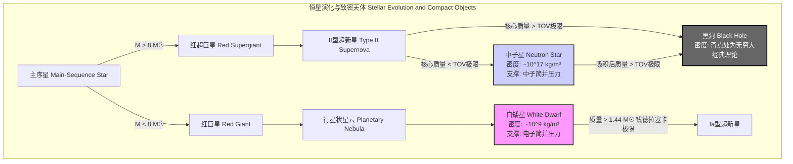
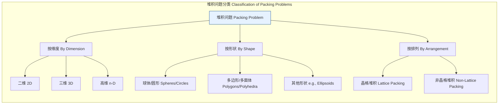

好的，我将根据您的要求，创建一份关于“最大密度”的综合性技术文档。该文档将严格遵循科学和数学的严谨性，所有内容仅基于“最大密度”这一标题进行推演和阐述。

## 最大密度

“最大密度”是一个在不同科学和技术领域中具有特定含义的概念。它并非一个单一的普适数值，而是取决于所讨论的系统、物质状态或数学结构。本技术文档将从物理学、数学、计算机科学和材料科学等多个角度，对最大密度的核心概念、理论极限和实际应用进行深入、严谨的探讨。

### 1. 物理学中的最大密度：物质的终极极限

在物理学中，最大密度探讨的是在自然法则（特别是量子力学和广义相对论）允许的范围内，物质可以被压缩到的极限程度。

#### 1.1 核心概念与数学基础

物质的密度 $\rho$ 定义为质量 $m$ 与其所占体积 $V$ 的比值：
$$ \rho = \frac{m}{V} $$
在宏观尺度下，密度由原子质量和原子间距决定。然而，在极端引力条件下，原子结构会被破坏，物质进入“简并态”。此时，密度由泡利不相容原理主导，该原理阻止了费米子（如电子、中子）占据相同的量子态，从而产生一种抵抗引力坍缩的“简并压力”。

#### 1.2 关键天体物理极限

*   **白矮星与钱德拉塞卡极限 (White Dwarfs and the Chandrasekhar Limit)**
    白矮星是由电子简并压力支撑的恒星遗骸。其最大质量存在一个上限，即钱德拉塞卡极限。超过此极限，电子简并压力将不足以抵抗引力，导致其坍缩。该极限的精确值取决于化学成分，通常约为1.44个太阳质量 ($M_☉$)。白矮星的典型密度约为 $10^9 \text{ kg/m}^3$。

*   **中子星与TOV极限 (Neutron Stars and the TOV Limit)**
    当恒星核心质量超过钱德拉塞卡极限时，会进一步坍缩形成中子星。中子星主要由中子简并压力和核子间的强相互作用力支撑。其最大质量由托尔曼-奥本海默-沃尔科夫（TOV）极限描述。TOV极限的精确值尚不确定，因为它依赖于极端高密度下物质的状态方程（Equation of State, EoS），目前理论和观测给出的范围大约在 $2.0 M_☉$ 到 $2.3 M_☉$ 之间。中子星的密度极高，可达 $10^{17} \text{ kg/m}^3$ 至 $10^{18} \text{ kg/m}^3$，与原子核的密度相当。

    TOV方程描述了在广义相对论框架下，一个静态、球对称的流体（如中子星）的内部结构：
    $$ \frac{dP(r)}{dr} = -\frac{G \left( \rho(r) + \frac{P(r)}{c^2} \right) \left( M(r) + \frac{4\pi r^3 P(r)}{c^2} \right)}{r^2 \left( 1 - \frac{2GM(r)}{c^2 r} \right)} $$
    其中：
    *   $P(r)$: 在半径 $r$ 处的压力。
    *   $\rho(r)$: 在半径 $r$ 处的能量密度（包括静止质量能）。
    *   $M(r)$: 在半径 $r$ 内的总质量。
    *   $G$: 万有引力常数。
    *   $c$: 真空中的光速。
    *   $r$: 到中心的径向距离。

*   **普朗克密度：理论上的终极密度 (Planck Density: The Theoretical Limit)**
    根据现有的物理学理论，物质密度的终极上限是普朗克密度。在这个尺度下，引力变得与量子效应同样重要，广义相对论和量子力学需要被统一的量子引力理论来描述。任何试图将物质压缩到超过普朗克密度的行为，理论上会导致一个黑洞的形成。

    普朗克密度 $\rho_P$ 由基本物理常数定义：
    $$ \rho_P = \frac{m_P}{l_P^3} = \frac{c^5}{\hbar G^2} $$
    其中：
    *   $\rho_P$: 普朗克密度。
    *   $m_P$: 普朗克质量 ($\sqrt{\hbar c / G}$)。
    *   $l_P$: 普朗克长度 ($\sqrt{\hbar G / c^3}$)。
    *   $\hbar$: 约化普朗克常数 ($h/2\pi$)。
    *   $G$: 万有引力常数。
    *   $c$: 真空中的光速。

#### 1.3 技术规格

| 对象/极限 (Object/Limit) | 典型/理论密度 (kg/m³) | 典型/理论密度 (g/cm³) | 备注 (Notes) |
| :--- | :--- | :--- | :--- |
| 白矮星 (White Dwarf) | $\sim 1 \times 10^9$ | $\sim 1 \times 10^6$ | 由电子简并压力支撑 |
| 中子星 (Neutron Star) | $\sim 3 \times 10^{17} - 1 \times 10^{18}$ | $\sim 3 \times 10^{14} - 1 \times 10^{15}$ | 由中子简并压力和强力支撑 |
| 普朗克密度 (Planck Density) | $\approx 5.155 \times 10^{96}$ | $\approx 5.155 \times 10^{93}$ | 物理学理论的密度上限 |

#### 1.4 Mermaid 图表：致密天体的层次结构



### 2. 数学中的最大密度：堆积问题

在数学，特别是几何学领域，“最大密度”通常指在一个给定空间中（如二维平面或三维空间），通过排列一组全等的物体所能达到的最大空间填充率，即堆积密度。

#### 2.1 核心概念

堆积密度 $\Delta$ 定义为所有物体占据的总体积与容器总体积之比：
$$ \Delta = \frac{N \cdot V_{\text{object}}}{V_{\text{container}}} $$
其中：
*   $N$: 堆积物体的数量。
*   $V_{\text{object}}$: 单个物体的体积。
*   $V_{\text{container}}$: 容器的总体积。
对于无限空间中的周期性堆积，该定义通常在极限情况下考虑一个越来越大的容器。

#### 2.2 开普勒猜想与三维球面堆积

这是一个经典的数学问题：在三维欧几里得空间中，堆积全等球体的最大密度是多少？
约翰内斯·开普勒在1611年提出猜想，认为最密的排列方式是面心立方（FCC）和六方密堆积（HCP）结构，这两种排列都能达到相同的最大密度。这个猜想直到2005年才被托马斯·黑尔斯（Thomas Hales）通过计算机辅助证明完全解决。

三维空间中球体的最大堆积密度为：
$$ \Delta_{\text{max}} = \frac{\pi}{\sqrt{18}} \approx 0.74048 $$
这个数值对应于FCC和HCP晶体结构中的原子堆积因子（APF）。

#### 2.3 相关技术与比较

堆积问题不仅限于三维球体，它在不同维度和不同形状上都有研究，并具有重要的理论和实际意义。

| 维度 (Dimension) | 形状 (Shape) | 最大堆积密度 ($\Delta_{\text{max}}$) | 状态 (Status) |
| :--- | :--- | :--- | :--- |
| 2 | 圆形 (Circles) | $\frac{\pi}{\sqrt{12}} \approx 0.9069$ | 已证明 (Lagrange, 1773) |
| 3 | 球体 (Spheres) | $\frac{\pi}{\sqrt{18}} \approx 0.74048$ | 已证明 (Hales, 2005) |
| 8 | 超球体 (Hyperspheres) | $\frac{\pi^4}{384} \approx 0.25367$ | 已证明 (Viazovska, 2016) |
| 24 | 超球体 (Hyperspheres) | $\frac{\pi^{12}}{12!} \approx 0.00193$ | 已证明 (Cohn, Kumar, Miller, Radchenko, Viazovska, 2016) |

高维度的堆积问题在信息论和编码理论中有重要应用，特别是在设计高效的纠错码方面。

#### 2.4 Mermaid 图表：堆积问题的分类



### 3. 计算机科学中的最大密度：图论

在图论中，“最大密度”涉及寻找一个图中“最紧密”连接的部分，即最大密度子图（Densest Subgraph）。

#### 3.1 核心概念与算法

给定一个无向图 $G=(V, E)$，其中 $V$ 是顶点集，$E$ 是边集。一个子图 $S=(V_S, E_S)$ 的密度 $d(S)$ 定义为子图中的边数与顶点数之比：
$$ d(S) = \frac{|E_S|}{|V_S|} $$
其中 $V_S \subseteq V$，$E_S$ 是连接 $V_S$ 中顶点的边的集合。
**最大密度子图问题 (Maximum Density Subgraph Problem)** 的目标是找到一个非空子图 $S \subseteq G$，使得 $d(S)$ 最大化。

#### 3.2 实现考量与算法复杂度

这个问题可以通过一系列参数化的最大流最小割计算来精确求解。
1.  **问题转化**：寻找密度至少为 $g$ 的子图问题可以转化为一个最小割问题。
2.  **网络构建**：构建一个流网络 $N$。创建一个源点 $s$ 和一个汇点 $t$。
    *   对于图 $G$ 中的每个顶点 $u \in V$，在 $N$ 中添加一条从 $s$ 到 $u$ 的边，容量为 $|E|$（或任何足够大的数，例如图的总度数）。
    *   对于图 $G$ 中的每个顶点 $u \in V$，在 $N$ 中添加一条从 $u$ 到 $t$ 的边，容量为 $|E| - \text{deg}(u) + 2g$。
    *   对于图 $G$ 中的每条边 $(u, v) \in E$，在 $N$ 中添加顶点 $e_{uv}$，以及边 $(u, e_{uv})$、$(v, e_{uv})$，容量均为无穷大。同时添加边 $(e_{uv}, t)$，容量为2。
    *   一个更简单的构造（Charikar, 2000）：创建一个源点 $s$ 和汇点 $t$。对于每条边 $(u, v) \in E$，添加一个节点 $e_{uv}$，以及边 $(s, e_{uv})$ 容量为1，边 $(e_{uv}, u)$ 和 $(e_{uv}, v)$ 容量为无穷大。对于每个顶点 $u \in V$，添加边 $(u, t)$ 容量为 $g$。图 $G$ 存在密度为 $g$ 的子图当且仅当该网络中的最大流小于 $|E|$。
3.  **求解**：由于最优密度 $g^*$ 未知，可以通过对 $g$ 进行二分搜索来找到最大密度。在每次迭代中，解决一个最大流问题来判断是否存在密度大于当前 $g$ 的子图。
4.  **算法复杂度**：使用Dinic等高效的最大流算法，整个过程的复杂度通常为 $O(\log(n) \cdot \text{MaxFlow}(n, m))$，其中 $\text{MaxFlow}(n, m)$ 是在 $n$ 个顶点和 $m$ 条边的图上运行最大流算法的复杂度。

#### 3.3 应用案例与性能指标

*   **应用案例**:
    *   **社交网络分析**：识别高度互联的社区或团体。
    *   **生物信息学**：在蛋白质相互作用网络中发现功能模块。
    *   **网络安全**：检测“链接农场”等垃圾邮件网络结构。
    *   **事件检测**：在新闻或推文网络中发现突发事件的核心话题。
*   **性能指标**:
    *   **子图密度 $d(S)$**：衡量所找到社群的“紧密”程度，是主要的质量指标。
    *   **计算时间**：找到最大密度子图所需的时间，是算法效率的指标。

#### 3.4 Mermaid 图表：最大密度子图算法流程

```mermaid
graph TD
    A["输入: 图 G=V, E Input: Graph G"] --> B["对密度 g 进行二分搜索 Binary Search on density g[";
    B --> C["为 g 构建流网络 N Construct Flow Network N for g"];
    C --> D["计算 N 上的最大流/最小割 Compute Max-Flow / Min-Cut on N"];
    D --> E"割的大小是否表明存在密度 > g 的子图? Does cut indicate subgraph with density > g?";
    E -- "是 Yes" --> F["调整 g 的搜索范围 下界 Adjust search range for g lower bound"];
    F --> B;
    E -- "否 No" --> G["调整 g 的搜索范围 上界 Adjust search range for g upper bound"];
    G --> B;
    B -- "搜索收敛 Search Converges" --> H["输出: 最优密度 g* 和对应的子图 S Output: Optimal density g* and subgraph S"];

    style C fill:#cde4ff, stroke:#004080
    style D fill:#cde4ff, stroke:#004080
    style H fill:#d4edda, stroke:#155724
```

### 4. 材料科学中的最大密度

在材料科学中，最大密度指的是在标准温度和压力（STP）下，自然存在或人工合成的材料所能达到的最高密度。这主要由两个因素决定：单个原子的质量和原子在晶体结构中的排列紧密程度。

#### 4.1 核心概念

材料的理论密度可以通过其晶体结构信息计算得出：
$$ \rho = \frac{n \cdot A}{V_C \cdot N_A} $$
其中：
*   $n$: 每个晶胞中的原子数。
*   $A$: 材料的原子量 (g/mol)。
*   $V_C$: 单个晶胞的体积 (cm³)。
*   $N_A$: 阿伏伽德罗常数 ($6.022 \times 10^{23}$ mol⁻¹)。

具有高原子质量和高原子堆积因子（APF）的晶体结构（如面心立方FCC和六方密堆积HCP，APF=0.74）的材料通常密度最高。

#### 4.2 技术规格：地球上最致密的材料

在所有已知元素中，锇（Osmium）和铱（Iridium）是密度最高的。它们的密度非常接近，由于测量和计算的微小不确定性，哪一个“最密”有时会引发讨论，但通常认为锇略胜一筹。

| 元素 (Element) | 符号 (Symbol) | 密度 (g/cm³) | 密度 (kg/m³) | 晶体结构 (Crystal Structure) | 原子量 (g/mol) |
| :--- | :--- | :--- | :--- | :--- | :--- |
| **锇 (Osmium)** | **Os** | **22.59** | **22,590** | HCP | 190.23 |
| **铱 (Iridium)** | **Ir** | **22.56** | **22,560** | FCC | 192.22 |
| 铂 (Platinum) | Pt | 21.45 | 21,450 | FCC | 195.08 |
| 铼 (Rhenium) | Re | 21.02 | 21,020 | HCP | 186.21 |
| 钚 (Plutonium) | Pu | 19.82 | 19,820 | Monoclinic | (244) |
| 金 (Gold) | Au | 19.30 | 19,300 | FCC | 196.97 |
| 钨 (Tungsten) | W | 19.25 | 19,250 | BCC | 183.84 |

### 5. 参考文献

1.  Oppenheimer, J. R., & Volkoff, G. M. (1939). On Massive Neutron Cores. *Physical Review*, 55(4), 374–381. DOI: `10.1103/PhysRev.55.374`
2.  Hales, T. C. (2005). A proof of the Kepler conjecture. *Annals of Mathematics*, 162(3), 1065–1185. DOI: `10.4007/annals.2005.162.1065`
3.  Viazovska, M. S. (2017). The sphere packing problem in dimension 8. *Annals of Mathematics*, 185(3), 991-1015. DOI: `10.4007/annals.2017.185.3.7`
4.  Charikar, M. (2000). Greedy approximation algorithms for finding dense components in a graph. In *Approximation Algorithms for Combinatorial Optimization* (pp. 1-14). Springer. DOI: `10.1007/3-540-44436-X_1` (Note: This is a foundational paper on approximation, the exact algorithm is often attributed to Goldberg's 1984 tech report).