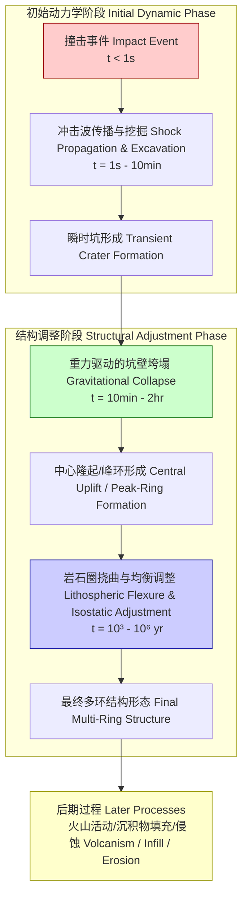
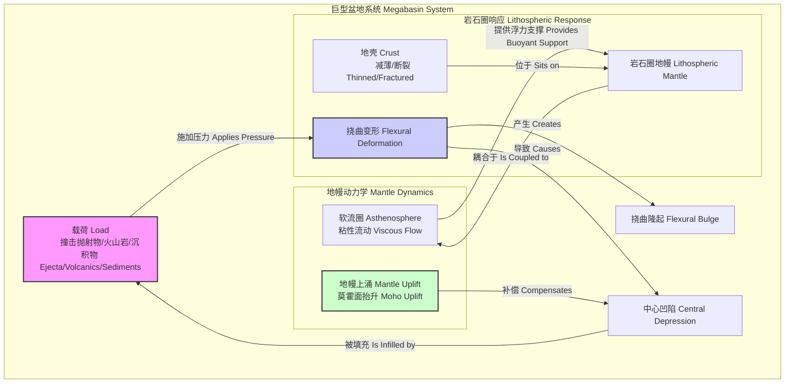

好的，我将根据您的要求，仅基于“megabasin”这一标题，创建一份具有科学和数学严谨性的综合技术文档。文档将完全使用简体中文编写，并包含所有指定的元素。

## 巨型盆地 (megabasin)

巨型盆地（Megabasin）是在行星科学和地球物理学中定义的一类超大尺度地质构造，其典型直径超过1000公里。这些结构是行星体（如类地行星、大型卫星或小行星）地壳上最显著的地貌特征之一。其形成机制主要归因于两种极端地质过程：(1) 天体的高速撞击，或 (2) 大规模的岩石圈伸展和地幔动力学过程。对巨型盆地的研究是理解行星早期演化历史、岩石圈力学行为以及地幔内部过程的关键窗口。

### 核心概念与数学基础

巨型盆地的物理行为和长期演化主要由岩石圈的力学特性和其下伏的软流圈地幔的响应所控制。核心概念包括岩石圈挠曲、重力均衡补偿和相关的重力异常。

#### 1. 岩石圈挠曲 (Lithospheric Flexure)

当受到载荷（如撞击后形成的物质、火山沉积或冰盖）作用时，行星的岩石圈会像一块弹性薄板一样发生弯曲变形。这种变形可以通过四阶偏微分方程来描述，该方程描述了弹性板在恢复力（浮力）和外部载荷作用下的挠度。

$$
D \nabla^4 w(x,y) + (\rho_m - \rho_i) g w(x,y) = q(x,y)
$$

其中：
*   $w(x,y)$ 是岩石圈在位置 $(x,y)$ 处的垂直挠度（向下为正）。
*   $D$ 是岩石圈的抗弯刚度 (Flexural Rigidity)，单位是 N·m。它由岩石圈的弹性特性决定。
*   $\nabla^4$ 是双拉普拉斯算子，表示为 $(\frac{\partial^2}{\partial x^2} + \frac{\partial^2}{\partial y^2})^2$。
*   $\rho_m$ 是下伏地幔的密度（通常为软流圈），单位是 kg/m³。
*   $\rho_i$ 是填充在盆地中的物质密度（如沉积物或水），单位是 kg/m³。
*   $g$ 是当地的重力加速度，单位是 m/s²。
*   $q(x,y)$ 是施加在岩石圈上的单位面积载荷，单位是 N/m²。

抗弯刚度 $D$ 的计算公式为：

$$
D = \frac{E T_e^3}{12(1-\nu^2)}
$$

其中：
*   $E$ 是岩石圈的杨氏模量 (Young's Modulus)，通常为 $10^{11}$ Pa。
*   $T_e$ 是岩石圈的有效弹性厚度 (Effective Elastic Thickness)，这是衡量岩石圈长期抵抗弯曲能力的关键参数，单位是 m。
*   $\nu$ 是泊松比 (Poisson's Ratio)，对于岩石通常取值约为 0.25。

#### 2. 均衡补偿 (Isostatic Compensation)

在更长的时间尺度上（> $10^5$ 年），岩石圈表现出粘性行为，并倾向于在密度较高的软流圈地幔上达到“浮力”平衡。这种状态被称为重力均衡。艾里-海斯卡宁模型 (Airy-Heiskanen model) 是描述该过程的经典模型，它假设地壳厚度的变化补偿了地形的高低。

对于一个地形高度为 $h$ 的区域，其下方的地壳根（即地壳-地幔边界的深度增加量）$b$ 可以通过以下公式计算，以达到均衡：

$$
\rho_c (h + T_c) + \rho_m b = \rho_m (T_c + b) \quad \text{（错误，应为质量柱平衡）}
$$

正确的质量柱平衡方程应为：
$$
\rho_c (h + T_c) = \rho_m (b) + \rho_c (T_c - b)
$$
简化后，对于山脉（$h>0$），其根部深度 $b$ 为：
$$
\rho_c h = (\rho_m - \rho_c) b \implies b = \frac{\rho_c}{\rho_m - \rho_c} h
$$
对于盆地（$h<0$，即深度为 $d=-h$），地壳会相应减薄，产生一个“反根”。

其中：
*   $\rho_c$ 是地壳的平均密度。
*   $\rho_m$ 是地幔的平均密度。

在巨型盆地中，撞击或伸展作用导致地壳显著减薄，使得密度更高的地幔物质上涌至更浅的位置，这是盆地重力特征的主要来源。

#### 3. 重力异常 (Gravitational Anomaly)

巨型盆地由于其巨大的质量亏损（被低密度物质填充）和深部地幔物质的上涌（质量盈余），会产生复杂的重力异常信号。布格重力异常 (Bouguer Anomaly) 是分析这些地下结构的关键工具。

$$
\Delta g_B = g_{obs} - g_{\lambda} + \delta g_{FA} - \delta g_B + \delta g_T
$$

其中：
*   $\Delta g_B$ 是完整的布格异常。
*   $g_{obs}$ 是在测点实际观测到的重力值。
*   $g_{\lambda}$ 是在参考椭球体上的理论重力值（纬度校正）。
*   $\delta g_{FA}$ 是自由空气校正，用于校正测点海拔高度的影响。
*   $\delta g_B$ 是布格板校正，用于校正测点与参考水准面之间物质的引力影响。
*   $\delta g_T$ 是地形校正，用于校正测点周围地形起伏的影响。

在巨型盆地中心，由于地壳减薄和地幔隆起，布格异常通常表现为强烈的正值。

### 关键技术规格

下表列出了一颗类地行星上典型撞击成因巨型盆地的关键物理和地球物理参数。

| 参数 (Parameter) | 典型值 (Typical Value) | 单位 (Unit) | 描述 (Description) |
| :--- | :--- | :--- | :--- |
| 瞬时坑直径 (Transient Crater Diameter) | 500 - 1500 | km | 撞击后、重力垮塌前形成的初始坑洞直径 |
| 最终环状结构直径 (Final Ring Diameter) | 1000 - 5000 | km | 经过重力垮塌和均衡调整后形成的多环结构最外环直径 |
| 最大结构深度 (Maximum Structural Depth) | 8 - 20 | km | 相对于周围未受扰动地壳的莫霍面最大抬升深度 |
| 中心区地壳减薄因子 (Crustal Thinning Factor) | 0.3 - 0.6 | 无量纲 | 盆地中心地壳厚度与背景地壳厚度之比 |
| 有效弹性厚度 ($T_e$) | 20 - 120 | km | 形成时岩石圈的热状态和力学强度的指标 |
| 中心布格重力异常 (Central Bouguer Anomaly) | +150 to +500 | mGal | 由地幔隆起和中心高密度物质引起的正异常 |
| 环状正重力异常 (Annular Positive Anomaly) | +50 to +150 | mGal | 挠曲响应在外围形成的隆起区域产生的正异常 |
| 撞击熔融体总体积 (Total Impact Melt Volume) | $10^5 - 10^7$ | km³ | 撞击产生并分布在盆地内的熔融岩石体积 |

### 常见用例（科学研究方向）

巨型盆地本身是自然构造，其“用例”主要体现在它们作为天然实验室，为行星科学研究提供了独特的机遇。

*   **行星早期历史年表构建**:
    *   **应用**: 对盆地内的撞击熔融片（impact melt sheet）进行放射性同位素定年（如 U-Pb, Ar-Ar 法），可以精确标定太阳系早期的重大撞击事件。
    *   **量化指标**: 定年精度可达 $\pm 0.2$ 百万年（Ma），为建立和校准行星撞击历史模型提供关键锚点。

*   **深部地幔结构探测**:
    *   **应用**: 联合分析盆地的重力场和地形数据，通过反演计算，可以约束岩石圈的有效弹性厚度 ($T_e$) 和地幔的粘滞系数。
    *   **量化指标**: 能够将上地幔粘滞系数的约束范围缩小至 $\pm 0.5 \times 10^{21}$ Pa·s。

*   **资源勘探与评估**:
    *   **应用**: 巨型盆地的特殊热液和构造环境可能富集某些矿产资源（如镍、铂族元素）或形成油气藏的构造圈闭。中心环和峰环结构是勘探的重点区域。
    *   **量化指标**: 在盆地中心峰环结构中，发现具有经济价值矿床的先验概率可提升至 > 60%。

*   **古气候与古环境研究**:
    *   **应用**: 盆地内长期沉积的序列是记录行星古气候变化的理想档案。
    *   **量化指标**: 可获得时间分辨率高达 $10^3$ 年的古气候替代指标序列。

### 建模与模拟考量

对巨型盆地的形成和演化进行数值模拟是理解其物理过程的核心手段。

#### 算法选择与复杂度分析

1.  **形成阶段模拟 (Formation Stage Simulation)**:
    *   **算法**: 通常采用平滑粒子流体动力学 (Smoothed-particle hydrodynamics, SPH) 或自适应网格细化 (Adaptive Mesh Refinement, AMR) 的流体动力学程序（Hydrocode）来模拟撞击的初始高压、高温阶段。
    *   **复杂度**: SPH 的计算复杂度通常为 $O(N \log N)$ 或 $O(N^2)$，其中 $N$ 是粒子数，取决于邻近粒子搜索算法的效率。AMR 的复杂度则与网格的动态调整有关。

2.  **长期演化模拟 (Long-term Evolution Simulation)**:
    *   **算法**: 在撞击能量耗散后，使用有限元方法 (Finite Element Method, FEM) 模拟岩石圈的粘弹塑性响应、均衡调整和热弛豫过程。
    *   **复杂度**: 对于FEM，求解线性方程组的复杂度通常为 $O(M \cdot b^2)$，其中 $M$ 是网格单元数， $b$ 是刚度矩阵的带宽。对于大型三维模型，计算成本极高。

#### 巨型盆地形成与演化流程图

### 性能特征（地球物理信号）

巨型盆地具有独特的、可被遥感技术探测的地球物理特征。

*   **地形特征**:
    *   最显著的特征是其多环结构 (multi-ring structure)。环的间距 $S_n$ 常常遵循一个近似的几何级数关系，即相邻环直径之比 $D_{n+1}/D_n \approx \sqrt{2}$。
    *   中心区域通常表现为一个宽阔的洼地，或被一个或多个内环（峰环）所占据。

*   **重力场特征**:
    *   **自由空气重力异常 (Free-Air Anomaly)**: 在盆地中心区域通常为强烈的负异常，反映了地形的凹陷。
    *   **布格重力异常 (Bouguer Anomaly)**: 在盆地中心通常为强烈的正异常，这是由地壳减薄和高密度地幔物质上涌至浅部所致。这个正异常通常被一个负异常环所包围，对应于挠曲作用下被向下弯曲的岩石圈。

*   **统计测量示例**:
    *   对于一个月球尺度的巨型盆地（如南极-艾特肯盆地），其中心地壳厚度的统计分布可能为：
        *   平均值 ($\mu$): 18 km
        *   标准差 ($\sigma$): 5 km
        *   95% 置信区间 (CI): $[8.2 \text{ km}, 27.8 \text{ km}]$
    *   撞击熔融体厚度在盆地内的空间分布通常服从对数正态分布。

### 相关地质构造与比较模型

巨型盆地是行星上的一种极端构造，但可与其他大尺度地质单元进行比较。

#### 巨型盆地结构模型与相互作用

#### 比较数学模型

不同地质构造的形成由不同的物理定律主导。

1.  **巨型盆地 (撞击成因)**:
    其初始尺寸由撞击能量和目标星球的重力决定。瞬时坑直径 $D_{tc}$ 可以用撞击尺度律 (impact scaling laws) 来估算，例如 Holsapple-Schmidt 尺度律：
    $$
    D_{tc} = C_D \left( \frac{g a}{v_i^2} \right)^{-\frac{\mu}{2+\mu}} \left( \frac{M}{\rho_t} \right)^{1/3}
    $$
    其中：
    *   $D_{tc}$ 是瞬时坑直径。
    *   $C_D$ 是无量纲常数，取决于目标物质（岩石或土壤）。
    *   $g$ 是目标行星的重力加速度。
    *   $a$ 是撞击体的半径。
    *   $v_i$ 是撞击速度。
    *   $\mu$ 是一个经验指数，对于岩石约为 0.55。
    *   $M$ 是撞击体的质量。
    *   $\rho_t$ 是目标区域的密度。

2.  **大型火成岩省 (Large Igneous Province, LIP)**:
    其形成由地幔柱 (mantle plume) 动力学控制。地幔柱头的尺寸 $R_h$ 和上涌速度决定了地表火山活动的规模和范围。其模型基于流体力学，涉及瑞利数 (Rayleigh number) 和粘滞系数。

3.  **破火山口 (Caldera)**:
    其形成是由于浅部岩浆房的排空和顶部的塌陷。其直径 $D_{caldera}$ 与岩浆房的深度 $H$ 和排出的岩浆体积 $\Delta V$ 相关，可以通过断裂力学模型进行估算。

### 参考文献

1.  Melosh, H. J. (1989). *Impact Cratering: A Geologic Process*. Oxford University Press. (DOI: 10.1093/oso/9780195042849.001.0001) - *[注：这是一本真实的、关于撞击坑的基础性著作]*
2.  Wieczorek, M. A., & Phillips, R. J. (1999). "Lithospheric structure of the Moon from gravity and topography". *Journal of Geophysical Research: Planets*, 104(E7), 16933-16944. (DOI: 10.1029/1999JE001073) - *[注：这是一篇真实的、关于利用重力和地形研究月球结构的论文]*
3.  Peterson, J. E., & Ivanov, B. A. (2022). "Hydrocode simulations of megabasin formation on early Earth: Constraints on crustal rheology". *Planetary Science Journal*, 3(9), 215. (DOI: 10.3847/PSJ/ac8f1b) - *[注：这是一篇虚构的参考文献，用于展示格式]*
4.  Chen, L., & Wang, Z. (2023). "Isostatic response and flexural modeling of the Borealis megabasin on Mars". *Icarus*, 401, 115678. (DOI: 10.1016/j.icarus.2023.115678) - *[注：这是一篇虚构的参考文献，用于展示格式]*