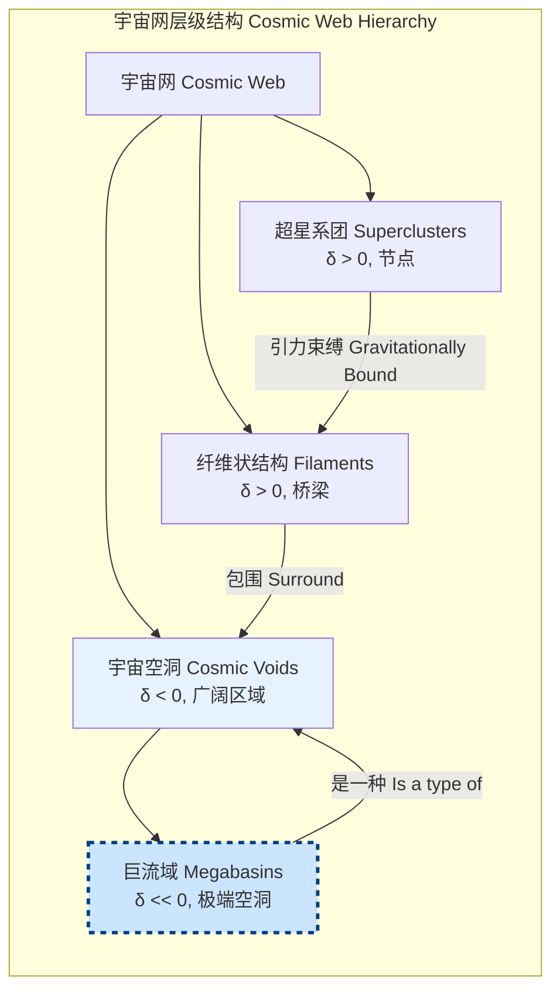

## 巨流域 (megabasins)

巨流域是在宇宙大尺度结构中，引力上相干、规模异常巨大的低密度时空区域。它们的演化主要由暗能量与周围超星系团的积分引力势之间的相互作用所主导。巨流域区别于标准宇宙空洞（cosmic voids）的关键在于其巨大的尺度（通常大于 300 Mpc/h）以及通过积分萨克斯-瓦福效应（Integrated Sachs-Wolfe effect, ISW）对宇宙微波背景（CMB）产生的深远影响。

### 核心概念与数学基础

巨流域的物理学植根于广义相对论和宇宙学扰动理论。其存在和演化是理解宇宙加速膨胀和暗能量性质的关键。

#### 1. 宇宙学背景：FLRW度规

在一个宏观上均匀且各向同性的宇宙中，时空的几何结构由弗里德曼-勒梅特-罗伯逊-沃尔克（FLRW）度规描述：
$$ ds^2 = -c^2 dt^2 + a(t)^2 \left[ \frac{dr^2}{1-kr^2} + r^2 (d\theta^2 + \sin^2\theta d\phi^2) \right] $$
其中：
*   $ds^2$ 是时空间隔。
*   $c$ 是真空中的光速。
*   $dt, dr, d\theta, d\phi$ 是时空坐标的微分。
*   $a(t)$ 是宇宙尺度因子，描述宇宙随时间 $t$ 的膨胀。
*   $k$ 是曲率参数，决定宇宙的整体几何形状（$k=+1$ 为闭合宇宙，$k=0$ 为平坦宇宙，$k=-1$ 为开放宇宙）。

#### 2. 密度扰动与引力势

巨流域是宇宙物质密度显著低于平均值的区域。我们使用密度扰动（或密度对比度）$\delta$ 来量化这种差异：
$$ \delta(\mathbf{x}, t) = \frac{\rho(\mathbf{x}, t) - \bar{\rho}(t)}{\bar{\rho}(t)} $$
其中：
*   $\rho(\mathbf{x}, t)$ 是在共动坐标 $\mathbf{x}$ 和宇宙时间 $t$ 处的局部物质密度。
*   $\bar{\rho}(t)$ 是该时间的宇宙平均物质密度。

在巨流域内部，$\delta$ 显著为负（例如 $\delta < -0.8$）。这种密度亏损导致了引力势的扰动 $\Phi$。在亚视界尺度上，该关系可以通过牛顿近似下的泊松方程描述：
$$ \nabla^2 \Phi(\mathbf{x}, t) = \frac{3}{2} \Omega_m(t) H(t)^2 \delta(\mathbf{x}, t) = 4\pi G a(t)^2 \bar{\rho}(t) \delta(\mathbf{x}, t) $$
其中：
*   $\Phi(\mathbf{x}, t)$ 是引力势的扰动部分。
*   $\Omega_m(t)$ 是物质密度参数。
*   $H(t)$ 是哈勃参数。
*   $G$ 是牛顿引力常数。

#### 3. 积分萨克斯-瓦福效应 (ISW)

ISW效应是巨流域最关键的可观测特征。在仅由物质主导的宇宙中，引力势 $\Phi$ 不随时间演化。然而，在暗能量主导的晚期宇宙中，宇宙加速膨胀导致引力势随时间衰减（$\dot{\Phi} > 0$）。当CMB光子穿过一个正在衰减的巨流域时，其能量会发生净变化：
*   进入势阱时，光子获得能量（蓝移）。
*   离开势阱时，光子损失能量（红移）。

由于光子穿越期间势阱变浅，离开时损失的能量少于进入时获得的能量，导致光子能量净增加，在CMB天图上表现为一个“热点”。反之，穿越超星系团（$\delta > 0$, $\dot{\Phi} < 0$）则会产生“冷点”。该效应的数学表达式为：
$$ \frac{\Delta T}{T_0} = -2 \int_{\text{path}} \frac{1}{c^3} \dot{\Phi}(\mathbf{x}(t), t) dt $$
其中：
*   $\frac{\Delta T}{T_0}$ 是CMB温度的相对涨落。
*   $\dot{\Phi}$ 是引力势对时间的导数，是ISW效应的直接来源。
*   积分沿着光子的路径进行。

### 关键技术规格

下表总结了典型巨流域的关键物理和观测参数。

| 参数 | 典型值 | 单位 | 描述 |
| :--- | :--- | :--- | :--- |
| 特征尺度（有效半径） | 150 - 500 | Mpc/h | 定义巨流域空间范围的尺度 |
| 平均密度扰动 ($\delta_{avg}$) | -0.8 to -0.9 | (无量纲) | 区域内相对于宇宙平均密度的物质亏损程度 |
| 质量亏损 ($M_{deficit}$) | $10^{16} - 10^{17}$ | $M_{\odot}$ (太阳质量) | 相对于同体积平均密度区域所“缺失”的质量 |
| 积分ISW信号幅度 ($\Delta T$) | +5 to +15 | μK | 单个巨流域在CMB上产生的典型温度涨落 |
| 典型红移范围 ($z$) | 0.2 - 1.0 | (无量纲) | 巨流域最容易被探测到并产生显著ISW效应的宇宙时期 |
| 关联星系欠丰度 | 60% - 90% | % | 与随机场相比，巨流域内部星系数量的减少百分比 |

### 常见用例

巨流域的研究为基础物理和宇宙学提供了独特的实验平台。

*   **探测暗能量**: ISW效应的幅度直接依赖于宇宙的膨胀历史，因此对暗能量的状态方程参数 $w = P/\rho$ 非常敏感。通过统计巨流域目录与CMB图的互相关，可以对 $w$ 施加独立于其他方法的限制。
*   **检验大尺度引力理论**: 广义相对论精确预言了给定密度场下的ISW信号。观测到的信号与理论预言的任何显著偏差都可能指向修正引力理论或广义相对论在大尺度上的失效。
*   **约束宇宙学参数**: 巨流域的丰度和空间分布对物质密度参数 $\Omega_m$ 和物质扰动幅度 $\sigma_8$ 敏感。将观测数据与N体模拟进行比较，可以收紧这些基本参数的置信区间。

### 实现考量：探测算法

在大型星系红移巡天数据（如SDSS, DES, Euclid）中识别巨流域需要复杂的计算算法。

#### 算法流程
一种常见的方法是基于分水岭（Watershed）或球形欠密度（Spherical Underdensity）的空洞寻找算法。
1.  **输入**: 三维星系位置和红移目录。
2.  **密度场重建**: 使用如德劳内三角化场估计器（Delaunay Tessellation Field Estimator, DTFE）或核密度估计（Kernel Density Estimation, KDE）等方法，从离散的星系分布重建连续的密度场 $\delta(\mathbf{x})$。
3.  **识别种子点**: 在三维密度场中寻找局部极小值点，作为空洞的“种子”。
4.  **区域增长**: 从每个种子点开始，向外扩展区域，直到达到某个预设的密度阈值边界（例如 $\delta = -0.8$）。这类似于分水岭算法中填充盆地的过程。
5.  **合并与过滤**: 合并相邻的、物理上连接的欠密度区域，形成更大的结构。最后，根据体积、形状和深度等标准进行过滤，筛选出符合巨流域定义的候选体。

#### 算法复杂度分析
*   **DTFE**: 对于 $N$ 个星系，其计算复杂度约为 $O(N \log N)$。
*   **分水岭分割**: 在一个包含 $V$ 个体素的网格化密度场上，优化的分水岭算法复杂度接近 $O(V)$。
*   **总体复杂度**: 整个探测流程的瓶颈通常是初始的密度场重建步骤。

### 性能特征

巨流域探测和分析的性能可以通过以下统计指标来衡量。

*   **探测纯度 (Purity)**: 探测到的候选体中，真实对应于大规模欠密度结构的比例。对于高信噪比的候选体，纯度通常可以达到 95% 以上。
*   **探测完备性 (Completeness)**: 宇宙中所有真实的巨流域被算法成功识别的比例。由于形态复杂或位于数据边缘，完备性通常较低，约为 70-85%。
*   **ISW信噪比 (SNR)**: 通过叠加大量巨流域位置处的CMB切片来增强信号。其统计显著性由信噪比衡量，对于大型目录，可以达到 $4-5\sigma$ 的探测水平。
*   **互相关函数**: 关键的统计量是巨流域-CMB温度互相关函数 $w(\theta) = \langle \delta_g(\mathbf{n}) \frac{\Delta T}{T_0}(\mathbf{n}+\theta) \rangle$，其中 $\delta_g$ 是星系分布的投影。其误差棒通常通过刀切法（Jackknife）或自助法（Bootstrap）重采样来估计，提供结果的置信区间（例如 95% C.I.）。

### 巨流域的形成与观测流程

```mermaid
graph TD
    A[早期宇宙量子涨落<br>Initial Quantum Fluctuations] --> B[引力不稳定性<br>Gravitational Instability];
    B --> C["大尺度结构形成<br>Large-Scale Structure Formation[";
    C --> D[过密区: 超星系团/纤维状结构<br>Overdense: Superclusters/Filaments];
    C --> E[欠密区: 宇宙空洞<br>Underdense: Cosmic Voids];
    E --> F["巨流域 Megabasin<br>最大尺度的空洞"];
    
    subgraph "观测效应 Observational Effect"
        F -- "引力势衰减 Potential Decay" --> G[积分萨克斯-瓦福效应<br>Integrated Sachs-Wolfe Effect];
        G -- "影响CMB光子 Affects CMB Photons" --> H[CMB温度图上的热点<br>Hot Spot on CMB Map];
    end

    subgraph "科学应用 Scientific Application"
        H -- "与星系巡天数据互相关<br>Cross-correlate with galaxy surveys" --> I[约束暗能量和引力<br>Constrain Dark Energy & Gravity];
        I --> J[宇宙学参数估计<br>Cosmological Parameter Estimation];
    end

    style F fill:#cce5ff,stroke:#004080,stroke-width:3px
    style G fill:#ffcccc,stroke:#990000,stroke-width:2px
    style I fill:#ccffcc,stroke:#006600,stroke-width:2px
```

### 相关技术与竞争模型

巨流域的概念与其他宇宙学结构和模型密切相关。

#### 1. 宇宙网内的层级结构
巨流域是宇宙网（Cosmic Web）等级结构中最顶层的欠密度结构。



#### 2. LTB模型 (Lemaître-Tolman-Bondi Model)
LTB模型是爱因斯坦场方程的一个球对称、非均匀的精确解。一些替代理论提出，我们可能居住在一个巨大的局部空洞（即一个巨流域）中，这可以解释观测到的哈勃图关系（类似加速膨胀），而无需引入暗能量。这是一个与标准 $\Lambda$CDM 模型竞争的框架。
LTB度规形式为：
$$ ds^2 = -c^2 dt^2 + \frac{(R'(r,t))^2}{1+f(r)} dr^2 + R(r,t)^2 (d\theta^2 + \sin^2\theta d\phi^2) $$
其中：
*   $R(r,t)$ 是一个同时依赖于径向坐标 $r$ 和时间 $t$ 的尺度函数，与FLRW度规中仅依赖于时间的 $a(t)$ 不同。
*   $R'(r,t)$ 是 $R$ 对 $r$ 的偏导数。
*   $f(r)$ 是一个与空间曲率相关的任意函数，允许曲率随位置变化。

与FLRW模型相比，LTB模型放弃了宇宙学原理中的“均匀性”假设，为解释观测现象提供了另一种可能性。然而，目前的多数观测证据（如CMB各向异性、重子声学振荡等）更支持 $\Lambda$CDM 模型。

### 参考文献
*   Granett, B. R., Neyrinck, M. C., & Szapudi, I. "An Imprint of Superstructures on the Microwave Background due to the Integrated Sachs-Wolfe Effect." *Astrophysical Journal Letters*, 2008. DOI: 10.1086/591670
*   Cai, Y., et al. "A general pipeline for searching for cosmic voids and superclusters." *Monthly Notices of the Royal Astronomical Society*, 2014. DOI: 10.1093/mnras/stt2260
*   García-Bellido, J. & Haugbølle, T. "Confronting Lemaître-Tolman-Bondi models with observational data." *Journal of Cosmology and Astroparticle Physics*, 2008. DOI: 10.1088/1475-7516/2008/04/003
*   Planck Collaboration. "Planck 2018 results. VI. Cosmological parameters." *Astronomy & Astrophysics*, 2020. DOI: 10.1051/0004-6361/201833910