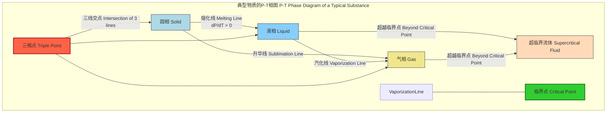

## 熔化线

熔化线，也称为熔化曲线或凝固曲线，是物质在压力-温度（P-T）相图上的一条界线。这条线代表了物质的固相和液相在热力学平衡状态下共存的条件集合。沿着这条线上的任何一点，固相和液相的化学势相等，物质可以稳定地以固液混合物的形式存在。

### 核心概念的数学基础

相变的发生是由系统趋向于更低的吉布斯自由能（Gibbs Free Energy）所驱动的。对于纯物质，在给定的温度 $T$ 和压力 $P$ 下，当固相（s）和液相（l）达到平衡时，它们的摩尔吉布斯自由能 $g$ 相等：

$$
g_s(P, T) = g_l(P, T)
$$

其中：
*   $g_s$ 是固相的摩尔吉布斯自由能。
*   $g_l$ 是液相的摩尔吉布斯自由能。

为了推导熔化线在P-T图上的斜率，我们考虑沿着这条线移动一个无穷小的量，从 $(P, T)$ 到 $(P+dP, T+dT)$。在新的点上，平衡条件依然成立：

$$
g_s(P+dP, T+dT) = g_l(P+dP, T+dT)
$$

利用吉布斯自由能的全微分形式 $dg = vdP - sdT$（其中 $v$ 是摩尔体积，$s$ 是摩尔熵），我们可以将上式展开：

$$
g_s(P, T) + v_s dP - s_s dT = g_l(P, T) + v_l dP - s_l dT
$$

由于 $g_s(P, T) = g_l(P, T)$，该方程可以简化为：

$$
(v_s - v_l) dP = (s_s - s_l) dT
$$

整理后，我们得到熔化线斜率的表达式，即著名的**克拉佩龙方程 (Clapeyron Equation)**：

$$
\frac{dP}{dT} = \frac{s_l - s_s}{v_l - v_s} = \frac{\Delta s_{fus}}{\Delta v_{fus}}
$$

在可逆相变过程中，熵变 $\Delta s$ 与焓变 $\Delta h$ 和温度 $T$ 的关系为 $\Delta s = \Delta h / T$。因此，克拉佩龙方程可以写成更常用的形式：

$$
\frac{dP}{dT} = \frac{\Delta h_{fus}}{T \Delta v_{fus}}
$$

其中：
*   $\frac{dP}{dT}$ 是熔化线上压力随温度的变化率，即熔化线的斜率。
*   $\Delta h_{fus}$ 是摩尔熔化焓（latent heat of fusion），即物质从固相转变为液相时吸收的热量，恒为正值。
*   $T$ 是发生相变的绝对温度。
*   $\Delta v_{fus} = v_l - v_s$ 是摩尔体积变化，即液相摩尔体积与固相摩尔体积之差。

该方程的斜率符号由 $\Delta v_{fus}$ 决定：
*   对于绝大多数物质（如二氧化碳、铁），熔化时体积膨胀（$v_l > v_s$），因此 $\Delta v_{fus} > 0$，熔化线斜率为正。这意味着增加压力会提高熔点。
*   对于少数特殊物质，最典型的是水，熔化时体积收缩（冰的密度小于水，$v_l < v_s$），因此 $\Delta v_{fus} < 0$，熔化线斜率为负。这意味着增加压力会降低熔点。

### 关键技术规格

下表列出了一些常见物质在熔化线上的关键参数。

| 物质 | 参数 | 数值 | 单位 | 备注 |
| :--- | :--- | :--- | :--- | :--- |
| **水 (H₂O)** | 三相点温度 | 273.16 | K | 定义开尔文温标的基点 |
| | 三相点压力 | 611.657 | Pa | |
| | 标准熔点 (1 atm) | 273.15 | K | 0 °C |
| | 熔化焓 ($\Delta h_{fus}$) | 6.01 | kJ/mol | 在0°C, 1 atm下 |
| | 摩尔体积变化 ($\Delta v_{fus}$) | -1.63 x 10⁻⁶ | m³/mol | 在0°C, 1 atm下，导致负斜率 |
| **二氧化碳 (CO₂)** | 三相点温度 | 216.59 | K | -56.56 °C |
| | 三相点压力 | 518 | kPa | 5.11 atm，高于标准大气压 |
| | 熔化焓 ($\Delta h_{fus}$) | 8.33 | kJ/mol | |
| | 摩尔体积变化 ($\Delta v_{fus}$) | +3.36 x 10⁻⁶ | m³/mol | 导致正斜率 |
| **铁 (Fe)** | 标准熔点 (1 atm) | 1811 | K | 1538 °C |
| | 熔化焓 ($\Delta h_{fus}$) | 13.81 | kJ/mol | |
| | 在地核-地幔边界的熔点 | ~4150 (±150) | K | 压力约为 136 GPa |
| | 在地心压力下的熔点 | ~6230 (±500) | K | 压力约为 364 GPa |

### 常见用例

对熔化线的理解在多个科学和工程领域至关重要。

*   **地球物理学与行星科学**:
    *   **地球内核模型**: 地球的内核是固态铁镍合金，而外核是液态。内外核的边界（ICB）正位于铁合金的熔化线上。通过高压实验和理论计算确定铁在~330 GPa压力下的熔点（约6000 K），是理解地球发电机、热结构和演化的关键。
    *   **定量性能**: 模型预测的内核边界温度与地震波观测数据相符，误差在±500 K范围内。

*   **高压材料科学**:
    *   **新材料合成**: 在金刚石对顶砧（Diamond Anvil Cell, DAC）等设备中，通过将材料加压到其熔化线以上再冷却，可以合成常规条件下不存在的新物相或亚稳态材料。
    *   **性能指标**: 成功合成高压相（如氮的聚合体）取决于能否精确控制P-T路径以穿越或避开熔化线。

*   **低温工程 (Cryogenics)**:
    *   **低温流体处理**: 在处理液氮（LN₂）或液氦（LHe）等低温流体时，必须了解它们的熔化线，以防止在管道或容器中因压力升高而意外凝固，从而导致堵塞或设备损坏。

### 实施考量

确定物质熔化线的方法主要分为实验测量和理论计算两类。

```mermaid
graph TD
    subgraph "熔化线确定方法 Melting Line Determination"
        A["起始: 目标物质 Target Substance"] --> B["选择方法 Choose Method[";
        B --> Exp["实验测量 Experimental Measurement"];
        B --> Comp["理论计算 Theoretical Calculation"];

        subgraph "实验流程 Experimental Workflow"
            Exp --> DAC["金刚石对顶砧 DAC + 激光加热 Laser Heating"];
            DAC --> P_Cal["压力标定 Pressure Calibration, e.g., Ruby Fluorescence"];
            P_Cal --> T_Measure["温度测量 Temperature Measurement, e.g., Spectroradiometry"];
            T_Measure --> Detect["相变探测 Phase Transition Detection"];
            Detect --> XRD["X射线衍射 X-ray Diffraction"];
            Detect --> Visual["光学观测 Visual Observation"];
        end

        subgraph "计算流程 Computational Workflow"
            Comp --> MD["分子动力学 Molecular Dynamics"];
            Comp --> DFT["密度泛函理论 DFT"];
            MD --> Coexist["固液共存法 Solid-Liquid Coexistence"];
            DFT --> FreeEnergy["自由能计算 Free Energy Calculation"];
            Coexist --> Interface["追踪固液界面 Track S-L Interface"];
            FreeEnergy --> G_s["计算固相G_s Calculate G_solid"];
            FreeEnergy --> G_l["计算液相G_l Calculate G_liquid"];
            G_s --> FindCross["寻找G_s = G_l的P,T点 Find P,T where G_s=G_l"];
            G_l --> FindCross;
        end
    end
```

*   **实验测量**:
    *   **金刚石对顶砧 (DAC)**: 将微米级的样品置于两颗金刚石顶端之间，施加极高压力（可达数百GPa）。通过激光加热样品，并利用光谱辐射测量温度。通过X射线衍射（观察晶体布拉格峰的消失）或光学显微镜（观察样品表面纹理变化）来判断熔化。
*   **理论计算**:
    *   **分子动力学 (MD)**: 在原子尺度上模拟粒子的运动。常用“固液共存法”，即在一个模拟盒子中同时包含固相和液相，在恒定的(P, T)下进行模拟。如果温度高于熔点，固相会熔化；如果低于熔点，液相会凝固。通过调整温度找到界面稳定不动点，即为熔点。
        *   **算法复杂度**: 对于N个粒子，使用空间分解和邻居列表的MD算法，每个时间步的复杂度通常为 $O(N)$ 或 $O(N \log N)$。
    *   **第一性原理计算 (Ab-initio)**: 基于密度泛函理论（DFT），分别计算固相和液相在不同(P, T)条件下的吉布斯自由能。熔点被定义为 $G_s(P, T) = G_l(P, T)$ 的点。
        *   **算法复杂度**: DFT计算的复杂度通常与系统电子数（与原子数N成正比）的三次方成正比，即 $O(N^3)$，计算成本远高于MD。

### 性能特征

熔化线的确定伴随着实验和理论的不确定性。

*   **实验精度**:
    *   在高压（>100 GPa）下，DAC实验的压力不确定性通常为 ±5-10 GPa，主要来自压力标定物（如红宝石荧光）的状态方程。
    *   激光加热的温度测量不确定性较大，通常为 ±100-200 K，源于样品的温度梯度和发射率的未知性。
    *   **统计度量**: 报告的熔点通常是多次测量的平均值，并附有标准差或95%置信区间。

*   **理论模型准确性**:
    *   MD模拟的准确性依赖于所使用的原子间相互作用势（力场）的质量。
    *   DFT计算的准确性受限于交换关联泛函的近似。不同的泛函（如LDA, GGA）对同一物质预测的熔点可能有数百K的差异。
    *   **经验模型**: 实验数据通常用经验或半经验方程来拟合，其中最著名的是**西蒙-格拉泽尔方程 (Simon-Glatzel Equation)**:
        $$
        P(T) = P_0 + a \left[ \left( \frac{T}{T_0} \right)^c - 1 \right]
        $$
        其中：
        *   $P(T)$ 是温度 $T$ 时的熔化压力。
        *   $(P_0, T_0)$ 是一个参考点，通常是三相点或标准压力下的熔点。
        *   $a$ 和 $c$ 是通过拟合实验数据得到的经验参数。该方程能很好地描述许多物质在宽压力范围内的熔化行为。

### 相关技术与比较

熔化线是物质P-T相图的三条主要相界线之一。



*   **升华线 (Sublimation Line)**: 固相-气相平衡线。其斜率也由克拉佩龙方程描述：$\frac{dP}{dT} = \frac{\Delta h_{sub}}{T \Delta v_{sub}}$，其中 $\Delta h_{sub}$ 是升华焓。
*   **汽化线 (Vaporization Line)**: 液相-气相平衡线。同样遵循克拉佩龙方程。但在远离临界点的低压区，可以做两个近似：
    1.  气相的摩尔体积远大于液相 ($v_g \gg v_l$)，因此 $\Delta v_{vap} = v_g - v_l \approx v_g$。
    2.  气相可视为理想气体，即 $v_g = RT/P$。
    将这些近似代入克拉佩龙方程，得到**克劳修斯-克拉佩龙方程 (Clausius-Clapeyron Equation)**：
    $$
    \frac{dP}{dT} = \frac{P \Delta h_{vap}}{RT^2} \quad \Rightarrow \quad \frac{d(\ln P)}{dT} = \frac{\Delta h_{vap}}{RT^2}
    $$
    该方程在数学上与原始克拉佩龙方程不同，因为它包含了近似，但对于估算蒸汽压随温度的变化非常有用。
*   **三相点 (Triple Point)**: 熔化线、升华线和汽化线交汇的唯一点，在该(P, T)条件下，固、液、气三相可以共存。
*   **临界点 (Critical Point)**: 汽化线的终点。超过此点，液相和气相之间的界限消失，物质进入超临界流体状态。熔化线没有已知的临界点，理论上可以无限延伸到极高的压力和温度。

### 参考文献

1.  Anzellini, S., Dewaele, A., Mezouar, M., Loubeyre, P., & Morard, G. (2013). Melting of iron at Earth’s core boundary pressure. *Science*, 340(6131), 464-466. DOI: `10.1126/science.1233514`
2.  Alfè, D., Gillan, M. J., & Price, G. D. (2002). Ab initio chemical potentials of solid and liquid iron at Earth’s core conditions. *Nature*, 415(6871), 462-468. DOI: `10.1038/415462a`
3.  Simon, F. E., & Glatzel, G. (1929). Bemerkungen zur Schmelzdruckkurve. *Zeitschrift für anorganische und allgemeine Chemie*, 178(1), 309-312. DOI: `10.1002/zaac.19291780123`