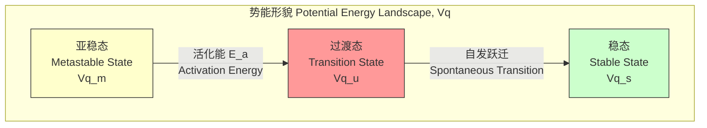
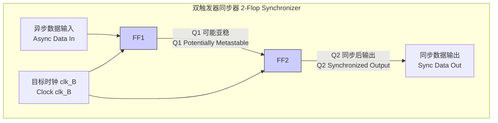
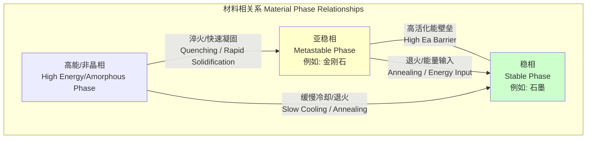

## 亚稳态 (metastability)

### 核心概念与数学基础

亚稳态描述了动力学系统中一类特殊的平衡状态。处于亚稳态的系统是局部稳定的；它能抵抗小的扰动并恢复到其原始状态。然而，它并非全局稳定。在足够大的扰动或足够长的时间（允许随机涨落累积）下，系统将跃迁到一个更稳定的状态，通常是全局稳定的基态。

这个概念根本上可以用一个势能形貌 $V(\mathbf{q})$ 来描述，其中 $\mathbf{q}$ 代表系统的状态坐标。

*   **稳态平衡 (Stable Equilibrium):** 点 $\mathbf{q}_s$ 是势能的全局最小值。任何扰动都会产生一个恢复力，将系统带回 $\mathbf{q}_s$。在数学上，对于一维系统中的坐标 $q_s$：
    $$ \left. \frac{dV(q)}{dq} \right|_{q=q_s} = 0 \quad \text{与} \quad \left. \frac{d^2V(q)}{dq^2} \right|_{q=q_s} > 0 $$
    并且对于所有 $q$，都有 $V(q_s) \le V(q)$。

*   **亚稳态平衡 (Metastable Equilibrium):** 点 $\mathbf{q}_m$ 是势能的局部最小值，但不是全局最小值。
    $$ \left. \frac{dV(q)}{dq} \right|_{q=q_m} = 0 \quad \text{与} \quad \left. \frac{d^2V(q)}{dq^2} \right|_{q=q_m} > 0 $$
    并且存在一个状态 $\mathbf{q}_s$ 使得 $V(\mathbf{q}_s) < V(\mathbf{q}_m)$。

*   **非稳态平衡 (Unstable Equilibrium):** 点 $\mathbf{q}_u$ 是势能的局部最大值。任何无穷小的扰动都会导致系统离开 $\mathbf{q}_u$。
    $$ \left. \frac{dV(q)}{dq} \right|_{q=q_u} = 0 \quad \text{与} \quad \left. \frac{d^2V(q)}{dq^2} \right|_{q=q_u} < 0 $$

从亚稳态到稳态的跃迁需要系统克服一个能量壁垒，称为**活化能 ($E_a$)**。这是亚稳态与分隔它和稳态的最高势能点（过渡态或鞍点）之间的能量差。

#### 跃迁速率与寿命

从亚稳态的跃迁是一个随机过程，通常由热涨落驱动。在许多物理和化学系统中，这个跃迁的速率 $k$ 可以很好地由**阿伦尼乌斯方程 (Arrhenius equation)** 描述：

$$ k = A e^{-E_a / (k_B T)} $$

其中：
*   $k$: 跃迁的速率常数 (单位: $s^{-1}$)。
*   $A$: 指前因子或尝试频率，代表系统尝试跨越能垒的频率 (单位: $s^{-1}$)。它与系统在势阱中的振动频率有关。
*   $E_a$: 活化能 (单位: 焦耳, J, 或电子伏特, eV)。
*   $k_B$: 玻尔兹曼常数 ($1.380649 \times 10^{-23} \, J \cdot K^{-1}$)。
*   $T$: 绝对温度 (单位: 开尔文, K)。

亚稳态的平均寿命 ($\tau$) 是速率常数的倒数：

$$ \tau = \frac{1}{k} = \frac{1}{A} e^{E_a / (k_B T)} $$

该方程表明，亚稳态的寿命随能量壁垒的高度 ($E_a$) 呈指数增长，随温度 ($T$) 呈指数下降。

### 数字电子学中的亚稳态

在同步数字电路中，触发器 (Flip-Flop, FF) 在时钟信号 (CLK) 的上升（或下降）沿对输入信号 D 进行采样。为了正常工作，D 输入必须在时钟沿之前的一段时间（建立时间, $t_{su}$）和时钟沿之后的一段时间（保持时间, $t_h$）内保持稳定。如果违反了这个时序要求（称为“时序违规”），触发器的输出 Q 就可能进入一个亚稳态。

在这种状态下，输出电压不是一个有效的逻辑 '0' 或 '1'，而是在一个中间的、非数字的电压水平上徘徊。触发器最终会解析到一个稳定的 '0' 或 '1'，但它所需的时间（解析时间, $t_{res}$）是无界的和概率性的。

触发器在亚稳态期间的行为可以被建模为一个带有正反馈的小信号放大器。内部节点之间的电压差 $\Delta V$ 会指数级地衰减（或增长）到一个稳定状态：

$$ \Delta V(t) = \Delta V_0 e^{t / \tau_{ff}} $$

因此，输出稳定所需的时间是概率性的。在时间 $t$ 之后，触发器*尚未*解析到稳定状态的概率为：

$$ P(\text{unresolved at time } t) = C \cdot e^{-t / \tau_{ff}} $$

其中：
*   $t$: 从时钟沿经过的时间。
*   $\tau_{ff}$: 触发器的亚稳态时间常数。这是器件的固有参数，由其内部锁存器的增益带宽积决定。它是衡量触发器抵抗亚稳态能力的关键指标。
*   $C$: 与初始条件相关的比例常数。

#### 平均无故障时间 (Mean Time Between Failures, MTBF)

如果触发器的输出在电路下一级采样它之前未能解析到有效的逻辑电平，就会发生系统故障。量化系统在存在亚稳态情况下的可靠性的主要指标是平均无故障时间 (MTBF)。

广泛接受的 MTBF 公式为：

$$ MTBF = \frac{e^{t_{res} / \tau_{ff}}}{T_w \cdot f_{clk} \cdot f_{data}} $$

其中：
*   $MTBF$: 平均无故障时间 (单位: 秒, s)。值越高越好。
*   $t_{res}$: 可用的解析时间。在同步系统中，这通常是时钟周期 $T_{clk}$ 减去下一级的任何传播延迟和建立时间。
*   $\tau_{ff}$: 触发器的亚稳态时间常数 (单位: 皮秒, ps)。
*   $f_{clk}$: 采样时钟的频率 (单位: 赫兹, Hz)。
*   $f_{data}$: 异步数据转换的频率 (单位: 赫兹, Hz)。
*   $T_w$: 时钟沿周围的时间窗口，在此窗口内的数据转换可能导致亚稳态。它约等于 $t_{su} + t_h$ (单位: 皮秒, ps)。

### 关键技术规格

| 参数 | 符号 | 典型值 (45nm CMOS) | 单位 | 描述 |
|---|---|---|---|---|
| 亚稳态时间常数 | $\tau_{ff}$ | 5 - 20 | ps | 触发器的固有属性。越低越好。 |
| 建立时间 | $t_{su}$ | 30 - 100 | ps | 时钟沿前数据必须保持稳定的最短时间。 |
| 保持时间 | $t_h$ | 10 - 50 | ps | 时钟沿后数据必须保持稳定的最短时间。 |
| 易受攻击窗口 | $T_w$ | 40 - 150 | ps | $T_w \approx t_{su} + t_h$。 |

### 实现考量：同步器

为了缓解亚稳态问题，特别是在跨时钟域 (Clock Domain Crossing, CDC) 时，会使用同步器电路。最常见的是 N 级触发器同步器。

*   **算法:** 一个异步信号通过一个由两个或更多触发器组成的链，所有触发器都由目标时钟域的时钟驱动。
*   **功能:** 第一个触发器 (FF1) 允许进入亚稳态。第二个触发器 (FF2) 在一个完整的时钟周期后对 FF1 的输出进行采样。这给了 FF1 的输出 ($Q_1$) 整整一个时钟周期 ($T_{clk}$) 的时间来解析。
*   **复杂度分析:** 硬件成本是线性的，$O(N)$ 对于一个 N 级触发器同步器。引入的延迟也是线性的，$N \cdot T_{clk}$。
*   **性能:** 可靠性的提升是指数级的。对于一个 N 级触发器同步器，解析时间变为 $t_{res} \approx (N-1) \cdot T_{clk}$。MTBF 被极大地增加了：
    $$ MTBF_{N} \approx \frac{e^{(N-1)T_{clk} / \tau_{ff}}}{T_w \cdot f_{clk} \cdot f_{data}} $$
    仅仅增加一个额外的触发器（从 N=2 到 N=3）就可以将 MTBF 从几年增加到数十亿年，从而有效地消除了故障。

### 材料科学与化学中的亚稳态

亚稳态是材料科学中的一个核心概念，描述了那些不处于其最低热力学能量状态（平衡相）但由于高活化能壁垒而动力学上持久存在的物质相。

#### 常见用例

| 亚稳态材料 | 稳定相 | 活化能 ($E_a$) | 关键特性 |
|---|---|---|---|
| 金刚石 (Diamond) | 石墨 (Graphite) | ~5.6 eV (~540 kJ/mol) | 极高的硬度，高导热性 |
| 马氏体 (钢中) (Martensite) | 铁素体+渗碳体 (Ferrite + Cementite) | 可变 (取决于碳含量) | 高硬度，脆性 |
| 钢化玻璃 (Tempered Glass) | 退火玻璃 (Annealed Glass) | 不适用 (基于应力) | 增加的强度和安全的断裂模式 |
| 非晶硅 (a-Si) (Amorphous Silicon) | 晶体硅 (c-Si) (Crystalline Silicon) | ~2.7 eV (~260 kJ/mol) | 较低的制造成本（用于太阳能电池） |

#### 数学模型：经典成核理论

从亚稳相（如过冷液体）到稳定相（如固体晶体）的转变通常通过成核和生长发生。形成稳定相的微小核需要克服一个自由能壁垒。

形成一个半径为 $r$ 的球形核所需的吉布斯自由能变化 $\Delta G$ 为：

$$ \Delta G(r) = -\frac{4}{3}\pi r^3 \Delta G_v + 4\pi r^2 \gamma $$

其中：
*   $\Delta G(r)$: 吉布斯自由能的总变化。
*   $r$: 核的半径。
*   $\Delta G_v$: 亚稳相和稳定相之间的单位体积自由能变化（此项为负，有利于相变）。
*   $\gamma$: 两相之间的单位面积表面能（界面张力）（此项为正，阻碍新表面的形成）。

通过找到该函数的最大值 ($\frac{d\Delta G(r)}{dr} = 0$)，我们可以找到临界核半径 $r^*$ 和成核能垒 $\Delta G^*$：

$$ r^* = \frac{2\gamma}{\Delta G_v} $$
$$ \Delta G^* = \frac{16\pi\gamma^3}{3(\Delta G_v)^2} $$

这个 $\Delta G^*$ 就是成核过程的活化能 ($E_a$)。成核速率 $I$ 随后可以用一个类似阿伦尼乌斯的表达式来建模：

$$ I = I_0 \exp\left(-\frac{\Delta G^*}{k_B T}\right) $$

该理论解释了为什么过冷或过饱和是可能的：没有尺寸达到临界值 $r^*$ 的核，相变就不会自发进行。

### 相关技术与比较模型

#### 平衡状态比较

| 特性 | 稳态 (Stable State) | 亚稳态 (Metastable State) | 非稳态 (Unstable State) |
|---|---|---|---|
| **势能 V(q)** | 全局最小值 (Global Minimum) | 局部最小值 (Local Minimum) | 局部最大值 (Local Maximum) |
| **一阶导数 dV/dq** | 0 | 0 | 0 |
| **二阶导数 d²V/dq²** | > 0 | > 0 | < 0 |
| **寿命** | 无限 (Infinite) | 有限，但可能很长 (Finite, but can be very long) | 无穷小 (Infinitesimal) |
| **对扰动的响应** | 恢复到原始状态 | 若扰动小则恢复；若扰动大则跃迁 | 离开原始状态 |

#### 数学模型：克莱默斯逃逸率 (Kramers' Escape Rate)

一个更复杂的、用于描述从势阱中跃迁速率的模型是克莱默斯理论，它使用随机微分方程（朗之万方程）来模拟一个在有摩擦和随机热噪声的势场中的粒子。

$$ m\ddot{x} = -\frac{dV(x)}{dx} - \gamma \dot{x} + \sqrt{2\gamma k_B T} \xi(t) $$

其中：
*   $x$: 系统坐标。
*   $m$: 系统的有效质量。
*   $V(x)$: 势能形貌。
*   $\gamma$: 摩擦或阻尼系数。
*   $\xi(t)$: 一个德尔塔相关的平稳高斯噪声项（白噪声），满足 $\langle \xi(t) \rangle = 0$ 和 $\langle \xi(t)\xi(t') \rangle = \delta(t-t')$。

在高摩擦极限下（与许多化学反应和固态过程相关），克莱默斯推导出了从一个势阱（亚稳态在 $q_m$）越过一个势垒（过渡态在 $q_u$）的逃逸率 $k$：

$$ k_{\text{Kramers}} = \frac{\omega_m \omega_u}{2\pi\gamma} e^{-E_a / (k_B T)} $$

其中：
*   $\omega_m = \sqrt{V''(q_m)/m}$ 是势阱底部的角频率。
*   $\omega_u = \sqrt{-V''(q_u)/m}$ 是势垒顶部的（虚）角频率。
*   $E_a = V(q_u) - V(q_m)$ 是活化能。

与简单的阿伦尼乌斯方程相比，该模型提供了一个更具物理基础的指前因子，将其与势能面的形状联系起来。

### 参考文献

1.  Chaney, T. J., & Molnar, C. E. (1973). "Anomalous behavior of synchronizer and arbiter circuits". *IEEE Transactions on Computers*, C-22(4), 421–422. DOI: `10.1109/T-C.1973.223730`
2.  Kramers, H. A. (1940). "Brownian motion in a field of force and the diffusion model of chemical reactions". *Physica*, 7(4), 284–304. DOI: `10.1016/S0031-8914(40)90098-2`
3.  Hänggi, P., Talkner, P., & Borkovec, M. (1990). "Reaction-rate theory: fifty years after Kramers". *Reviews of Modern Physics*, 62(2), 251–341. DOI: `10.1103/RevModPhys.62.251`
4.  Wakerly, J. F. (2006). *Digital Design: Principles and Practices* (4th ed.). Pearson/Prentice Hall. (该书对数字电路中的亚稳态问题提供了全面的教科书级处理)。